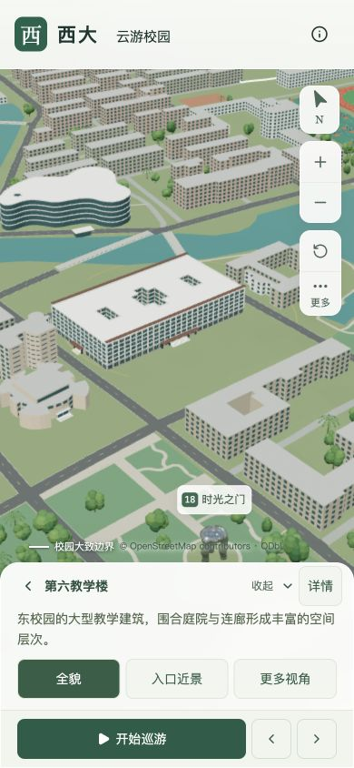
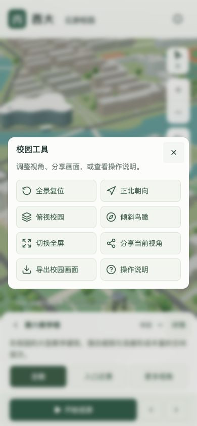

# 西大 · 云游校园

广西大学大学东路主校区的三维游览项目。使用 Three.js 和 Blender 制作，基于 OpenStreetMap 与公开资料建模，可在浏览器中搜索地标、调整视角、自动巡游和切换昼夜。

[在线游览](https://wcqqq1214.github.io/gxu-campus-3d/) · [Blender 源文件](blender/gxu-campus.blend) · [数据来源](docs/DATA.md) · [建模说明](docs/MODELING.md)


## 功能

- 搜索 20 处地标，支持“六教”“新东园门”等别名和分类筛选。
- 切换地标全貌、正背面、俯视和入口近景，也可自由旋转、平移和缩放。
- 自动巡游支持暂停、继续和跳站；收起菜单后仍可控制进度。
- 选择晨光、日间、黄昏或夜景；自动画质会根据运行表现调整阴影、植被和近景细节。
- 独立开关建筑、植被、道路、水体、运动场、周边建筑、校界和地标名称。
- 分享当前镜头，或导出带 OpenStreetMap 署名的 PNG。
- 手机详情支持简要、展开和收起；“更多工具”提供视角、分享和操作说明。

| 手机地标详情 | 手机工具菜单 |
| --- | --- |
|  |  |

## 模型范围

| 校内建筑 | 紧邻校界建筑 | 精选地标 | 示意树木 |
| :---: | :---: | :---: | :---: |
| 435 栋 | 13 栋 | 20 处 | 3,034 株 |

模型覆盖东、西、北校园，包含两处田径场、31 片室外篮球场，以及农院路和三座主要下穿桥梁。白线标示校园大致范围，农院路按公共道路表示。校外建筑仅保留距校界约 20 米以内的紧邻部分。

| 图书馆北侧 | 崇左桥下穿道路 |
| --- | --- |
|  |  |


以上为正式网站的原始截图；手机图使用桌面浏览器的手机尺寸视口采集。[截图日期、版本与视角](docs/screenshots/readme/captures.json)。

建筑轮廓主要来自 **2026-09-09 的 OpenStreetMap 快照**，道路与桥梁使用 2026-09-11 获取的补充数据。建筑外观参考不同年份的公开照片和资料，资料日期不等于当前实景。这是独立开源项目，未经过校园实地测绘。

347 栋建筑使用估算高度；照片没有覆盖的立面、树位及部分设施布局也包含推定。篮球场中 16 片沿用地图定位，东区另有 15 片依据资料估算布置。具体依据与局限见 [数据说明](docs/DATA.md)、[东区篮球场](docs/EAST_BASKETBALL.md) 和 [道路桥梁](docs/INFRASTRUCTURE.md)。

## 本地运行

使用 Node.js 24，与 CI 保持一致。

```sh
git clone https://github.com/wcqqq1214/gxu-campus-3d.git
cd gxu-campus-3d
npm ci
npm run dev
```

打开终端输出的 Local 地址。项目使用 React、TypeScript、vinext 和 Vite，网页运行不需要地图密钥或后端服务。

### 检查与静态构建

```sh
npm run typecheck
npm run lint
npm test
npm run build:pages
npm run preview
```

静态文件生成于 `out/`，默认预览地址为 `http://127.0.0.1:4300/gxu-campus-3d/`。请通过 HTTP 服务访问，不要直接打开 HTML 文件。

提交到 `main` 和面向 `main` 的 Pull Request 均执行检查与构建；只有主分支推送和手动运行会发布 Pages。

### 数据测试与模型重建

数据测试使用 Python 3.12：

```sh
python3.12 -m venv work/data-venv
source work/data-venv/bin/activate
python -m pip install -r scripts/requirements.txt
npm run test:data
```

[可编辑源文件](blender/gxu-campus.blend) 内含具名对象、材质和打包纹理。修改模型需要 Blender；步骤见 [建模说明](docs/MODELING.md)。[原始数据快照](data/snapshots/) 用于离线恢复，[网页模型](public/models/) 使用 Draco 压缩并按需加载。首屏模型和树木模板约 5.05 MB，脚本、JSON 和解码器另计。

## 项目文档

- [数据来源与精度](docs/DATA.md)
- [模型结构与重建](docs/MODELING.md)
- [校内主路与汇学堂草地](docs/CAMPUS_ROADS.md)
- [界面与交互](docs/DESIGN.md)
- [验证记录](docs/VALIDATION.md) · [近期优化](docs/FIXES.md)

## 许可

代码采用 [MIT](LICENSE)，自制模型和材质采用 [CC BY 4.0](licenses/MODELS.md)。地理数据库及其衍生数据采用 ODbL，署名 **© OpenStreetMap contributors**。其他数据与字体的许可见 [第三方说明](licenses/THIRD_PARTY.md)。

官方照片和视频只用于造型参考，未作为网页贴图或仓库图片分发。
