<div align="center">

# 西大 · 云游校园

**在浏览器里，走近广西大学。**

基于公开地理数据与 Blender 建模的三维校园，支持地标探索、自动巡游与昼夜切换。

[在线游览](https://wcqqq1214.github.io/gxu-campus-3d/) · [数据依据](docs/DATA.md) · [建模说明](docs/MODELING.md) · [体验优化](docs/OPTIMIZATION.md) · [验收记录](docs/VALIDATION.md)


</div>

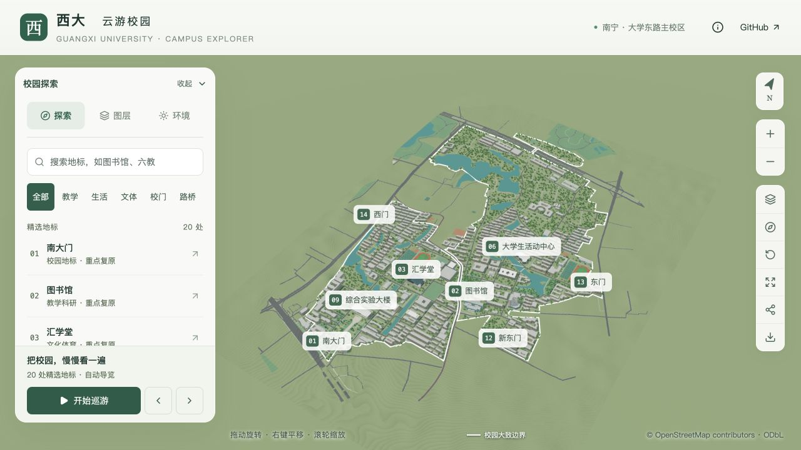

本页截图于 **2026-09-11** 从正式网站采集，包含白色校界与最新路面模型。[截图版本与视角记录](docs/screenshots/readme/captures.json)。

## 一座可以探索的三维校园

项目复现广西大学大学东路主校区，覆盖东、西、北校园及周边道路环境；校外建筑仅保留距校界约 20 米以内的紧邻部分。以自然建筑配色、浓绿乔木与棕榈，呈现校园中的楼宇、湖塘、道路和运动场。打开网页即可游览，无需账号、地图密钥或后端服务。

| 校内建筑 | 周边建筑 | 精选地标 | 示意树木 |
| :---: | :---: | :---: | :---: |
| **435 栋** | **13 栋** | **20 处** | **3,034 株** |

> 基于 2026-09-09 07:57:13 UTC 的 OpenStreetMap 快照。建筑外观参考资料跨越不同年份；道路与桥梁采用 2026-09-11 获取的补充快照。快照日期不代表所有模型均反映该日实景。项目为独立开源作品，未经过校园实地测绘。

## 游览体验

| 功能 | 可以做什么 |
| --- | --- |
| **地标探索** | 按分类与“六教”“新东园门”等别名搜索，定位 20 处精选地标。 |
| **自动巡游** | 按地标顺序游览，支持暂停、继续和前后跳站；手动操作会暂停巡游。 |
| **自由视角** | 旋转、平移、缩放；地标可切换全貌、正背面、俯视、入口近景与环绕观察。 |
| **位置与分享** | 小图显示地标及镜头方向；分享链接还原镜头和光照，并适配不同屏幕。 |
| **光照与画质** | 选择晨光、日间、黄昏或夜景，搭配自动、精细、流畅画质。 |
| **图层控制** | 分别开关建筑、植被、道路与桥梁、水体、运动场、紧邻校界建筑、校园大致边界和名称标注。 |
| **截图与移动端** | 导出带 OSM 署名的 PNG；手机统一底部面板，桌面菜单可收起，镜头按可用画面自动构图。 |

## 当前校园场景

**白色校界与覆盖范围。** 2 像素白色实线标示校园大致范围，可独立开关，并在农院路两侧区分校内与公共道路。校外仅保留 13 栋紧贴西大校界的建筑，财经学院及工业职业技术学院区域的多余建筑、球场与运动色块已清理。

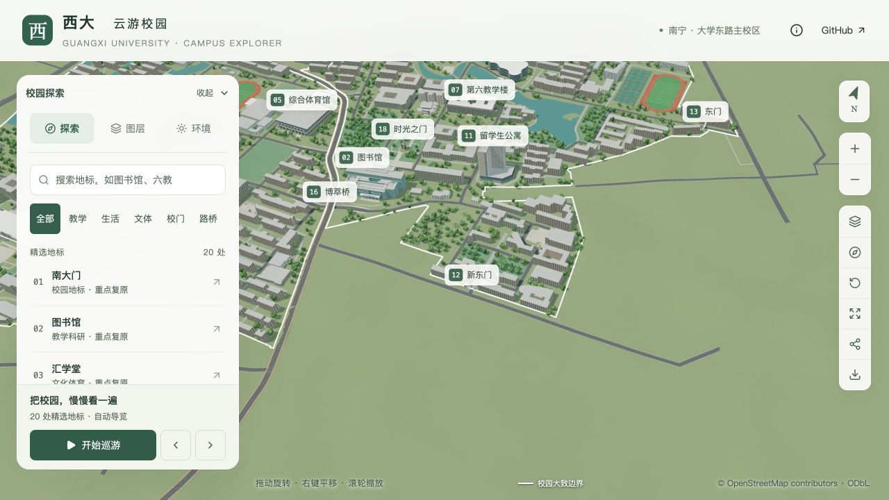

**校道与桥梁。** 校内 53 段主路沿用沥青、浅色路缘和中心虚线；小路与支路保留原表示。约 2.17 千米的农院路作为公共道路单独建模，崇左桥、博萃桥、荟贤桥采用农院路上跨、校道下穿的结构。六处桥下接口渐变接回主路，支路入口保持开放，桥洞内保留两侧抬高步道与护栏。[校内主路说明](docs/CAMPUS_ROADS.md) · [路桥资料与精度](docs/INFRASTRUCTURE.md)。

| 桥下道路与主路衔接 | 崇左桥桥洞与两侧步道 |
| --- | --- |
| 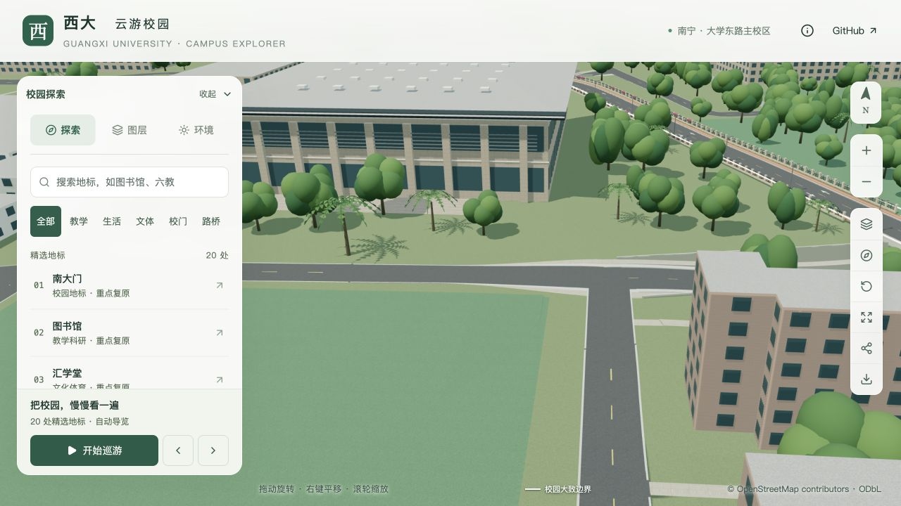 | 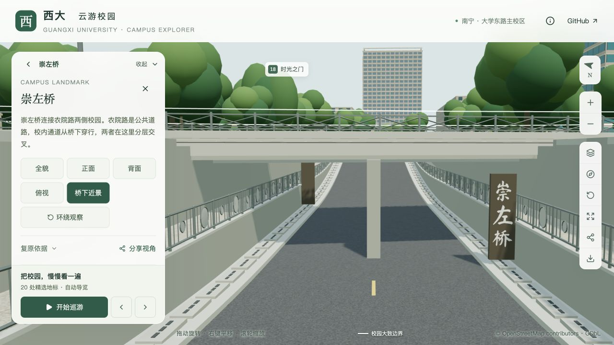 |

**汇学堂前草地。** 汇学堂正面朝东，东侧草地已清除示意树木，保留开阔草坪及周边道路。

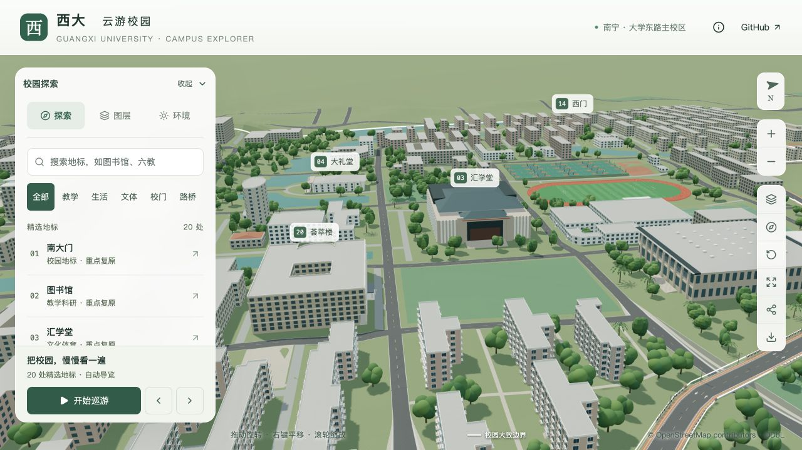

**地标与运动场。** 搜索、拾取与巡游仅面向 20 处精选地标；普通建筑和七座无可靠名称资料的湖上桥梁参与场景展示。地标包含图书馆、留学生公寓、南大门、新东门、东门、西门、六教、十教、时光之门及荟萃楼等。图书馆保留南北入口，六教包含四向入口和三个内院。

运动设施包含两处田径场与 **34 片独立篮球场**：19 片沿用地图定位，其中西校园集中区 16 片；东田径场西侧另有 15 片依据资料约束布置的估算球场。标线、篮板、篮圈与镂空篮网为自制模型。[东篮球场位置与精度说明](docs/EAST_BASKETBALL.md)。

| 西校园篮球场 | 东田径场旁篮球场 |
| --- | --- |
| 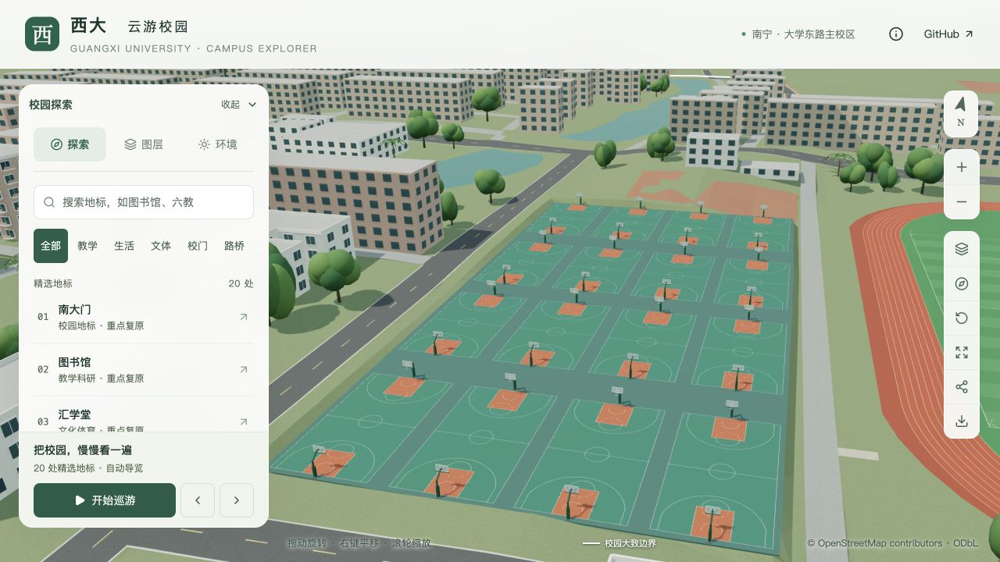 | 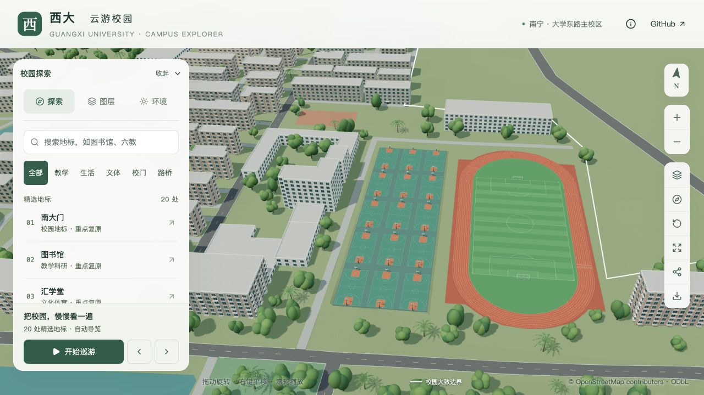 |

<details>
<summary>查看更多地标与运动场网页截图</summary>

| 图书馆北侧 | 六教北门 |
| --- | --- |
| 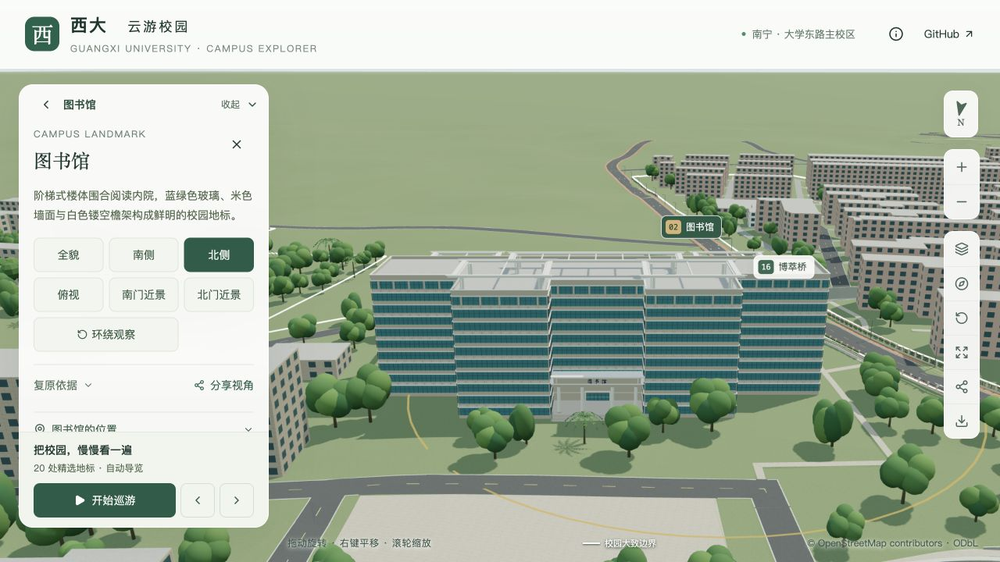 | 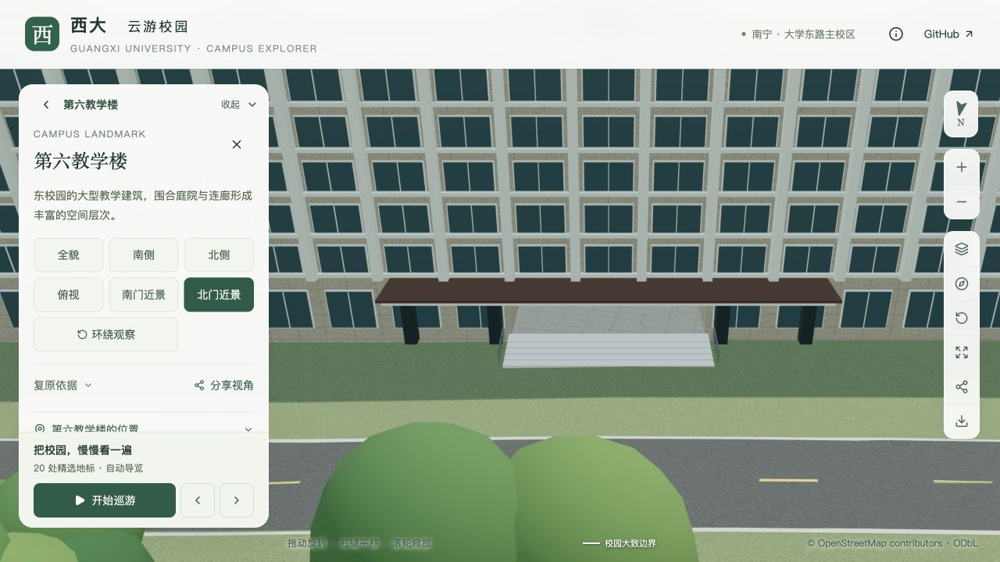 |

| 第十教学楼 | 荟萃楼 |
| --- | --- |
| 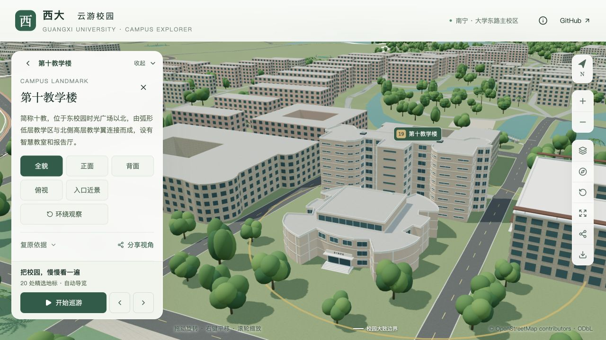 | 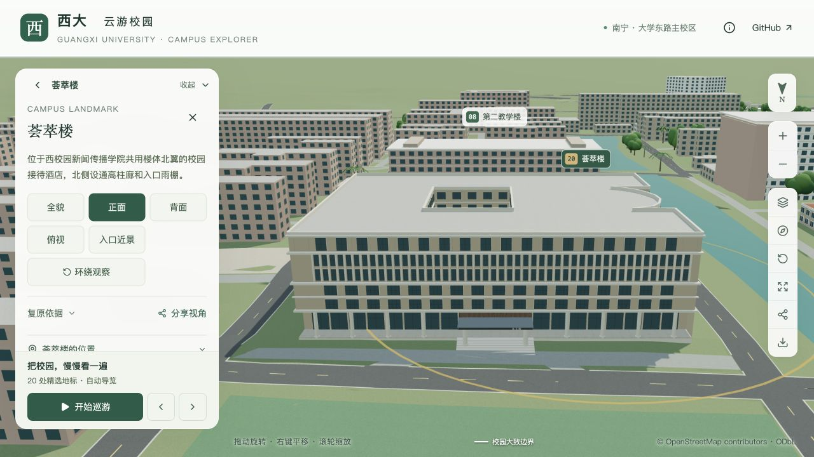 |

| 南大门 | 时光之门 |
| --- | --- |
| 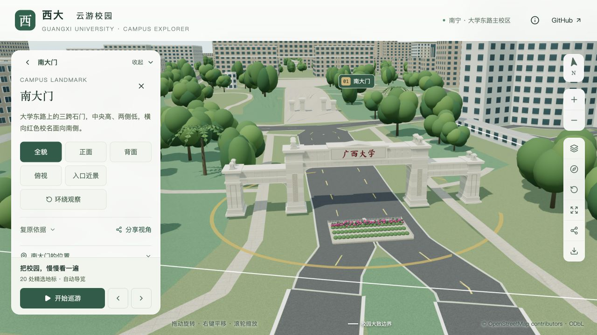 | 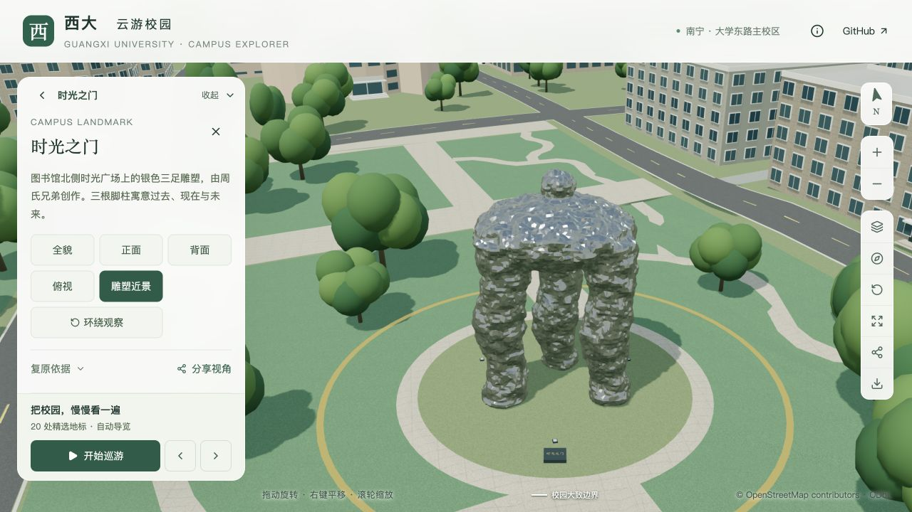 |

| 东田径场 | 西田径场 |
| --- | --- |
| 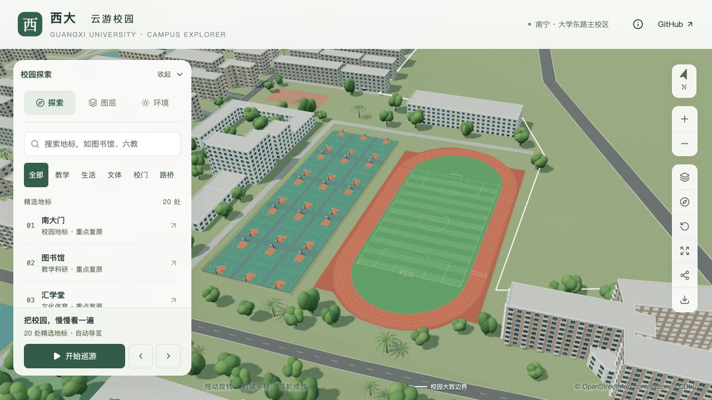 | 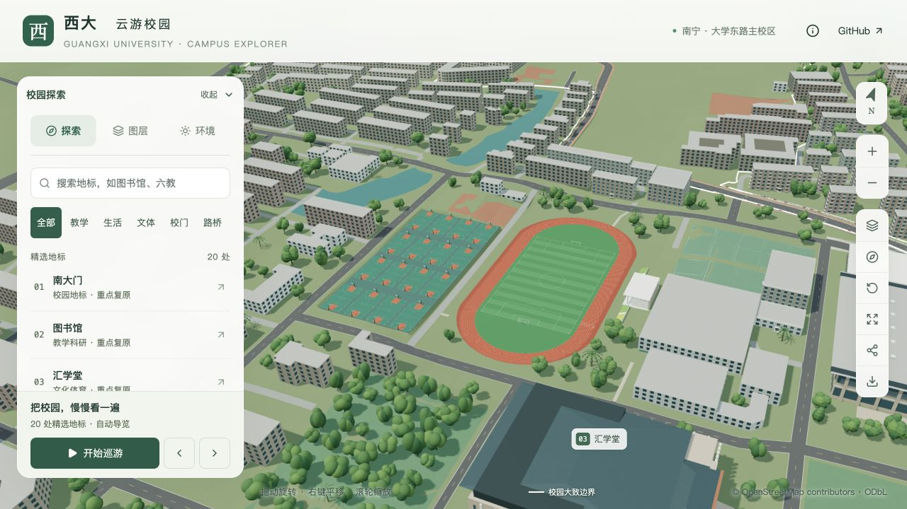 |

[游览图书馆](https://wcqqq1214.github.io/gxu-campus-3d/#place=library) · [查看六教北门](https://wcqqq1214.github.io/gxu-campus-3d/#place=teaching-six&view=rear-entrance) · [游览十教](https://wcqqq1214.github.io/gxu-campus-3d/#place=teaching-ten) · [游览荟萃楼](https://wcqqq1214.github.io/gxu-campus-3d/#place=huicui) · [查看时光之门](https://wcqqq1214.github.io/gxu-campus-3d/#place=time-gate)

</details>

## 技术与资源

| 技术 | 用途 |
| --- | --- |
| **Three.js** | 浏览器三维场景、相机交互和模型展示。 |
| **Blender** | 校园与地标建模，保留可编辑源文件。 |
| **React + TypeScript** | 游览菜单、搜索与交互状态。 |
| **vinext + Vite** | 本地开发与静态构建。 |
| **OpenStreetMap + DEM** | 建筑轮廓、道路、水体和地形的数据基础。 |
| **GLB + Draco** | 压缩模型资源，优先加载当前地标与附近区块。 |

- [Blender 源文件](blender/gxu-campus.blend)：米制尺寸、具名建筑、材质与集合，纹理已打包。
- [模型资源](public/models/)：校园基础模型、30 个普通建筑区块、16 个道路与跨水桥近景区块、20 处独立地标和树木模板。
- [场景数据](public/data/)：GeoJSON、建筑与地标目录、模型清单、来源记录和高程数据。
- 首屏基础模型与树木模板合计约 **5.39 MB**，低于 6 MB 预算；脚本、JSON 与解码器另计。
- [原始快照](data/snapshots/)：保留版本与编辑时间的 OSM 数据、DEM 瓦片及查询，支持离线恢复与重建。

## 本地运行

建议使用 **Node.js 24**，与仓库 CI 保持一致。

```sh
git clone https://github.com/wcqqq1214/gxu-campus-3d.git
cd gxu-campus-3d
npm ci
npm run dev
```

打开终端输出的 Local 地址。

### 检查与构建

```sh
npm run typecheck
npm run lint
npm test
npm run build:pages
npm run preview
```

构建产物生成于 `out/`，默认预览地址为 `http://127.0.0.1:4300/gxu-campus-3d/`。请通过 HTTP 服务访问，不要直接用 `file://` 打开文件。

数据准备与模型重建流程见 [建模说明](docs/MODELING.md)，来源与快照说明见 [数据依据](docs/DATA.md)。

## 数据来源与精度

模型以公开地理数据为基础，结合校方照片、视频及资料重建部分地标。近期核对采用 2024—2026 年校方资料；缺少近期外观时也引用更早的官方记录，资料获取时间不等于拍摄时间。

- **建筑高度**：347 栋使用估算高度，部分地标参考照片估高；第二教学楼立面主要按类型推定。
- **外观细节**：照片未覆盖的立面、植物种类与树位包含推定。新东门外观暂为推定，东门参考含 2018 年实拍，西门参考照片拍摄日期未知。
- **覆盖范围**：北校园及周边以现有 OSM 数据为准，未绘制的位置没有虚构补建。
- **地形高程**：历史 DEM 经过湖岸与基底局部平整，不能作为工程高程依据。

## 文档导航

| 文档 | 内容 |
| --- | --- |
| [数据依据](docs/DATA.md) | 地理数据、资料年份、来源与精度边界。 |
| [校内主路与草地](docs/CAMPUS_ROADS.md) | 主路材质、六处桥下接口及汇学堂东侧草地。 |
| [农院路与桥梁](docs/INFRASTRUCTURE.md) | 公共道路分隔、立交关系、近期资料与估算范围。 |
| [建模说明](docs/MODELING.md) | Blender 重建流程与地标建模依据。 |
| [界面说明](docs/DESIGN.md) | 菜单、交互与视觉设计。 |
| [验收记录](docs/VALIDATION.md) | 功能检查与验证结果。 |

## 许可与署名

| 内容 | 许可／署名 |
| --- | --- |
| 代码 | [MIT](LICENSE) |
| 自制模型与材质 | [CC BY 4.0](licenses/MODELS.md)，作者 `wcqqq1214` |
| 地理数据库及衍生数据库 | ODbL 1.0，**© OpenStreetMap contributors** |
| SRTM / Mapzen 等数据 | 见 [第三方说明](licenses/THIRD_PARTY.md) |

模型作为地理数据的可视化作品保留 OSM 署名，并提供对应数据库。官方照片与视频仅用于造型参考，未作为网页贴图或仓库图片再分发。
