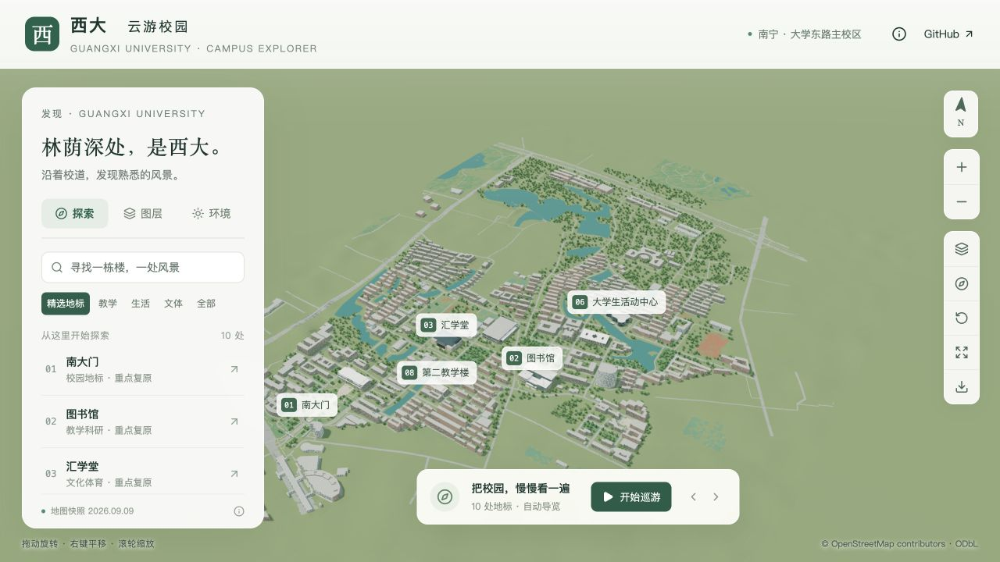
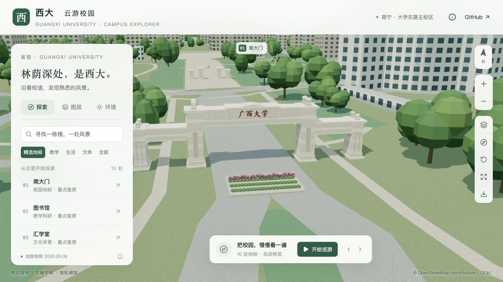
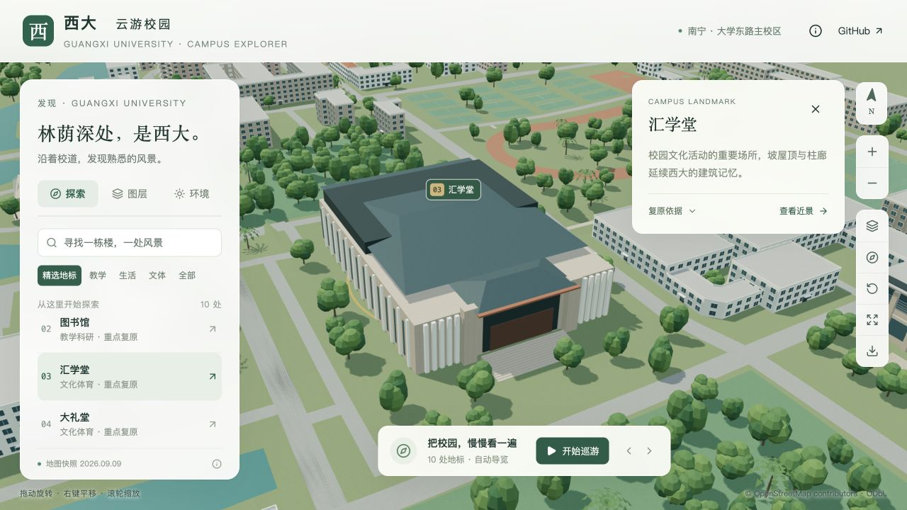
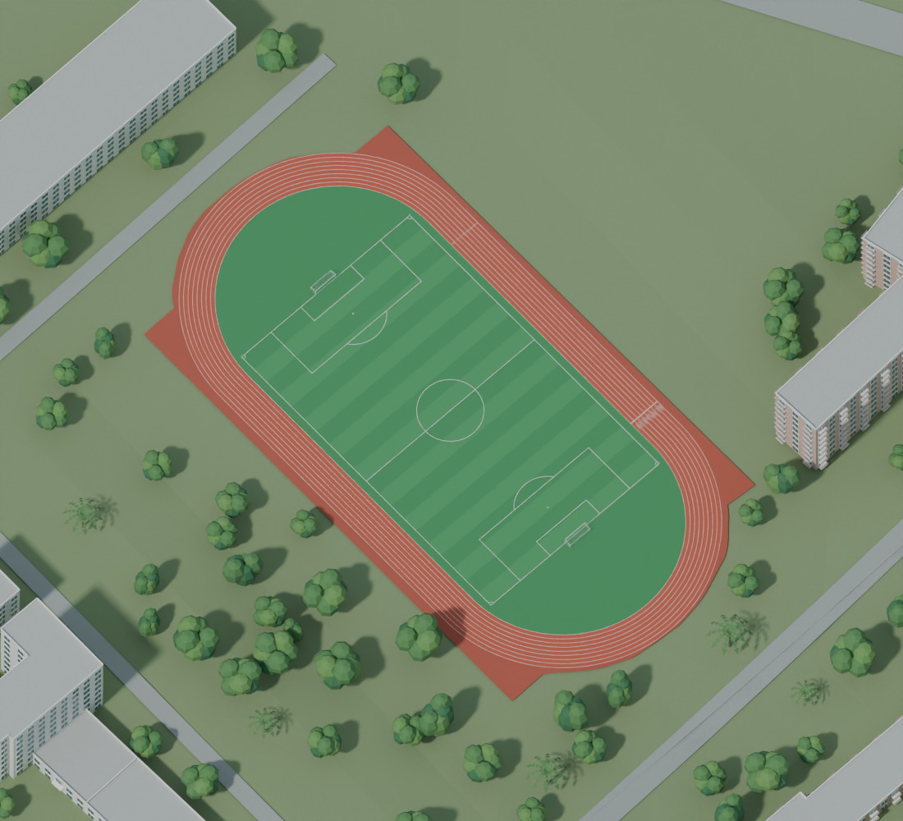
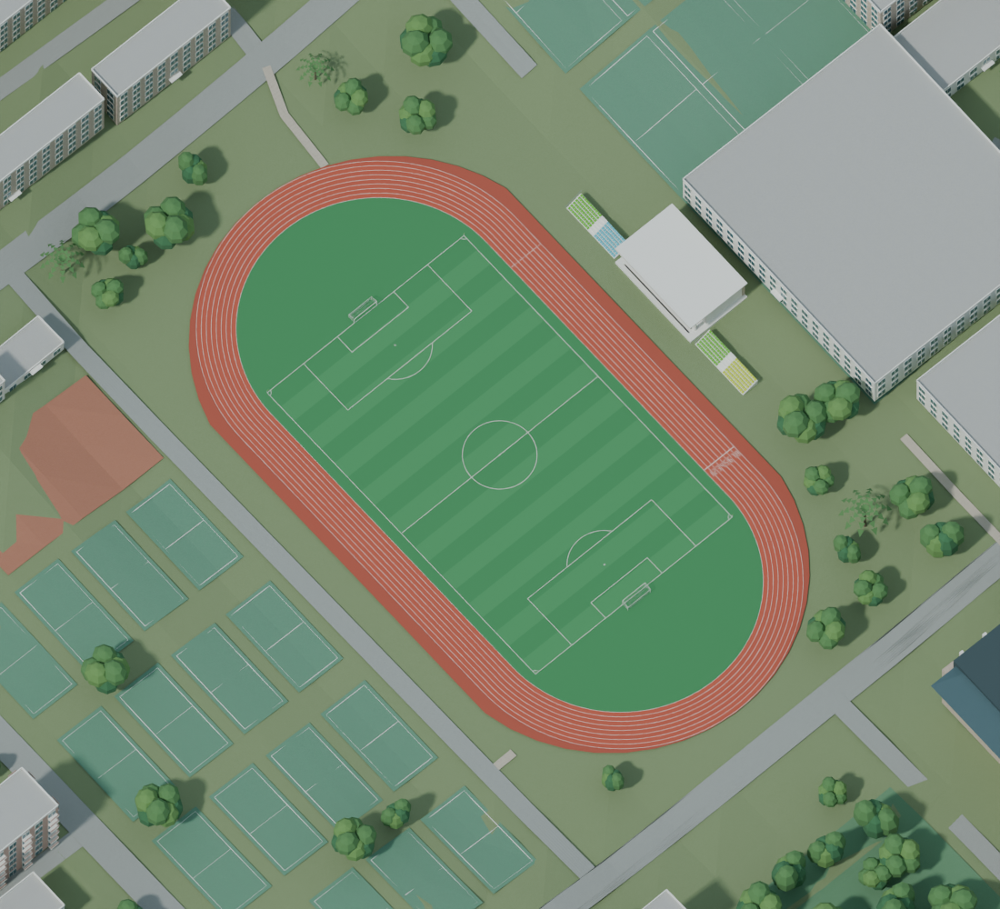

<div align="center">

# 西大 · 云游校园

**在浏览器里，走近广西大学。**

基于公开地理数据与 Blender 建模的三维校园，支持地标探索、自动巡游与昼夜切换。

[在线游览](https://wcqqq1214.github.io/gxu-campus-3d/) · [数据依据](docs/DATA.md) · [建模说明](docs/MODELING.md) · [验收记录](docs/VALIDATION.md)


</div>



## 一座可以探索的三维校园

项目复现广西大学大学东路主校区，覆盖东、西、北校园及校界外约 300 米的周边环境。以自然建筑配色、浓绿乔木与棕榈，呈现校园中的楼宇、湖塘、道路和运动场。打开网页即可游览，无需账号、地图密钥或后端服务。

| 校内建筑 | 周边建筑 | 精选地标 | 示意树木 |
| :---: | :---: | :---: | :---: |
| **435 栋** | **45 栋** | **14 处** | **3,176 株** |

> 基于 2026-09-09 07:57:13 UTC 的 OpenStreetMap 快照。建筑外观参考资料跨越不同年份；快照日期不代表所有模型均反映该日实景。项目为独立开源作品，未经过校园实地测绘。

## 游览体验

| 功能 | 可以做什么 |
| --- | --- |
| **地标探索** | 搜索、点击建筑或通过列表定位 14 处精选地标。 |
| **自动巡游** | 按地标顺序游览，支持暂停、继续和前后跳站；手动操作会暂停巡游。 |
| **自由视角** | 旋转、平移、缩放，切换俯视、倾斜鸟瞰、正北和全景视角。 |
| **光照与画质** | 选择晨光、日间、黄昏或夜景，搭配自动、精细、流畅画质。 |
| **图层控制** | 分别开关建筑、植被、道路、水体、运动场、周边建筑和名称标注。 |
| **截图与移动端** | 导出带 OSM 署名的 PNG；手机端提供可收起的底部菜单。 |

精选地标涵盖南大门、图书馆、汇学堂、大礼堂、综合体育馆、大学生活动中心、第六教学楼、第二教学楼、综合实验大楼、计算机与电子信息学院、留学生公寓、新东门、东门和西门。普通建筑参与场景展示，不进入搜索与巡游名单。

<details>
<summary>查看更多场景预览</summary>

| 南大门 | 汇学堂 |
| --- | --- |
|  |  |

| 东田径场 | 西田径场 |
| --- | --- |
|  |  |

[查看移动端截图](docs/screenshots/mobile.png)

</details>

## 技术与资源

| 技术 | 用途 |
| --- | --- |
| **Three.js** | 浏览器三维场景、相机交互和模型展示。 |
| **Blender** | 校园与地标建模，保留可编辑源文件。 |
| **React + TypeScript** | 游览菜单、搜索与交互状态。 |
| **vinext + Vite** | 本地开发与静态构建。 |
| **OpenStreetMap + DEM** | 建筑轮廓、道路、水体和地形的数据基础。 |
| **GLB + Draco** | 压缩模型资源，按区域加载近景。 |

- [Blender 源文件](blender/gxu-campus.blend)：米制尺寸、具名建筑、材质与集合，纹理已打包。
- [模型资源](public/models/)：校园基础模型、东／西／北近景分区、独立地标和树木模板。
- [场景数据](public/data/)：GeoJSON、建筑与地标目录、模型清单、来源记录和高程数据。
- [原始快照](data/snapshots/)：保留版本与编辑时间的 OSM 数据、DEM 瓦片及查询，支持离线恢复与重建。

## 本地运行

建议使用 **Node.js 24**，与仓库 CI 保持一致。

```sh
git clone https://github.com/wcqqq1214/gxu-campus-3d.git
cd gxu-campus-3d
npm ci
npm run dev
```

打开终端输出的 Local 地址。

### 检查与构建

```sh
npm run typecheck
npm run lint
npm test
npm run build:pages
npm run preview
```

构建产物生成于 `out/`，默认预览地址为 `http://127.0.0.1:4300/gxu-campus-3d/`。请通过 HTTP 服务访问，不要直接用 `file://` 打开文件。

数据准备与模型重建流程见 [建模说明](docs/MODELING.md)，来源与快照说明见 [数据依据](docs/DATA.md)。

## 数据来源与精度

模型以公开地理数据为基础，结合校方照片、视频及资料重建部分地标。近期核对采用 2024—2026 年校方资料；缺少近期外观时也引用更早的官方记录，资料获取时间不等于拍摄时间。

- **建筑高度**：370 栋按类型估算，部分地标参考照片估高；第二教学楼立面主要按类型推定。
- **外观细节**：照片未覆盖的立面、植物种类与树位包含推定。新东门外观暂为推定，东门参考含 2018 年实拍，西门参考照片拍摄日期未知。
- **覆盖范围**：北校园及周边以现有 OSM 数据为准，未绘制的位置没有虚构补建。
- **地形高程**：历史 DEM 经过湖岸与基底局部平整，不能作为工程高程依据。

## 文档导航

| 文档 | 内容 |
| --- | --- |
| [数据依据](docs/DATA.md) | 地理数据、资料年份、来源与精度边界。 |
| [建模说明](docs/MODELING.md) | Blender 重建流程与地标建模依据。 |
| [界面说明](docs/DESIGN.md) | 菜单、交互与视觉设计。 |
| [验收记录](docs/VALIDATION.md) | 功能检查与验证结果。 |

## 许可与署名

| 内容 | 许可／署名 |
| --- | --- |
| 代码 | [MIT](LICENSE) |
| 自制模型与材质 | [CC BY 4.0](licenses/MODELS.md)，作者 `wcqqq1214` |
| 地理数据库及衍生数据库 | ODbL 1.0，**© OpenStreetMap contributors** |
| SRTM / Mapzen 等数据 | 见 [第三方说明](licenses/THIRD_PARTY.md) |

模型作为地理数据的可视化作品保留 OSM 署名，并提供对应数据库。官方照片与视频仅用于造型参考，未作为网页贴图或仓库图片再分发。
