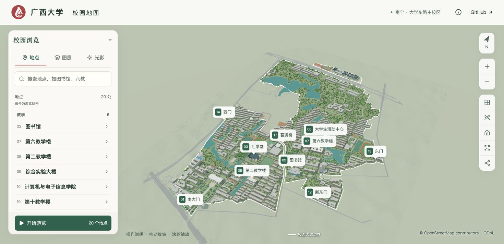
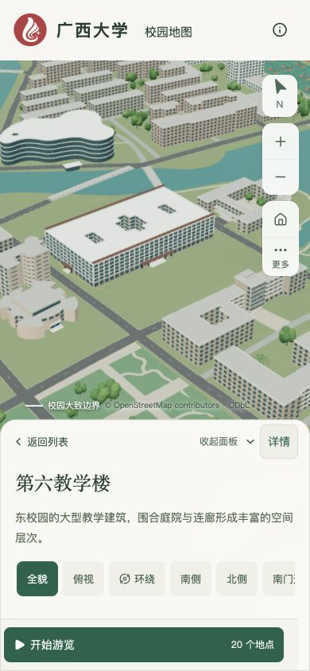
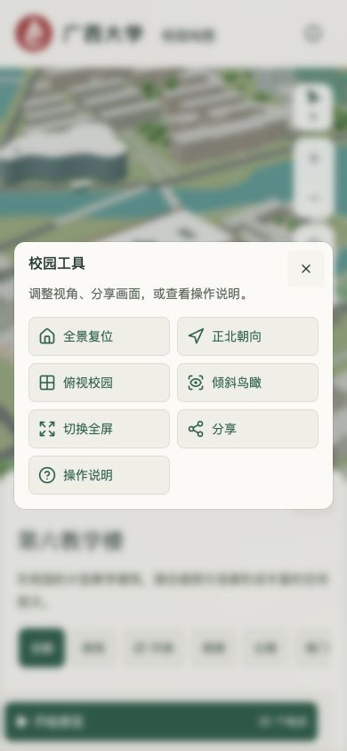
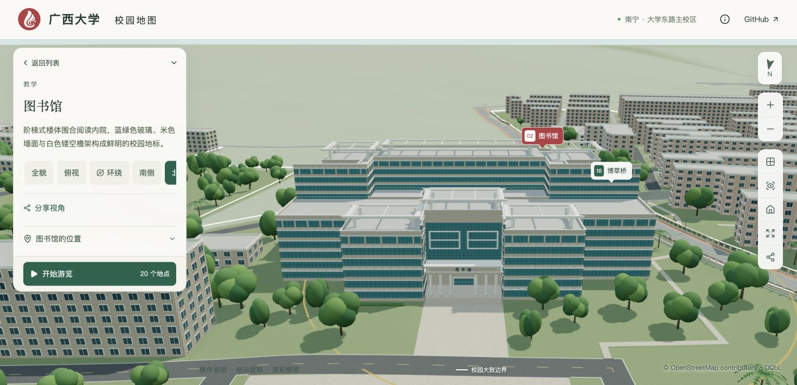
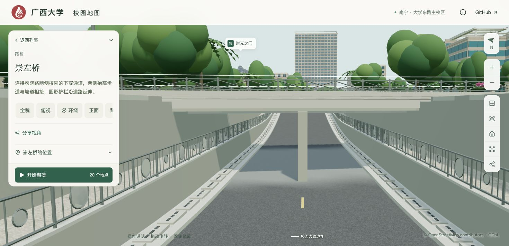
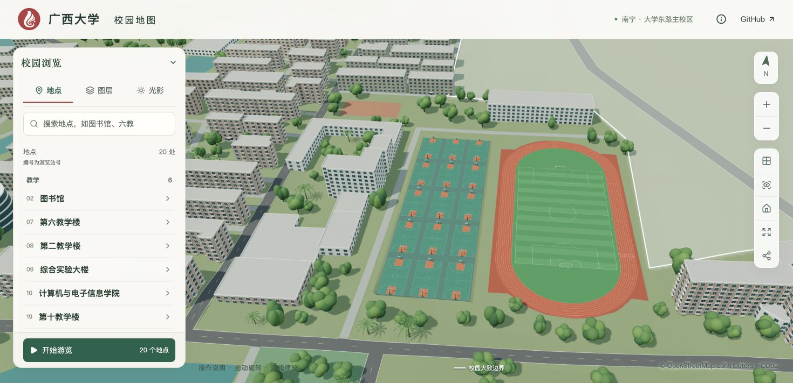

<h1 align="center">广西大学 校园地图</h1>

<p align="center">
  <strong>简体中文</strong> · <a href="README.en.md">English</a>
</p>

<p align="center">
  
  
  
  
  
</p>

<p align="center">
  广西大学大学东路主校区的三维校园地图。使用 Three.js 和 Blender 制作，基于 OpenStreetMap 与公开资料建模，可在浏览器中查找地点、查看建筑、游览校园和切换昼夜。
</p>

<p align="center">
  <a href="https://wcqqq1214.github.io/gxu-campus-3d/">在线游览</a>
</p>



## 功能

- 搜索和浏览 20 处精选地点，支持分类、别名搜索及列表与地图联动。
- 自由切换观察视角，或跟随校园游览路线，支持暂停、继续和跳站。
- 切换晨光、日间、黄昏和夜景，控制建筑、树木、道路等图层，画质自动适配运行表现。
- 分享当前视角链接，或导出带 OpenStreetMap 署名的 PNG。
- 适配手机，支持键盘操作及系统“减少动态效果”偏好。

| 手机地点详情 | 手机工具菜单 |
| --- | --- |
|  |  |

## 模型范围

| 校内建筑 | 周边建筑 | 精选地标 | 示意树木 |
| :---: | :---: | :---: | :---: |
| 446 栋／体块 | 13 栋 | 20 处 | 2,936 株 |

基于 OpenStreetMap 与公开资料建模，覆盖东、西、北校园。项目未经实地测绘，部分建筑高度、立面和设施布局为估算，详见 [数据说明](docs/DATA.md)。

<details>
<summary>更多截图</summary>

| 图书馆北侧 | 崇左桥下穿道路 |
| --- | --- |
|  |  |



</details>

截图摄于 2026-10-07 的开发版本，可能与在线站点不同。

## 本地运行

使用 Node.js 24，与 CI 保持一致。

```sh
git clone https://github.com/wcqqq1214/gxu-campus-3d.git
cd gxu-campus-3d
npm ci
npm run dev
```

打开终端输出的 Local 地址。项目使用 React、TypeScript、vinext 和 Vite，网页运行不需要地图密钥或后端服务。

### 检查与静态构建

```sh
npm run typecheck
npm run lint
npm test
npm run build:pages
npm run preview
```

静态文件生成于 `out/`，默认预览地址为 `http://127.0.0.1:4300/gxu-campus-3d/`。请通过 HTTP 服务访问，不要直接打开 HTML 文件。

提交到 `main` 和面向 `main` 的 Pull Request 均执行检查与构建；只有主分支推送和手动运行会发布 Pages。

### 数据测试与模型重建

数据测试与模型重建步骤见 [建模说明](docs/MODELING.md)。可编辑的 Blender 源文件未纳入仓库，暂未提供下载；运行网页和普通测试无需该文件。

## 项目文档

- [数据来源与精度](docs/DATA.md)
- [模型结构与重建](docs/MODELING.md)
- [界面与交互](docs/DESIGN.md)

## 许可

代码采用 [MIT](LICENSE)，自制模型和材质采用 [CC BY 4.0](licenses/MODELS.md)。地理数据库及其衍生数据采用 ODbL，署名 **© OpenStreetMap contributors**。其他数据与字体的许可见 [第三方说明](licenses/THIRD_PARTY.md)。

官方照片和视频只用于造型参考，未作为网页贴图或仓库图片分发。
