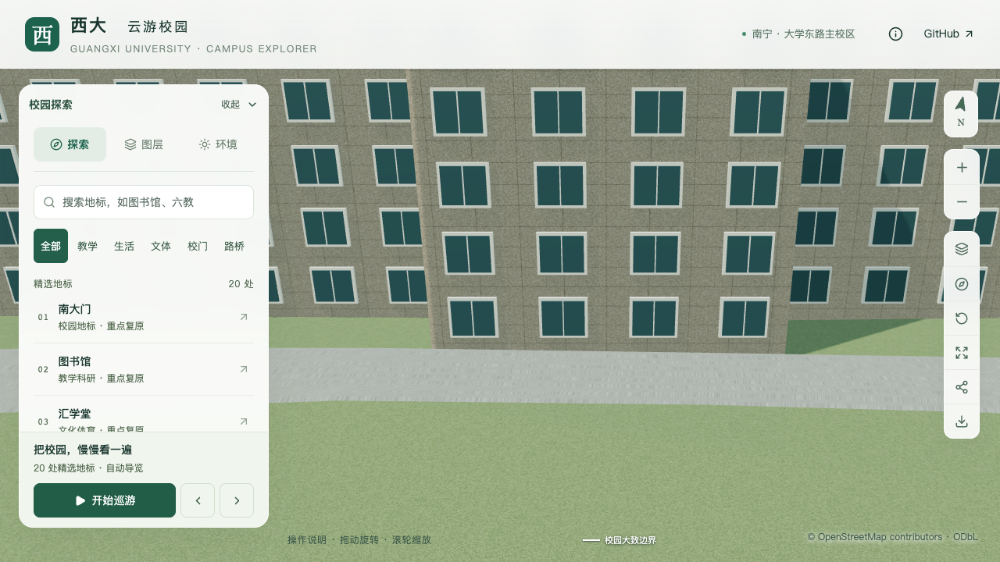
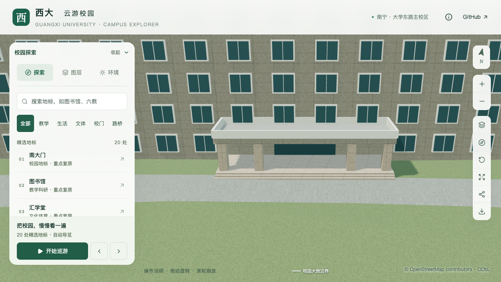
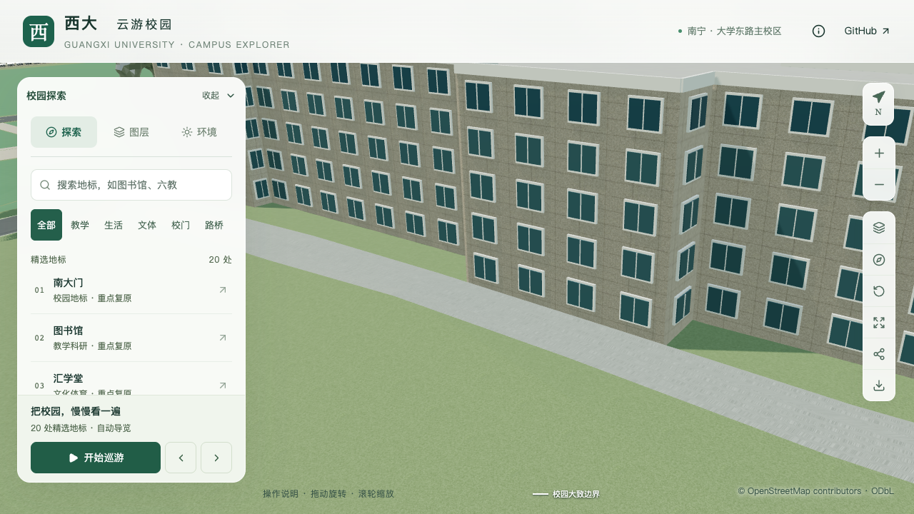
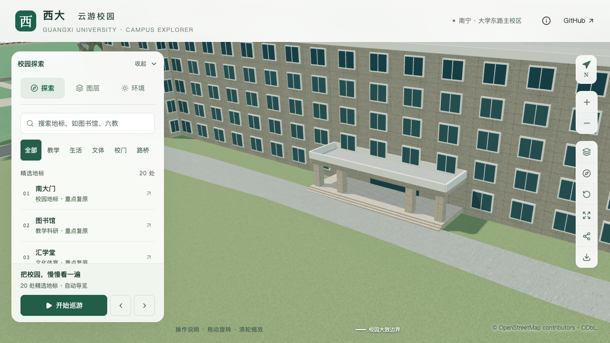

# 农学院南侧入口与低门廊校准

本页对应 S2 楼栋校准和 S3 图书馆周边空间，建筑 ID 为 `way/759185166`。本批修正南侧中央门廊及入口；后翼露台和其他立面尚未完成核对，不计作整栋实测或完整 S3 交付。

## 资料与空间对应

[农学院官网](https://nxy.gxu.edu.cn/)使用的[具名正面横幅](https://nxy.gxu.edu.cn/images/01-28h.jpg)显示五层正面及低门廊。[2026 年院前活动报道](https://www.gxu.edu.cn/info/1004/40379.htm)明确活动在农学院院前广场，首图可见四根正面方柱、三个开放柱间和内退门面。页面发布于 2026-04-14，活动为 4 月 12 日；照片拍摄日期没有单独元数据确认。横幅电子屏含 2021 年日期，不据此认定其拍摄日期。

正面中央突出门廊对应 OSM 外环第 8–11 号顶点组成的凸部，朝外边为第 9 边，方位约 167.3°（北为 0°、顺时针）。这是根据具名照片和轮廓的匹配推断，保留原外环和建筑位置；未向 OSM 写入修改。

[2024 年修缮公告](https://www.gxu.edu.cn/info/1364/36128.htm)提到四层东西两侧露台，但未提供其平面边界。当前主楼仍采用项目册记载的五层与 3.3 米估算层高，不据此给整个侧翼降层。2026 宣传视频的开头片段也未能可靠定位这些露台。

[来源与图像哈希](model-checks/refinement/s3-agriculture-evidence.json)记录采用、未采用和未解决内容。参考照片和视频帧仅保存在本机 `work/`，不作为纹理或分发图片。

## 修改内容

| 项目 | 修改前 | 当前采用 |
| --- | --- | --- |
| 入口位置 | 最长外边中点，位于西侧 | 南侧中央门廊轴线，门面退至主体墙 |
| 映射凸部 | 随主体挤出五层 | 低门廊顶与开放柱间 |
| 门廊尺寸 | 未分段 | 映射范围约 17.81 × 4.74 米、84.34 平方米 |
| 高度与支撑 | 五层实体墙 | 顶高 4.0 米、板底 3.4 米、地板 0.45 米、四根方柱 |
| 入口表达 | 通用雨棚与小平台 | 内退门面、完整门廊地板、三阶入口 |
| 远近景 | 共用错误的高凸部 | 共用低门廊、柱子、平台、台阶与门面 |

顶高、柱宽、柱距、门宽、地板和台阶高度都是照片比例约束的模型估算。主楼仍为 16.5 米，不将估算层高或压缩容差写成测量精度。此处未调整树位，最近树冠与门廊仍有约 4.9 米的模型间隔；镜头被前场树冠遮挡不等于树木侵入门廊。

## 共享生成规则

`parts.openBelow` 表达低门廊：`clearHeight` 为板底相对楼栋基准的高度，`floorHeight` 为地板高度，`columns` 给出显式方柱中心、宽深及弧度角。首版限定一层平屋面门廊，检查地板/板底/屋顶次序、柱子位于分段内且互不重叠。

`entrances.recess` 从原外环锚点沿法向向内退让。解析器要求路线经过唯一门廊并接到主体墙面，门廊柱不能堵住中央通路。保留前缘位置用于台阶，后墙位置用于门面。新能力由普通建筑生成器消费，没有新增农学院专用建模脚本。

门廊从五层主体中分出后，后墙上部成为可见外立面。生成器补上这一部分窗列；首次画面检查发现把女儿墙高度也计入排窗门槛会误删一排窗，已改为按实体屋面高度判断，让女儿墙自然遮挡背后的窗口。

## 验收与画面

实际源文件、基础和近景的专项检查覆盖低门廊顶、四根柱、三个开放柱间、内退门面、地板、三阶台阶和门廊上方窗口，并对照实际地形与铺面。旧模型在同一检查中因凸部仍为五层而失败。当前最终检查结果在[门廊报告](model-checks/refinement/s3-agriculture-portico.json)记录。

正常视图可能被前场树冠遮挡。关闭植被图层的对照只用于看清建筑几何，必须与保留植被的视图分别标注，不将隐藏树木当作场地优化结果。手机尺寸按现有预算可能使用基础模型，验收其实际形体，不强迫加载近景资源。

本批只推进农学院南侧入口工作包。野生动物研究所与东侧两层配套楼尚未找到可靠的外观对应，继续保留已有 OSM 层数及待核对标注，见[邻楼队列](model-checks/refinement/s3-neighbor-review-queue.json)。

### 固定画面对照

同一桌面相机、光照和前端，修改前使用上一批归档模型。以下关闭植被和地点名称，便于查看门廊形体；全场景的树位没有改动。

| 角度 | 修改前 | 当前 |
| --- | --- | --- |
| 正面 |  |  |
| 斜向 |  |  |

[保留植被的正常视图](screenshots/refinement/s3-agriculture-checked/after/agriculture-oblique-trees-on-day.png)仍有前场树冠遮挡；[夜间对照](screenshots/refinement/s3-agriculture-checked/after/agriculture-front-trees-off-night.png)可见入口、柱间与窗列。最初手机相机被前方邻楼屋顶遮挡，不能用于入口视觉验收；改用明确记录的较高角度后，[手机尺寸基础模型](screenshots/refinement/s3-agriculture-mobile/after/agriculture-front-trees-off-day-mobile.png)可见门廊、四柱及台阶。这是桌面浏览器尺寸模拟，不是真机验证。

原始报告分别为[桌面对照与图层状态](model-checks/refinement/s3-agriculture-checked-context-browser.json)和[手机镜头修正](model-checks/refinement/s3-agriculture-mobile-context-browser.json)。旧截图与脚本失败记录保留，未把采集完成等同于画面有效。

### 数据和模型核验

31 项 Python、51 项 Node、类型检查、lint 与 Pages 生产构建通过。最终源模型与实际 GLB 的共享形体检查覆盖 430 栋源对象、430 栋基础表示和 417 栋校内近景表示。农学院专项在三种表示中均确认四柱、三个开放柱间、后墙门面和门廊上方窗口；三阶台阶全部露出实际地形/铺面。图书馆中央前场和时光之门回归通过。

[69 个资产核验](model-checks/refinement/s3-agriculture-assets.json)确认公共模型与生产包一致；本批变化资产为基础模型、农学院所在近景块及重建后的时光之门。后者的输入和生成代码未变，体素生成的二进制差异另做几何复核。首屏模型 5,639,720 bytes，最大普通近景块 1,684,868 bytes；原轮廓、其他楼栋数据、道路、地形、场地与树位保持。

### 活动性能与当前完成边界

[标准浏览器记录](model-checks/refinement/s3-agriculture-validated-browser.json)完成六组固定画面、三次远近景往返和两档各三次 30 秒环绕，无页面、控制台或 HTTP 错误。六张回归图片已查看：图书馆中央连接与六柱保留，内院未封闭，普通楼坡屋面保持。每次全景均释放普通近景区块，返回近景后重新加载。

| 三次中位数 | S0 | 本次观测 | 变化 |
| --- | ---: | ---: | ---: |
| 精细 FPS | 60 | 60 | 0% |
| 精细三角形 | 4,017,716 | 4,049,125 | +0.78% |
| 精细 Draw Calls | 537 | 537 | 0% |
| 流畅 FPS | 30 | 30 | 0% |
| 流畅三角形 | 1,052,490 | 1,090,031 | +3.57% |
| 流畅 Draw Calls | 268 | 267 | −0.37% |

单次 FPS 中位数分别为 60/60/60 与 30/30/30，数值符合计划门槛。但 27 次[进程采样](model-checks/refinement/s3-agriculture-performance-context.json)中有 20 次观察到另一项目的数据准备任务持续占用 CPU，因此不作为同条件性能通过结论，也不据此宣称性能改善。后续需在重任务结束后复测。

[本批汇总及文件哈希](model-checks/refinement/s3-agriculture-summary.json)将“几何和画面通过”与“性能联合验收待复测”分开。农学院后翼和其他立面、完整 S3 邻楼核对、S2 的 20–30 栋目标以及 S4/S5 均仍在计划内。

### 后续累计版本复测（2026-09-12）

两处食堂层数校准后，包含本门廊的累计版本已完成同一活动协议复测：精细档 60/60/60 FPS、流畅档 30/30/30 FPS，三角形和 Draw Calls 增幅均在计划门槛内。26 次进程采样未观察到其他项目构建或数据准备任务，按常规桌面条件接受比较，详见[食堂批次联合验收](DINING_BUILDINGS.md#当前版本联合验收)与[累计版本汇总](model-checks/refinement/s2-dining-summary.json)。本门廊的数据和近景区块在该批次保持不变；原受干扰的历史记录保留，不改写为当时已通过。农学院整栋核对与完整 S3 仍未完成。
