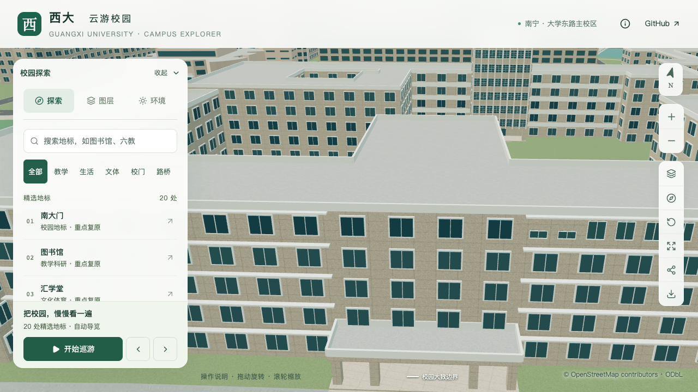
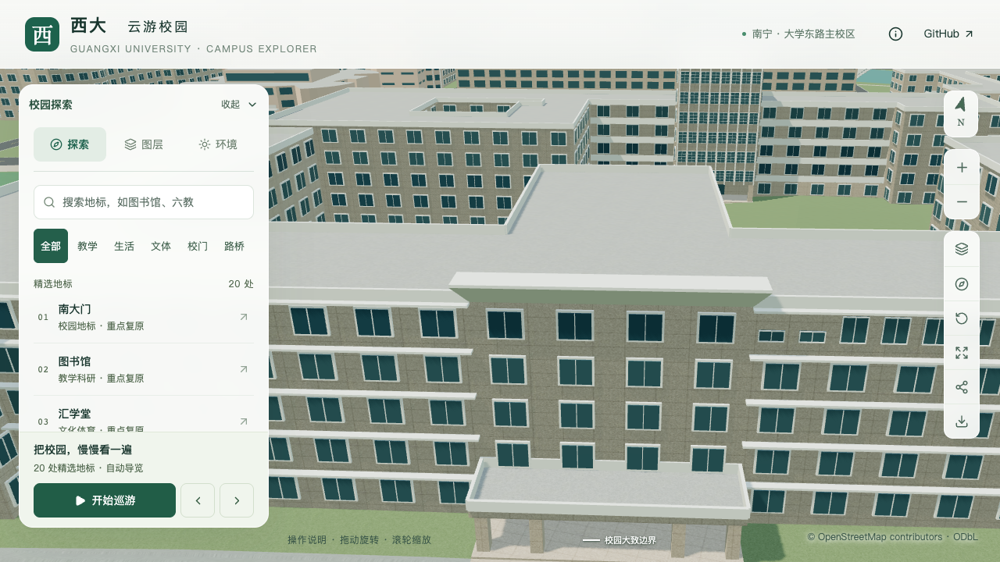
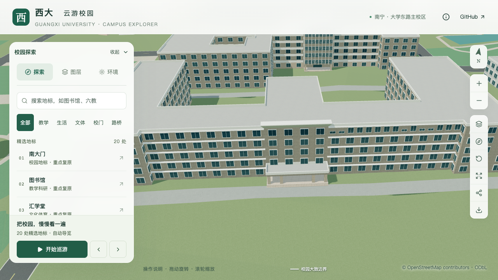

# 农学院中央宽檐口

2026-09-20，S2/S3接续，建筑 `way/759185166`。根据具名正面资料，在五层主墙中央补入白色外挑檐口，替换这一段原通用女儿墙。下方低门廊、主体分段、窗列、十道普通挑檐及绿化保持。

## 依据与估算边界

[学院官网高清横幅](https://nxy.gxu.edu.cn/images/01-28h.jpg)与[2026年招生片](https://nxy.gxu.edu.cn/info/1091/5737.htm)约25秒均可辨认中央宽檐口及下方具名门廊。宽檐口对应门廊后方主墙顶部，不是入口门廊本身。两侧普通挑檐在这里发生形制变化。

采用主楼分段 `main-five-storeys` 的外环第7边，端点对应原OSM外环第8、11顶点，长约17.8044米。这条边由拆出低门廊产生，在原建筑外环中并非一条完整边；因此使用分段锚点，避免误把宽檐口放到4米高的入口顶板上。

| 项目 | 当前参数 | 依据口径 |
| --- | --- | --- |
| 下缘标高 | 主楼16.5米屋面 | 沿用五层×3.3米的估算高度 |
| 向屋内支撑深度 | 0.6米 | 估算；完整支撑区需落在实体屋面内 |
| 顶部向外挑出 | 1.6米 | 照片比例约束估算 |
| 两端放宽 | 每端0.8米 | 照片比例约束估算 |
| 斜面上升 | 1.6米 | 外形近似，非测绘坡度 |
| 顶边厚度 | 0.2米 | 估算，最高点18.3米，不计为新增楼层 |

宽檐口的存在与相对位置有照片支持；斜面、端部和背部以闭合简化外形表达，不声称还原结构做法。板缝、照明、内部支撑和准确厚度未建模。图片拍摄时间未知，招生网页发布日期不能代替每帧的拍摄日期。原照片及裁图仅留在本机 `work/`，不作为纹理或公开分发素材。文件指纹和参数见[证据记录](model-checks/refinement/s3-agriculture-eave-evidence.json)。

## 实现与检查

新增 `roofEave` 字段，明确引用分段自身的外边，屋面高度和朝向由分段计算。校验支撑完整落在平屋面上、不穿内院、不与等高或更高邻段相交，并拒绝无效索引、非有限尺寸、开放门廊及不支持的屋顶组合。基础与近景共用一个闭合外形，只替换选中边的通用女儿墙，不改变原屋面或其他外边。

177项Python数据测试通过，覆盖锚点、顺逆时针朝向、屋面高度派生、规则移除、尺寸边界、内院和高低邻段。56项Node测试、类型检查、lint及完整模型与Pages构建通过。

[专项网格检查](model-checks/refinement/s3-agriculture-eave-eave-geometry.json)对源文件、基础GLB及近景GLB各执行64条射线，检查斜面下侧、前缘、顶部、两端放宽、外侧留空和后方原屋面。检查使用固定地图端点与验收尺寸，不从新增配置自动生成预期值。旧模型在缺失顶边处按预期[失败](model-checks/refinement/s3-agriculture-eave-negative-geometry.json)。

原[15扇顶层窗](model-checks/refinement/s3-agriculture-eave-windows-geometry.json)、[十道挑檐](model-checks/refinement/s3-agriculture-eave-ledges-geometry.json)及[门廊](model-checks/refinement/s3-agriculture-eave-portico.json)回归通过。[数据检查](model-checks/refinement/s3-agriculture-eave-data.json)确认其他447栋记录、原轮廓、标签和场地数据保持。[资产核验](model-checks/refinement/s3-agriculture-eave-assets.json)确认仅基础模型及一个近景区块改变，其他67个GLB及90个基础节点保持，69个模型与生产包一致。首屏模型5,159,656字节，增加132字节；最大普通近景1,684,868字节。

[430栋普通建筑](model-checks/refinement/s3-agriculture-eave-generic-geometry.json)和[实际树冠](model-checks/refinement/s3-agriculture-eave-trees-geometry.json)回归通过。[源文件对比](model-checks/refinement/s3-agriculture-eave-source-preservation.json)确认只有农学院对象改变，其他530个非树木对象和3,063株树的几何、材质、UV与变换保持。

## 固定画面对照

| 角度 | 修改前 | 当前 |
| --- | --- | --- |
| 中央檐口 |  |  |
| 正面整体 |  |  |

另核看[植被开启](screenshots/refinement/s3-agriculture-eave-visible/after/agriculture-front-trees-on-day.png)、[夜间](screenshots/refinement/s3-agriculture-eave-visible/after/agriculture-central-eave-trees-off-night.png)和[手机尺寸基础模型](screenshots/refinement/s3-agriculture-eave-visible/after/agriculture-central-eave-trees-off-day-mobile.png)，共七张。手机为桌面浏览器模拟，不是真机验收；正面整体镜头只用于本次局部修改的环境对照，不证明低翼及后部屋面已校准。完整元数据见[浏览器记录](model-checks/refinement/s3-agriculture-eave-visible-context-browser.json)。

东西端退台、低翼屋面、底部四层与西侧顶层窗列、其他入口与立面仍待核对。当前20条部分对象记录，新增整栋验收数零。

## 首次性能测量（保留）

[完整活动记录](model-checks/refinement/s3-agriculture-eave-performance-browser.json)完成三次LOD往返及两档各三次30秒环绕，无页面、控制台或HTTP错误。精细档59/44/52 FPS，中位数52，相对同系统S0下降13.33%，未通过原10%门槛；流畅档30/30/30 FPS。三角形变化+4.01%/+7.84%，绘制调用变化+2.19%/+11.03%，这两项仍在预算内。

24次[CPU快照](model-checks/refinement/s3-agriculture-eave-performance-performance-context.json)在计时窗口捕获到一次其他项目Python计算（79% CPU、累计CPU时间约1秒）。即时进程检查未看到它，不能代替完整记录；该短时活动也不足以单独解释精细档波动。本次失败及同条件比较未通过的状态保留在[首次联合汇总](model-checks/refinement/s3-agriculture-eave-summary.json)，后续通过交替资产比较排查；几何、画面通过不替代性能验收。

### 交替资产诊断

[三轮交替对照](model-checks/refinement/s3-agriculture-eave-paired-browser.json)使用相同前端、视口和本地资源响应方式，每次从新浏览器上下文开始精细档30秒环绕。顺序为旧/新、新/旧、旧/新；修改前资产为60/60/55 FPS，当前资产为60/60/53 FPS。两组中位数均60，末轮同时下降。这没有复现稳定地随新增檐口出现的帧率损失，但也不能确定首次波动的根因。

此诊断没有运行完整两档协议，不能替代正式验收。为进一步核对同一时段的成本，从本机归档找到与原 `s2-arts-s0-current-os-browser.json` 中模型清单完全一致的S0资产，并逐一验证69个GLB的字节数和SHA-256。后续对S0与当前资产均使用相同当前前端、本地资源响应和原三次LOD往返、两档各三次30秒协议；比较对象仍为原S0，未换成已经包含后续增量的旧dev版本。

### 完整S0/当前对照与交付状态

[S0复测](model-checks/refinement/s3-agriculture-eave-s0-fresh-browser.json)为精细60/52/49 FPS、流畅30/30/30 FPS；[当前版本](model-checks/refinement/s3-agriculture-eave-current-fresh-browser.json)为精细54/51/57 FPS、流畅30/30/30 FPS。相对本轮S0，中位帧率变化+3.85%/0%，三角形增加3.98%/8.52%，绘制调用增加2.21%/10.67%，观测数值均在原预算内。两套资产分别完成三次LOD往返，无浏览器错误；新版本图书馆手机尺寸画面已核看。

但两轮共48次CPU快照显示，计时期间仍有其他项目的Python计算：[S0负载](model-checks/refinement/s3-agriculture-eave-s0-fresh-performance-context.json)、[当前负载](model-checks/refinement/s3-agriculture-eave-current-fresh-performance-context.json)。因此不能将受负载影响的S0下降当成放宽门槛的理由，也不能从+3.85%推断新檐口提高了性能。[最终对照汇总](model-checks/refinement/s3-agriculture-eave-comparison-summary.json)保留 `performanceBudgetNumbersPassed=true`、`sameConditionPerformanceAccepted=false`、`passed=false`。

本批几何与画面通过，性能联合验收仍待无外部重任务的完整复测。首次失败、交替诊断和S0/当前完整对照均原样保留，不通过降低模型真实性或放宽预算消除失败。下一步继续补充低翼/退台定位及剩余立面资料，在具备条件时补齐性能门槛。
