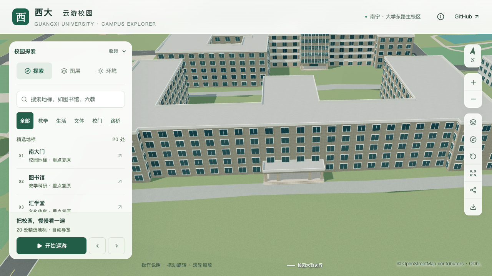
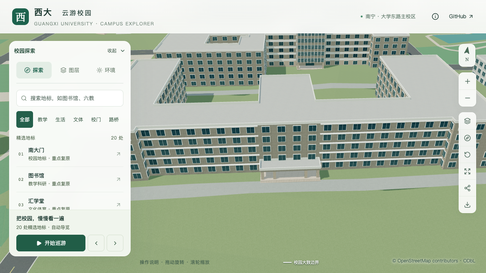
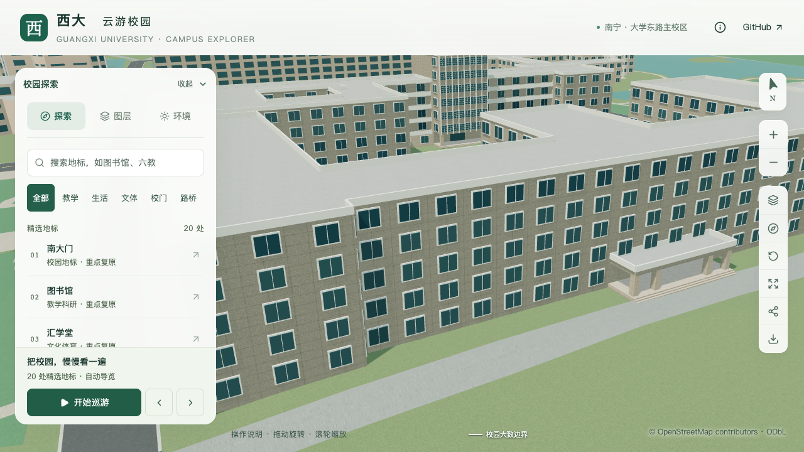
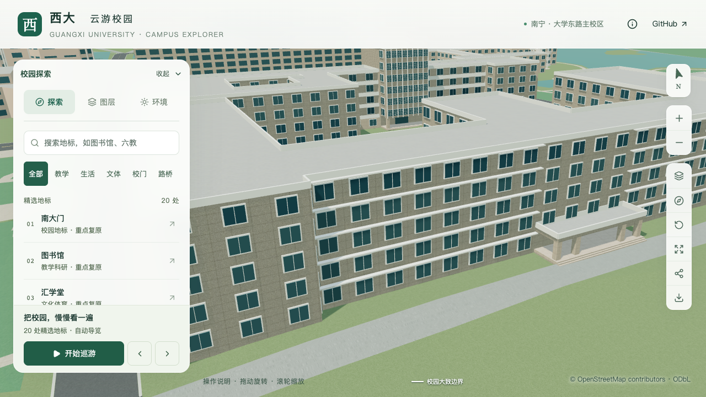

# 农学院正面水平挑檐

2026-09-20，S2/S3 接续工作包，建筑 `way/759185166`。在已校准的四柱低门廊两侧，补充主体正面各五道水平挑檐。此项推进正面辨识度，仍不计为整栋完成。

## 依据与采用范围

[农学院官网具名横幅](https://nxy.gxu.edu.cn/images/01-28h.jpg)可见门廊两侧窗上方的连续水平外挑构件；[2026 招生页面](https://nxy.gxu.edu.cn/info/1091/5737.htm)所附视频约 25 秒提供另一正面视角。页面发布日期与照片拍摄日期分别记录，不能因视频发表于 2026 年就确认每一帧的拍摄时间。

依据低门廊、主墙与两端凸部的关系，将左右主体墙段匹配到原 OSM 外环第 7、11 边。这是图像与轮廓的匹配推断。各边连续挑檐止于原边端点，不向两端待核实的低屋面或中央门廊上方特殊檐口延伸。

| 参数 | 当前采用 | 精度口径 |
| --- | --- | --- |
| 数量 | 每侧五道，共十道 | 正面照片可辨识的重复构件 |
| 顶部相对标高 | 3.3、6.6、9.9、13.2、16.5 米 | 沿用五层、3.3 米估算层高，非测量 |
| 挑出深度、厚度 | 0.65 米、0.16 米 | 照片比例估算 |
| 水平范围 | 原外环第 7、11 边全长 | 保留原轮廓的映射锚点 |
| 材料 | 现有白色材质 | 沿用共享材质，未做真实饰面采样 |

原窗列保持示意；东侧顶层小窗、其他楼层窗宽差异、中央上部大檐口、端部退台及后立面仍待校准。屋顶分级证据见[待核实记录](AGRICULTURE_ROOF_EVIDENCE.md)。本次没有改变主体高度、轮廓、屋顶分段、入口、道路或树位。

## 共享规则

`facadeRules.horizontalLedges` 接受 `from`、`to`、`tops`、`depth`、`thickness`。`tops` 是相对楼栋基准的构件顶面高度，板底由厚度派生；它不替换窗户。远近景均由共享主体生成十个实心薄板，窗户细节仍沿用现有 LOD。

配置限于明确关闭阳台的实体外墙。解析器拒绝越界或倒序的范围、非法数值、无序/重叠标高、超过所属体量高度、门廊及未限定分段的切开立面；当前不与外廊、附着连廊、专项窗格、窗带或面板混用。删除配置可回到默认立面。

## 验收

171 项 Python、56 项 Node、类型检查、lint、完整模型及 Pages 构建通过。[挑檐检查](model-checks/refinement/s3-agriculture-ledges-ledge-geometry.json)直接使用实际三角网，在源文件、基础 GLB 和近景 GLB 中各检查 220 条射线，覆盖顶面、板底、外缘、深度外空区、保留窗口与层间净空。旧模型因缺少第一道挑檐按预期失败，见[旧版反例](model-checks/refinement/s3-agriculture-ledges-negative-geometry.json)。

[原门廊](model-checks/refinement/s3-agriculture-ledges-portico.json)、[430 栋普通建筑](model-checks/refinement/s3-agriculture-ledges-generic-geometry.json)和[实际树冠](model-checks/refinement/s3-agriculture-ledges-trees-geometry.json)回归通过。[源对象对比](model-checks/refinement/s3-agriculture-ledges-source-preservation.json)确认仅农学院变化，其他 530 个非树对象与 3,063 株树保持。[资产核验](model-checks/refinement/s3-agriculture-ledges-assets.json)确认 69 个 GLB 与生产包一致，仅基础模型与一个近景区块变化，90 个非目标基础节点及其余 67 个 GLB 保持。

首屏模型为 5,154,520 bytes，比本批基线增加 704 bytes；最大普通近景区块仍为 1,684,868 bytes。

## 画面对照

以下为同一前端、相机、光照的去树对照。去树仅便于检查建筑，场地树位没有变化。

| 角度 | 修改前 | 当前 |
| --- | --- | --- |
| 正面 |  |  |
| 西侧 |  |  |

[保留植被](screenshots/refinement/s3-agriculture-ledges-visible/after/agriculture-west-ledges-trees-on-day.png)、[夜间](screenshots/refinement/s3-agriculture-ledges-visible/after/agriculture-front-ledges-trees-off-night.png)及[手机尺寸基础模型](screenshots/refinement/s3-agriculture-ledges-visible/after/agriculture-front-ledges-trees-off-day-mobile.png)均已直接核看。手机图仅显示东侧局部立面，属于桌面浏览器尺寸模拟，不是真机或整栋验收。

首次正面相机受南侧邻楼屋顶遮挡，不能核验底层；该次记录留在本机工作目录，最终重新提高相机后采集。最终镜头、图层、加载表示与资产指纹见[浏览器记录](model-checks/refinement/s3-agriculture-ledges-visible-context-browser.json)。参考图仅保存在本机工作目录，不作为模型纹理或分发图片；[来源与估算清单](model-checks/refinement/s3-agriculture-ledges-evidence.json)保留本地图像哈希。

## 复现命令

在完整准备和模型构建完成后，用新的报告前缀执行，避免覆盖历史记录：

```sh
blender --background --python-exit-code 1 --python blender/validate_agriculture_ledges.py -- --report-prefix=<new-prefix>
blender --background --python-exit-code 1 --python blender/validate_agriculture.py -- --report-prefix=<new-prefix>
```

专项检查使用固定验收位置，不从新增挑檐参数自动推导全部预期值；若尺寸依据变更，须重新审查验收位置。其他立面、端部退台与中央大檐口仍待推进，当前仍为 20 条部分对象记录，新增整栋验收数为零。

## 活动性能与交付状态

[活动记录](model-checks/refinement/s3-agriculture-ledges-performance-browser.json)完成三次LOD往返、图书馆手机尺寸回归和两档各三次30秒环绕，无页面、控制台或HTTP错误。记录的FPS为精细60/60/60、流畅30/30/30；相对当前系统S0，三角形增加3.51%/7.38%，绘制调用增加2.38%/6.46%，观测数值在预算内。

但24次[进程快照](model-checks/refinement/s3-agriculture-ledges-performance-performance-context.json)显示，测量中途有两个其他Python进程持续高占用。本批没有在计时窗口运行自己的建模或测试任务，也未干预其他项目任务。**这些测量不构成同条件性能验收通过**；需在外部重任务结束后，对相同资产指纹重新执行活动协议。原记录保留，不以有干扰的高帧率宣称优化效果。

[本批汇总](model-checks/refinement/s3-agriculture-ledges-summary.json)分别记录几何与画面通过、观测预算通过和性能比较待复测，联合验收 `passed` 保持为 `false`。模型改动可在dev审阅；没有更新主分支。

### 后续复测与顶层窗列

本次接续先对原资产执行了[第二次活动协议](model-checks/refinement/s3-agriculture-ledges-quiet-browser.json)，观测仍为精细60/60/60、流畅30/30/30 FPS。但后半段再次出现其他项目的Python计算，[复测汇总](model-checks/refinement/s3-agriculture-ledges-quiet-summary.json)继续保留未通过同条件比较的结论，没有改写第一次报告。随后推进[东侧顶层15窗校准](AGRICULTURE_TOP_WINDOWS.md)，后续联合验收以包含窗列的新资产版本为准。

该后续扩展允许水平挑檐与显式面板同时配置，并检查两者不相交，替代首版暂不允许面板混用的限制。十道挑檐形体保持不变；挑檐验证器不再将已经专项替换的顶层窗强行按旧通用窗位置检查，顶层改由专用窗列验证器覆盖。

2026-09-20，对包含窗列的 `9c38430` 未变资产完成[补充验收](model-checks/refinement/s3-agriculture-windows-recheck-summary.json)：精细60/60/60 FPS、流畅30/30/30 FPS，原性能预算及三次LOD往返通过，24次CPU快照在计时窗口未记录到超过阈值的Python/Blender计算。配合新资产已通过的219条挑檐射线、窗列专项和画面检查，当前保留挑檐的局部联合验收通过。历史旧资产报告未改判；中央大檐口与屋顶退台仍未完成。
