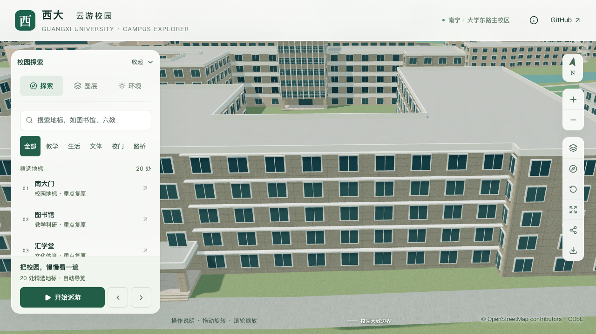
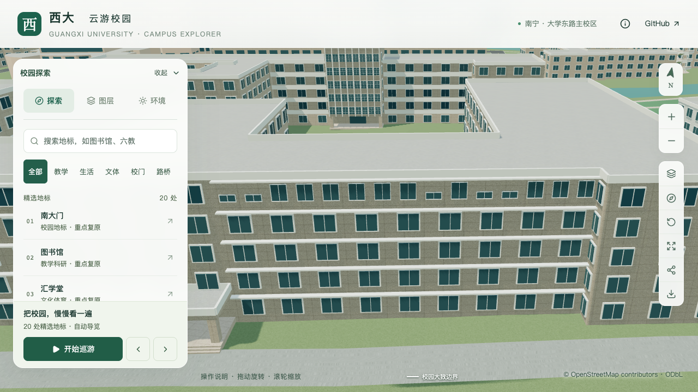
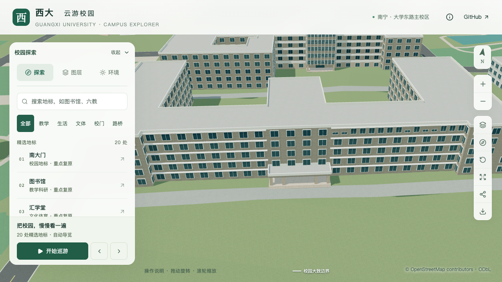

# 农学院东侧顶层窗列

2026-09-20，S2/S3 接续，建筑 `way/759185166`。将南立面东侧主墙顶层的9扇通用窗替换为15扇有照片依据的窗，其中5扇较矮。保留底下四层窗列、既有十道挑檐、四柱门廊和主体；此项仍不代表整栋完成。

## 资料与定位

[农学院官网高清横幅](https://nxy.gxu.edu.cn/images/01-28h.jpg)与[2026年招生片](https://nxy.gxu.edu.cn/info/1091/5737.htm)约25秒的具名正面视角均可辨认这一排列。以中央上部大檐口为西界、东端退台旁墙角为东界，主墙顶层共15扇窗；中央向东数第1、2、9、11、12扇较矮。

与原OSM轮廓匹配后，采用外环第7边。这条边由东向西，故配置中的小窗为第4、5、7、14、15扇，不能直接照照片的从左到右顺序填写。墙段匹配是基于门廊和两端轮廓的推断，仍非测绘定位。

窗数与高矮排列有图像依据；等间距、1.65米宽、共同底标高14.15米、常规窗顶16.0米、小窗顶14.95米及0.06米框宽/0.10米框深为照片比例约束估算。玻璃和窗框是外表面表达，不生成室内空间。上部气窗、外置防护栏、空调、精确窗距与材料没有纳入本批。

横幅内电子屏日期不视为拍摄日期，招生页面的2026-06-08发布日期也不等于每一视频帧的拍摄时间。本地图像及分析裁图只保存在`work/`，不作为纹理或分发照片。[来源、哈希与排列](model-checks/refinement/s3-agriculture-windows-evidence.json)单独记录。

## 实现

新增 `facadeRules.skipWindowLevels`，使用有序且不重复的零基楼层索引。本次 `[4]` 只关闭顶层通用窗，显式面板仍生成；底部四层保持原行为。解析器拒绝无效/不存在的层号、开放门廊，以及会忽略此选择的专项窗格、窗带、外廊和附着连廊组合。

15扇窗沿用 `panels.glazing`，基础与近景共享窗位、尺寸和简化分格。允许面板与既有 `horizontalLedges` 同时存在，新增范围相交检查，避免窗框与挑檐互相穿插。

中央上部檐口、东西端退台、底部四层的真实窗型及其他立面仍待核对。当前仍20条部分对象记录，不增加整栋验收数。

## 验收

174项Python、56项Node、类型检查、lint、完整模型与Pages构建通过。[窗列专项](model-checks/refinement/s3-agriculture-windows-windows-geometry.json)直接读取实际三角网，源文件、基础GLB和近景GLB各84条射线通过。检查包含15扇窗的玻璃与框面、5个小窗上方的实墙、窗间及端部实墙，并确认下方四层的原窗面。旧9窗模型在同一检查中失败，见[反例](model-checks/refinement/s3-agriculture-windows-negative-geometry.json)。

保留的侧墙窗框在转角处向外突出约0.32米，最初端墙采样与它相交；最终固定采样位于距墙端约0.383米处，仍在第一扇新窗约0.452米起点之前。这是避开已有转角构件的检查点修正，没有移动或删除侧墙窗。

[十道挑檐](model-checks/refinement/s3-agriculture-windows-ledges-geometry.json)和[四柱门廊](model-checks/refinement/s3-agriculture-windows-portico.json)回归通过。挑檐检查各219条射线，跳过已经替换的旧顶层通用窗位置，改由上述84条窗列专项覆盖。[430栋普通建筑](model-checks/refinement/s3-agriculture-windows-generic-geometry.json)及[实际树冠](model-checks/refinement/s3-agriculture-windows-trees-geometry.json)检查通过。

[数据检查](model-checks/refinement/s3-agriculture-windows-data.json)确认其他447栋记录、全部原轮廓和标签保持，主体分段、入口、挑檐规则未改。[源文件对比](model-checks/refinement/s3-agriculture-windows-source-preservation.json)确认仅农学院对象变化，其他530个非树对象和3,063株树保持。[资产核验](model-checks/refinement/s3-agriculture-windows-assets.json)确认69个GLB与生产包一致，仅基础模型和一个近景区块变化，其他67个GLB及90个基础节点保持。

首屏模型5,159,524 bytes，比上一版本增加5,004 bytes；最大普通近景区块仍为1,684,868 bytes。

## 固定画面

同一前端、相机和光照，去树便于比较窗列；原植被数据保持。

| 角度 | 修改前 | 当前 |
| --- | --- | --- |
| 东侧主墙 |  |  |
| 正面整体 |  |  |

[保留植被](screenshots/refinement/s3-agriculture-windows-visible/after/agriculture-front-trees-on-day.png)、[夜间](screenshots/refinement/s3-agriculture-windows-visible/after/agriculture-east-upper-trees-off-night.png)及[手机尺寸基础模型](screenshots/refinement/s3-agriculture-windows-visible/after/agriculture-east-upper-trees-off-day-mobile.png)均已核看。手机视角只覆盖局部立面，属于桌面尺寸模拟，不是真机验证。完整元数据见[浏览器记录](model-checks/refinement/s3-agriculture-windows-visible-context-browser.json)。

复查命令使用新报告前缀，不覆盖历史验收：

```sh
blender --background --python-exit-code 1 --python blender/validate_agriculture_windows.py -- --report-prefix=<new-prefix>
```

## 首次性能记录（保留）

[新版本活动记录](model-checks/refinement/s3-agriculture-windows-performance-browser.json)完成三次LOD往返、图书馆手机尺寸回归及两档各三次30秒环绕，无页面、控制台或HTTP错误。精细档52/56/50 FPS，中位数52，比S0低13.33%，**未通过下降不超过10%的门槛**；流畅档30/30/30 FPS。三角形变化为+3.22%/+7.48%，绘制调用变化为+3.84%/+6.08%。

25次[进程快照](model-checks/refinement/s3-agriculture-windows-performance-performance-context.json)记录到计时窗口内仍有其他Python和Blender计算。不能将本次下降直接归因于窗列，也不能因存在干扰而将不通过的结果改判为通过。待外部重任务结束后，须对相同资产指纹复测，并解决届时仍存在的预算问题。

[联合汇总](model-checks/refinement/s3-agriculture-windows-summary.json)中几何与画面通过，性能观测预算和同条件比较均未通过，整体 `passed=false`。这批可在dev审阅，不更新主分支。此前挑檐两次受干扰记录保留；本版本已经重新检查十道挑檐，后续共同使用当前完整资产进行性能验收。

## 2026-09-20 补充验收：性能通过

对 `9c38430` 的未变资产完成一次独立复测。[新活动记录](model-checks/refinement/s3-agriculture-windows-recheck-browser.json)中，精细档60/60/60 FPS、流畅档30/30/30 FPS；相对同系统S0，三角形增加3.56%/7.48%，绘制调用增加2.38%/2.66%，均通过原预算。三次LOD往返无错误。

24次[CPU快照](model-checks/refinement/s3-agriculture-windows-recheck-performance-context.json)在计时窗口未记录到超过2%阈值的Python/Blender计算。该检查为10秒间隔采样，不表示机器完全没有后台活动。[图书馆手机尺寸回归](screenshots/refinement/s3-agriculture-windows-recheck/library-mobile.png)已直接核看，入口、台阶及前场连接保持可见。

[补充汇总](model-checks/refinement/s3-agriculture-windows-recheck-summary.json)核对源文件、生成输入及模型清单指纹未变，并校验全部69个GLB和生产包一致。沿用匹配这些资产的窗列、挑檐、门廊、普通建筑、树冠与画面检查，当前窗列及保留挑檐的局部联合验收通过。未重新运行已通过的模型构建或单位测试，也未改判、覆盖此前失败报告。

下一步继续核对中央上部檐口、底部窗列和屋面分级边界。20条部分对象记录及新增整栋验收数零保持；本次局部通过不表示农学院整栋或S3场地样板已完成。
