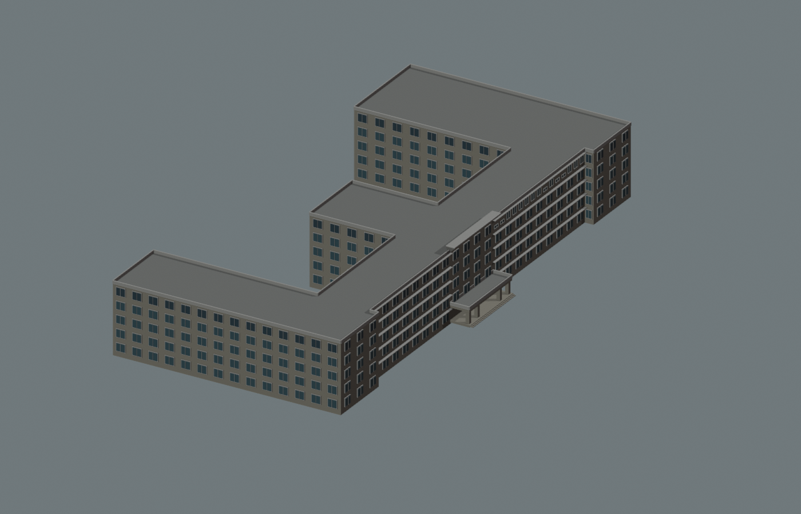
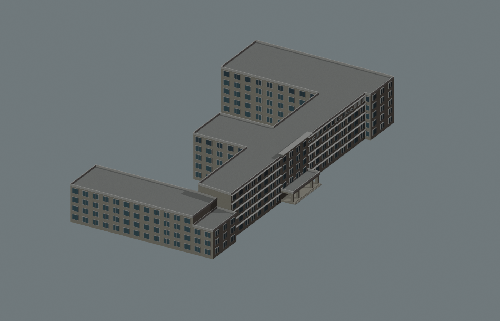

# 农学院西翼屋面：独立体量候选

2026-09-30，针对 `way/759185166` 制作西翼高低关系对照。**候选未进入正式模型。** 院庆航拍支持西翼低于主体、前部露台再低一级；四层、三层和分界进深仍待验证，不能把生成检查通过解释为实景校准完成。

## 依据与参数

沿用[屋面证据记录](AGRICULTURE_ROOF_EVIDENCE.md)中的[院庆视频](https://nxy.gxu.edu.cn/xyzc/a90znyqxcsp.htm)约255秒及[招生视频](https://nxy.gxu.edu.cn/info/1091/5737.htm)约25秒参考帧。拍摄日期未确认；“四层露台”不直接等于四层实体屋顶。本轮采购附件检索及GX720局部全景筛查没有取得可可靠定位的新屋面尺寸证据，未用相似建筑替代本栋。

| 部位 | 正式模型 | 独立候选 | 判断边界 |
| --- | --- | --- | --- |
| 主条形楼、东翼、中央后翼 | 五层，16.5米 | 保持 | 东翼另行核对，不能由西侧照片推定 |
| 西翼后段 | 五层，16.5米 | 四层，13.2米 | 高低关系有航拍线索；层数、层高为假设 |
| 西翼南端露台下部 | 五层，16.5米 | 三层，9.9米 | 支撑层数及标高未确认 |
| 露台进深 | 未分段 | 沿原西翼轴线8米 | 参数试装，不是已定位的实景退台线 |
| 南门廊、中央檐口、正面挑檐和东侧顶层窗列 | 已有局部校准 | 保留配置 | 本轮没有重新验收生产资产中的全部构件 |

西翼采用原外环顶点12–17围成的区域，在原占地内拆分；主楼维持中央檐口对应的物理边。6、8、10米进深分别产生95.537、128.007、160.820平方米的露台。这只是参数敏感性，不是置信区间，也不能据此选定8米为真实值。

## 前后对照

下图为同相机、同材质的独立生成几何，地面基准归零；没有地形、植被、浏览器光照或照片相机配准。

原模型：



估算候选：



另检查[原南面](screenshots/refinement/s3-agriculture-west-roof-proposal/original-south.png)、[候选南面](screenshots/refinement/s3-agriculture-west-roof-proposal/candidate-south.png)、[原俯视](screenshots/refinement/s3-agriculture-west-roof-proposal/original-roof.png)、[候选俯视](screenshots/refinement/s3-agriculture-west-roof-proposal/candidate-roof.png)，共六张。候选能表达逐级降低，但新暴露的主楼西端与退台墙仍为空白墙；露台出入口、栏杆和窗列未校准，不能作为成品外观交付。

## 已验证范围

- 分区并集保持原3763.307平方米占地，并集对称差约2.84×10⁻¹³平方米、重叠约9.09×10⁻¹³平方米。入口与中央檐口解析结果、立面规则保持。
- 基础/近景两种生成模式共16条记录通过：各六处固定坐标屋面高度，另各两条从估算退台上方向24米标高的有限射线。原五层模型在改变高度处不符合候选期望，且阻挡这两条上方射线。该检查不证明整个空间体积完全净空，不包括导出GLB、地形或现场正确性。
- 候选重新生成后解析JSON一致；序列化键序可能不同，不要求字节相同。
- 对照提交 `00531878df182844979db3049add8bd96fbe83e0`，检查的119个受版本管理的源/公共数据和模型文件保持，包含69个GLB及校园Blender源文件。没有构建Pages或重新测FPS，不新增性能结论。

数据见[候选及来源指纹](model-checks/refinement/s3-agriculture-west-roof-proposal.json)与[生成几何检查](model-checks/refinement/s3-agriculture-west-roof-proposal-geometry.json)。临时来源ID仅存在候选内，没有写入生产来源目录。22个校准对象中仍为2栋首轮整栋通过、20个部分校准；S3六栋整栋完成数仍为零。

复现候选需要本机已取得的两张参考帧（路径与哈希保存在候选JSON），Python环境需安装Shapely。独立渲染可直接使用已提交的候选JSON：

```sh
work/refinement-venv/bin/python scripts/propose_agriculture_west_roof.py --output work/agriculture-roof-proposal.json
blender --background --python-exit-code 1 --python blender/check_agriculture_roof_proposal.py -- --proposal docs/model-checks/refinement/s3-agriculture-west-roof-proposal.json --report work/agriculture-roof-geometry.json --images work/agriculture-roof-images
```

## 2026-09-30投影试配补查

以七处手动选择的主楼边角/层线和估算层高做初步针孔相机试配，尚不能同时对齐主楼两端；人工边角对应与相机假设均待重查。没有将试配结果用于修订进深或层数，不能把误差归因于OSM轮廓本身。试配脚本和参考叠图留在本机 `work/refinement-s3-agriculture-alignment/`，不作为通过的配准报告。本轮转入同帧背景中可与具名项目册交叉核对的[动物学院核心屋顶](ANIMAL_COLLEGE_ROOFTOP.md)，农学院候选保持。

## 接续工作

### 2026-09-30：独立屋顶验证点复查

新增[可复现试配脚本](../scripts/audit_agriculture_roof_alignment.py)与[数值报告](model-checks/refinement/s3-agriculture-roof-alignment-audit.json)。沿用原七个人工对应，先仅用六个正面层线点求相机，将屋顶角作为未参与求解的验证点。七点共同拟合的均方根误差约6.07像素；六点正面拟合降至约1.91像素，但屋顶角偏差约66.35像素。东端三点整体沿水平或竖直偏移±3像素的四次确定性探测中，屋顶偏差仍约65.78–66.91像素；这些不是置信区间。

这说明正面拟合改善不能证明屋顶对应正确，尚不能区分人工对应、屋面形体、映射轮廓与相机假设中的原因。不用该相机推算8米退台或层数，也不根据单帧误差移动OSM轮廓。相机假定等像素焦距、主点`[960,540]`、无镜头畸变；层高仍采用估算3.3米。没有引入新的现场尺寸。

```sh
work/refinement-venv/bin/python scripts/audit_agriculture_roof_alignment.py --report work/agriculture-roof-alignment.json
```

本轮停止重复求解同一对应组，等待新的可定位屋顶边缘或校准资料。下一独立工作已转入[动物学院接地修补](ANIMAL_COLLEGE_FOUNDATION.md)，其生产侧翼侵入已由实际源/基础模型确认。农学院候选继续保留，不转入生产。

### 后续取证与集成条件

1. 对应可见露台边缘与原外轮廓，取得西翼侧后视图或对应图纸，确认低翼层数、露台支撑层数和退台深度；不重复扩大无目标的全景搜索。
2. 依据结果修订候选，补齐新暴露墙面、露台出入口和边缘构件。东翼露台独立处理，不能沿用西翼参数。
3. 达到可定位、可登记估算的程度后，再集成覆盖表与正式模型，并运行既有门廊/挑檐/窗列/檐口回归、实际两级GLB、地形树木、固定相机及性能检查。
4. 继续动物学院核心侧后方、后翼及前庭核对；资料仍不足的部位保留明确未知项。旧结构大厅的独立身份及存废核对仍在队列中。
