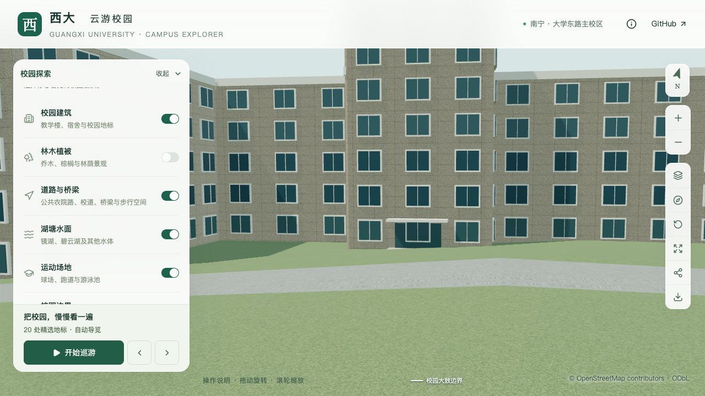
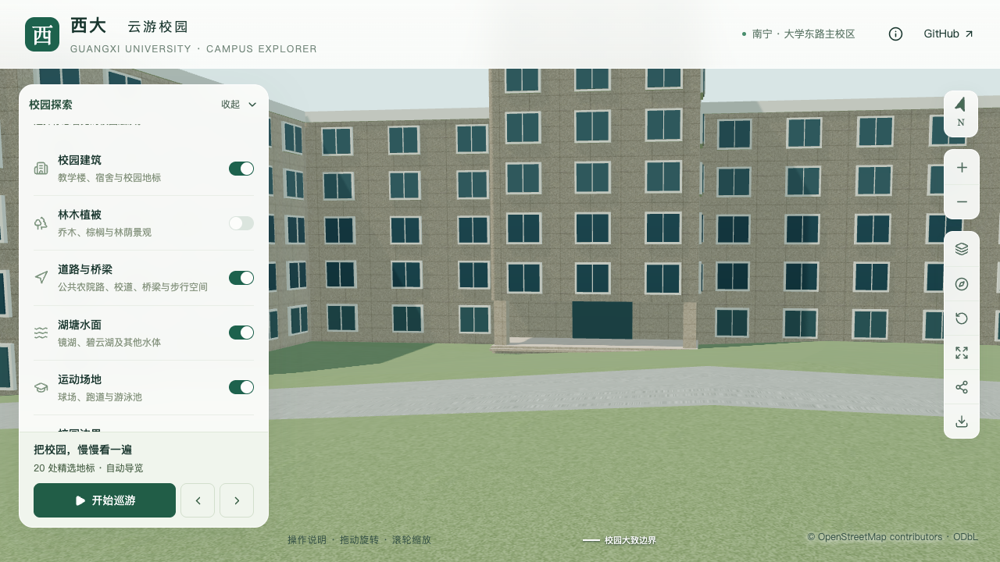
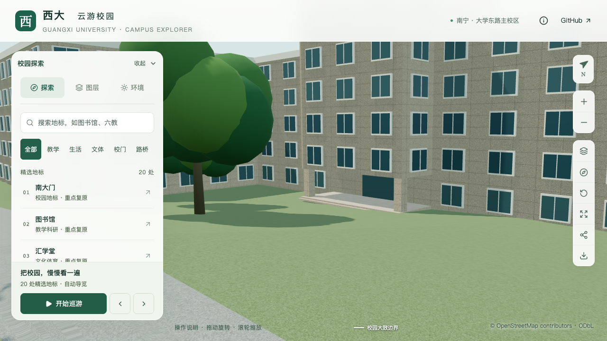

# 动物学院南侧入口校准

本批对应 S2 楼栋校准与 S3 图书馆邻楼，目标为 `relation/11564704`。依据具名照片，将南侧凸出核心底层改为开放门廊，并把门面移到后方主体墙；核心与侧翼高度本批保持原值。整栋核对尚未完成。

## 资料与定位

[学院 2026 年校友会筹备会议报道](https://dky.gxu.edu.cn/info/1240/4410.htm)的末张合影显示学院门头、两侧方形支撑、梁底、后退的玻璃门墙，以及右侧未遮挡的两级台阶。页面发布于 2026-07-31，确切拍摄日期未独立确认。

该入口与[校方项目册](https://jjh.gxu.edu.cn/__local/A/1C/2D/C94DA67648AB9698A6BE04E1718_D3801DBD_2512297.pdf) PDF 第 40 页的具名全楼照相匹配。南侧方向由全楼形体与 OSM 凸部推断，近照本身没有方位标志。资料文件、哈希、采用与排除项见[取证记录](model-checks/refinement/s3-animal-evidence.json)。原图只存本机参考目录，不随项目分发或制作贴图。

同批研学营合影中带大型圆柱的另一栋建筑，以及被活动展板遮挡的背景，均没有套用于动物学院几何。

## 几何处理

- 保留原外环、内院与南侧第 11 边入口锚点，沿法向内退约 4.64 m，落在原凸部后缘的主体墙上。
- 将原七层入口核心分成等高的前部和后部，前部底层开放；前部约 64.52 m²，后部约 162.90 m²。原切分约 0.0035 m² 的侧翼边缘细片并入凸部，整栋轮廓不变。
- 两侧方柱、开放空间、后退门面、平台与台阶在基础和近景共用；上层仍有窗列。两段同高屋顶的内部边界不增加女儿墙。
- 门宽 4.4 m、方柱 0.85 × 0.85 m、板底相对楼栋基准 3.60 m 为模型估算。两级台阶各估 0.15 m，落地基准相对楼栋基准为 0.25 m，平台为 0.55 m；这些不是现场测量高程。

`parts.openBelow` 扩展为支持平顶多层体量的底层开放空间。多层体量只排除板底以下窗格；一层门廊继续不生成普通窗格。新增 `entrances.steps` 和 `stepBaseHeight`，分别表示级数与相对楼栋基准的落地标高；既有入口不填写时保持原三阶及零基准规则。输入检查拒绝非整数级数、无内退入口的阶梯配置及高于平台的落地基准。

## 验证范围

专项命令为 `blender --background --python-exit-code 1 --python blender/validate_animal_entry.py`。检查实际源文件、基础 GLB 与近景区块中的屋顶高度、柱间开口、柱位置、后退门面、上层窗格、两级台阶及其地面净空。同高屋面检查在接缝两侧各 4 cm 的面内部采样，以识别原宽 25 cm 的错误女儿墙；不将恰落在浮点或压缩边上的单条射线当作连续屋面的证明。

修改前模型在新检查中缺少抬高门廊地板，明确失败。首版暴露了旋转公共边未被识别而生成内部女儿墙的问题；修正后又发现下级台阶被地形埋住约 13.5 cm。两项发现均保留日志，并分别通过公共边容差和独立台阶落地标高处理。

最终几何、画面、资产和性能结论统一见[本批汇总](model-checks/refinement/s3-animal-summary.json)。未经完成的检查保持待验收。

本批源文件及实际基础/近景检查通过，430 栋普通建筑回归、农学院入口回归和 3,050 株树的实际表面碰撞检查通过。54 项 Python、54 项 Node 测试及生产构建通过。只有动物学院源对象、基础模型内对应区块及该近景区块变化；其余 522 个源对象、82 个基础节点和 67 个 GLB 文件保留。首屏模型为 5,892,644 bytes，增加 548 bytes。

11 张固定画面与图层/夜景状态已逐张核对，三次 LOD 往返通过，无浏览器错误。本轮精细档 60/60/60 FPS，流畅档 27/28/28 FPS；三次中位数分别为 60/28。相对 S0，三角形增加约 1.04%/3.61%，Draw Calls 增加约 0.93%/5.22%，均符合门槛。25 次进程采样未捕捉到 Python/Blender 高负载活动，同条件验收通过；这是保留日常桌面活动的比较，不宣称 CPU/GPU 独占基准。

下列同镜头对照关闭植被，以显示入口变化；正常植被状态的遮挡保留在本批画面报告中。

| 修改前 | 修改后 |
| --- | --- |
|  |  |

## 尚未完成

后续校方英文介绍中的清晰照片支持可见侧翼为五层，消除了本批小图引起的数层疑问；两段可定位的南侧外廊和中央正面八列窗格已另批处理，见[外廊校准](ANIMAL_COLLEGE_FACADES.md)与[窗格校准](ANIMAL_COLLEGE_GLAZING.md)。未入镜的后翼层数与范围、背立面、其他入口、核心侧面及精确窗扇细节仍需核对，不能用这些局部修正代替整栋完成。门前道路到入口的完整铺装与植被组织也仍属于后续场地校准；关闭植被的对照用于检查几何，正常画面中的示意树遮挡需单独记录。上文数值和验收报告保留入口批次的历史资产含义。
