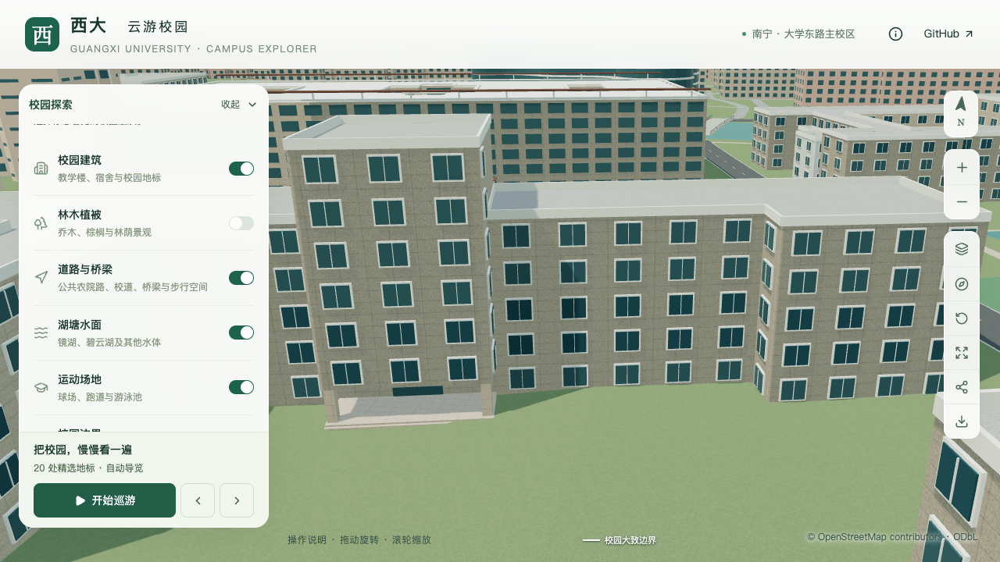
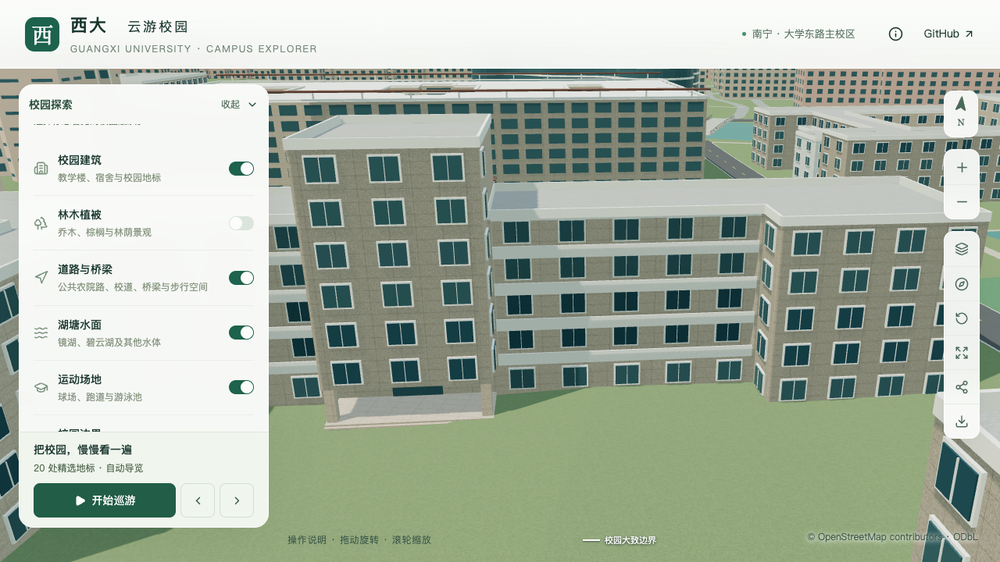

# 动物学院南侧外廊校准

本批继续 S2/S3 的 `relation/11564704` 楼栋核对，把南侧两段封闭窗墙改为有楼板、栏板及后退墙面的开放外廊。沿用五层侧翼、七层入口核心与上一批内退门廊；整栋和门前场地尚未完成校准。

## 依据与精度

[校方英文学院介绍](https://www.gxu.edu.cn/en/info/1152/1716.htm)中的[具名建筑照片](https://www.gxu.edu.cn/__local/1/32/C3/85513A03D9D47359D91A371CBCF_0804C39E_8B8FE.jpg)能辨认东侧翼底层及其上四层外廊，支持该可见段为五层。西侧可见段也有连续外廊横带。门头和凸出的玻璃核心与历史项目册及 2026 年入口合影相匹配；南向及对应边段仍由照片和地图轮廓联合推断。

这张清晰照片消除了上一批小图引起的“可见侧翼是否应增至六层”疑问。它没有覆盖全部后翼，不能据此确认后翼层数、分段范围或其他入口。页面中的 2022–2023 年办学统计不作为建筑拍摄日期；发布日期和拍摄日期均未知。

采用记录见[资料与排除项](model-checks/refinement/s3-corridor-evidence.json)，来源 ID 为 `gxuAnimalEnglishFacade`。参考原图只在本地取证目录保存，不分发或制作贴图。照片还支持门前存在硬质铺地，但本批未确定铺装边界、树种、雕像或花坛位置。

## 几何与数据规则

- 在原始外环第 1、9 边锚定外廊，各保留底层实体，第二至第五层开放。全部外廊位于原轮廓内部，外环、内院、体量分段和高度不变。
- 两级 LOD 共用外廊楼板、栏板、后墙和端墙。上层窗列移到后墙，底层保持原规则；窗户数量和样式仍为示意。
- 廊深 1.4 m、栏板高 0.9 m、两端各退 0.3 m、楼板厚 0.18 m、栏板厚 0.14 m 为模型估算。五层采用照片计数，16.5 m 主体高度仍由 3.3 m 层高换算，并非测量。
- 屋顶保留原顶面，最上层楼板不重复生成共面顶面；后墙、端墙按楼层分段，避开楼板厚度范围。

`facadeRules.openCorridor` 接受 `depth`、`firstLevel`、`railHeight` 和 `endInset`。`firstLevel` 从零计数，最小为 1；仅支持具有整数层数的平顶实体分段外立面。解析器拒绝越出所属分段、侵入内院、相互重叠的外廊，以及非法尺寸、过高栏板、无有效净长或同时启用阳台的配置。

## 验证与前后对照

专项检查运行：

```sh
blender --background --python-exit-code 1 --python blender/validate_facade_corridors.py -- --report-prefix=s3-corridor-final
```

检查源文件与实际解码的基础/近景 GLB：每层取三个位置，两面四层共 24 组采样，核对开口、后墙深度、地板、顶板、栏板及底层和端部实体。容差分别为 0.011、0.05、0.02 m，针对模型与压缩误差，不表示现实测量精度。修改前模型在开口检查中明确失败；[最终几何检查](model-checks/refinement/s3-corridor-final-geometry.json)通过。

下面使用同一无邻楼遮挡的镜头，关闭植被显示外廊变化。正常植被、图层与夜景检查另存；最初被邻楼屋顶遮挡的近景不用于几何对照。

| 修改前 | 修改后 |
| --- | --- |
|  |  |

验收结论及资产哈希见[本批汇总](model-checks/refinement/s3-corridor-summary.json)。后续已依据相同资料另批处理[中央正面八列窗格](ANIMAL_COLLEGE_GLAZING.md)；背立面与后翼、其他入口、核心侧面、门前铺地和植被组织继续待核对，完整建筑计数仍不增加。下文保留本外廊批次的历史资产与性能结果。

已通过源文件及基础/近景专项、430 栋普通楼回归、原内退入口回归、全部 3,050 株树的实际建筑表面碰撞检查。57 项数据测试、54 项 Node 测试、类型检查、Lint 与 Pages 构建通过；最后补充的门廊冲突校验只拒绝无效配置，10 条现有覆盖记录解析出的形体与已导出数据完全相同。11 张固定/图层/夜景画面逐张核对，三次 LOD 往返与手机尺寸检查通过。

源文件只有动物学院对象变化，其他 522 个对象和全部树属性保留；仅基础模型中的对应区块及该近景 GLB 变化，其余 82 个基础节点和 67 个 GLB 文件保留。69 个模型及全部派生数据与生产包一致，首屏模型 5,895,008 bytes，比本批前增加 2,364 bytes，最大普通近景区块 1,684,868 bytes。

**性能尚未通过。** 首轮精细 52/53/53、流畅 27/27/27 FPS，记录到外部 Python 高负载；首轮观察到的一个进程退出后安排复测，结果为精细 55/51/48、流畅 28/28/28 FPS，仍未达到 S0 精细档中位数至少 54 FPS 的门槛。完整采样显示第二轮也出现其他高负载 Python 进程；末段没有该类进程的单次快照不足以代表整轮。两轮均存在干扰，不能据此通过同条件性能验收或断言模型是下降的原因。原报告分别保存在 `s3-corridor-timed` 与 `s3-corridor-repeat`，后续冻结基线复跑只作为诊断证据。

完整模型重建仍需成套保留未改动的时光之门源对象及原压缩几何，避免其过程生成差异混入本批；全局重建字节确定性尚未解决。树检查证明已导出表面没有交叉，不等同于封闭体包含或道路、水体、运动场的完整净空验收。

冻结 S0 预览的 85 个数据及模型文件已逐一核对原哈希，独立复跑得到精细 60/60/60、流畅 28/28/28 FPS，26 次采样未捕捉到高负载 Python/Blender。随即测试相同资产的当前版本（`s3-corridor-post-baseline`），得到精细 60/60/60、流畅 29/28/28 FPS，数值全部达标；25 次采样中有一次高负载 Python 进程，发生在第三轮精细活动期间，因此同条件性能仍待补测。

上述回放保留原基线，未改变验收门槛。此前低帧率没有在最后一轮稳定复现，但顺序测试仍不足以确定原因。见[性能诊断与采样记录](model-checks/refinement/s3-corridor-performance-diagnosis.json)。后续应补充无并发计算干扰的活动记录；若再次稳定回退，再针对实际渲染瓶颈处理。

后续[中央窗格批次](ANIMAL_COLLEGE_GLAZING.md)已对当前模型重新检查两段外廊、原入口和全部树的建筑表面碰撞，并取得精细 60/60/60、流畅 29/29/28 FPS 的同条件通过记录，25 次采样未捕捉到高负载 Python/Blender。当前累计版本的外廊性能待验收项据此关闭，依据为[当前批次汇总](model-checks/refinement/s3-glazing-summary.json)中的模型哈希；本页前述历史报告保留原结果。
