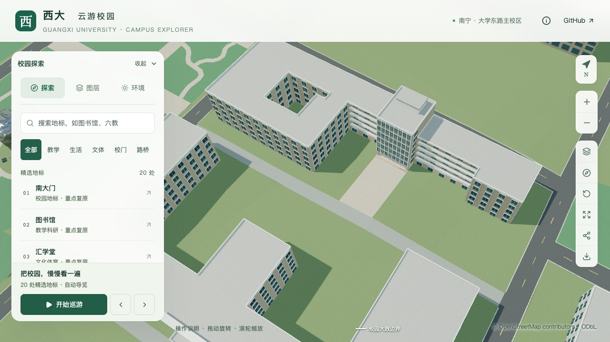
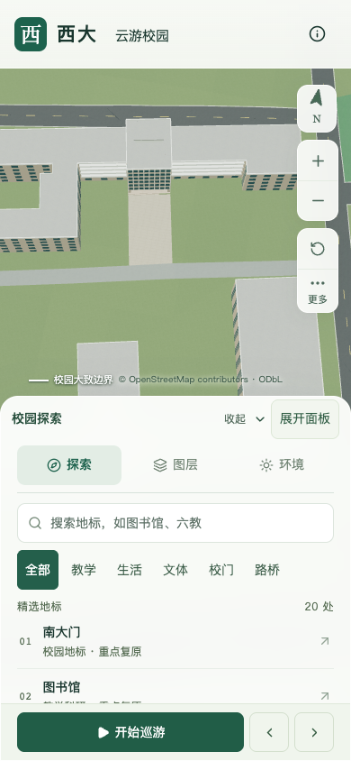

# 动物学院南入口与服务路连接

2026-09-30，动物科学技术学院 `relation/11564704`。在原两级入口台阶与南侧服务路 `way/759185167` 之间补入中央铺装，保留建筑、台阶和道路原平面。完整两侧前庭、雕像及树池尚未定位，本批不增加整栋完成数。

## 依据与范围

[校方英文介绍的具名照片](https://www.gxu.edu.cn/en/info/1152/1716.htm)可见入口前连续硬质铺地；[2026年校友活动](https://dky.gxu.edu.cn/info/1240/4410.htm)提供入口与台阶的补充线索。本次直接核看已保存的英文页面原图。照片不能给出完整前庭边界，接路范围采用现有模型台阶和地图道路约束，未作摄影测量。

- 沿原台阶全宽13.894米，连接约24.156–24.376米外的原服务路边，面积337.145平方米。
- 沿用原台阶底部0.25米基准、两级台阶和0.55米平台，入口及建筑主体不改。
- 远端贴合实际路面三角网；仅削低铺装下方地面，保留铺装外地形与道路边界。
- 浅色铺装、宽度和标高为估算。生成坡度约8.8%–12.4%（按各网格列中点采样），不是现场实测，也不作为无障碍路线认证。
- 移除树干位于新铺装内部的一株示意树 `[303.3, -269.0]`，其余3,062株树的位置、尺寸和朝向保持。该操作不表示现实中砍伐或缺失树木。

解析器的台阶宽度采用与建筑生成器相同的规则：有 `stepWidth` 时优先采用，否则使用 `porticoWidth`。原入口记录不变，禁止用独立路径宽度绕过台阶全宽约束。

## 验证

280项Python、66项Node、类型检查、lint及完整模型/Pages构建通过。源文件和实际基础模型各1,344处铺装采样、1,463处外围地形采样通过；检查包含2.1米净空、原台阶高度、道路接口和连续坡面。旧资产因缺少连接面被验证器拒绝，反例有效。

初版1米网格的两档FPS保持60/30，但流畅档三角形较原S0增加15.20%，超过15%预算，见[初次失败汇总](model-checks/refinement/s3-animal-front-summary.json)。最终改用既有允许范围内的2米网格，原边界、标高与全部几何阈值保持。首屏模型从初版5,970,148字节降到5,886,864字节，相对本批前增加56,220字节；最大普通近景1,684,868字节。

只有基础GLB发生改变，其他68个GLB、448栋建筑记录、原地图几何、532个无关非树源对象及3,062株保留树的形体和变换保持。源文件仅修改地形、道路接口，新增连接面；69个GLB与生产包一致。

最终[联合汇总](model-checks/refinement/s3-animal-front-lite-summary.json)通过：精细60/60/60 FPS、流畅30/30/30 FPS，相对原同系统S0三角形增加6.20%/14.86%、绘制调用增加3.11%/14.07%；首屏及最大近景资产预算通过。三次LOD往返无记录错误，六张回归图已直接核看；26次CPU快照在计时窗口内未记录超过2%阈值的Python/Blender计算，采样不等于完全隔离。流畅档三角形仍接近15%上限，后续细化继续控制新增几何。

## 后续

动物学院仍需核对侧后立面、后翼体量、其他入口和两侧完整前庭。用户指定的土木学院实验大厅和“新结构大楼”已归入同一平台复合对象，见[首轮整栋报告](CIVIL_PLATFORM_WHOLE_REVIEW.md)；下一批优先复核其剩余大厅运输口及北楼背面资料，旧结构大厅仍独立取证。全项目S0–S5目标保持，所有修改、提交与推送仅在dev。

## 最终画面

九张前后、植被、日夜和手机尺寸画面已直接核看。初版手机视角被邻楼遮挡；最终采用俯视镜头，完整显示入口接路。道路斜向镜头仍有前景屋顶遮挡，由俯视图及实际几何采样补充，不把遮挡画面当作全接口验收证据。

[最终几何](model-checks/refinement/s3-animal-front-lite-geometry.json)、[资产保持性](model-checks/refinement/s3-animal-front-lite-assets.json)和[画面检查](model-checks/refinement/s3-animal-front-lite-visual-review.json)记录实际范围与限制。手机检查是桌面Chromium视口模拟，未声称实体设备验证。
