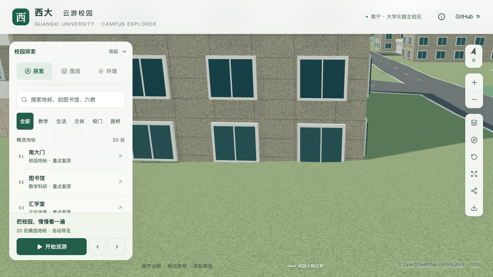
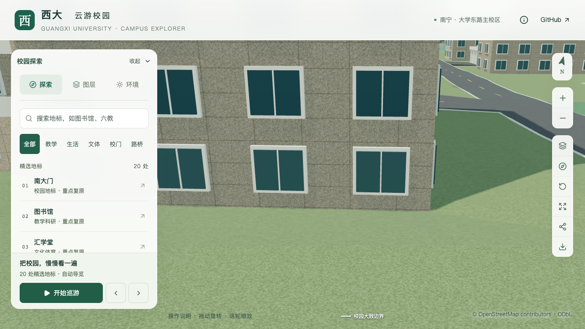

# 动物学院侧翼接地：正式修补与验收

2026-09-30，`relation/11564704`。侧翼局部修补已进入正式源模型和基础GLB，同组楼内侵入采样归零。南入口、屋顶、农学院周界与既有土木修补复验通过；本批仍不增加整栋通过数。最终资产和性能见[本批汇总](model-checks/refinement/s3-animal-foundation-summary.json)。

## 修补前生产资产中的问题

采用已有[接地审计器](../blender/inspect_foundation_clearance.py)，覆盖封闭分部的2米网格及外墙内侧0.25米采样带，排除开放入口分部。基础模型实际解码后重复检查，近景共用基础地形。

| 分部 | 每种表示采样数 | 源模型地形侵入点 | 基础模型地形侵入点 | 最大高于采用基准：源 / 基础 |
| --- | ---: | ---: | ---: | --- |
| 入口核心 | 69 | 0 | 0 | 0.207 / 0.210米 |
| 侧翼 | 713 | 101 | 101 | 0.941 / 0.938米 |

两种表示均未检出高于基准0.3米的道路侵入。0.3米为粗略模型冲突诊断容差，不是现场允许高差。建筑采用基准3.9米未改变，也不是实测地坪。最大侵入位于侧翼东端附近，源与基础都有问题，因此不能归因于Draco压缩；单独通过南入口铺地检查不足以证明整栋接地正确。详见[当前失败报告](model-checks/refinement/s3-animal-foundation-before.json)。

对修补前快照可复现失败；对当前模型同一命令通过：

```sh
blender --background --python-exit-code 1 --python blender/inspect_foundation_clearance.py -- --building-id=relation/11564704 --report=work/animal-foundation.json --fail-on-intrusion
```

## 独立候选及边界缺陷

候选复用已有局部修补：封闭占地外扩0.1米作为核心，6米范围内向保留地面过渡，保留道路、其他建筑和南入口铺地保护区；只削低超出采用基准的地形。闭合占地约2,369.24平方米，保护裁剪后的范围约4,530.31平方米，无需裁除道路。上述为模型修补参数，不代表现场土方方案。

首个候选消除了楼内采样侵入，但周边检查发现保留路面下方一处地面被抬高约0.327米。检查点`[307.17, -253.31]`及其周围毫米级偏移均复现，不能视作孤立射线噪声。问题来自共享边界重新向原地形投射射线：原有铺地接缝两侧有不同高程，重新取最高命中面把保留低侧顶点从约4.03米改为4.47米，影响相邻三角面。

修复后，裁剪边界沿用原三角面的插值高度，不再在边界上重新取高；0.1毫米范围仅用于容纳float32坐标舍入。内部共享边仍重算，原周边验收容差没有放宽。新增真实网格回归用例模拟不同高度的相邻地形面：旧代码把保留区域从1米抬到约2.99米，修复后保持1米，内部目标区域仍降到0米。

## 前一批独立候选的验证记录

- 五项修补网格夹具、五项接地审计夹具通过；新增边界用例已验证旧代码失败、新代码通过。
- 修复后的独立源模型候选：同组782点侵入归零；内部最高残差约0.025毫米。影响91个原地形三角形，最终增加1,023个地形/道路三角形，道路裁剪数为零。
- 57,250个周边采样中，39,131个范围外/边界点最大变化约0.046毫米；13,254个保留道路样本最大高度变化约0.031毫米、地形支撑变化约0.061毫米；农学院984个边缘点最大变化约0.031毫米。
- 上述周边检查覆盖区域网格、修补边界和农学院周界，不等于所有邻楼逐栋验收。未重新确认现场高程、无障碍路线或完整前庭。

见[候选汇总与指纹](model-checks/refinement/s3-animal-foundation-candidate-summary.json)、[候选内部检查](model-checks/refinement/s3-animal-foundation-candidate.json)、[周边检查](model-checks/refinement/s3-animal-foundation-candidate-neighbors.json)。初次[边界失败报告](model-checks/refinement/s3-animal-foundation-candidate-boundary-failed.json)保留。候选源文件和辅助探测脚本位于本机`work/refinement-s3-animal-foundation/`；当时正式配置尚未加入该记录；下节记录本批正式集成。

本批前首屏余量为5,704字节；独立源候选通过不等于正式导出通过，以下另行记录集成结果。


## 正式集成结果

新增 `animal-college-foundation` 配置。保持0.1米核心外扩、6米过渡、原3.9米采用基准及保护范围；局部共面简化法线容差和焊接距离上限均为0.0001，焊接距离以米计。没有命中裁剪范围的道路直接返回原网格，避免仅包围盒重叠导致无关道路重新三角化。正式完整构建中87个地形三角形受影响，净减少291个三角形，道路裁剪数为0；与前批孤立候选统计的构建上下文不同。

| 检查 | 源模型 | 实际基础GLB |
| --- | ---: | ---: |
| 楼内采样数 | 782 | 782 |
| 超过原容差的地形侵入 | 0 | 0 |
| 最高地形残差 | 0.0000244米 | 0.0056244米 |
| 周边采样数 | 57,250 | 57,250 |
| 范围外地面最大变化 | 0.0000458米 | 0.0114288米 |
| 农学院周界最大变化 | 0.0000305米 | 0.0037842米 |
| 保留道路支撑最大变化 | 0.0000458米 | 0.0110321米 |

[周边报告](model-checks/refinement/s3-animal-foundation-neighbors.json)区分新变化与既有量化误差。普通 `roads` 节点的压缩载荷、accessor、材质和节点属性与旧模型完全相同，因此基础路面采用前次导出作为保持性基线；源模型仍对源平面检查。旧GLB相对源平面最高偏差0.0750122米、50处已有未命中射线均单独记录，未宣称本批修好。默认源平面检查方式保持，前次导出模式要求节点指纹一致才能启用。

南入口接路检查对显式同楼修补区核验单调削低范围，区外仍核验保持性；原接路、入口和屋顶均通过。土木平台楼内接地、西侧服务路与D区入口通过。道路、水面、运动场及基础设施与现有树模板的实际源/GLB碰撞检查通过。

源文件仅地形和道路对象变化，其他533个非树对象及3,062株树保持；448栋记录和轮廓不变。仅 `base.glb` 更新，其他68个GLB保持，基础内变化节点为地形及土木局部服务路，其余95个节点保持。土木局部路面在完整重建后重新通过原路面、接缝及封口审计。历史树筛选记录保留，当前实例保持性另见[源指纹报告](model-checks/refinement/s3-animal-foundation-source-preservation.json)。

## 模型体积与导出

第一次完整集成首屏6,021,464字节，局部简化后6,002,128字节，均未满足6,000,000字节上限。提高Draco压缩级别的试验体积反而增加，因此仍采用原level 6和原量化位数。

导出地形时临时剔除374个叉积严格为零的三角面，不采用面积阈值；117,550个有效有向三角面的位置、法线、UV和材质精确保留，退出导出上下文恢复可编辑源网格。异常恢复和微小有效三角形夹具通过。该源侧剔除与既有浏览器解码后的零面积索引清理分开验证，详见[剔除报告](model-checks/refinement/s3-animal-foundation-export-pruning.json)。

最终首屏5,998,892字节，较本批前增加4,596字节，仅余1,108字节；最大普通近景1,684,868字节。新增模型仍需守住原预算。289项Python、70项Node、类型检查、lint、Pages构建、12项修补网格夹具、3项导出剔除夹具和既有后缀/材质导出夹具通过。顺带修正铺地报告将无序集合转列表的问题，使ID与面积按同组记录输出；七项铺地数据测试复验通过，派生铺地数据未变。

同一OS、浏览器与S0固定镜头的两档三轮性能通过：精细60/60/60、流畅30/30/30 FPS；三角形增幅5.87%/14.27%，绘制调用增幅3.11%/14.45%。三次LOD往返无错误；26次CPU快照在计时窗口未发现阈值以上Python/Blender负载。原FPS下降10%、三角形和绘制调用增长15%的门槛保持。

## 画面与剩余范围

前两次较远近景受到前景楼体遮挡，保留原记录，不用作墙脚修复证明。最终缩小分享镜头跨度，东侧翼墙脚可见：原先被草地挡住的底层窗下墙面已露出，立面与邻路保持。日/夜、树图层和手机尺寸检查无浏览器错误；前庭俯视仍能看到中央台阶接路。[视觉判读记录](model-checks/refinement/s3-animal-foundation-visual-review.json)列出采用与排除的画面。





这只是有界模型冲突修复，不证明现场高程、坡度或完整场地真实。核心背面、其他入口及前庭组织仍待核对。当前22个校准对象、1栋首轮通过、21个部分校准，S3六栋整栋完成数0。下一批按用户顺序优先[土木实验大厅及新结构大楼](CIVIL_LABS_FOLLOWUP.md)；完整S0–S5目标保持。
