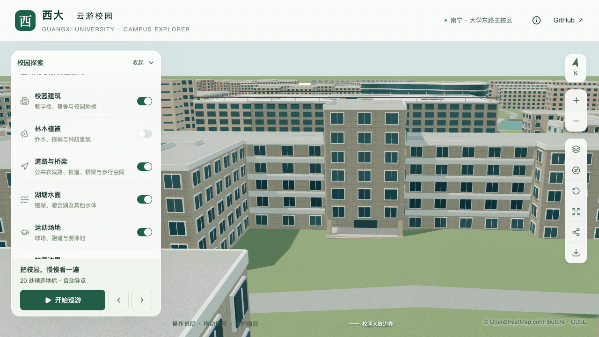

# 动物学院中央八列窗格校准

本批继续校准 `relation/11564704` 的南侧中央立面：将三列通用小窗改为八列有资料依据的窗格，并增加贯通的浅色竖向分隔。五层侧翼、七层核心、内退入口和两段外廊保持原有校准结果；整栋和门前场地仍未完成。

## 资料与采用范围

[校方英文学院介绍](https://www.gxu.edu.cn/en/info/1152/1716.htm)的具名近照可以辨认中央正面八列窗格及其间的贯通竖向分隔。[校方项目册](https://jjh.gxu.edu.cn/__local/A/1C/2D/C94DA67648AB9698A6BE04E1718_D3801DBD_2512297.pdf) PDF 第 40 页全楼照片支持这种排列延伸到高核心上部。两张照片的确切拍摄时间未知；未把网页中的办学统计年份当作拍摄日期。

原外环第 11 边与南侧凸部正面的对应沿用此前照片/地图联合定位。八列窗格采用资料计数，尺寸按现有 13.89 m 立面宽度和估算层高配置；原外环、内院及分段高度不变。来源文件哈希与排除项见[取证记录](model-checks/refinement/s3-glazing-evidence.json)。原照片只在本机参考目录中保存，未用作贴图。

## 生成规则

`facadeRules.windowGrid` 在一条完整外立面边上指定列数、起始楼层、边距、窗宽高比例、竖向分隔和窗内横向分格。解析器拒绝将同一列数重复应用到被体量切开的多个面，也拒绝与外廊、阳台、关闭窗户或通用窗距规则混用。

| 参数 | 本批采用值 | 依据 |
| --- | ---: | --- |
| 窗列 | 8 | 可见正面照片计数 |
| 起始楼层索引 | 1，即第二层 | 保留底层开放门廊 |
| 两端边距 | 0.22 m | 模型估算 |
| 窗宽 / 开间宽 | 0.78 | 照片约束估算 |
| 窗高 / 层高 | 0.55 | 照片约束估算 |
| 竖向分隔宽 / 深 | 0.18 / 0.28 m | 模型估算 |
| 近景窗内横向分格 | 4 行 | 照片约束的简化，不代表逐窗测绘 |

八列玻璃窗位、九道竖向分隔在基础和近景保留一致。竖向分隔从门廊板底以上开始，到既有主体屋顶高度结束。近景增加窗边框、中央竖窗梃和三道横窗梃；基础版省略这些小构件。窗框单边 0.06 m、细窗梃宽 0.045 m 也属于表现参数。

构件由 `blender/facade_windows.py` 生成，并接入普通建筑共享形体与立面模块。未采用新的逐楼材质，继续使用现有玻璃和浅色构件材质；颜色、窗帘、反射、标牌文字和每层窗扇开合状态未作实景复原。

## 验证与对照

```sh
blender --background --python-exit-code 1 --python blender/validate_window_grid.py
```

专项检查针对实际源文件和解码后的两级 GLB：每级检查六层共 48 个玻璃窗位，九道竖向分隔各取三个高度，共 27 个采样；另检查 144 处横窗梃在源文件/近景存在，在基础版省略。源文件、基础及近景的容差为 0.011、0.05、0.02 m，用于模型与压缩误差，不表示现实测量精度。

旧模型在八列布局的第一个玻璃窗位明确失败。新模型的[专项几何](model-checks/refinement/s3-glazing-final-windows.json)、430 栋普通楼、原内退入口及两侧外廊回归检查通过。60 项数据测试和 54 项 Node 测试通过，Pages 生产包与 69 个资产清单一致。首屏模型为 5,896,440 bytes，增加 1,432 bytes，最大普通近景区块仍为 1,684,868 bytes。

| 修改前 | 修改后 |
| --- | --- |
|  |  |

上述镜头关闭植被以便检查立面。正常树木遮挡、夜景、图层和性能的完整结果见[本批汇总](model-checks/refinement/s3-glazing-summary.json)。

11 张固定、图层、夜景和手机尺寸画面已逐张核对，三次 LOD 往返通过，无浏览器错误；全部 3,050 株树的实际建筑表面碰撞检查通过。其他 522 个源对象、82 个基础节点和 67 个 GLB 文件保留，源树属性不变。类型检查和 Lint 也通过。

本轮精细档为 60/60/60 FPS，流畅档为 29/29/28 FPS，中位数 60/29；相对 S0，三角形增加约 0.98%/3.73%，Draw Calls 增加约 0.93%/5.22%。25 次进程采样未捕捉到高负载 Python/Blender，记录环境与原基线一致，当前版本同条件性能验收通过。该结论覆盖当前已检查的入口、两段外廊和中央窗格，不改写之前受干扰批次的历史报告，也不代表独占 CPU/GPU 或真机手机性能。

## 尚未完成

核心侧面、后翼高度和立面、其他入口、顶部小体量，以及门前硬质铺地和植被组织仍需核对。已有照片不够支持这些部分的完整定位；不能用中央正面校准代替整栋或 S3 完整场地样板完成。此前外廊批次的性能待补测记录保留历史含义，当前资产另行验收。
