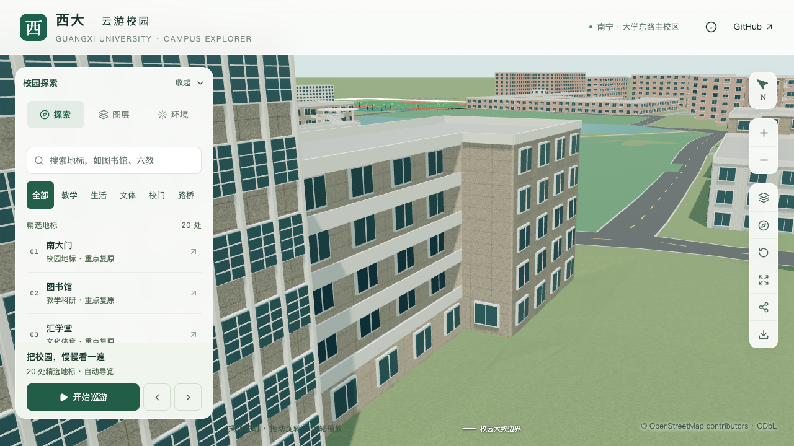

# 动物学院东端短侧墙校正

2026-09-30；对象 `relation/11564704`。后翼取证中找到一处可定位的正面侧墙修正：东端凸部朝前庭的短西侧墙上部为实墙，原模型却按默认规则生成了窗。现移除二至五层共四处窗，底层继续保留估算。后翼范围、层数、背立面仍未确认，本批不增加整栋完成计数。

## 来源和覆盖范围

[校保卫处消防演练报道](https://bwc.gxu.edu.cn/info/1012/9149.htm)发布于2025年11月27日10:21，正文记载活动于11月26日下午举行。原始页面在普通请求中返回访问限制，已通过浏览器直接读取正文并逐张核看四张原图；照片精确拍摄时间未知，不将活动日期当作照片元数据。

| 正文图片 | 内容 | 本批采用情况 |
| --- | --- | --- |
| 第1张 | 教室消防知识讲座 | 无外墙定位信息 |
| 第2张 | 楼梯内疏散 | 无后翼轮廓、楼层上限信息 |
| 第3张 | 具名南入口、玻璃核心、东侧外廊及端部 | 短西侧墙二至五层实墙；底层有人员和树木遮挡 |
| 第4张 | 前庭消防演练及东侧背景 | 不覆盖后翼与北立面 |

采用的[第三张原图](https://bwc.gxu.edu.cn/__local/9/79/77/81D257C0314518E1CA153AB42AD_A6C91413_ECCD7.png)为568×426像素，SHA-256为 `41d64a425dac9d6b6bfbca1c9f9127aec0bd7324e85cdc35c62a8baaf66c7894`。图片仅在本地辅助判读，不随仓库分发或用作纹理。

[学校英文学院介绍](https://www.gxu.edu.cn/en/info/1152/1716.htm)的5760×3840照片在右端亦可见该实墙，与新照片中的具名入口、开放外廊和端部凸出关系一致，提供第二视角。该照片拍摄日期未知，既有来源ID为 `gxuAnimalEnglishFacade`；本批新增 `gxuAnimalFireDrill2025`。两张照片支持墙面有无窗，不支持精确测量尺寸或推断内部用途。

同时定向查找后翼、背面及学院宣传片，未取得能定位北立面和后翼分界的新外景。学院简介中的用房总面积不能换算为后翼占地；“农林动教学科研实验中心”属于另一对象，不能套用到现有学院楼。已有农学院院庆片约255秒画面是南侧及屋顶视角，不再次记为新背面证据。本项取证有界结束，等待新定位资料。

## 采用参数

- 沿原外环 `polygon=0 / ring=0 / edge=8`，端点为 `(330.255985, -247.787188)` 与 `(329.363484, -243.367784)`，长度约4.51米。
- 使用既有 `skipWindowLevels: [1, 2, 3, 4]`；层索引从0起，对应二至五层。无需改动生成器或增加叠加墙面。
- 保持原侧翼16.5米、五层、轮廓和位置；这些尺寸仍是既有模型估算。底层遮挡处的窗继续估算，不能称为实景确认。
- 相邻第7边南向窗列、第9边外廊、中央玻璃、入口、屋顶、前庭及接地保持。

源文件沿用既有双面石材墙的绕序。新增检查曾按朝外法线断言失败；检查旧模型和导出材质后，确认这一墙面原本即朝内绕序且以双面材质显示。本批明确验证原绕序及双面材质均保留，不把有无窗修正写成法线修复。

## 验证与生产资产

[实际几何检查](model-checks/refinement/s3-animal-return-geometry.json)对源文件、基础和近景各取40个固定坐标点：上部32点命中实墙，底层8点仍命中玻璃。探针与层高固定，不从新规则反推预期；[旧资产反例](model-checks/refinement/s3-animal-return-before-geometry.json)在二层命中旧窗玻璃而失败。既有入口、开放外廊、中央窗网和屋顶检查全部通过。

[源文件保持性](model-checks/refinement/s3-animal-return-source-preservation.json)确认535个非树对象中仅动物学院变化，其余534个非树对象及3,062株树的网格、UV、材质和变换保持。土木平台、普通道路和地形因此沿用上批已验收资产，本批没有重建这些对象，也不声称重新执行了全部接地采样。

[资产检查](model-checks/refinement/s3-animal-return-assets.json)确认448栋中仅动物学院的规则和证据改变，所有轮廓保持；仅 `base.glb` 与 `chunk-p0-n1.glb` 改变，其他67个GLB及96个基础节点保持压缩几何。69个模型及公开数据与Pages目录一致。首屏5,996,992字节，减少32字节，预算余3,008字节；目标近景减少1,108字节，最大普通近景仍1,684,868字节。原Draco精度和预算没有调整。

289项Python、70项Node、类型检查、lint及Pages构建通过。派生楼栋、GeoJSON、来源表和校准表同步更新；基础场地重新派生后仅依赖指纹变化，实际几何记录保持。

[七张浏览器画面与记录](model-checks/refinement/s3-animal-return-context-browser.json)已逐张核看。近景前后镜头清晰显示四层窗的移除；手机使用基础模型也显示实墙和保留的底层窗；夜景未出现上部亮窗。较远南侧镜头只用于周边关系，不能证明后翼真实。浏览器无控制台或资源错误。系统未安装 `agent-browser` 命令，本批使用仓库已有Playwright检查，覆盖页面加载、图层控制、日夜、手机和实际模型显示。

[最终汇总](model-checks/refinement/s3-animal-return-summary.json)：精细三轮60/60/60 FPS，流畅30/30/30 FPS；相对同系统S0，三角形增加5.84%/13.97%，绘制调用增加3.29%/10.65%，均在原预算内。三次LOD往返无错误；26次CPU快照未发现计时窗口内超过2%阈值的Python/Blender进程，这不等于完全隔离的性能实验。

## 接续

土木学院实验大厅与“新结构大楼”仍为用户指定优先项；运输口、平台背立面、西门厅屋面、旧大厅现状以及九层平台与6–8层新建中心的名称边界见[接续清单](CIVIL_LABS_FOLLOWUP.md)。没有可定位新资料的项目继续待证，不互套名称或参数。

动物学院此次后翼检索已登记覆盖边界。下一独立工作包转入S3必需邻楼“环境学院／原环境楼”候选 `way/759170251` 的具名外观与7F/8F冲突核对。取得土木新定位资料或用户指认后优先恢复。仍为22个校准对象、1栋首轮通过、21个部分校准，S3六栋整栋完成数0；S0–S5完整目标不变。仅在 `dev` 开发、提交和推送。
