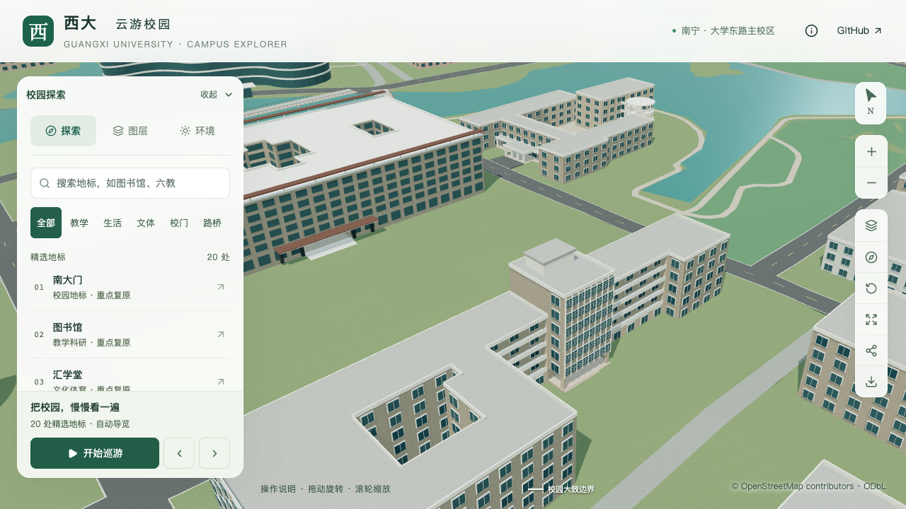

# 动物学院核心屋顶小体量

2026-09-30，接续南侧入口、外廊及八列窗格，将 `relation/11564704` 七层核心顶部原平屋面上的小体量补入正式模型。仍为同一栋建筑，不新增主体楼层或整栋验收计数。

## 依据与估算

[校方项目册](https://jjh.gxu.edu.cn/__local/A/1C/2D/C94DA67648AB9698A6BE04E1718_D3801DBD_2512297.pdf)第40页的具名全楼照片显示：七层玻璃核心上方存在较窄的浅色体量，灰色平顶向外挑出。[农学院院庆片](https://nxy.gxu.edu.cn/xyzc/a90znyqxcsp.htm)约255秒的背景航拍提供侧向观察；通过玻璃核心、两侧外廊及两院邻接关系交叉对应。影像拍摄日期未知，不能当作2026年现状认证。

| 参数 | 本次采用值 | 依据性质 |
| --- | --- | --- |
| 支撑 | 原 `entrance-core`，屋面23.1米 | 既有七层及3.3米估算层高 |
| 白色体量 | 宽8.4米、深5.5米、高2.6米 | 照片约束的形体估算 |
| 位置 | 沿原北侧第5边，向屋内退2米 | 位于高核心中部，精确退距待核实 |
| 灰色顶帽 | 四周外挑0.35米，厚0.55米 | 表达可见宽于下部的平顶，尺寸估算 |
| 顶部标高 | 相对本栋地面26.25米 | 不作为测量建筑高度 |

未推断其为水箱、电梯机房或新增完整楼层；小开口、侧后设备、真实材质和精确尺寸仍待补充。原参考照片保留在本机，不打包或用作纹理；路径与哈希见[依据记录](model-checks/refinement/s3-animal-rooftop-evidence.json)。

农学院西翼仍保持上一轮独立候选。主楼边角的初步投影试配未能同时吻合两端，不能据此采用8米退台分界，见[候选接续](AGRICULTURE_WEST_ROOF_PROPOSAL.md)。

## 实现与验证口径

`roofVolumes` 新增可选 `cap`，显式提供 `overhang` 与 `height`。下部与顶帽分开做三维重叠判断，顶帽外边仍须距支撑屋面外沿或内院至少0.5米；这防止只检查下部占地而让顶帽跨出屋面或撞到旁边较高体量。省略该配置时沿用原矩形体量生成方式。基础与近景共用构造，使用现有浅墙/灰屋面材质。

固定坐标专项覆盖顶帽九点顶面、四侧底面与外缘、白色下部四面、帽下支撑屋面、外侧留空及三个保留屋面点。源文件与实际解码基础/近景均检查位置和法线，旧资产必须不能通过新增屋顶顶面检查。一般楼栋验证继续检查被遮盖的支撑屋面，同时将顶帽计入附加体最高面；没有移除原屋面检查。

```sh
blender --background --python-exit-code 1 --python blender/validate_animal_rooftop.py -- --report-prefix=s3-animal-rooftop
blender --background --python-exit-code 1 --python blender/validate_animal_entry.py -- --report-prefix=s3-animal-rooftop-entry
blender --background --python-exit-code 1 --python blender/validate_facade_corridors.py -- --report-prefix=s3-animal-rooftop-corridor
blender --background --python-exit-code 1 --python blender/validate_grid_winding.py -- --report-prefix=s3-animal-rooftop-grid
```

独立屋顶验证器接受 `--check-root=<旧资产副本>`，期望坐标不随被检查资产变化。检查为有限网格取样，不代替实景测量、整个屋顶可通行性或整栋校准。

## 本批结果

[最终汇总](model-checks/refinement/s3-animal-rooftop-summary.json)通过本局部工作包。279项Python、66项Node、类型检查、lint与模型/Pages构建通过；源/基础/近景各30处屋顶检查、旧模型反例、原入口/外廊/窗格、430栋普通建筑及3,063株树回归通过。九张楼栋对照和六张固定回归图均已核看，三次LOD往返无浏览器错误。

只有本栋源对象、基础模型和本栋近景区块变化；其他533个非树对象、447栋记录、67个GLB及95个基础节点保持。69份模型与生产包一致，首屏5,830,644字节（增加244字节），最大普通近景1,684,868字节。

同条件精细档为60/60/60 FPS、流畅档30/30/30 FPS；相对原S0，三角形中位数增加6.33%/14.33%，绘制调用增加2.19%/10.65%，均在原预算内。27次CPU快照在活动计时窗口未记录到阈值以上的Python/Blender计算；10秒采样不等同于完全隔离，活动中的数值差异不用于声称普遍性能提升。



首轮因数据准备与构建重叠丢失12个树实例，被保持性检查拒绝；按串行准备、构建和验证重跑，初次日志留存，不将该构建用于最终验收。

核心侧后立面、后翼范围及层数、其他入口和前庭铺地继续核对。完整S2的20–30栋目标、S3六栋邻楼及后续景观/性能工作保持；提交与推送只在 `dev`。
