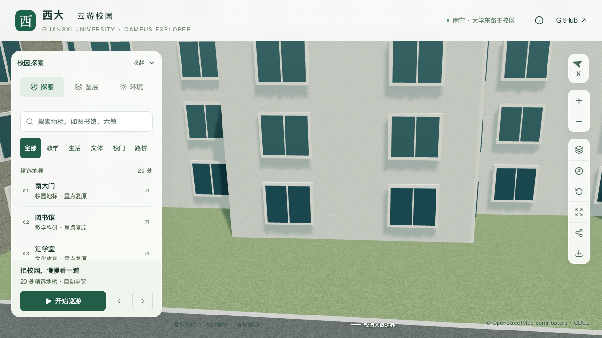
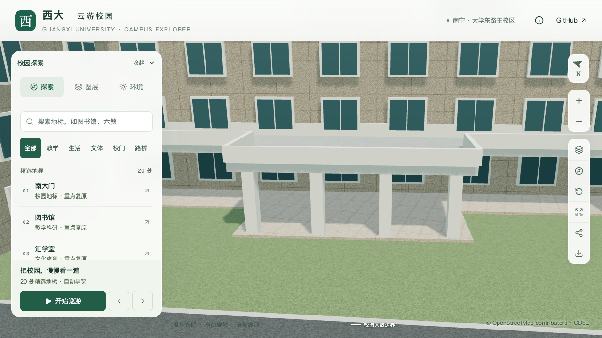
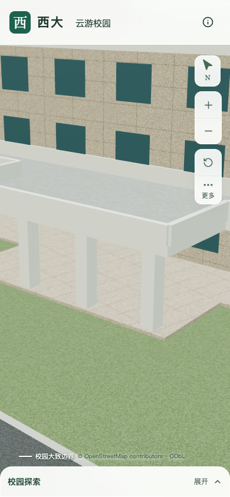

# 艺术学院楼体与西侧雨棚校准

> 后续进展：西主入口及雨棚前场接路已完成本批局部校准，见[西入口专项](ARTS_WEST_ENTRY.md)。下文保留此前楼体批次的参数和验收记录。

本批校准艺术学院三处已有 OSM 对象的体量：主楼采用三层主体，临湖附楼采用四层主体，西侧独立屋顶改为下部通透的支柱雨棚。原建筑轮廓、东侧庭院及全部3,063株树木保持。三个对象均为部分校准，其中一个是雨棚，不把它们计为三栋完成验收的建筑。

## 依据及冲突处理

采用[艺术学院 Environment](https://art.gxu.edu.cn/info/1338/4615.htm)前两张照片，网页标注2024-08-11，本轮于2026-09-16复核页面。照片拍摄日期未知，不代表2026年实景测绘。照片本地文件及哈希沿用[庭院取证记录](model-checks/refinement/s4-courtyard-evidence.json)，不随仓库分发。本批逐对象判读、原标签及前后参数见[取证与冲突记录](model-checks/refinement/s2-arts-evidence.json)。

第一张照片有“艺术学院”标识，可见三层正面窗列、两端翼楼和中央入口雨棚。主楼西侧映射的狭长屋顶及中央西凸轮廓与该雨棚组合匹配；这属于照片与地图的人工判读。原OSM主楼标记四层，本批保留原始标签，采用照片约束的三层主体估算。照片上方局部凸起不能直接解释成整栋第四层，具体范围仍待俯视资料核对。

第二张临湖照片可见底层及三层上部楼层，侧方有开放圆形楼梯，与 `way/759165562` 及相邻圆形轮廓的组合相符。因此将附楼原有五层用途默认值改为四层估算。该照片不能支持把圆形楼梯继续作为完整封闭房间，但其平台、梯段及柱位尚未完成定位，本批保留该对象并明确列为后续任务。

| 对象 | 修改前 | 本批表达 | 尚未确认 |
| --- | --- | --- | --- |
| 艺术学院 `way/759165563` | OSM四层，主体13.2米 | 三层主体，按3.3米层高估算9.9米 | 屋顶局部凸起、背立面、主入口准确锚点和尺寸 |
| 临湖附楼 `way/759165562` | 用途默认五层，主体16.5米 | 四层主体，估算13.2米 | 入口、实际外廊、窗墙分区及背部屋面 |
| 西侧雨棚 `way/880089961` | `building=roof` 被挤出为三层实心体，约9.9米 | 原轮廓内雨棚板面3.8米、板底3.35米，平台0.15米；沿用0.8米女儿墙，总高4.6米 | 精确标高、平台接道路、侧翼支撑和屋面收边 |

主楼及附楼的层数采用状态均为 `estimated`，没有把图像数层当作文献文字确认。所有层高及总高为估算。雨棚中央正面四柱与照片对应，窄侧翼两端支柱是简化估算；柱宽0.6米、深0.65米、位置和全部高程均未测量。配置保存在 `data/building-overrides.json`，按稳定ID及原轮廓摘要校验。

## 雨棚与入口规则

雨棚沿用已有 `parts.openBelow` 实现，基础和近景共用板面、底面、平台及支柱。下部没有填成实墙，也不生成悬空窗户。

解析器允许显式空入口列表的条件限定为：OSM `building=roof`，存在明确分段，且全部分段均含 `openBelow`。其他普通建筑仍须恰好一个主入口，空对象等非列表输入也会拒绝。雨棚自身不再生成假门；主楼入口属于另一稳定ID，当前仍是未校准的示意入口。本批没有把雨棚通透检查扩大为真实道路到主门的完整通行验收。

## 验证

- 121项数据测试通过，包括开放屋顶可省略门、封闭建筑不可省略门、取消支撑配置后不可省略门及错误输入类型拒绝。
- 430栋普通建筑的共享形体、保存源文件及基础/近景实际GLB检查通过。[全量形体](model-checks/refinement/s2-arts-all-geometry.json)。
- 三个对象的实际屋面高度、雨棚底面/平台及六条通行射线在源文件、基础GLB和对应两块近景GLB通过。[专项几何](model-checks/refinement/s2-arts-geometry.json)。源文件容差6毫米包含公开高程四舍五入到厘米产生的最多5毫米误差；基础/近景容差50/20毫米沿用既有Draco量化检查标准。
- 旧资产在主楼屋面高度检查中失败：原屋面约15.917米，目标约12.620米，均为模型世界坐标。[旧模型反例](model-checks/refinement/s2-arts-before-model-geometry.json)。更早一次检查在构建尚未写回高程时退出，不计作模型反例。
- 529个旧非树木对象中仅本批三处变化，其余526个对象的几何、UV、材质、变换保持；所有3,063株源树实例属性保持。[源文件比较](model-checks/refinement/s2-arts-source-preservation.json)。全部树对源/解码模型建筑网格的检查也通过。[树木检查](model-checks/refinement/s2-arts-trees-geometry.json)。
- 仅 `base.glb`、`chunk-p0-n1.glb`、`chunk-p1-n1.glb` 变化，其余66个GLB保持；基础模型87个无关节点保持。首屏5,020,364 bytes，比上一批减少792 bytes；最大普通近景区块1,684,868 bytes。69个模型和公共数据与Pages生产包一致。[资产检查](model-checks/refinement/s2-arts-assets.json)。
- 道路增量维护在成套资产隔离副本通过；89个基础节点及其他68个GLB保持，16个优先树位仍存在，增量后的三处实际形体专项通过。[增量资产](model-checks/refinement/s2-arts-incremental-assets.json) · [增量几何](model-checks/refinement/s2-arts-incremental-geometry.json)。正式源文件未被副本覆盖。
- 上一批庭院铺面、树池孔洞及庭院树实例专项通过。[庭院回归](model-checks/refinement/s2-arts-courtyard-geometry.json)。

七张最终选用画面已逐张审阅：桌面前后、关闭植被、夜景及收起面板后的手机斜向近景。手机画面可见近侧支柱和雨棚下部，未涵盖完整楼体。初始西侧宽镜头被邻楼遮挡；缩小共享镜头的半幅参数后取得无遮挡桌面近景。展开面板的手机画面同样被邻楼挡住，保留为未通过画面，并使用单独补拍替代；没有隐藏邻楼来通过验收。[逐图审阅](model-checks/refinement/s2-arts-visual-review.json) · [桌面与初次手机记录](model-checks/refinement/s2-arts-close-context-browser.json) · [手机补拍](model-checks/refinement/s2-arts-mobile-context-browser.json)。

| 原雨棚投影被挤出为三层实心体 | 校准为下部通透雨棚 |
| --- | --- |
|  |  |

固定图书馆活动回归通过。首次比较发现旧S0记录为Darwin 25.5.0、当前为27.0.0，因此本轮另在当前系统重放S0；最终两版均为Apple M5、Darwin 27.0.0、Chromium 148.0.7778.96、1280×720、DPR 1，使用同一检查脚本，各档三次至少30秒，双方各三次LOD往返无错误。

| 三次结果或中位指标 | 本轮重放S0 | 当前版本 | 变化 |
| --- | ---: | ---: | ---: |
| 精细档FPS | 60 / 60 / 60 | 60 / 60 / 60 | 0% |
| 流畅档FPS | 30 / 30 / 30 | 28 / 27 / 28 | −6.67% |
| 精细档三角形 | 4,019,920 | 4,143,209 | +3.07% |
| 流畅档三角形 | 1,051,945 | 1,119,649 | +6.44% |
| 精细档绘制调用 | 547 | 552 | +0.91% |
| 流畅档绘制调用 | 263 | 290 | +10.27% |

帧率下降不超过10%、三角形及绘制调用增幅不超过15%的门槛通过。两版各24次负载快照未记录Python/Blender计算，但保留WindowServer、Codex、代理及短时Git/Chrome活动；代理瞬时峰值为57.9%/49.0%，不能称作空闲或独占设备测试。按常规桌面条件接受，不推断相同热状态、电源模式、全校各机位或手机真机性能。见[本批汇总及文件指纹](model-checks/refinement/s2-arts-summary.json)、[当前活动记录](model-checks/refinement/s2-arts-performance-browser.json)、[当前负载](model-checks/refinement/s2-arts-performance-performance-context.json)、[新S0记录](model-checks/refinement/s2-arts-s0-current-os-browser.json)和[新S0负载](model-checks/refinement/s2-arts-s0-current-os-performance-context.json)。

## 剩余工作

本批新增三条部分对象记录，累计15条；其中雨棚与主楼属于同一建筑空间，不能按条数替代20–30栋整栋校准目标。新增整栋验收数为零。下一步优先定位主楼西入口、雨棚平台与道路的连续关系，并将临湖圆形楼梯拆解为有依据的平台和梯段；其余主要立面、屋顶小体量和材质随后核对。

全计划的20–30栋完整普通建筑、图书馆六栋必需邻楼及完整场地样板、S4湖边组织和其余S5范围保持。
