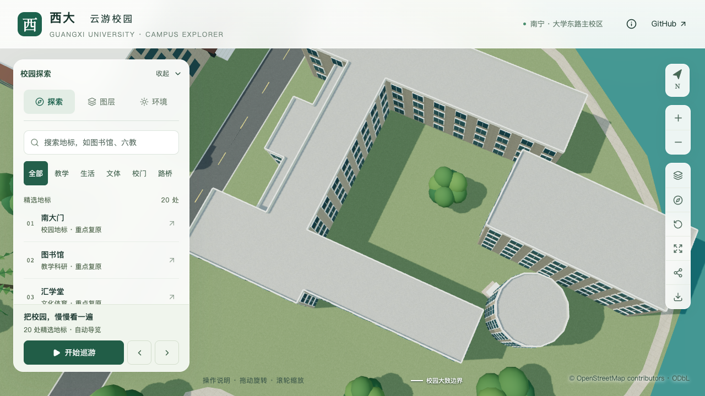
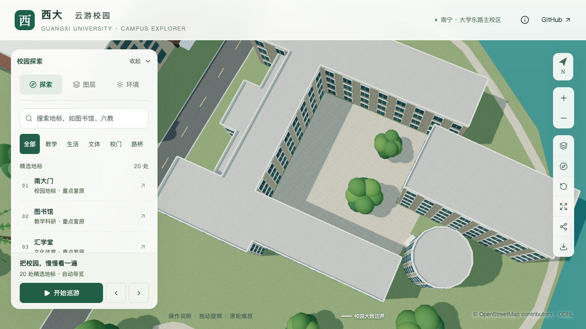
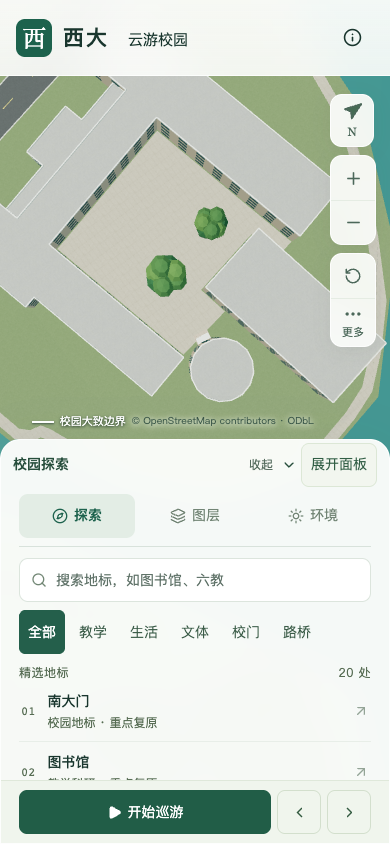

# 艺术学院东侧庭院试点

本批把原来的草地散点树改为有资料依据的硬质活动庭院：铺地约 **985.53 平方米**，保留两个树池，树木集中在东侧，西侧留出约 **242 平方米**活动空间。树位、树高、树池和范围补全均为估算；本批不计入普通建筑整栋校准数量。

## 资料与定位

- [后勤基建处2024年5月工作简报](https://ghjjc.gxu.edu.cn/info/1011/3224.htm)，发布于2024-07-04。“冲洗艺术学院内庭地面污渍”照片可见硬质方格铺面、中央活动涂装、周边大小树木。
- [艺术学院三月三中庭活动](https://art.gxu.edu.cn/info/1158/4545.htm)，发布于2024-04-20，活动日期2024-04-09。两张合影中的大树、后方独立楼体和右侧圆形外楼梯与前述照片互相补充。
- [学院 Environment](https://art.gxu.edu.cn/info/1338/4615.htm)，发布于2024-08-11。用于院楼身份和临湖环境核对；该相册包含多处教学演出空间，不能把所有图片视为同一栋楼。

照片中的独立楼体及圆形楼梯组合，与主楼 `way/759165563` 东侧的 `way/759165562`、`way/880089960` 对应。这是照片与地图组合的人工判读，不是测绘机位。院落范围以主楼既有第2、3、4、1顶点限定，扣除相邻建筑并退让0.2米；不使用整个凸包差集，避免误铺西侧凹口或覆盖东侧邻楼。

2023年春季第六周简报中的门前清洗图没有显示这个内庭；2024年同页排污管道图片显示屋面，也未用于庭院定位。2016年临湖照片不支持当前逐株树位。原图仅在本地参考，仓库保留链接、判读及文件哈希，不复制校方照片或将其制作成纹理。详见[取证记录](model-checks/refinement/s4-courtyard-evidence.json)。

## 参数和实现

| 项目 | 本批采用值 | 依据边界 |
| --- | --- | --- |
| 局部坐标 | 原点为主楼顶点3，X沿3→4 | 来自原始轮廓，保留摘要检查 |
| 两株树局部位置 | `(21,10)`、`(21,24)` 米 | 照片关系约束估算，并非逐株测量 |
| 树高和模板 | 11/9米，既有阔叶模板0 | 大小关系示意，不复原精确树种和冠形 |
| 树池半径 | 1.5/1.2米 | 简化圆形孔洞，底面沿用原地形材质 |
| 开放活动区 | 局部X=3–14、Y=5–27米 | 11×22米估算范围，对全部最终候选检查树冠 |
| 铺地高程 | 原地形实际三角面上方0.06米 | 显示偏移，不是现实台阶或测绘标高 |

配置位于 `data/site-overrides.json` 的 `arts-east-courtyard`。`scripts/courtyard_data.py` 解析原始锚点、邻楼摘要、铺面与树池孔洞，接入既有场地准备链；`blender/courtyard.py` 将铺面按原地形三角面裁分，外缘和树池内缘封入地面。**没有改变原地形、楼栋或原始建筑轮廓。** 铺地归属道路图层，常驻基础模型。

庭院规则仅替换其有界范围内的背景树，随后仍执行最终地面占地、保留区、树冠和实际建筑网格检查。最终删除原中心一株示意树，增加两株庭院树，其他 **3,061 株**位置、高程、模板、缩放和朝向保持；全校共 **3,063 株**。

手机检查发现原流畅档按实例顺序截取树木，追加在末尾的两株庭院树均被隐藏。新增清单字段 `treePriorityPositions`，只包含经过最终筛选仍存在的庭院/行道树；客户端在原有模板和450米区块内先排列这些树，再保留原有背景顺序。流畅档仍按原55%规则设置数量，没有提高预算：庭院所在组162株中显示90株，行道树所在组104株中显示58株，16株有依据的布局均保留。旧清单没有该字段时保持原行为。流畅档这两个区块的背景显示成员可能因优先排序而变化，实际树位和全量精细档实例不变。

## 检查结果

- 119项完整Python数据测试通过；随后新增的优先树位筛选测试单独通过，共120项。56项前端测试、类型检查、lint和最终Pages构建通过。
- 旧模型在“缺少庭院铺地”检查中失败。首次检查脚本采用BVH默认四边形剖分，产生约2.7毫米的取样差异；改为与导出一致的实际 `loop_triangles` 后，源文件967个铺面样点的偏移为59.95–60.06毫米。此修复未修改模型。
- 实际基础GLB相同967个样点的偏移为54.78–64.12毫米；另检查883个非铺面样点和10个树池内部点，未发现越界铺面或封闭树池。[最终铺面检查](model-checks/refinement/s4-courtyard-triangulated-geometry.json)。
- 全部3,063株树与保存源文件、基础/近景实际解码建筑网格的检查通过。[树木检查](model-checks/refinement/s4-courtyard-trees-geometry.json)。后续优先排序只改清单元数据和客户端顺序，源、模型条目及树数据保持，见[承接证明](model-checks/refinement/s4-courtyard-priority-preservation.json)。
- 528个原有非树木源对象的几何、UV、材质及变换全部保持，只新增庭院对象。88个原有基础节点压缩几何和其他68个GLB保持；没有把非确定性重建的时光之门变化带入本批。[源对象比较](model-checks/refinement/s4-courtyard-source-preservation.json) · [资源检查](model-checks/refinement/s4-courtyard-assets.json)。
- 道路增量更新在成套资产隔离副本通过；89个基础节点与其他68个GLB保持，增量后的实际源文件/GLB铺面及树池检查通过。[增量资源](model-checks/refinement/s4-courtyard-incremental-assets.json) · [增量几何](model-checks/refinement/s4-courtyard-incremental-final-geometry.json)。正式资产未被副本覆盖。

首屏模型 **5,021,156 bytes**，净增加 **8,436 bytes**，距600万字节上限仍有978,844 bytes；最大普通近景区块1,684,868 bytes。69个模型及公共数据与最终生产包一致。

七张近距离前后、关闭植被、夜景和手机尺寸画面完成审阅；最后的390×844流畅档画面可见两株庭院树，关闭植被时可见两个树池孔洞。五张最终截图与先前逐张审阅的图片字节一致，另两张重新查看。[画面审阅](model-checks/refinement/s4-courtyard-visual-review.json) · [最终浏览器状态](model-checks/refinement/s4-courtyard-final-context-browser.json)。静态截图中的瞬时FPS不用于活动性能验收。

固定图书馆活动回归通过：精细档60/60/60 FPS，流畅档27/28/30 FPS，相对当日S0重放基线的中位帧率变化为0%/−6.67%；三角形增加3.21%/6.60%，绘制调用增加2.79%/7.43%，均在计划门槛内。三次LOD往返无错误。24次负载快照未记录到外部Python/Blender计算，按常规桌面条件接受；本批复用当日S0记录，没有再次重放S0，也不声称独占机器或相同热状态。见[本批汇总与指纹](model-checks/refinement/s4-courtyard-summary.json)、[活动记录](model-checks/refinement/s4-courtyard-performance-browser.json)和[负载记录](model-checks/refinement/s4-courtyard-performance-performance-context.json)。这只覆盖固定图书馆活动镜头，不代表手机真机或全校所有机位性能。

## 前后画面

| 原有草地散点树 | 硬质铺面、活动留白及成组树木 |
| --- | --- |
|  |  |

## 后续范围

主楼层数、入口、屋顶及相邻圆形外楼梯仍沿用既有模型，本批没有将其宣称为实景校准。完整门槛/校道连接、庭院测绘标高、真实树池边框、活动涂装和标识尚未完成。新找到的学院正面与临湖照片为下一步楼体分段和开放楼梯校准提供了入口，仍须逐栋对应。

本批推进S4庭院组织及其流畅档可见性，不代表S4全部完成。全计划保持20–30栋普通建筑、图书馆六栋必需邻楼和完整场地样板、代表性湖边组织及其余S5细化范围；普通楼栋仍为12条部分记录，新增整栋验收数为零。
