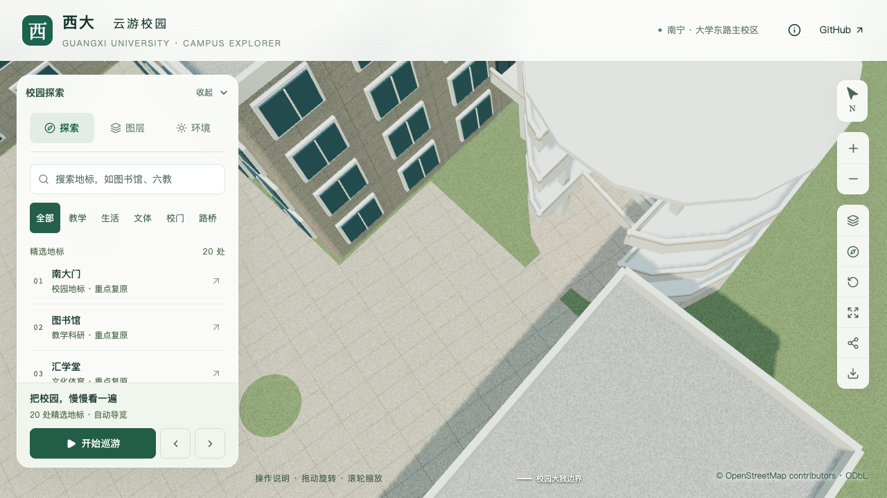

# 艺术学院庭院至外楼梯底层接面

2026-09-16，将庭院 `arts-east-courtyard` 东缘与圆形外楼梯 `way/880089960` 的底层平台接上。原模型最短平面间隙为 **0.7245米**，本批增加宽 **2.4米**、面积约 **2.03平方米**的短铺面。完整庭院仍保留两个树池和西侧活动留白。本批属于S4局部通行关系修正，不增加整栋建筑验收数。

## 依据与范围

沿用[庭院取证](ARTS_COURTYARD.md)中的[2024年中庭活动照片](https://art.gxu.edu.cn/info/1158/4545.htm)和[后勤清洗照片](https://ghjjc.gxu.edu.cn/info/1011/3224.htm)。活动照片能对应独立附楼、圆形外楼梯及其相邻硬质庭院，但人群遮挡底层接缝；清洗图支持庭院硬铺地性质。**具体连接宽度、边界和标高过渡均为模型估算**，不能据此宣称实测坡度、无障碍通道或已完成通往校园道路的路径。

当前有效地表数据中，最近道路面距原庭院约15.32米。本次只闭合庭院与已有楼梯底层之间的短间隙，外部校道连接仍待可定位资料。原照片保留在本机参考目录，仓库不分发原图；来源、判读和哈希见[本批证据](model-checks/refinement/s4-courtyard-connection-evidence.json)。

## 实现

`data/site-overrides.json` 的庭院配置新增可选 `stairConnection`：目标建筑、原轮廓摘要、宽度和证据说明。数据准备从庭院最近直边向实际楼梯底层轮廓求交，要求全宽相接、间隙在0.1–3米内，拒绝穿过映射建筑；最终占地进入水体/运动场冲突检查和植被排除。旧庭院配置不带此字段时仍按原方式生成。

`blender/courtyard.py` 保持原铺地、树池及地形不变，将接面单独存入庭院源对象的 `03_庭院与楼梯接面` 组。庭院侧按实际地形三角面边界拆点，楼梯侧使用与楼梯一致的附楼地形基准加0.15米平台偏移；两侧封口延伸进原地面。目标楼梯几何摘要、原轮廓、附楼基准或平台偏移失效时，构建拒绝使用旧派生结果。

| 参数 | 当前模型结果 |
| --- | --- |
| 原间隙最短距离 | 0.7245米 |
| 新增面积、宽度 | 2.0299平方米、2.4米 |
| 楼梯平台顶 | 模型高程3.77656米 |
| 接面最大纵向坡度 | 约7.03%，由模型两端高程产生 |
| 构建时最小地形净距 | 约0.060米，延续原庭院的显示抬升 |
| 新增面数 | 28个源面，使用既有铺地材质 |

## 验证

168项Python数据测试、56项Node测试、类型检查、lint、完整模型和Pages构建通过。旧模型作为反例在“缺少实际间隙铺面”处失败；没有将旧资产反例记为正式模型失败。

[实际几何检查](model-checks/refinement/s4-courtyard-connection-geometry.json)分别读取保存的源文件、解码后的基础GLB，以及基础场地与近景楼梯组合：

- 每种表示检查437个接面点、46组两端接缝点，未发现缺面或穿地；跨接缝前后各3.5厘米样点的最大高度差为源文件2.81毫米、实际GLB3.10毫米。这包含正常坡度变化，并非测绘精度或严格的零距离接缝误差。
- 每种表示沿0.6米宽取样路径检查231点，从西侧底层入口绕过支柱，经过北侧底层平台，止于第一段上行梯之前；最小实际取样净高约3.12米。该路径检查只证明有限模型样点可通行，不替代完整人体碰撞或现实通行认证。
- [原庭院回归](model-checks/refinement/s4-courtyard-connection-court-geometry.json)继续检查967个铺面点、880个非铺面点及10个树池内部点。新增接面交给专项检查，未套用原庭院统一6厘米偏移规则。
- [楼梯回归](model-checks/refinement/s4-courtyard-connection-stair-geometry.json)保留60个踏面/净空、12个平台与连桥点、三个附楼门口及顶棚检查；[3,063株树检查](model-checks/refinement/s4-courtyard-connection-trees-geometry.json)通过。

[源对象比对](model-checks/refinement/s4-courtyard-connection-source-preservation.json)确认仅庭院对象改变；其他530个非树木对象的几何、UV、材质、变换以及全部3,063株树实例保持。[资源比对](model-checks/refinement/s4-courtyard-connection-assets.json)确认448条建筑数据语义不变，90个其他基础节点和另外68个GLB保持，69个模型与生产包配套。原地形未修改。

首屏模型为 **5,153,816字节**，比前一批增加 **468字节**；最大普通近景区块仍为1,684,868字节，分别低于600万/200万字节门槛。

## 前后画面

| 连接前 | 连接后 |
| --- | --- |
|  |  |

完整校道路径、庭院测绘标高、树池边框、涂装和标识继续待完成。S2的20–30栋整栋校准、S3六栋必需邻楼及完整样板、其余S4/S5目标保持。

道路增量更新已在隔离副本中从缺少接面的旧源文件和旧基础GLB启动，生成当前规则下的接面；[增量实际几何](model-checks/refinement/s4-courtyard-connection-incremental-geometry.json)通过。其91个基础节点的几何签名与正式完整构建一致，其他68个GLB保持，见[增量资源比对](model-checks/refinement/s4-courtyard-connection-incremental-assets.json)。正式资产未被副本覆盖；增量文件的容器元数据和字节数允许与完整构建不同。

## 活动性能与画面结论

八张正式庭院画面均逐张查看：俯视日景、夜景及补拍的手机俯视能看清短接面；前景屋顶遮挡的斜视只用于环境/植被回归，没有作为接缝外观通过的依据。首组坐标方向错误和过宽探索镜头留在本机忽略目录，未纳入正式验收。[画面审阅](model-checks/refinement/s4-courtyard-connection-visual-review.json)。

当前完整资产在固定图书馆活动镜头中完成六次30秒测量：精细60/60/60 FPS、流畅29/29/29 FPS。相对同系统S0，帧率中位数变化为0%/−3.33%，三角形增加3.50%/7.98%，绘制调用增加2.38%/11.03%，均满足原计划门槛。三次LOD往返无错误，图书馆手机尺寸入口回归已核看；24次CPU快照在计时窗口未记录到超过2%阈值的Python/Blender计算。这是固定全局镜头与模拟手机尺寸的回归，不是庭院全视角或手机真机的帧率承诺。[本批汇总与资产指纹](model-checks/refinement/s4-courtyard-connection-summary.json) · [活动测量](model-checks/refinement/s4-courtyard-connection-performance-browser.json)。
