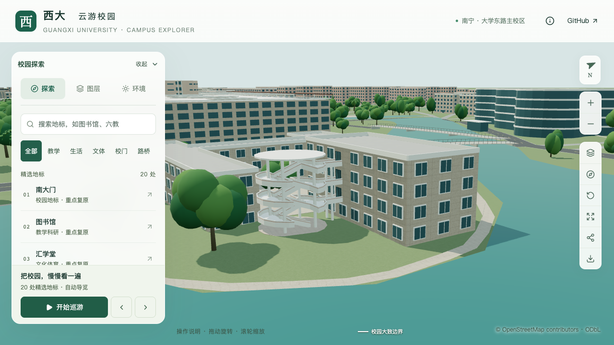
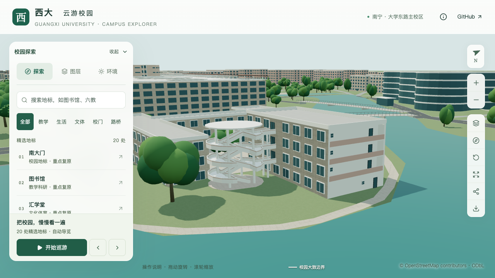
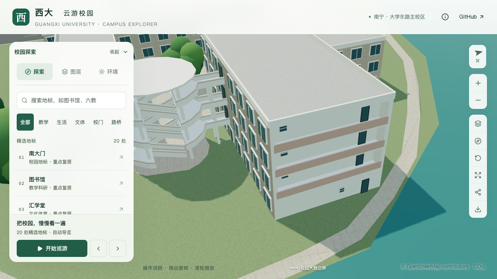

# 艺术学院临湖附楼东端面

2026-09-16，接续[开放外楼梯](ARTS_LAKESIDE_STAIR.md)，校准附楼 `way/759165562` 朝湖的东端面。原来四层均为默认窗墙，现采用三层开放外廊、实体栏板、两端支承，以及照片约束的后墙门窗。原建筑轮廓、四层高度和外楼梯连接保持；累计仍为16条部分对象记录，不增加整栋验收数量。

## 资料与采用范围

[校档案馆“碧云湖全景”](https://dag.gxu.edu.cn/ztlstp/xyxm/xyxm-0001.jpg)可同时辨识南侧长立面、外楼梯及东端面；[学院 Environment](https://art.gxu.edu.cn/info/1338/4615.htm)第二张湖景照片更接近东面正视角。两图都显示三个上层的连续开放空间、浅色后墙、暖色实体栏板，北端门口和南端小窗；底层以实墙、北端门及偏中的小窗简化表达。原图与哈希沿用[上一轮取证索引](model-checks/refinement/s2-arts-stair-evidence.json)，不随仓库分发。

地图外环第0边约14.98米长，法线朝东偏北约11度，与湖岸位置及外楼梯的南侧关系对应。仅校准这个短端面，南北长立面和西端仍待逐面核对。档案照片无可靠拍摄日期，Environment页面发布于2024-08-11，不等同于照片拍摄时间。

| 参数 | 采用值及依据边界 |
| --- | --- |
| 外廊楼层 | 零基第1、2、3层；底层保留实墙 |
| 凹入深度 | 1.8米估算，位于原轮廓内 |
| 两端退让 | 各0.35米估算 |
| 栏板 / 楼板 | 栏板高1米；楼板厚0.18米 |
| 两端支柱 | 宽0.35米、深0.45米估算，无中柱 |
| 北端门 | 边上比例0.17，宽1米、高2.15米，四层采用 |
| 南端上层窗 | 比例0.86，宽0.9米、高0.8米、窗台高1.35米 |
| 底层小窗 | 比例0.4，宽高各0.7米、窗台高1.3米 |

开口的数量和位置来自可见关系的人工简化，全部尺寸及门窗分格仍为估算。白色墙、暖色栏板使用既有共享材质；门窗深色部分采用共享玻璃与框架示意，不把照片中难辨的具体玻璃、门扇材料或色号列为确认。北侧主入口仍未定位，本批不以东侧次门取代主入口，也未凭空新增雨棚或接路。

## 实现与可复核规则

复用 `openCorridor` 内退外廊，补充可选的 `finish` 和 `openings`。`finish` 仅选择既有白色、暖色和石色材质；`openings` 明确门窗类型、墙边比例、宽高、窗台及使用层。准备阶段检查有限数值、楼层范围、开口重叠、端墙和楼板边界；门必须落到本层地板，显式开口必须关闭该立面的默认窗列。

门窗根据楼层自动位于底层原墙面或上层外廊后墙。主体、栏板、楼板、端柱及显式门窗在基础和近景中共用，防止近景加载时重新出现整面窗墙。其他外廊在未提供新字段时保留原规则。当前端面的材料调整只作用于该面及其内退构件，不扩散到尚未校准的其他墙面。

## 共用外廊面朝向修复

画面核查时，近正面外廊的深度对比偏弱。随后增加方向检查，发现生成器假定“沿墙、向内”坐标始终为右手系，而现有四个外廊面的地图边方向均相反，导致后墙朝内、楼板顶面朝下。只检查射线距离无法发现这个错误。

现根据局部坐标系的方向翻转面顶点顺序。24组检查覆盖四个外廊面、两种边方向及三个旋转角度；实际源文件、基础和近景中，艺术学院、数学研究中心及动物学院三栋建筑的后墙、地板和板底方向均通过。上一版数学研究中心源文件直接复现反向后墙，保留为反例。

数学研究中心1,306个面、动物学院120个面的方向得到修正，逐面验证其顶点位置、纹理坐标、材质和对象变换全部保持。该修复不改变两栋楼的外廊尺寸。导出使用双面材质，修复前后的画面差异很小，不能将原画面的深度对比偏弱完全归因于背面剔除，也不声称这一步改善了整体光照。

## 验证和前后画面

135项数据测试通过；端面专项在三个角度、两个细节级别通过。430栋普通建筑生成、源文件及两级实际GLB检查、3,063株树实际网格检查、既有外楼梯与动物学院外廊回归通过；数学研究中心镂空栏杆和门廊小样保持。完整模型与Pages构建通过。

端面专项检查九处后墙/栏板位置、18处地板/板底、12处端墙/端柱及八处门窗，并核对面方向。旧模型在第一处后墙采样即命中原外墙，未形成凹入。早期一次反例检查在准备流程尚未写回高程时运行，其“缺少高程”错误不作为模型证据；完整构建后重新验证了上述有效反例。

530个非树木对象中仅附楼和两栋外廊法线修复对象改变，其余527个对象几何、UV、材质及变换保持；全部3,063株树实例属性保持。69个模型与静态包一致，只有基础GLB与三个受影响区块改变，其余65个GLB、87个基础节点保持。首屏5,064,304 bytes，相对上一批增加3,520 bytes；最大普通近景区块1,684,868 bytes，均在预算内。

成套隔离副本的道路增量重建保持90个基础节点的压缩几何及其他68个GLB，端面和三栋外廊法线专项复查通过。增量文件重新封装少144 bytes，未改变节点几何。

| 原默认窗墙 | 当前端面与少量门窗 |
| --- | --- |
|  |  |

九张最终画面逐张核看。近正面和手机尺寸下，浅色后墙与地板的深度对比仍较弱；斜向图可辨薄板边缘及端墙，1.8米凹入由实际几何射线补充证明。早期探索截图保留并标为被最终版本替代，不把截图完成状态等同于视觉通过。

[端面实际几何](model-checks/refinement/s2-arts-corridor-geometry.json) · [全部外廊法线](model-checks/refinement/s2-arts-corridor-normals-geometry.json) · [既有模型反向反例](model-checks/refinement/s2-arts-corridor-previous-normals-geometry.json) · [两栋表面保持](model-checks/refinement/s2-arts-corridor-surface-preservation.json) · [源对象保持](model-checks/refinement/s2-arts-corridor-source-preservation.json) · [资源预算](model-checks/refinement/s2-arts-corridor-assets.json) · [视觉核查](model-checks/refinement/s2-arts-corridor-visual-review.json)

## 性能对照

复用同日当前系统重放的S0，双方为Apple M5、Darwin 27.0.0、Chromium 148.0.7778.96、1280×720、DPR 1，同一脚本各档三次至少30秒。三次LOD往返完成且无浏览器错误。

| 三次结果或中位指标 | S0 | 本批 | 变化 |
| --- | ---: | ---: | ---: |
| 精细FPS | 60 / 60 / 60 | 60 / 60 / 60 | 0% |
| 流畅FPS | 30 / 30 / 30 | 28 / 28 / 28 | -6.67% |
| 精细三角形 | 4,019,920 | 4,148,916 | +3.21% |
| 流畅三角形 | 1,051,945 | 1,126,196 | +7.06% |
| 精细绘制调用 | 547 | 556 | +1.65% |
| 流畅绘制调用 | 263 | 290 | +10.27% |

帧率下降不超过10%、三角形和绘制调用增长不超过15%的门槛通过。24次负载快照未见超过2%记录阈值的Python/Blender计算，保留常规桌面活动，不推断独占设备、相同热状态或手机真机表现。

[活动测量](model-checks/refinement/s2-arts-corridor-performance-browser.json) · [负载](model-checks/refinement/s2-arts-corridor-performance-performance-context.json) · [复用S0](model-checks/refinement/s2-arts-s0-current-os-browser.json) · [本批汇总与文件指纹](model-checks/refinement/s2-arts-corridor-summary.json)
