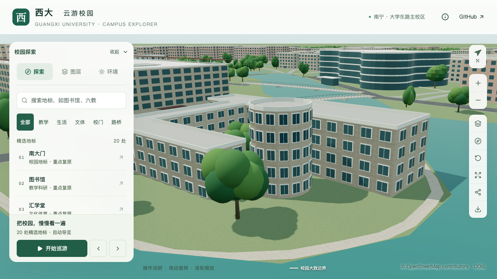
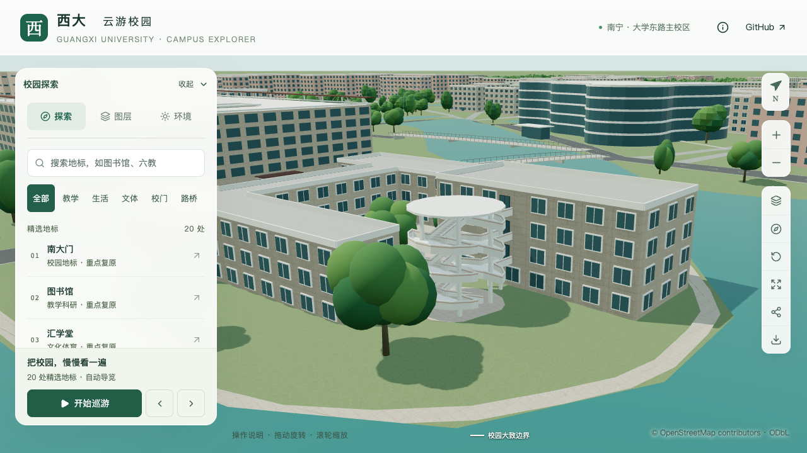
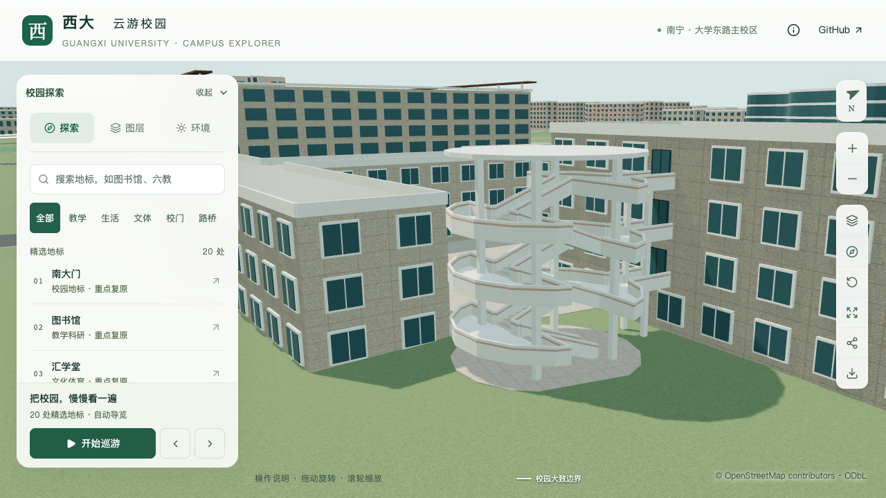

# 艺术学院临湖外楼梯

2026-09-16，在 `dev` 将圆形映射对象 `way/880089960` 从默认五层封闭楼体改为四层附楼的开放外楼梯。保留原地图轮廓，采用每层两跑折返梯、弧形平台、独立支柱和薄圆顶棚，三个上层平台连接临湖附楼 `way/759165562` 的新增门口。这是部分校准，累计16条部分对象记录，新增整栋验收数为零。

## 资料与估算边界

[校档案馆校园照片](https://dag.gxu.edu.cn/wszl1/ztlstp/xyxm.htm)中的[碧云湖全景](https://dag.gxu.edu.cn/ztlstp/xyxm/xyxm-0001.jpg)清楚显示四层临湖附楼、倾斜梯段、弧形平台、矩形支柱和低于附楼屋面的薄顶棚。结合[学院 Environment](https://art.gxu.edu.cn/info/1338/4615.htm)及[庭院活动照片](https://art.gxu.edu.cn/info/1158/4545.htm)交叉识别对象。按照片可见结构采用折返梯，不因地图轮廓为圆形便推定螺旋梯。

全景拍摄和发布日期未核实；另两页分别发布于2024-08-11和2024-04-20，不将页面日期作为拍摄日期。档案馆“东九教（室）”照片显示另一低层体量，无法可靠定位为本楼梯，因此未采用。参考原图与分析裁切仅留本地取证目录，不随仓库分发或用于贴图，详见[取证索引](model-checks/refinement/s2-arts-stair-evidence.json)。

以下都是照片约束下的建模估算，并非测绘或施工参数：

| 参数 | 采用值 |
| --- | --- |
| 原默认体量 → 当前顶高 | 五层16.5米 → 四个使用层、顶棚顶12.65米 |
| 附楼层间距 | 3.3米 |
| 底层平台及三个上层平台 | 相对统一基准0.15 / 3.45 / 6.75 / 10.05米 |
| 梯段 | 每层两跑，每跑10级；共60级 |
| 单级升高 / 踏面深度 | 0.165 / 0.44米 |
| 梯段毛宽 / 中央空隙 | 2.0 / 0.8米 |
| 平台板厚 / 顶棚厚 | 0.18 / 0.25米 |
| 实体栏板高 / 厚 | 0.9 / 0.16米 |
| 三层连接平台宽 | 2.4米 |
| 附楼门口宽 / 高 | 1.6 / 2.3米 |

照片支持开放体量和主要构件关系，隐藏梯段的准确方向、级数、结构尺寸、桥接细节和门窗分格仍属估算。底层圆平台外的步行接路、附楼主要立面和屋顶小体量留待后续核对，不将局部结果计为完整建筑验收。

## 数据与建模规则

新增 `external-stair` 类型和 `stairTower` 配置，显式引用附楼ID、轮廓摘要及墙边锚点。准备阶段生成局部坐标中的梯段、平台和连接区域，检查附楼层数、顶棚净空、支柱与梯段冲突、连接区域对其他建筑的侵占；派生上下文与几何摘要在构建前再次验证。主楼、楼梯原始OSM轮廓不改写，连接范围单独进入植被排除。

两者统一使用附楼中心地形高程，避免各自采样导致门口和平台相差约9厘米。三个上层门由楼梯关系生成在附楼墙面上，并排除重叠的默认窗；门槛保持小幅突出。基础与近景共用主体楼梯，不再套用默认窗列和普通楼体女儿墙。末层不再继续上行的位置封闭栏板，四根楼梯柱及两根连接柱避开梯段和门口中线。

## 验证与画面

131项数据测试通过；三个旋转角度的独立小样检查60级踏步、净空、中央留空及顶棚厚度。完整数据准备、模型和Pages静态包构建通过。430栋普通建筑生成、保存源文件及两级实际GLB检查通过；3,063株树实际网格冲突检查、西入口和庭院及原艺术学院体量回归通过。

楼梯专项在源文件、基础GLB和近景GLB中分别核验60个踏面与净空、六条侧向通透射线、薄顶棚上下表面、12处平台/连廊高度及三个附楼玻璃门口。另采样五处底层平台与地形间隙。平台末端射线避开突出的门槛，门口单独检查；未放宽原误差标准。旧模型在第一处踏面检查失败，作为有效反例保留。

530个非树木对象仅楼梯和附楼改变，其余528个对象几何、UV、材质和变换保持；全部3,063株树属性保持。69个GLB中仅基础文件与 `chunk-p1-n1.glb` 改变，89个其他基础节点保持；静态包与模型清单一致。首屏5,060,784 bytes，增加22,544 bytes；最大普通近景区块1,684,868 bytes，均在预算内。

道路增量重建在完整隔离副本通过，90个基础节点的压缩几何与其他68个GLB保持，增量后的楼梯专项再次通过。增量基础文件重新封装后减少144 bytes，不能将文件级差异称为几何变化。

| 原默认封闭圆筒 | 当前开放外楼梯 |
| --- | --- |
|  |  |

七张画面已逐张核看，包括前后固定镜头、关闭植被、夜景和收起面板后的手机尺寸画面。关闭植被用于观察被树遮挡的结构，正常状态的原树仍保留。旧模型近景顶部超出画面，完整高度比较采用上表全景。手机画面可辨识开放轮廓及连接关系，不据此推断真机性能。

[实际几何](model-checks/refinement/s2-arts-stair-geometry.json) · [旧模型反例](model-checks/refinement/s2-arts-stair-before-model-geometry.json) · [全量建筑](model-checks/refinement/s2-arts-stair-all-geometry.json) · [树木](model-checks/refinement/s2-arts-stair-trees-geometry.json) · [源对象保持](model-checks/refinement/s2-arts-stair-source-preservation.json) · [资产预算](model-checks/refinement/s2-arts-stair-assets.json) · [道路增量](model-checks/refinement/s2-arts-stair-incremental-assets.json) · [视觉核看](model-checks/refinement/s2-arts-stair-visual-review.json)

## 性能对照

复用同日当前系统重放的S0基线。双方为Apple M5、Darwin 27.0.0、Chromium 148.0.7778.96、1280×720、DPR 1，同一脚本各档三次至少30秒。三次LOD往返无错误。

| 三次结果或中位指标 | S0基线 | 本批 | 变化 |
| --- | ---: | ---: | ---: |
| 精细FPS | 60 / 60 / 60 | 60 / 60 / 60 | 0% |
| 流畅FPS | 30 / 30 / 30 | 29 / 29 / 29 | -3.33% |
| 精细三角形 | 4,019,920 | 4,145,324 | +3.12% |
| 流畅三角形 | 1,051,945 | 1,125,768 | +7.02% |
| 精细绘制调用 | 547 | 556 | +1.65% |
| 流畅绘制调用 | 263 | 290 | +10.27% |

中位帧率下降不超过10%、三角形和绘制调用增加不超过15%的门槛通过。24次CPU快照中，首个快照仅出现采样包装脚本启动（4.6%、累计CPU 0.06秒），后续未见超过2%记录阈值的Python/Blender计算。保留常规桌面活动，按常规桌面回归条件接受，不推断独占机器、相同热状态或全校每个视角性能。

[本批活动](model-checks/refinement/s2-arts-stair-performance-browser.json) · [负载记录](model-checks/refinement/s2-arts-stair-performance-performance-context.json) · [复用S0](model-checks/refinement/s2-arts-s0-current-os-browser.json) · [本批汇总及文件指纹](model-checks/refinement/s2-arts-stair-summary.json)
