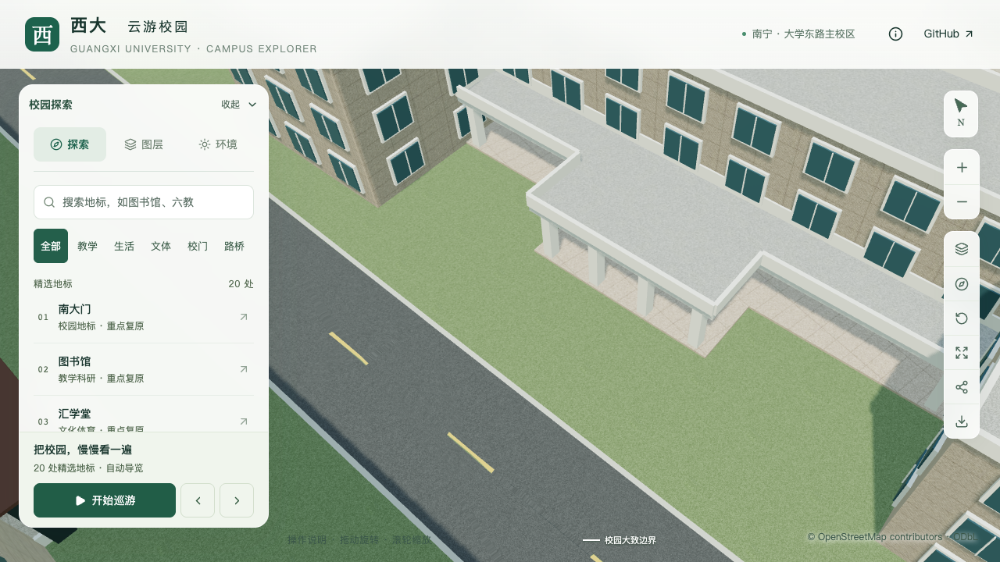
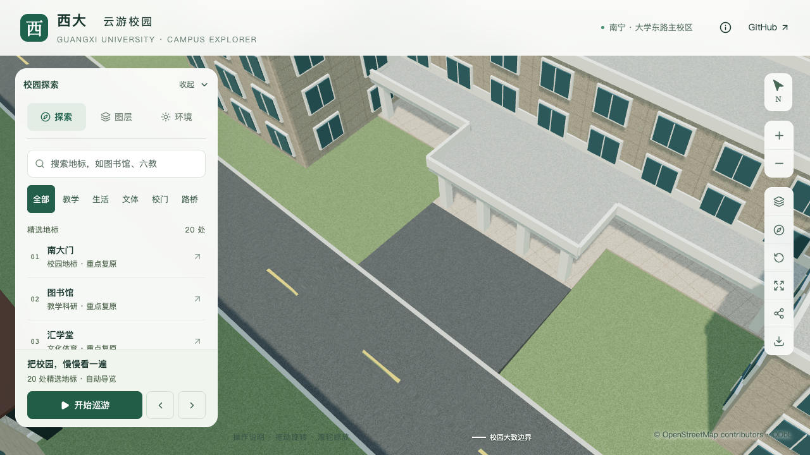
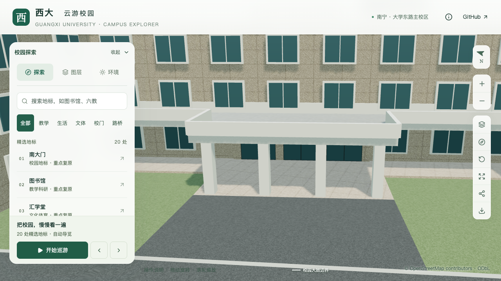

# 艺术学院西入口与雨棚前场连接

2026-09-16，在 `dev` 接续艺术学院楼体校准。主楼 `way/759165563` 的主入口从最长边默认位置改到西侧独立雨棚下，新增三组玻璃门、深色框架、上亮窗和石材边框。雨棚前缘通过约86.67平方米的有界沥青铺面接到鸪江路。主楼仍为部分校准，本批不增加整栋验收数量。

## 资料与估算范围

- [学院 Environment](https://art.gxu.edu.cn/info/1338/4615.htm)的具名正面照片，结合 OSM 西侧独立雨棚轮廓，支持入口朝向与三组开口的人工判读。
- [后勤基建处2024年4月工作简报](https://ghjjc.gxu.edu.cn/info/1011/3196.htm)，页面发布于2024-06-11。“更换艺术学院大门玻璃”前一张照片显示玻璃门、深色金属框、上亮窗与石材边框，未给出测量尺寸。
- [2025年寒假环卫绿化简报](https://ghjjc.gxu.edu.cn/info/1046/3490.htm)，页面发布于2025-02-28。艺术学院门口南面地砖修复前后照片显示灰色铺砖与沥青相接，仅支持局部材料关系。

门组宽9.9米、边框宽0.6米、门高2.55米和上亮窗高0.45米均为估算。入口锚点采用主楼外环第10边、比例0.5228731865，朝向约256.77°。三组门的通行中线避开既有雨棚柱。

连接宽约11.78米，起点来自雨棚原前缘，终点取已生成鸪江路路面边界。中央连接暂以沥青作有边界的示意延续；照片未覆盖整个中央前场，不能据此确认完整材料分带、砖缝、施工边界或实测高差。两侧草地和校道既有路缘保留，不宣称无障碍改造或现场完整复原。

## 模型与数据规则

`entrances.mappedCanopy` 引用另一稳定建筑ID的 `openBelow` 分段。准备数据时检查轮廓摘要、雨棚分段、门框是否位于雨棚后方、门楣是否低于板底，以及三条通行中线是否被支柱阻断。源文件构建再检查派生上下文摘要，避免门位改变后沿用旧雨棚参数。

主楼只生成门窗和边框；雨棚原对象继续拥有平台、顶板和支柱，不在主楼重复生成平台或雨棚。基础与近景共用门组主要几何，门组占据的底层区域不再叠加默认窗户。普通建筑全量检查以门楣检查替代本类型并不存在的独立入口平台检查；独立雨棚的实际平台、板底和通行射线仍由专项检查覆盖。

`canopy-connection` 场地类型从独立雨棚前缘接到准备后的校园道路。起点按前缘两个实际端点插值，保留其约2.6毫米的局部斜差；终点采样实际道路三角面，侧面封入地面。平台世界高程约2.8656米，路缘约3.1477–3.1553米，均为模型高程；铺面沿两者插值，不把DEM当成入口台阶测量。此次无需降低原地形，源地形几何、UV和变换均保持。

## 验证与前后画面

430栋普通建筑的生成、保存源文件及两级实际GLB检查通过，3,063株树对实际建筑网格检查与已有庭院铺面/树池检查通过。道路增量重建在成套隔离副本验证，90个基础节点和其他68个GLB保持，入口实际几何复核通过。

126项数据测试及转向连接、直向连接、微斜雨棚边缘和道路UV小样通过。完整模型及Pages静态包构建通过。门窗专项对三组门及上亮窗分别进行实际材质/位置射线检查，并检查九处铺面内部地形间隙、三处平台接缝和三处道路接缝。

源文件接缝两侧相距16厘米的采样高差最大约3.38毫米，基础GLB最大约7.90毫米，包含连续坡面本身的高差及压缩误差，不等同于裂缝宽度。源文件、基础GLB和近景GLB的门窗均通过。旧模型在第一个玻璃门检查处命中普通窗白框，形成有效反例。

源文件529个旧非树木对象仅主楼和局部道路网格变化，其余527个对象保持；新增一处场地对象，全部3,063株树实例属性保持。69个模型与Pages生产包一致，仅基础GLB和 `chunk-p0-n1.glb` 改变，其他67个GLB保持。首屏5,038,240 bytes，增加17,876 bytes；最大普通近景区块1,684,868 bytes，均在现有预算内。

| 原来雨棚前为连续草地 | 当前有界连接铺面 |
| --- | --- |
|  |  |

| 原来雨棚后仍为普通窗 | 当前三组落地玻璃门 |
| --- | --- |
|  |  |

七张前后、关闭植被、夜景及手机尺寸画面逐张核看。桌面正面能看到门组下部与平台连接；雨棚遮住上部门框和上亮窗，由专项几何补充验证。手机尺寸可见近侧支柱、平台和铺面侧面收口，完整三组门超出该镜头覆盖范围，不以手机截图证明整组门已可见。

[全量建筑](model-checks/refinement/s2-arts-entry-all-geometry.json) · [全部树木](model-checks/refinement/s2-arts-entry-trees-geometry.json) · [庭院回归](model-checks/refinement/s2-arts-entry-courtyard-geometry.json) · [道路增量](model-checks/refinement/s2-arts-entry-incremental-assets.json)

[实际入口与连接几何](model-checks/refinement/s2-arts-entry-geometry.json) · [旧模型反例](model-checks/refinement/s2-arts-entry-before-model-geometry.json) · [源对象比较](model-checks/refinement/s2-arts-entry-source-preservation.json) · [资产与预算](model-checks/refinement/s2-arts-entry-assets.json) · [画面记录](model-checks/refinement/s2-arts-entry-views-context-browser.json)

## 性能回归

首次活动测量的精细三次为60/60/45 FPS，第三次时段伴随外部Python持续计算，因此只保留原始记录，不接受为同条件通过依据。外部计算结束、再次检查未见该进程后进行补测；两次记录均未覆盖或删除。

补测复用同日当前系统重放的S0基线。双方为Apple M5、Darwin 27.0.0、Chromium 148.0.7778.96、1280×720、DPR 1，同一检查脚本，各档三次至少30秒。当前三次LOD往返通过，无浏览器错误。

| 三次结果或中位指标 | S0基线 | 本批补测 | 变化 |
| --- | ---: | ---: | ---: |
| 精细FPS | 60 / 60 / 60 | 60 / 60 / 60 | 0% |
| 流畅FPS | 30 / 30 / 30 | 30 / 30 / 30 | 0% |
| 精细三角形 | 4,019,920 | 4,138,464 | +2.95% |
| 流畅三角形 | 1,051,945 | 1,119,438 | +6.42% |
| 精细绘制调用 | 547 | 555 | +1.46% |
| 流畅绘制调用 | 263 | 285 | +8.37% |

24次负载快照未见Python或Blender计算，保留常规桌面活动，按常规桌面回归条件接受。中位帧率下降不超过10%、三角形与绘制调用增加不超过15%的门槛通过。此次未重新测量S0，不推断独占机器、相同热状态、全校每个机位或手机真机性能。

[补测活动](model-checks/refinement/s2-arts-entry-quiet-browser.json) · [补测负载](model-checks/refinement/s2-arts-entry-quiet-performance-context.json) · [受干扰的首次记录](model-checks/refinement/s2-arts-entry-performance-browser.json) · [首次负载](model-checks/refinement/s2-arts-entry-performance-performance-context.json) · [复用S0](model-checks/refinement/s2-arts-s0-current-os-browser.json) · [本批汇总与文件指纹](model-checks/refinement/s2-arts-entry-summary.json)

## 后续范围

当前仍为15条部分对象记录，其中主楼与雨棚属于同一建筑空间。后续继续核对临湖圆形外楼梯、主要立面、屋顶小体量及其他入口；20–30栋普通楼完整校准、图书馆六栋必需邻楼与完整场地、其余S4/S5任务继续保留。
