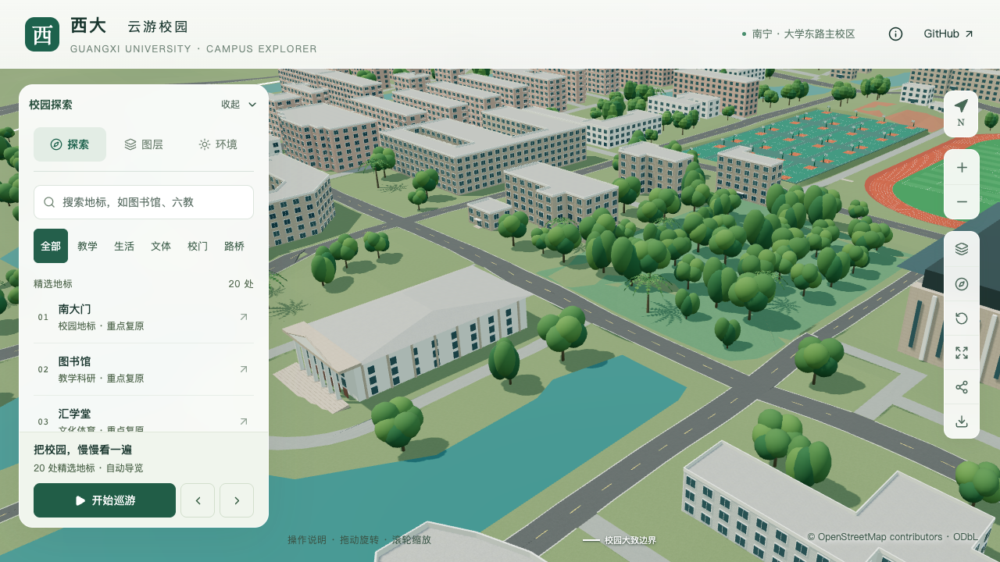
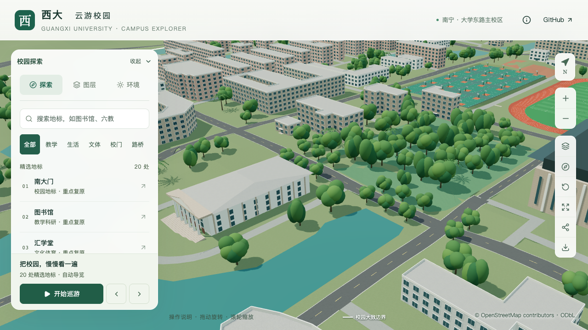

# 博萃路行道树试点

以OSM `way/699156911` 西端起230–350米的约120米直线路段为试点，按两侧行列组织14株阔叶树示意，替换该范围内3株背景散点树。其余3,047株背景树的位置、类型、高度、朝向及标高保留，总树数为3,061。

## 依据与不确定性

[校方项目册](https://jjh.gxu.edu.cn/__local/A/1C/2D/C94DA67648AB9698A6BE04E1718_D3801DBD_2512297.pdf)第33页、印刷第29页列有博萃路两旁玉兰树。[2024年暑假养护简报](https://ghjjc.gxu.edu.cn/info/1046/3305.htm)的具名照片显示沿道路排列的树干、树冠及相邻步行空间，支持道路树列的组织方式。该照片没有定位到本试点的精确路段；项目册同页配图也没有明确标注为博萃路，不用其构图反推本路树位。

[2024年秋季养护简报](https://ghjjc.gxu.edu.cn/info/1046/3406.htm)记载博萃路白玉兰养护及学生公寓5栋附近危树清除。本试点位于路线西侧，不覆盖地图上的西校园宿舍5栋附近；不据文字补回任何被移除树，也不声称掌握2026年完整树木清单。

道路名称与线位来自地图；具体里程区间、12米间距、距路中心6.2米的横向偏移、10米树高、7米路口退让及12米背景替换半宽均为模型估算。既有阔叶模板0表达树列关系，未制作玉兰专属叶形、花朵或调查树冠。公共来源目录增加两份养护记录，共70条；参考照片仅保存在工作资料中，不打包到网站或用于纹理。

## 生成规则

[人工参数](../data/vegetation-avenues.json)按稳定道路ID与坐标哈希绑定线位。[生成器](../scripts/vegetation_avenues.py)按固定里程站点计算道路切向与两侧偏移，输出前量化到0.1米。地图线位变化、失效来源、非法尺寸、叠加替换区或重合树位会报错。

所有映射道路交点及接近主轴的支路端点都形成退让范围，按主轴里程位置排除候选；树列不能因为位于道路侧面就绕过路口退让。本段20个原始双侧候选中，6个因路口开口被排除，14个继续参与最终筛选。

仅清理选定路段的背景替换带；范围外树不重排。重复运行保留已经存在的相同树位及其地面标高。后续最终占地、32个模型树冠保留范围和两处显式禁植区继续优先，模型构建时重新贴地并执行实际建筑三维净空检查。

## 当前验证

74项Python数据测试通过，包含4项新增行道树测试，覆盖局部替换、重复生成、路口开口、线位变更、来源和非法参数。首次集成时来源目录导出缺少原有 `version/sources` 包装，测试发现后已恢复，失败记录保留；该问题不属于原有生成器缺陷。

完整构建保留3,061株；523个非树木源对象的几何、UV、材质与变换保持，全部69个GLB逐字节保持。时光之门继续成套保留基线源对象和压缩模型，未解决全局构建字节确定性。首屏模型仍为5,897,824 bytes，最大普通近景区块1,684,868 bytes。

当前3,061株树重新通过[建筑检查](model-checks/refinement/s4-avenue-buildings-geometry.json)和[场地检查](model-checks/refinement/s4-avenue-sites-geometry.json)：源建筑452个网格、运行建筑95个网格；源场地64个网格、运行场地52个网格。场地分别检查7,523及15,284对候选，未发现表面相交或可识别闭合组件包含。开放网格不自动封口，不据此推定完整实心体或工程净空。

[贴地检查](model-checks/refinement/s4-avenue-tree-source.json)覆盖全部源树属性及地形采样。源锚点最大误差约0.00000051米，运行GLB地形最大偏差约6.53毫米；这些是模型表示误差，不是现场测量精度。

## 固定镜头对照

| 修改前 | 行道树试点 |
| --- | --- |
|  |  |

逐张检查两组桌面前后对照、关闭树木、夜景及手机尺寸，共7张原图。双侧树列及路口开口可见，树木关闭后原有道路、礼堂和水边场地保持完整；夜景位置一致。桌面左侧面板遮住部分远端画面，手机图为桌面浏览器视口模拟。静态截图上的调试帧率不作为活动性能结果。

[浏览器状态记录](model-checks/refinement/s4-avenue-views-context-browser.json)无页面、控制台和HTTP错误；[逐图检查记录](model-checks/refinement/s4-avenue-visual-review.json)保存原图哈希与判断边界。

## 性能与批次验收

采用S0同机、同浏览器、1280 × 720、DPR 1的图书馆活动镜头，每档三次30秒。博萃路静态镜头用于布局对照，活动性能仍用既定图书馆镜头保持基线可比。

| 三次结果的中位数 | S0 | 本批 | 变化 |
| --- | ---: | ---: | ---: |
| 精细FPS | 60 | 60 | 0% |
| 精细三角形 | 4,017,716 | 4,083,109 | +1.63% |
| 精细Draw Calls | 537 | 542 | +0.93% |
| 流畅FPS | 30 | 29 | −3.33% |
| 流畅三角形 | 1,052,490 | 1,096,223 | +4.16% |
| 流畅Draw Calls | 268 | 282 | +5.22% |

首次采样数值达标，但期间捕捉到一次高负载Python进程，故未作同条件通过结论；[首次汇总](model-checks/refinement/s4-avenue-initial-summary.json)保留。补测精细60/60/60 FPS、流畅28/29/29 FPS；25次CPU快照未捕捉到高负载Python或Blender，记录环境与S0一致，数值及环境门槛通过。进程抽样不证明CPU/GPU独占。两轮各完成三次近景往返，无浏览器错误。

[资产核验](model-checks/refinement/s4-avenue-assets.json)确认新增与移除树均位于替换带，范围外3,047株全部属性保持；仅树位、植被分区、来源目录和总览树数更新，全部69个GLB及生产包一致。完整结果见[本批汇总](model-checks/refinement/s4-avenue-summary.json)、[补测记录](model-checks/refinement/s4-avenue-recheck-browser.json)与[进程记录](model-checks/refinement/s4-avenue-recheck-performance-context.json)。

**博萃路约120米行道树试点验收通过。** 本试点是有依据的树列示意，仍不代表整条道路逐树复原；庭院、低矮景观、S2完整楼栋校准、S3邻楼及S5继续推进。
