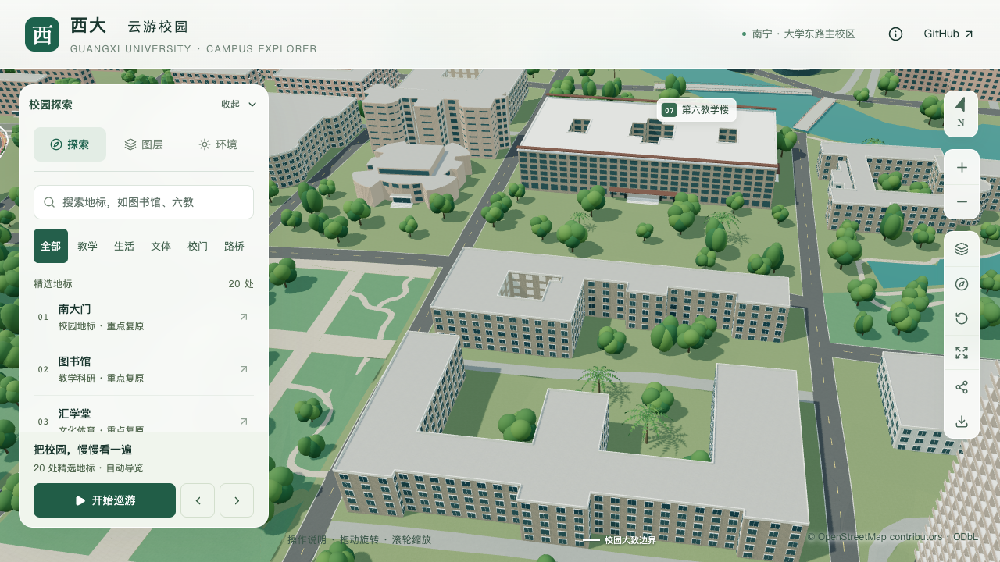
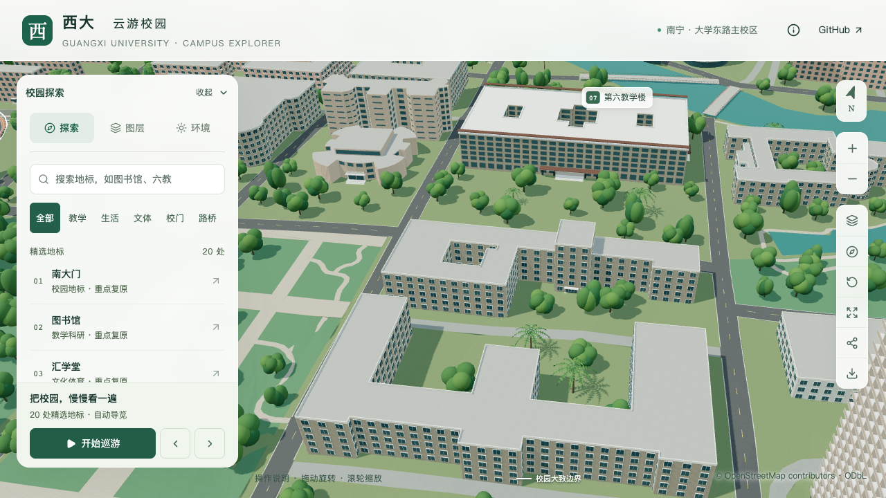
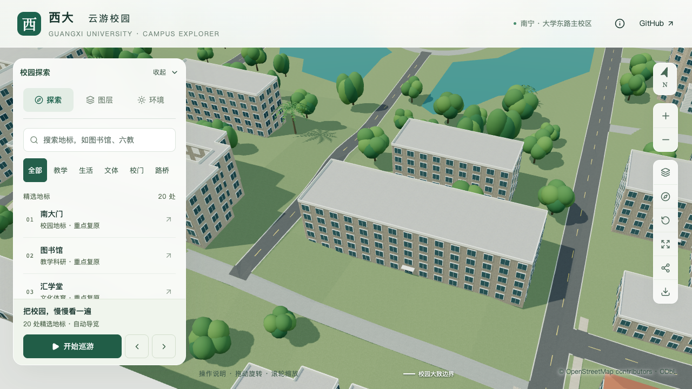
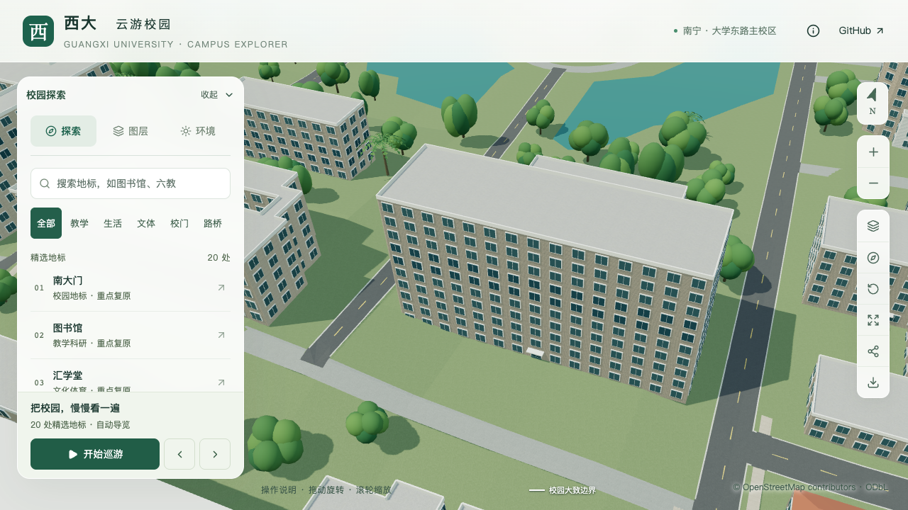
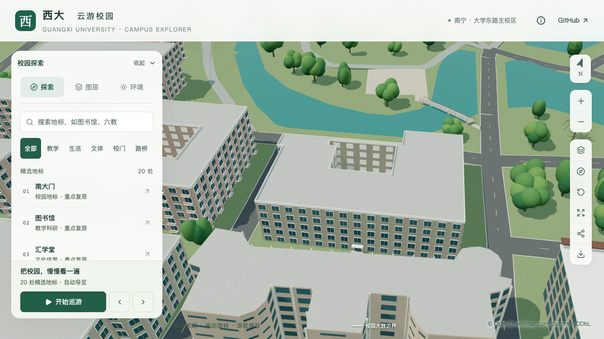
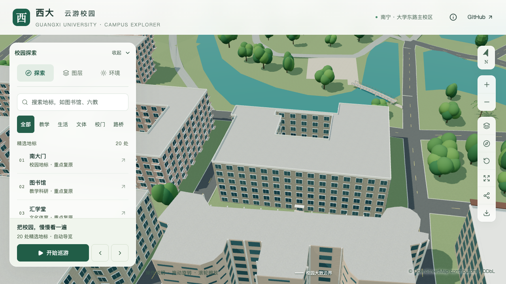

# 普通建筑校准记录与数据契约

本页对应 [实施计划](CAMPUS_REFINEMENT_PLAN.md) 的 S2。当前建立 12 条部分校准记录，其中原有 8 栋相对初始参数调整主体高度，动物科学技术学院增加高入口核心与低侧翼分段，农学院南侧凸部校准为低门廊并将入口内退到主体墙。首批 8 栋之后新增东苑、碧湖苑两处食堂，详见[食堂校准](DINING_BUILDINGS.md)。**这不是 12 栋完整实测，也尚未完成首批 20–30 栋校准。** 未定位的入口、背立面、附楼范围和层高仍单独列为待核对项。

第三教学楼已从类型默认五层调整为校方项目册记载的八层，估算主体高度26.4 m；屋顶、分段、入口和外廊仍待核对，见[三教校准记录](TEACHING_THREE_CALIBRATION.md)。

林学院南侧门廊按具名照片与南门学院石资料校准为靠东端的外挑入口，四柱、平台、三阶台面及两排镂空栏板在基础和近景共用。原主体和内院保留，位置与尺寸明确按估算记录；整栋计数不增加，见[林学院入口记录](FORESTRY_COLLEGE_ENTRY.md)。

## 资料与判断范围

广西数学研究中心（地图名第五教学楼 `way/759129515`）新增西三层/东两层、开放外廊和南侧入口校准；资料、估算范围及入口整地见[本批记录](MATH_CENTER_CALIBRATION.md)。

东楼南入口两侧随后补充[附着式上层外廊](MATH_CENTER_EAST_GALLERIES.md)。新增实体底层、上层栏杆与斜檐单独保存占地，原地图轮廓不变；当前仍为同一条部分记录。

主要依据是[广西大学基金会校园项目册](https://jjh.gxu.edu.cn/__local/A/1C/2D/C94DA67648AB9698A6BE04E1718_D3801DBD_2512297.pdf)。它包含楼栋名称、层数及对应照片，共 56 页；印刷页码比 PDF 页序少 4。文件元数据创建时间为 2020-01-15，公开发布日期和各照片拍摄日期未知。采用其中既有楼栋的历史记录，不把新建方案或旧照片称为 2026 年现状测绘。

源文件只保存在本机取证目录，不随项目分发，不用于材质贴图。[PDF 取证索引](model-checks/refinement/s2-source-pdf.json)保存文件哈希、元数据与核对页码；[来源目录](../data/building-sources.json)保存公开链接、日期、用途及局限。

## 首批试点

表中高度均为主体高度，坡屋顶增量另计。未获得测量高度的楼栋继续按每层 3.3 米估算；“文献记载层数”不等于“测量高度”。

| 楼栋与稳定 ID | 原层数 → 采用层数 | 原高度 → 当前主体高度 | 项目册 PDF 页 | 当前处理 |
| --- | --- | --- | --- | --- |
| 动物科学技术学院 `relation/11564704` | 5 → 核心 7、侧翼估 5 | 16.5 → 核心 23.1 / 侧翼 16.5 m | 40 | 文本确认最高层数，照片约束高核心、低侧翼和凸出门厅；分段范围、侧翼层数与入口宽度仍为估算 |
| 林学院 `relation/11564703` | 5 → 6 | 16.5 → 19.8 m | 39 | 采用具名层数；保留内院，南侧端部门廊及中段上层宽窄窗组已按照片约束估算校准，其他主要立面和体量仍待核对 |
| 农学院 `way/759185166` | 5 → 主体 5、门廊 1 | 16.5 → 主体 16.5 / 门廊估 4.0 m | 40 | 官网正面图与 2026 院前活动图约束南侧四柱低门廊及内退入口；东西露台与后翼分段仍待定位 |
| 生命科学与技术学院 `relation/12874251` | 5 → 6 | 16.5 → 19.8 m | 40 | 项目册“国家重点实验室楼”条目同时说明生命学院使用；保留原内院与轮廓 |
| 轻工与食品工程学院 `way/759080588` | 6 → 7 | 19.8 → 23.1 m | 38 | 采用校方具名条目；保留 OSM 的 6 层标签及差异说明，局部高低体量仍待细分 |
| 数学与信息科学学院 `way/759129516` | 5 → 西端 5 / 较低主体 4 | 16.5 → 16.5 / 13.2 m | 39 + 学院官网 | 已分段、迁移西南主入口并加对侧次入口，校准三窗凸部、封闭窗廊、西端实墙、主门三开间/四柱、北侧五层端部四列窗及北门四柱平雨棚/短台阶和向西侧人行道的连接；南门三道台阶及直向道路连接已实现。另补[竖向玻璃及北侧三层花格](MATHEMATICS_FACADE_PANELS.md)，位置、尺寸与纹样简化均标估算。东端、花格下方门厅及其他主要立面仍待核对，见[数学学院](MATHEMATICS_COLLEGE.md) |
| 电气工程学院 `way/759096561` | 5 → 10 | 16.5 → 33.0 m | 39 | 修正原类型默认楼层；门厅和背部附楼未按照片逐段建模 |
| 计算机信息网络中心大楼 `way/759132929` | 11 → 11 | 36.3 → 36.3 m | 35 | 校方条目与 OSM 层数一致；低裙房仍需明确范围后再拆分 |

动物学院的入口使用外环第 11 边的中点，沿该边法向朝外。该凸部与照片中中央玻璃门厅的匹配属于有资料约束的推断；4.4 米门宽、3.3 米层高及向内分段均非实测。生成后的两个体量完整覆盖原轮廓，没有扩建、填院或互相重叠。窗口按各段层数生成，内部体量分割面不生成窗列。

2026-09-13 后续校准依据学院官网合影，将动物学院入口沿该锚点内退约 4.64 m，凸部底层开放并增加两级落地台阶。入口核心现分成两个等高部分，上层窗列保留，内部同高边不生成女儿墙，详见[动物学院入口记录](ANIMAL_COLLEGE_ENTRY.md)。随后校方清晰照片支持可见侧翼为五层，并将原外环第 1、9 边的上四层校准为开放外廊，见[外廊记录](ANIMAL_COLLEGE_FACADES.md)；层高、未入镜后翼和其他立面仍待核对。前段“两体量”描述保留为首批实现背景。

农学院入口从西侧最长边示意位置移至南侧原外环第 9 边，向主体墙内退约 4.74 米，四根方柱和三个开放柱间在基础与近景共用。低门廊上方已暴露的主体墙补回窗列。该层数、门廊及入口校准仍包含估算尺寸，详见[农学院入口专项记录](AGRICULTURE_BUILDING.md)。

### 保留的资料冲突

- **东苑餐厅：**项目册 PDF 第 43 页文字为 3 层，而同页照片可见包含底层的四排楼层；[设计院 2022 年项目说明](https://sjy.gxu.edu.cn/info/1042/1294.htm)称其为 4 层。后续食堂批次采用照片与设计院说明一致的四层，保留文字计数冲突，不以“餐厅用了几楼”替代总层数。
- **农学院：**[2024 年采购公告](https://www.gxu.edu.cn/info/1364/36128.htm)提及 4 层东西两侧露台。这支持继续核对低侧翼，但公告施工范围不是整栋总层数，也不足以直接确定露台平面边界。
- **旧楼与新楼：**项目册含新建学院楼方案和旧学院楼照片。后续扩展须先匹配位置、原轮廓和当前稳定 ID，不能把新楼的层数套在旧楼上。

## 数据契约

[building-overrides.json](../data/building-overrides.json)是人工输入，[building_overrides.py](../scripts/building_overrides.py)负责校验与解析。现有 `buildings.json`、GeoJSON 和统计仍为派生产物。

- 顶层为 `schemaVersion: 1` 和以稳定 OSM ID 为键的 `buildings`。每条保存 `footprintRevision`，即原 `polygons` 紧凑 JSON 的 SHA-256；轮廓变化后必须重新核对入口与立面定位。
- `category` 保留用途与导航语义，`archetype` 控制建筑形制。原型不替换轮廓，不增加精选地标。
- `levels`、`floorHeight`、`height` 独立解析。有依据的人工字段覆盖有效 OSM 对应字段；没有高度时由最终层数与估算层高计算。无效 OSM 高度不会连带丢弃有效层数，反之亦然。平均层高超出 2.2–6 米时报告冲突，不把该检查当作工程规范。
- `roof` 当前支持 `type` 和 `rise`；矩形屋脊跟随映射轮廓的局部轴。任意屋脊方位与屋坡参数尚未实现，未知字段直接报错，不静默忽略。多体量坡屋面在各部分内生成，禁止用整栋外接矩形封闭凹口和内院。
- `parts` 是已有轮廓的完整分区，每部分明确 `id`、`polygons`、`height`、`levels`；可选 `roof` 必须同时给出类型与起坡高度，分部依据写入 `parts` 的证据。拒绝越界、重叠、缺口、填内院及最高部分与主体高度不一致；不使用一套新轮廓替代原始建筑记录。
- `parts.openBelow` 可表达一层平顶门廊，显式指定地板、板底和方柱；验证高度次序、柱位与重叠。相邻主体墙在低屋面以上补充可见窗列，柱间不生成普通外窗。
- `entrances` 通过 `polygon/ring/edge/t` 定位在原外边，记录宽度和主次。方向由外边法向解析，北为 0°、顺时针递增；必须有一个主入口，门宽不能超过所在外边。无资料时保留明确标为估算的最长边入口。
- 可选 `entrances.recess` 将门面内退到主体墙，要求退让路线处于唯一门廊且柱子不堵住中央通路。外边锚点用于台阶，内退位置用于门面；不是允许任意悬空设置入口。
- 可选 `entrances.attachedPortico` 用于照片支持、位于原主体外侧的低门廊，显式指定门廊宽深、平台/台阶起算标高、顶板与栏板高度、柱宽/边距、步数/踏深。它保留原轮廓，校验附着外边与本栋全部多边形、柱间通路和竖向净空；当前不能与主体分段或内退门廊混用。台阶占地进入最终植被落点约束，实际 GLB 和最终地形另外检查。当前林学院使用该配置，尺寸均为估算。
- 后续扩展允许平顶多层 `parts.openBelow`：保留板底以上窗列，等高分段的共边不生成女儿墙。内退入口可用 `steps` 与 `stepBaseHeight` 分别设置级数与相对楼栋基准的落地标高，默认保持既有三阶及零基准；当前动物学院采用两阶，尺寸仍为模型估算。
- `facadeRules` 支持按原轮廓外边或内院边关闭窗列、关闭阳台和设置窗距。分段后窗层数按所属体量生成；各原立面覆盖一次，内院窗朝向院内空地。当前试点尚未把各楼实墙面全部落到这些规则中。
- `facadeRules.openCorridor` 为有照片依据的外廊提供 `depth`、`firstLevel`（零基；底层开放需显式 `piers`）、`railHeight`、`endInset`。允许平顶或坡顶实体分段的外环立面；检查内退范围完全位于原分段内、不侵占内院、不与其他外廊重叠，且不能同时开启阳台。基础/近景共用主要几何，窗列退到后墙。当前动物学院的两段四层外廊采用该规则，尺寸均为模型估算。
- `facadeRules.attachedGallery` 表达原墙线外的两层附着构件：下层实体、上层廊道与接回四坡主体屋面的斜檐，显式给出深度、端部退让、栏杆、斜檐与上层门窗参数。要求关闭默认阳台，不能与其他专项窗格/面板或内退外廊混用。零端部退让必须有两侧映射凸部约束，按原侧墙方向求交；新增占地独立进入最终植被排除，并检查楼体与入口冲突。
- `facadeRules.windowGrid` 支持有资料计数的窗列及连续竖向分隔，指定 `columns`、`firstLevel`、`edgeInset`、`widthRatio`、`heightRatio`、`pilasterWidth`、`pilasterDepth` 与 `paneRows`。只在一条未被体量切开的外环边上应用，不能与窗距、外廊、阳台或关闭窗户混用；构建前检查窗框、分隔和门廊净空。动物学院第 11 边采用八列，第二至第七层保留对应窗位，近景附加窗内分格，详见[中央窗格校准](ANIMAL_COLLEGE_GLAZING.md)。窗列计数与估算尺寸分别表述。
- `evidence` 对应具体字段；屋顶分别使用 `roof.type`、`roof.rise`。`confirmed` 表示资料明确记载该字段，`estimated` 表示保留估算；每项附来源引用与说明。复合的分段和入口字段若含估算尺寸，整体按 `estimated` 记录。
- `review` 记录已查阅后仍未确认的内容。派生 `calibration.evidence` 同时列出默认层高、默认立面与回退入口的估算状态，不能因层数被确认就把整栋标为确认。
- 未知/专用模型 ID、重复 JSON 键、非法数值、无来源的确认值、过期轮廓摘要和失效立面定位都会使准备流程失败。图书馆、荟萃楼、主席台及纪念柱等继续由既有专用模型处理。

## 准备与重建

楼栋校准入口：

```sh
work/refinement-venv/bin/python scripts/building_overrides.py
work/refinement-venv/bin/python -m unittest discover -s scripts -p 'test_*.py'
npm run models:build
blender --background --python-exit-code 1 --python blender/validate_generic.py -- --report-prefix=s2-pilot
```

旧的 `building_forms.py` 命令转调同一覆盖流程，避免误删新校准。完整 `prepare_geodata.py` 已接入同一解析器，并在隔离目录验证其校准输出与增量输出一致。S2 首批曾保留部分前期增量场地结果；S3 前置修复已解决外围道路、来源依赖和共享楼体身份差异，并采用完整准备输出重建模型，见[重建核验](model-checks/refinement/s3-preparation.json)。少量主路饰面分界的重算差异已单独记录。

输入重复应用不应继续改变结果，移除一条覆盖后回到对应 OSM/默认参数。原始标签一直保留，可追溯资料与标签冲突。统计区分“校准记录数”“资料明确的层数”和“资料明确的主体高度”；当前最后一项为零。

## 本批验证

[数据不变项](model-checks/refinement/s2-data-invariants.json)确认 448 栋轮廓与身份保留，非试点楼栋记录不变，场地/地形/树位文件不变。[完整流程对照](model-checks/refinement/s2-full-prepare.json)仅证明校准字段一致，不把未采用的其他派生结果称为通过。

[逐栋记录](model-checks/refinement/s2-calibrations.json)列出原值、采用值与字段依据；[几何报告](model-checks/refinement/s2-pilot-geometry.json)比较可编辑源、实际基础 GLB 与近景 GLB。固定镜头见 [相机清单](model-checks/refinement/s2-cameras.json)。[近景相机](model-checks/refinement/s2-close-cameras.json)用于最后的细节对照。[浏览器记录](model-checks/refinement/s2-validated-browser.json)已完成 9 张截图、3 次 LOD 往返及 6 次环绕，错误为空；精细/流畅 FPS 中位数为 60/27，满足本轮门槛，流畅档处于允许下降的边界。完整数值、资产哈希和验收范围见[本批汇总](model-checks/refinement/s2-summary.json)。


## 固定近景对照

以下使用相同相机、日间光照和桌面视口，左为 S1，右为当前 S2 试点。截图中的屋面和窗层反映生成结果；层高、窗尺寸与未定位入口仍包含估算。

| 楼栋 | S1 | S2 试点 |
| --- | --- | --- |
| 动物科学技术学院 |  |  |
| 电气工程学院 |  |  |
| 林学院 |  |  |

[逐镜头检查](model-checks/refinement/s2-visual-review.json)覆盖 8 栋试点及图书馆手机尺寸画面。动物学院的核心与侧翼高差、林学院和生命学院的内院、各楼采用层数均在画面中可见。该历史图书馆画面中的中央草地连接与树冠问题已在 S3 中处理，见[中央前场记录](LIBRARY_NORTH_SITE.md)；农学院后续对照单独见[入口专项记录](AGRICULTURE_BUILDING.md)。

林学院后续已处理[南门门廊](FORESTRY_COLLEGE_ENTRY.md)与[南侧中段窗带](FORESTRY_COLLEGE_FACADES.md)。窗组、分格和挑檐尺寸属于照片约束估算；底层、两端、入口上方竖向突出体和其他立面继续待核对。该楼仍属于部分校准，不能增加整栋验收数量。
