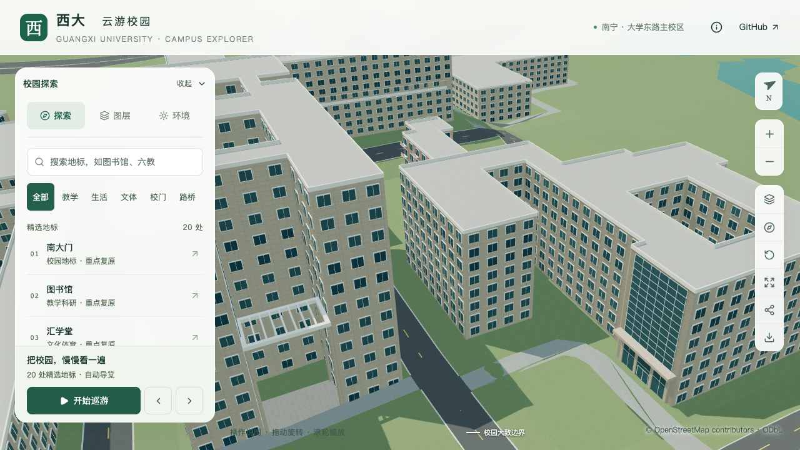
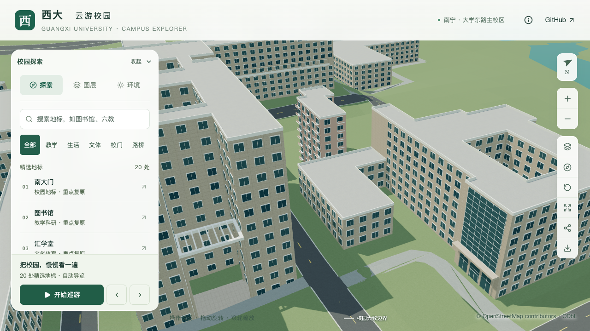

# 土木学院西南低附楼体量校准

2026-09-20，接续东南玻璃门厅，对 `relation/12875606` 西南附楼作第一步高低体量拆分。原来整个轮廓统一八层、26.4米，正面照片中的低附楼被拉成与主楼等高；本批将其降低为三层、10.8米的照片约束估算。原建筑轮廓、内院、主楼及玻璃入口保持，仍不计整栋完成。

## 依据与估算边界

[学院英文官网宽幅](https://tmjz-en.gxu.edu.cn/images/banner_six.jpg)及[学院官网完整正面图](https://tmjz.gxu.edu.cn/__local/A/7E/69/4A06C7C98FB4DD485911A8F3606_2806A0A4_AFCA6.jpg)同时显示高主楼和西南矮附楼。附楼可辨下部低窗、台阶以上房间和上层带外廊房间，因此先采用三段竖向空间、每段3.6米的简化表达。这是推断；低窗是否属于半地下层、实际层高及局部高屋面的构造都没有测绘依据，不能称为确认的完整地上三层。

沿原外环第1边，经第2顶点 `[-537.90085785, -834.82207600]` 向西延长，与第6边交于 `[-548.70115052, -834.80855526]`。以该线划分南侧C形附楼，低附楼面积约734.26平方米，其余原轮廓约2021.57平方米保留主楼估算高度。这条分界由外观与原轮廓约束推断，不是确认的施工缝；没有用有投影偏移的航拍屋顶外缘改变地面轮廓。

| 分段 | 采用参数 | 当前口径 |
| --- | --- | --- |
| `main-and-rear` | 八层、26.4米 | 沿用原估算；后翼实际高度另核对 |
| `southwest-annex` | 三层、10.8米 | 照片约束估算；底层与半地下层口径待核对 |
| 屋顶 | 暂沿用平顶简化，各自屋面标高随分段变化 | 局部高屋面、退台及细分级尚未校准 |

补查的[2021年退休座谈会合影](https://tmjz.gxu.edu.cn/info/1452/5151.htm)左侧也可见低附楼上层，但截幅不足以确定后部屋面；[综合楼用房改造公告](https://www.gxu.edu.cn/info/1364/30304.htm)没有定位本附楼的平面资料，未把其楼层描述套用到本对象。资料文件、哈希、分界和参数见[本批证据](model-checks/refinement/s2-civil-annex-evidence.json)。参考照片与影像仍只保存在本机。

## 生成与待办

沿用既有 `parts` 机制，基础和近景使用同一组分段。新分段初稿沿用顺时针外环，实际几何射线发现交界墙面法线向内；定向为逆时针外环、顺时针内环后重建，分界及尺寸不变。保留[初稿问题记录](model-checks/refinement/s2-civil-annex-winding-before-geometry.json)，旧八层模型的[高度反例](model-checks/refinement/s2-civil-annex-negative-geometry.json)也独立保留。

下一步继续核对附楼局部高屋面、露台、外台阶及窗廊，而非把本次统一低层分段当作最终屋面。当前主楼后翼、端部塔顶、其余立面与完整接路仍待校准；之后按用户顺序开展实验大厅、新结构平台。

## 几何与画面对照

[专项检查](model-checks/refinement/s2-civil-annex-geometry.json)对源文件、基础GLB及近景GLB分别进行58条射线，覆盖低屋面、高主楼屋面、交界两侧、内院和前庭开口、交界墙及主体外墙/院墙方向。墙面方向检查选在窗间的楼层接缝，确保基础窗片和近景窗框没有替代实际墙面成为被测对象。原东南玻璃门厅、顶板、上部玻璃及旧入口移除另通过每级143条[入口回归射线](model-checks/refinement/s2-civil-annex-entry-geometry.json)。

| 视角 | 修改前 | 修改后 |
| --- | --- | --- |
| 西南附楼及高主楼 |  |  |

七张最终前后、植被开关、日夜及手机尺寸画面已直接核看。调整总览角度后可以辨认低附楼与高主楼；西侧局部被资环材楼遮挡，近景用于检查本批高低变化。照片中的外台阶、局部高屋面和窗廊尚未还原，不能将当前简单窗列视为完成。手机检查为桌面视口模拟。初稿法线修正前的临时画面只留在本机，不作为最终验收截图。

180项Python、56项Node测试、类型检查、lint和完整模型/Pages构建通过。[数据检查](model-checks/refinement/s2-civil-annex-data.json)确认覆盖解析可重复执行，两部分无重叠并完整覆盖原轮廓，其他447栋及原入口数据保持。[资产检查](model-checks/refinement/s2-civil-annex-assets.json)确认仅基础模型与本栋近景区块变化，其他67个GLB、90个基础节点保持，69个GLB及生产数据一致。首屏5,161,136字节，比上一批减少360字节；最大普通近景仍1,684,868字节。

[源对象比对](model-checks/refinement/s2-civil-annex-source-preservation.json)确认仅土木学院楼变化，其他530个非树对象及3,063株树实例的几何、材质、UV与变换保持。430栋普通建筑回归及[实际树木净空检查](model-checks/refinement/s2-civil-annex-trees-geometry.json)通过。

## 性能与局部验收

全部建模及几何检查结束后，完成三次LOD往返和两档各三次30秒环绕，浏览器无错误。精细档为60/49/57 FPS，中位数57 FPS，相对原同系统S0下降5%；流畅档30/30/30 FPS。三角形相对S0增加3.66%/8.11%，绘制调用增加2.56%/11.03%，均通过原预算，未调整门槛。

24次CPU快照在计时窗口没有记录到超过2%阈值的Python/Blender计算；该10秒间隔采样不证明没有任何后台活动，也不能解释单轮49 FPS的全部波动。图书馆手机尺寸回归画面已核看。结果及当前资产指纹见[本批汇总](model-checks/refinement/s2-civil-annex-summary.json)。

本批估算高低体量、定向后的主体墙面及保留的东南玻璃入口通过局部联合验收；上一批受后台任务干扰的性能报告保留原状态，以本次当前资产的结果接续。该结论不覆盖未实现的真实屋面、台阶及主要立面，累计21条部分对象记录，整栋完成数不增加。
