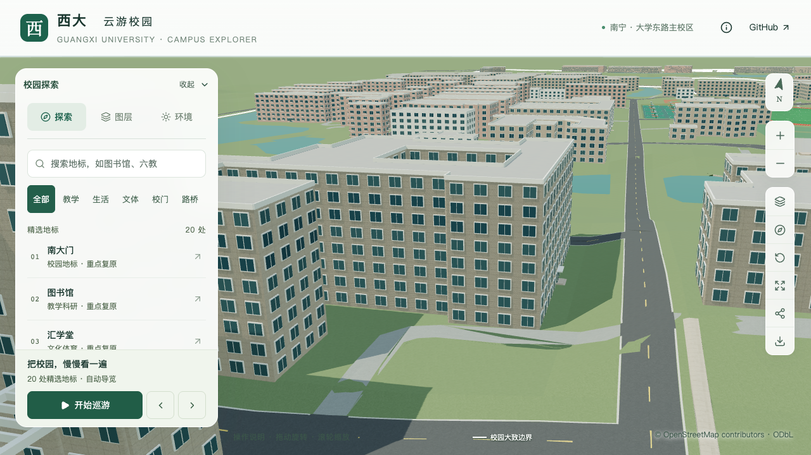
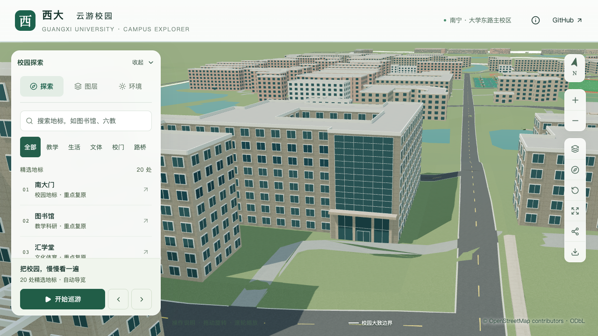

# 土木建筑工程学院校准记录

2026-09-21接续：[附楼三角形高墙与小拱窗](CIVIL_ANNEX_GABLE.md)已按照片定位到东侧上层墙面，估算峰高14.4米，保留后方平屋面，未推断完整双坡屋顶。此前的主体、退台、台阶与前场连接保持；后方屋面及其他立面继续核对。

2026-09-21接续：[主门与附楼台阶前场连接](CIVIL_FRONT_CONNECTIONS.md)补齐两处短铺地，并处理前庭映射路面原有高差突跳。主体、台阶和树位保持；本批仅覆盖两处连接与相邻路面，屋顶和其他立面、完整前庭仍待校准，后续实验大厅 → 新结构大楼顺序不变。

2026-09-20，按用户指定顺序，在农学院门廊、挑檐、顶层窗列及中央檐口这一批局部验收后开始。本栋为 `relation/12875606`，区块 `chunk-n2-n3`。首批取证后已校准南侧东端入口和上方玻璃立面，随后对[西南低附楼作体量拆分](CIVIL_ANNEX_MASSING.md)；低附楼细分屋面、后翼等仍待继续处理，属于部分对象记录，不计为整栋完成。

## 现有模型与首批资料

开始校准前，OSM 标签为八层，模型按3.3米层高得到26.4米；这不是实测高度。轮廓有一个内院和多处凹凸，没有高低分段，屋顶为默认平顶，入口位于最长外边中点，均需核对。入口的本批改动见下文。

[学院简介](https://tmjz.gxu.edu.cn/info/1019/2987.htm)提供[带院名的入口照片](https://tmjz.gxu.edu.cn/__local/7/BC/6D/911F703A11995BE3EDDC88147EF_C60DF7C0_E388.jpg)。可以辨认蓝色玻璃竖向体量、入口门廊及一侧连续外廊。这些应成为首批校准重点；原图仅333×229像素，不能据其精确计层、量取尺寸或确定轮廓锚点。页面日期为2025-10-11，照片拍摄日期未知。

[官网招生视频](https://tmjz.gxu.edu.cn/index/zsxcsp.htm)全长327.52秒，560×240、50 fps；完整解码后以10秒间隔取33帧，全部通过三张接触表查看。取样主要为校园环境、室内教学和工程项目，没有取得可确定对应本栋的完整屋面或侧后方画面；这不等于逐帧检查，也不证明全片没有其他有效镜头。

[校友返校报道](https://tmjz.gxu.edu.cn/info/1452/8581.htm)的两张照片分别是室内会场与室外阶梯合影。室外阶梯尚未与目标轮廓对应，不用于重建入口。官网首页的会议、桥梁与会场轮播图片也未作为该楼外观依据。

## 防止混用项目与后续顺序

[后勤基建处2024年11–12月简报](https://ghjjc.gxu.edu.cn/info/1011/3517.htm)描述的土木工程综合实验中心于2024年9月开工，地上八层、局部六层，总高31.75米。它是另一个建设项目，这些数字不能直接覆盖本栋已有学院楼。

1. 补充能定位的高清正面、侧面或航拍，将玻璃体量、门廊、连续外廊与原轮廓逐项对应。
2. 确认主体层数、分段及屋顶，再核对入口方向和门槛至校道连接；有依据的形制与估算尺寸分开登记。
3. 按既有覆盖表实现，检查内院保留、基础/近景一致性、实际模型与固定画面，并继续执行原性能预算。

首批来源、素材哈希、取样范围和当时未变模型指纹见[初始记录](model-checks/refinement/s2-civil-initial-evidence.json)。原照片及视频仅保存在本机 `work/`，不作为模型纹理或公开分发素材。上述初始记录保留，以下为后续新增资料及实现。

## 南侧东端入口与玻璃立面

后续取得[英文官网入口近照](https://tmjz-en.gxu.edu.cn/info/1050/1096.htm)、[英文官网宽幅](https://tmjz-en.gxu.edu.cn/images/banner_six.jpg)及[学院域名完整正面图](https://tmjz.gxu.edu.cn/__local/A/7E/69/4A06C7C98FB4DD485911A8F3606_2806A0A4_AFCA6.jpg)。近照可核对门厅横档与竖向柱，另两张能同时辨认主楼、端部玻璃和另一端低附楼；拍摄日期均未知。完整正面图来自搜索索引关联的旧简介图片，当前简介已换图，不把它称为当前网页配图。

利用 [Esri World Imagery](https://server.arcgisonline.com/ArcGIS/rest/services/World_Imagery/MapServer) 的九块19级瓦片，将内院、南侧资环材楼及西南侧C形附楼与原OSM轮廓交叉定位，确认照片主立面向南，入口在东端原外环第17边。最初仅凭透视考虑的东立面方案已排除。影像存在高楼投影偏移，未用屋顶投影量尺寸或改变原轮廓；影像拍摄日期未知，版权归Esri、Vantor、Earthstar Geographics及GIS用户社区。历史校园规划图的土木片区不能直接代表当前屋面分段，未用于生成分界。

撤去原东侧最长边中点的示意入口，采用第17边中点。其地图端点为 `[-476.76969845, -838.05035600]` → `[-493.45022626, -838.02809200]`，约16.6805米长。入口位置是多资料约束的人工对应，仍非测绘定位。

| 构件 | 本批参数 | 口径 |
| --- | --- | --- |
| 门厅玻璃 | 宽13.8米，顶高7.2米，三开间 | 两层高的外观有照片支持；尺寸及分格简化估算 |
| 柱与横档 | 柱宽0.65米，横档高3.6米 | 照片约束估算 |
| 门 | 宽3.2米、高2.7米、门槛0.1米 | 估算；没有增加一组无依据的台阶 |
| 门厅顶板 | 宽16.2米、外挑2米、厚0.6米，下缘7.2米 | 估算的悬挑外形，不是结构还原 |
| 上部玻璃 | 原边范围0.09–0.91，高7.8–26米，六列十二行 | 外观有依据；尺寸和分格为简化估算 |

沿用原八层、26.4米估算主体及原内院；没有把未核对的后翼或低附楼当作已确认八层。端部斜墙、玻璃转角和实际塔顶高度尚未实现。门厅及上部玻璃均为外表面表达，不生成室内，也不复刻院名、旗帜或空调。

`flushEntrance.canopy` 为可选的显式顶板：下缘跟随门厅玻璃顶高，检查有限尺寸、所在墙段高度、墙边范围与其他翼楼相交，拒绝与另一套入口雨棚/台阶叠加。原办公北楼不配置该字段，几何保持。普通窗和显式上部玻璃不会穿过新门厅及顶板。依据、参数和素材哈希见[本批证据](model-checks/refinement/s2-civil-entry-evidence.json)。

### 模型与画面检查

180项Python、56项Node测试、类型检查、lint及完整模型/Pages构建通过。[专项验证](model-checks/refinement/s2-civil-entry-geometry.json)在源文件、实际基础和近景GLB各进行143条射线，检查玻璃、四道竖向柱、上部窗格、顶板上下表面、外侧留空及旧东入口移除；[旧模型反例](model-checks/refinement/s2-civil-entry-negative-geometry.json)在新门厅位置失败。

[数据检查](model-checks/refinement/s2-civil-entry-data.json)确认其他447栋、原轮廓、标签、主体高度和场地保持。[资产检查](model-checks/refinement/s2-civil-entry-assets.json)确认只有基础模型及本栋近景区块改变，其他67个GLB、90个基础节点及3,063株树保持，69个GLB与生产包一致。首屏5,161,496字节，增加1,840字节；最大普通近景1,684,868字节。

| 局部视角 | 修改前 | 修改后 |
| --- | --- | --- |
| 南侧东端入口 |  |  |

七张前后、日夜、植被开关及手机尺寸画面已直接核看。宽景中资环材楼遮挡部分西侧体量，仅作为周边环境对照；本批外观验收采用入口近景。手机为桌面视口模拟，不是真机验证。原西南低附楼仍错误沿用高主体默认高度，将作为后续体量校准重点；本批没有将宽景视为整栋真实性验收。

### 性能记录与本批状态

首次测量和未变资产复测均完成三次LOD往返、两档各三次30秒环绕，浏览器无错误。两轮精细档均为60/60/60 FPS，流畅档均为30/30/30 FPS；相对同系统原S0，复测三角形增加3.57%/7.88%，绘制调用增加2.38%/11.03%，数值通过原预算。两张图书馆手机尺寸回归画面均已核看。

两轮各24次CPU快照，均在计时窗口捕获到其他项目的Python计算。因此几何和画面检查通过，性能数值达标，但同条件性能比较及本批联合验收仍未通过。保留[首次汇总](model-checks/refinement/s2-civil-entry-summary.json)和[复测汇总](model-checks/refinement/s2-civil-entry-recheck-summary.json)，待外部重任务结束后对相同资产补测；没有更换或降低原S0门槛。采样每10秒一次、仅记录CPU占用至少2%的进程，不用于证明完全没有其他后台活动。

本批成果在dev交付，不计整栋完成。下一步优先核对西南低附楼分界和分级屋面，再继续后翼、端部塔顶、主要立面及道路连接；缺少依据的尺寸继续标为估算或待核对。

2026-09-20接续：西南附楼已完成第一步[估算体量拆分及局部验收](CIVIL_ANNEX_MASSING.md)，保留入口的143条射线回归通过；新版本性能中位帧率为57/30 FPS，原预算通过，计时采样未捕获高占用Python/Blender计算。上面的入口阶段失败记录保持，当前累计资产验收以[附楼批次汇总](model-checks/refinement/s2-civil-annex-summary.json)为准；细分屋面、台阶等继续待办。

## 后续建筑队列（2026-09-20 用户追加）

当前楼栋接续已补充[南立面中部窗组、连续挑檐及顶部两层窄窗](CIVIL_SOUTH_FACADE.md)。十三开间、分格和尺寸为照片约束估算；顶部真实深凹窗廊、西端附楼上方墙面、附楼台阶及屋顶继续待校准，未计整栋完成。

随后将最上层进一步改为[有进深的凹窗槽](CIVIL_TOP_RECESS.md)，保留下方窗组；只有第八层已处理退进，第七层实际凹进和其余待办仍未完成。凹窗槽借用凹廊构件生成，不据此认定实际通行用途。

西端低附楼上方高墙接续补充[两排窗带、第七层窗与三开间顶层凹窗](CIVIL_EXPOSED_FACADE.md)，锚定两体块的内部共享边界；原占地、体块与外边立面保持。更低局部露窗、侧后立面和附楼等仍继续核对。

东南入口上部玻璃接续补充[东侧幕墙转折](CIVIL_CURTAIN_RETURN.md)，正面东端延伸至转角附近；侧向3.60米为估算。白色斜墙与塔冠、侧门厅仍继续核对。

西南附楼接续补充[两段外台阶与平台](CIVIL_ANNEX_STAIRS.md)，沿原第4边锚定，宽下梯与偏置窄上梯采用照片约束估算。分级屋顶、台阶侧墙、门槛及完整接路仍待核对。

东南塔部随后补充[抬高的玻璃塔头与白色屋顶墙片](CIVIL_ROOF_CROWN.md)，塔头屋面32.4米、白墙上缘34.8米采用照片约束估算。原主体层数及26.4米主屋面保持；完整下部斜侧墙与侧门厅仍未完成，不将屋顶局部校准计为整栋完成。

2026-09-21：接续实现[由底座至塔冠的连续白色斜侧墙](CIVIL_TAPERED_SIDEWALL.md)，只抑制与墙片相交的通用窗。斜率、表面外偏和厚度仍是估算，侧门厅玻璃、局部小开口及其他待办继续处理。

侧门厅随后补充[两层玻璃、柱梁与转角顶板](CIVIL_PORTAL_RETURN.md)，接续既有正面门厅，不另增侧门或入口身份。附楼分级屋顶、场地接路、局部小开口及其他立面继续待办，整栋状态保持未完成。

附楼东侧接续补入[7.2米露台与3.2米上层退进](CIVIL_ANNEX_TERRACE.md)，后部10.8米屋面保持；标高和进深为照片约束估算。退台后补三组窗，未改变地面轮廓或台阶参数。三角形高墙及其后方屋面、其他方向屋面和场地接路继续核对。

用户要求完成当前楼栋后，继续实验大厅及“新结构大楼”。当前学院楼的低翼、屋顶、立面、接路与待复测项继续推进；后续顺序为实验大厅 → 新结构大楼。两处新增目标尚未修改模型，不计入21条部分对象记录或整栋完成数。

| 用户称呼 | 初步对应与现有对象 | 开始校准前需核对 |
| --- | --- | --- |
| 实验大厅 | 优先核对学院官网所称“旧结构试验大厅”；尚未锁定模型ID | 旧大厅现状、轮廓、是否包含在相邻复合对象中，与新平台南楼实验大厅区分 |
| 新结构大楼 | 官网“新结构试验平台”；候选为 `way/957404988`，现名“大型结构试验研究平台综合楼”，区块 `chunk-n2-n3` | 名称与轮廓对应、南北楼和门厅分段、现状屋顶及入口 |

[学院2021年夏令营报道](https://tmjz.gxu.edu.cn/info/1452/5053.htm)将新结构试验平台、旧结构试验大厅与水工大棚分别列出，支持上述名称线索，但不能单独确定地图边界。这里对用户称呼的对应仍是推断。

[校报2014年3月31日基建专版](https://news.gxu.edu.cn/__local/8/C4/4D/0B1CE8B9D4B8389F21FF34B7030_FF27C11E_793A3.pdf?e=.pdf)介绍“土木工程大型结构研究平台实验室”：其东侧邻原结构实验楼大厅，西侧邻校界，北侧靠水科所；由南楼、北楼和门厅组成，北楼设计为九层，南楼包含实验大厅及小型实验室。这是历史建设期资料，须用现状照片交叉核对，不能把整个复合轮廓直接改为九层。候选对象目前默认五层、16.5米为类型估算，并非该楼实测值。

上述新旧结构实验建筑与2024年开工的土木工程综合实验中心分别取证；也不将扶绥农科新城的落摆锤实验平台套用到本校园。先保留原轮廓并确认对象覆盖关系，再决定校准记录如何划分，避免重复新增建筑。

2026-09-20补充资料时点：[2026年3月官方报道](https://carbon.gxu.edu.cn/info/1032/2253.htm)显示另一个土木工程综合实验中心已主体封顶，并采用原址拆除再建造。位置图本次无法取得，不能据文字认定旧结构试验大厅已拆除；后续两处目标开始校准前需核对现状范围和资料时点，详见[本批记录](CIVIL_CURTAIN_RETURN.md#后续实验建筑的时点提醒)。
