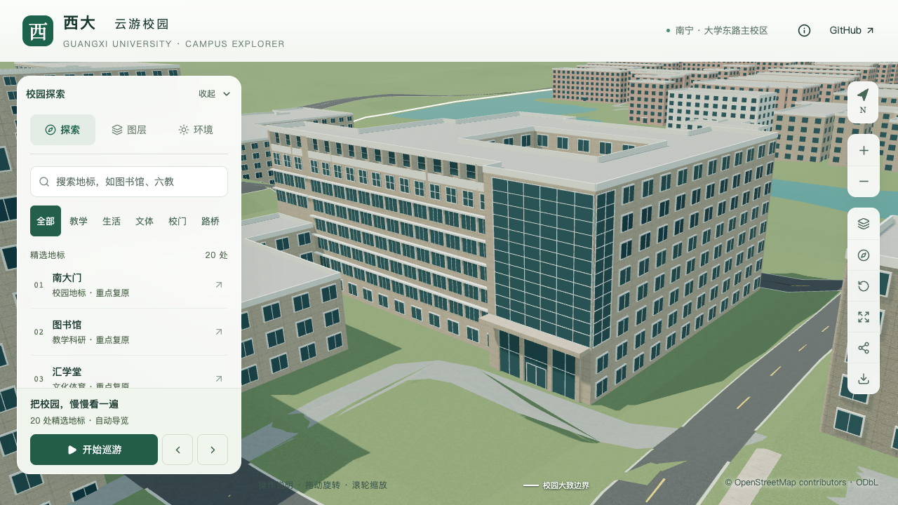

# 土木学院东南入口玻璃幕墙转角

2026-09-20，接续[西端高墙](CIVIL_EXPOSED_FACADE.md)，补充入口上部幕墙的东侧转折，并将正面玻璃延伸至东南转角。原两层门厅、顶板、主楼与低附楼、南立面窗带及凹窗保持，本批不计整栋完成。

## 照片依据与参数

[学院官网宽幅](https://tmjz-en.gxu.edu.cn/images/banner_six.jpg)和[完整正面照片](https://tmjz.gxu.edu.cn/__local/A/7E/69/4A06C7C98FB4DD485911A8F3606_2806A0A4_AFCA6.jpg)均能辨认玻璃向东侧转折，其后为较宽的浅色侧墙。旧模型只有正面玻璃，靠近转角留约1.50米实体墙，东侧仍为普通窗。

| 部位 | 本批采用 | 口径 |
| --- | --- | --- |
| 正面幕墙 | 原第17边东端改为距转角0.10米，西端仍止于边长的91% | 扩展既有玻璃面，六列十二行仍为简化估算 |
| 东侧转折 | 原第16边末端，距转角0.10米，向北延伸3.60米 | 照片可确认转折，进深、留边及两列十二行不是实测 |
| 上下标高 | 两面均为7.8–26.0米 | 保留此前估算，不据此确认塔楼实际总高 |
| 窗框 | 宽0.07米、外凸深度0.10米 | 与已采用正面表达一致 |

复用现有有界玻璃面板规则，侧面只替换与新玻璃相交的普通窗，其余东侧窗保留。两个表面各留0.10米窄实体转角，不额外生成悬空转角玻璃或室内。所有幕墙面板同时进入基础及近景模型。

白色斜侧墙和突出的塔冠仍缺少可定位后缘、屋顶视角；本批保留待核对，未由透视图反推完整塔顶体量。原地面轮廓、分段高度和屋面未改变。来源哈希、搜索范围及具体参数见[本批证据](model-checks/refinement/s2-civil-return-evidence.json)。

## 后续实验建筑的时点提醒

检索时发现[学校双碳研究院2026年3月报道](https://carbon.gxu.edu.cn/info/1032/2253.htm)：另一个土木工程综合实验中心已主体封顶，采用原址拆除再建造方式，报道当时预计2026年交付。其位置图请求返回403，本批未取得图像证据。该文字不能证明用户指定的旧结构试验大厅已拆除，也不能把新中心等同“新结构大楼”；进入后续队列时须核对建设范围与资料时点。2024年开工的旧状态不能再作为这个新中心的最新进度。

当前学院楼仍需继续核对塔冠、侧门厅、其余立面、附楼屋顶和两段台阶，以及道路连接。完成后按实验大厅 → 新结构大楼的顺序推进。

## 几何与画面对照

[幕墙专项](model-checks/refinement/s2-civil-return-geometry.json)在源文件、基础GLB、近景GLB中各完成222处固定坐标检查：玻璃、水平及竖向窗框、留边、标高以上保留墙面和东侧未改的实体带，并核对表面进深与法线。[旧模型反例](model-checks/refinement/s2-civil-return-negative-geometry.json)在扩展后的首列玻璃处如预期失败。

原门厅验证新增 `--portal-only` 选项，仅剔除已经变化的上部幕墙与旧宽转角探针，保留69处门厅、柱、顶板、净空及旧东入口移除检查；上部两面改由本批222处专项覆盖。历史默认验证仍保留。

原西端高墙63处、南侧顶层凹窗146处、原下部窗带及第七层219处、附楼体量58处，在源文件及两级GLB均回归通过。189项Python测试、56项Node测试、类型检查、lint及完整模型/Pages构建通过。

| 同机位转角近景 | 修改前 | 修改后 |
| --- | --- | --- |
| 正面延伸及东侧玻璃 |  |  |

七张楼栋画面已直接核看，包含前后斜侧近景与总览、植被开启、夜景及手机尺寸。两面幕墙的上下界与水平分格一致，旁侧普通窗保持；手机视口内前景屋顶未遮挡幕墙主体。

[资产检查](model-checks/refinement/s2-civil-return-assets.json)确认只有基础模型与本栋近景区块改变，其他67个GLB和90个基础节点保持，69个生产模型与数据一致。首屏模型5,173,512字节，较本批前增加700字节；最大普通近景仍1,684,868字节。

430栋普通建筑与3,063株树的实际几何检查通过；[源对象比对](model-checks/refinement/s2-civil-return-source-preservation.json)确认只有土木学院楼发生变化，其他530个非树对象的几何、材质、UV与变换，以及全部树实例均保持。

[本批联合验收](model-checks/refinement/s2-civil-return-summary.json)通过。与原同系统S0使用相同浏览器和环境，完成三次LOD往返及两档各三轮30秒环绕，浏览器无错误。精细60/60/54 FPS，中位数60；流畅30/30/30 FPS。相对原基线，三角形分别增加3.81%/7.78%，绘制调用增加2.74%/3.04%，通过原预算。24次CPU快照在计时窗口未捕获高占用Python/Blender进程；10秒采样间隔和2% CPU纳入阈值不证明完全没有后台活动。图书馆手机尺寸回归已直接核看。

累计仍为21条部分对象记录、零新增整栋验收。下一批优先继续核对影响整体轮廓的附楼屋顶与台阶，完整目标和后续实验建筑顺序保持。
