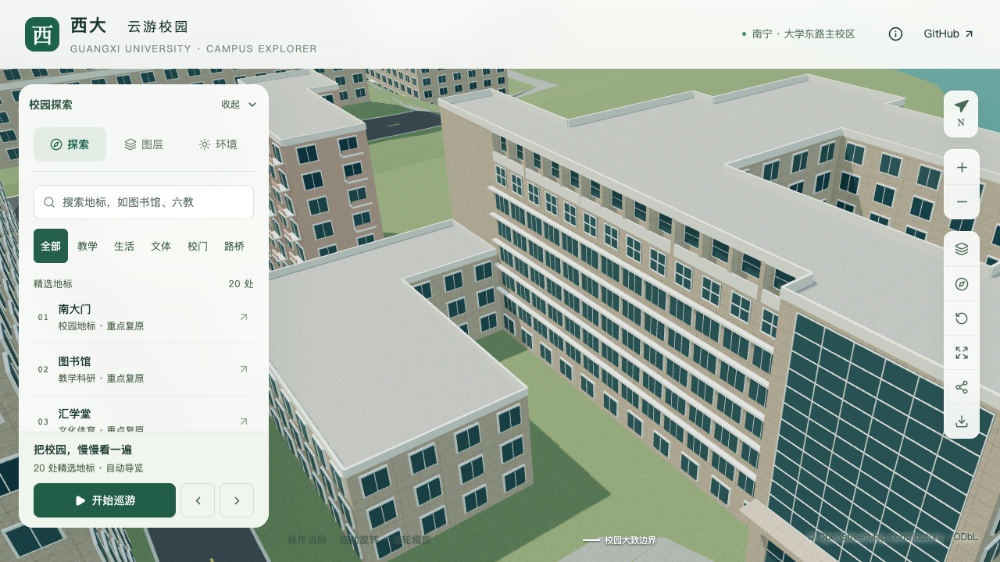
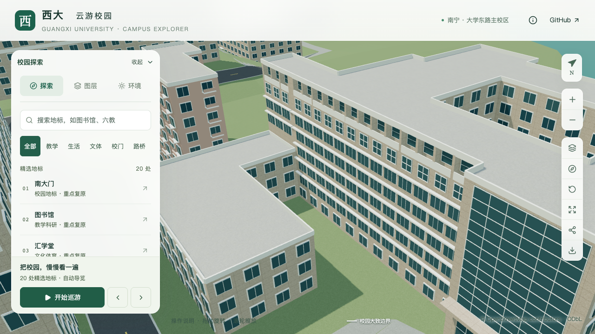

# 土木学院低附楼上方的西端高墙

2026-09-20，接续[顶层凹窗槽](CIVIL_TOP_RECESS.md)，补充主楼南立面西端、低附楼屋顶上方约10.80米的高墙。原主楼与附楼分段、占地、入口及原外边上的立面规则保持；这仍是局部工作，不计整栋完成。

## 依据与采用范围

[学院官网完整正面照片](https://tmjz.gxu.edu.cn/__local/A/7E/69/4A06C7C98FB4DD485911A8F3606_2806A0A4_AFCA6.jpg)显示主楼窗排延续到低附楼后上方。采用原主楼与附楼的共享边界，未根据照片透视移动地面轮廓。来源文件哈希及具体参数见[本批证据](model-checks/refinement/s2-civil-step-evidence.json)。

| 部位 | 本批表达 | 依据边界 |
| --- | --- | --- |
| 内部高差墙 | 主楼分段本地外环第12边，长约10.80米 | 分段源自此前照片约束估算，不是测绘分界 |
| 中部窗带 | 零起始第4、5层各三组窗，连续水平挑檐 | 只延续完全露出的两排；更低的局部露窗待附楼屋顶核对 |
| 第七层 | 三组窄窗，标高及分格与已校准墙段相同 | 深度仍为贴墙近似 |
| 第八层 | 三开间、四道隔板、0.95米凹槽、后退玻璃和窗下墙 | 数量、尺寸及0.40米端墙均为估算，不认定为可通行外廊 |

低附楼仍采用10.8米高、0.8米通用女儿墙；新增显式构件必须位于11.6米以上。没有把窗玻璃画入低屋面，也没有以裁切掩盖尚未确认的下排窗。

## 生成与约束

新增逐字段归因的 `exposedFacadeRules`，锚定命名体块的本地边，并明确相邻低体块。它不改变原 `facadeRules` 的OSM外边含义。解析器要求整条锚边在两体块间完整共边、位于原占地内部，且两者均为实体平屋顶、具有明确高差；重复、外边、错误体块或部分共边均被拒绝。

窗带、玻璃面板及凹槽复用已有立面校验，并额外检查低屋顶与女儿墙净空、凹槽与其他立面凹槽的平面冲突。当前只支持等层高以及上述三类构件，未开放任意附加几何。普通窗仍按最低可见标高过滤。

## 后续

仍需继续核对第七层退进、西端较低局部露窗、侧后立面、东端塔冠、附楼高低屋面与两段台阶，以及完整道路连接。完成当前学院楼后，按用户顺序推进实验大厅，再核对并开发“新结构大楼”；两处目标身份与地图对象的对应仍须落实。

## 验证记录

[西端专项](model-checks/refinement/s2-civil-step-geometry.json)对源文件、基础GLB、近景GLB各检查63处，包括两排玻璃与挑檐、第七层玻璃和窗框、顶层凹槽前方净空、后墙、四道隔板两侧、底板、顶板、原屋面及屋顶上方保留实体墙。[旧空白模型反例](model-checks/refinement/s2-civil-step-negative-geometry.json)如预期失败。

首次专项探针从西端外侧发射，先命中建筑西外墙；改为从0.4米端墙内部发射后通过，未修改资产或放宽深度误差。原附楼回归的19米与24米探针则分别命中新加玻璃和窗下墙，因此新增 `--decorated-step` 选项，以12米、16.5米及22.8米保留实体带测量原墙面。默认选项仍支持历史空白墙检查，新增细节由西端专项另测。两份首次失败报告均保留。

原顶层凹窗各146处、原下部窗带与第七层各219处、附楼体量各58处、东南入口各143处回归通过。189项Python测试、56项Node测试、类型检查、lint及完整模型/Pages构建通过；新增解析测试涵盖错误锚点、缺少体块、重复边界、部分共边、屋顶以下构件、越界凹槽和与原外墙凹槽相交。

| 同机位对照 | 修改前 | 修改后 |
| --- | --- | --- |
| 低附楼上方西端高墙 |  |  |

七张楼栋画面已直接核看，包括前后近景与总览、植被开启、夜景和手机尺寸。手机为桌面视口模拟；附楼屋顶与台阶尚未接受为完成。

[资产比对](model-checks/refinement/s2-civil-step-assets.json)确认仅 `base.glb` 和 `chunk-n2-n3.glb` 改变，其他67个GLB与90个基础节点保持，69个生产模型及数据一致。首屏模型为5,172,812字节，较本批前增加2,436字节；最大普通近景仍为1,684,868字节。430栋普通建筑及3,063株树的实际几何检查通过。[源对象检查](model-checks/refinement/s2-civil-step-source-preservation.json)确认只改变土木学院，其他530个非树对象与全部树实例保持。

[本批联合验收](model-checks/refinement/s2-civil-step-summary.json)通过。原同系统S0与当前使用相同浏览器及环境，完成三次LOD往返、两档各三轮30秒环绕，浏览器无错误。精细档60/56/51 FPS，中位数56，相对原基线下降6.67%；流畅档30/30/30 FPS。三角形分别增加3.80%/8.45%，绘制调用增加2.38%/11.03%，均在原预算内，未调整阈值。24次CPU快照在计时窗口未捕获高占用Python/Blender进程；10秒间隔及2% CPU纳入阈值不证明完全没有后台活动。图书馆手机尺寸回归画面已核看。

本批仍为21条部分对象记录、零新增整栋验收，完整目标范围保持。
