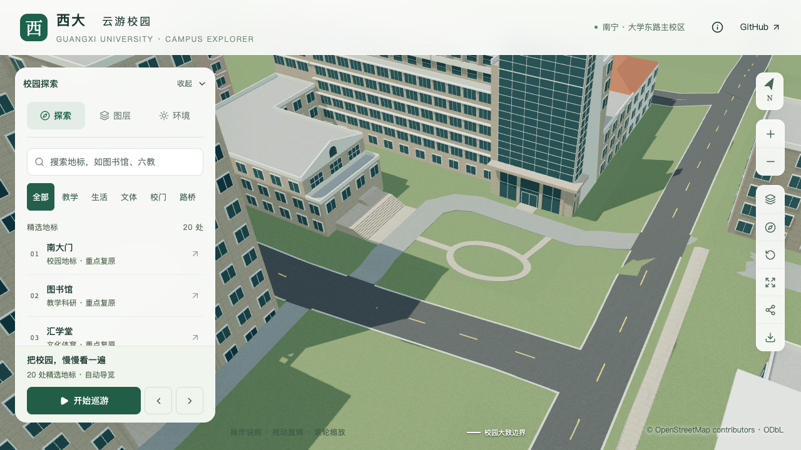

# 土木学院前庭草坪环路

2026-09-21，接续主门与附楼台阶的两处短连接，补充前庭草坪环路及通向门前、附楼一侧的两条支路。本批处理整体前庭中可辨的园路关系；学院楼连接段、附楼后方屋面和最终整栋验收继续按[收尾清单](CIVIL_WING_WRAP.md#整栋收尾清单)推进。

## 依据与估算

[学院官网宽幅](https://tmjz-en.gxu.edu.cn/images/banner_six.jpg)及[完整正面图](https://tmjz.gxu.edu.cn/__local/A/7E/69/4A06C7C98FB4DD485911A8F3606_2806A0A4_AFCA6.jpg)可见草坪中央的环路、附楼一侧的支路和门前通行空间。两图拍摄日期未知，仅用于本机核对；模型不分发照片，也没有据照片补造标识牌、石雕或未定位的设施。

以既有`way/842784664`服务路的西侧纵向路段和北侧横向路段作为两个接点。道路平面轮廓保持，环路位于其东南侧草地空隙；两条支路通过原道路分别联系附楼台阶和学院主门。

| 项目 | 本批采用值 | 口径 |
| --- | --- | --- |
| 中心线 | 校园局部坐标中心`(-484, -856.5)`，椭圆半径7米、4.5米 | 照片与地图约束下的布局估算，不是测绘坐标 |
| 路宽 | 1.2米 | 展示估算，环内保留草坪 |
| 核心铺地 | 约60.468平方米，含环路及两条支路 | 配置解析得到的模型面积 |
| 接路 | 两处全宽接缝，合计约2.414米 | 沿现有路边裁切，并避开道路两端的高度过渡区 |
| 高程 | 原地形三角面以上0.12米 | 与先前修复的服务路使用同一数值偏移，不代表实测路缘高度 |
| 压缩接缝 | 向原道路下方搭接0.12米，最深埋入0.02米 | 覆盖独立GLB节点量化误差，不改变原道路几何 |

现有树位保持，路径避开树干；不要求树冠完全避开园路。环内和园路外部草地保留，未将整片前庭铺满。完整外围步道、材质色号、标识设施与实际尺寸仍未确认。

## 实现与接缝修正

新增`forecourt-paths`场地类型，用有界椭圆环及显式支路线表达布局。准备阶段核验来源、楼栋与道路指纹、道路贴地偏移、接点宽度、建筑净距和草坪留空；旧道路过渡区不能作为同高接点。沿用现有庭院铺地生成器，铺面按真实地形三角面分割，侧边封口，原地形不重新整平。

园路与同材质的`civil-main-front-connection`合批，保留独立场地配置和源文件顶点组，不新增渲染节点或材质。原门前连接几何保留，园路作为新部分追加；这样控制绘制调用，也便于分别核对。

第一版源模型通过接缝检查，但压缩GLB在西接口出现微小空隙，[失败记录](model-checks/refinement/s2-civil-garden-no-overlap-geometry.json)保留。随后增加位于原道路下方的浅埋搭接；不放宽原接缝检查，也不修改全校道路压缩精度。

首次搭接使用整个路径的缓冲边界，三角化省去了接触线上的共线点，使局部搭接从接口即下沉至埋入深度，导出检查捕获约2厘米跳变，[记录保留](model-checks/refinement/s2-civil-garden-ungraded-lip-geometry.json)。最终改为沿接触线生成短条，保留零埋深边，另增加接口内4厘米处的渐变检查。

## 验收状态

228项Python测试、56项Node测试、类型检查、lint及Pages构建通过。[实际模型专项](model-checks/refinement/s2-civil-garden-geometry.json)在源文件与基础GLB各检查214个铺面点、2,117个未铺面点、6个固定环路/支路点及4个固定草坪/树干位置；两处接缝各9条剖面，每个模型共450个接缝采样点。最终GLB最大相邻高度变化约0.29毫米，铺面相对压缩地形的高度差为0.1157–0.1224米，满足原检查容差。[旧资产反例](model-checks/refinement/s2-civil-garden-negative-geometry.json)能检出缺失园路。

[源文件比较](model-checks/refinement/s2-civil-garden-source-preservation.json)确认仅原主门铺地对象追加园路；原门前部分的顶点、面、材质和UV逐项保持，另532个非树对象及3,063株树保持。[数据比较](model-checks/refinement/s2-civil-garden-data.json)确认448栋建筑、10处既有场地、道路、原地形和树位数据保持，园路至最近树干约0.955米；环内草坪约78.008平方米。铺地、岸线、低植被文件仅更新依赖指纹，没有改变对应布局。

[资产核验](model-checks/refinement/s2-civil-garden-assets.json)确认69个GLB仅基础模型变化，另外68个模型与93个基础模型节点保持；唯一变化节点为合批后的主门铺地，原有材质仍复用。首屏模型5,386,884字节，增加11,928字节；最大普通近景块1,684,868字节，均在原体积预算内。生产包与全部资产、数据一致。

已直接核看九张前后、俯视、树木开启、日夜和手机尺寸截图，以及图书馆手机尺寸回归图。树冠遮挡环路的一部分，树干不占用园路；手机图是桌面浏览器尺寸模拟。原主门、附楼台阶连接及树木碰撞回归通过。

同条件三轮持续活动测量，精细档为60／60／60 FPS，流畅档为27／28／27 FPS。相对同系统S0，三角形中位数分别增加4.38%、10.69%，绘制调用分别增加2.56%、14.83%；流畅档帧率中位数下降10%，恰到现有门槛。数值通过原预算，但后续细化仍需控制开销；不能将一次通过理解为留有充足余量。

24次CPU快照在计时窗口内未捕获超过记录阈值的Python或Blender活动；十秒采样及2%CPU阈值不证明完全没有后台活动。三次LOD往返、浏览器无错误检查与文件指纹核验完成，详见[联合验收](model-checks/refinement/s2-civil-garden-summary.json)。本批通过局部验收，仍为21条部分对象记录、零栋新增整栋验收。继续学院楼收尾，再按用户顺序推进实验大厅、新结构大楼。

| 修改前 | 修改后 |
| --- | --- |
|  |  |
