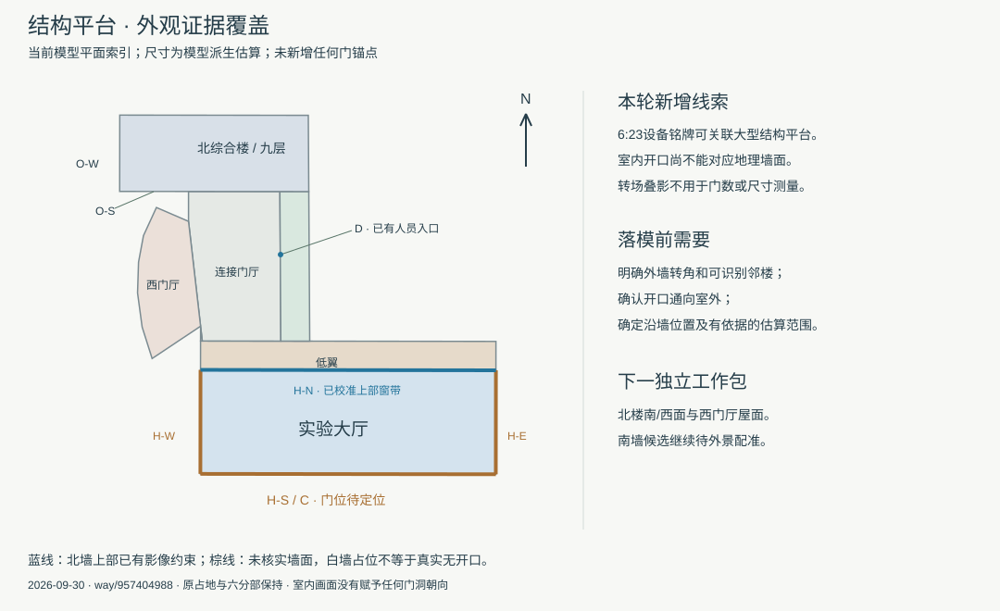

# 土木实验大厅：视频补充核对与墙面索引

2026-09-30，接续[运输口取证](CIVIL_PLATFORM_DELIVERY_ENTRY.md)。本批扩大核看2021年校园参观视频的末段，取得设备铭牌、屋架和室内开口的补充线索；**仍未把宽开口唯一定位到外墙，不修改生产门位或增加模型完成数**。

## 视频里实际核看了什么

来源为学院[2021年优秀大学生夏令营校园参观报道](https://tmjz.gxu.edu.cn/info/1452/5053.htm)，页面内[视频](https://tmjz.gxu.edu.cn/__local/2/B7/5D/B046C8E3829FF8A1793D4F6CFA2_7813618E_317EC7DB.mp4?e=.mp4)长393.683秒。报道发表于2021年7月13日，记述7月9日活动；发布日期不能逐帧证明拍摄日期。

下表时间为播放器显示值，精度约1秒；只代表离散画面核看，未完整观看视频或证明镜头连续性。

| 时间 | 可见内容 | 可采用的判断与限制 |
| --- | --- | --- |
| 2:19 | 历史展陈与留声机 | 无目标楼外墙定位信息 |
| 5:00 | 灰色双扇大门及门中小门，墙面较旧，门外有绿化 | 可见这一镜头的开口通向室外；尚不能唯一对应2022年编号1旧大厅或现有平台 |
| 5:14、5:21、5:46 | 绿色加载架、屋架、长窗和厅内设备；5:14含转场叠影 | 与末段大空间在外观上有差异，不据剪辑顺序命名为旧大厅，不转移其门型到新大厅 |
| 5:58 | MTS加载系统展板、反力墙、绿色设备；字幕提及参观新结构大厅 | 支持追踪末段大厅；展板不能提供地理方位或建筑尺寸 |
| 6:00、6:02 | 大厅纵向内景与控制室等画面的叠化，右侧可见宽开口轮廓 | 转场混合多帧；不能在这些画面上量取门宽、计数独立门洞或推断连续路线 |
| 6:05、6:12 | 带规则孔阵的反力墙、绿色设备；后者可见黄色吊车梁及窗带 | 可与2022/2023年内景作设备形态比对，但设备相似不等于外墙配准 |
| 6:18 | 钢屋架、屋面底部、侧面窗带及蓝色吊车梁 | 补充高空间大厅形态线索，不能直接转换为米制跨度、净高或外屋面坡度 |
| 6:23 | 蓝色试验架，铭牌明确标注大型结构试验研究平台及12000kN试验系统 | 为末段设备所在平台提供直接名称线索；仍缺少外墙转角、邻楼和北向参照 |

快进后曾出现播放器时间已更新、画面尚未解码的情况。约3:20、4:18、5:18、6:12的一组即时截图显示相同旧展陈画面，整组不作证据；表中6:12来自之后单独等待解码并核看的画面。未用失效截图断言任何时段没有大厅内容，未下载或重新发布整段视频。

## 当前模型的墙面索引

图形来自当前六分部模型，北向及长度是模型坐标派生值，不是新增实测。坐标见[机器记录](model-checks/refinement/s2-platform-hall-video-review.json)。

| 索引 | 当前模型位置 | 已有资料与下一项缺口 |
| --- | --- | --- |
| H-N | 大厅与低翼共边，长约61.35米 | 上部双排高窗已校准；底部贴邻低翼。室内宽开口可能通向相邻空间，不能仅凭开口亮度判为室外运输门 |
| H-S / C | 原轮廓边1，长约61.36米 | 南墙运输口只是既有候选。需外景或平面同时约束墙段、门位及室外道路 |
| H-E | 原轮廓边0，长约21.60米 | 当前白墙为占位；没有证明真实无门窗 |
| H-W | 原轮廓边2，长约21.61米 | 当前白墙为占位；需独立西侧外观资料 |
| O-S / O-W | 北综合楼南/西面 | 普通窗仍为示意；视频末段室内画面不能校准这两面 |

2014年设计说明中的南侧构件流线可帮助筛选候选，不能替代建成门位。新增内景没有消除“通向室外还是附属房间”的歧义，也没有证明2022和2023年照片里的开口为同一个或两个门。

## 已复查来源及接续方式

- [2025年冈比亚研修班访问](https://tmjz.gxu.edu.cn/info/1016/7805.htm)：合影已在此前柱廊批次使用，本次属于重复核对，不计新增证据；画面集中在D区入口，不能用于大厅运输门或北楼背面。
- [2024年夏令营开营](https://tmjz.gxu.edu.cn/info/1452/7289.htm)：正文说明在平台第六报告厅开营，末尾合影仍集中在柱廊入口。人物遮挡门区，无大厅外墙与邻楼关系，不据此新增建筑参数。
- 2022/2023年大厅照片继续沿用原始[证据记录](model-checks/refinement/s2-platform-wide-entry-evidence.json)，本批没有把缩放显示当作更高分辨率证据。

本次定向核对到此登记。运输口进入“待外景配准”，下一独立工作包是北楼南/西面及西门厅屋面；无需再从同一视频的前段或同一合影重新开始。若用户明确指的是新建综合实验中心，则先独立核对它的轮廓和施工时点，不修改现有九层楼的层数。

本批交付为证据索引、墙面图及整理后的执行计划。生产数据、69个GLB和Blender源文件未修改，未重建或重测性能；累计22个对象、2栋首轮通过、20个部分校准，S3六栋整栋完成数仍为0。开发、提交与推送仅在dev。
