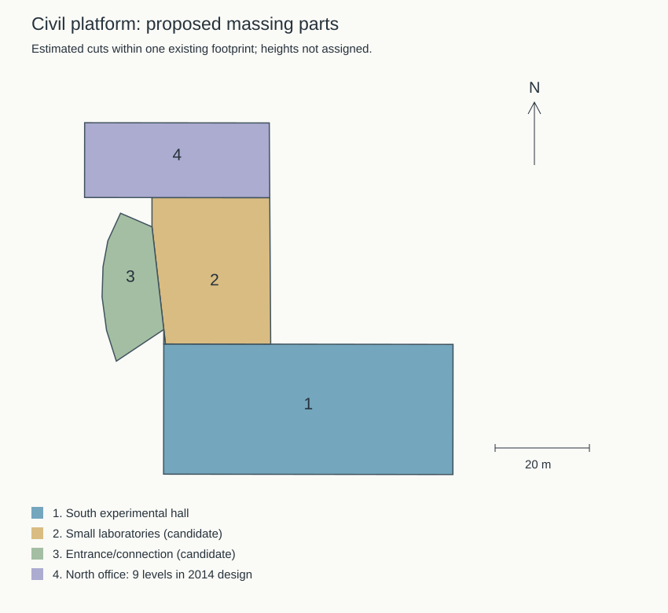

# 实验大厅与新结构平台：对象识别及体量分区

2026-09-21，接续学院楼首轮验收。本轮取得此前未能下载的2022年拆除范围航拍和逐栋清单，**确认旧结构实验大厅与新平台蓝顶大厅是不同建筑**；据此为现有平台 `way/957404988` 提出保留原轮廓的分区。本轮未修改生产模型，不增加整栋校准计数。

后续实施已完成[四分部首批体量](CIVIL_PLATFORM_MASSING.md)。以下保留取证阶段的候选与待办记录；正式采用高度和本批验收范围以实施专项为准。

## 名称与位置

[学校2022年1月12日拆除采购公告](https://www.gxu.edu.cn/info/1364/30576.htm)所附[范围航拍](https://www.gxu.edu.cn/system/_content/download.jsp?urltype=news.DownloadAttachUrl&owner=1556120285&wbfileid=3792656)和[建筑物汇总](https://www.gxu.edu.cn/system/_content/download.jsp?urltype=news.DownloadAttachUrl&owner=1556120285&wbfileid=3792657)现已取得。航拍图完整核看，并放大核看编号1和新平台；清单只读提取了唯一工作表 `Sheet1 (2)` 的全部13行。

| 对象 | 新证据 | 对当前项目的判断 |
| --- | --- | --- |
| 旧结构实验大厅 | 清单第3行，编号1，名称“结构实验大厅”，1984年建成，框架，建筑面积2534平方米；航拍编号1覆盖长条浅色大屋面及北侧绿色低屋面 | 已确认对应拆除采购中的具体历史建筑。位于学院楼西北、新平台大厅东侧。与现有新平台复合轮廓分开，不能用新平台ID代替 |
| 新平台实验大厅 | 航拍编号1西侧另有蓝色大屋面、高空间厅体及浅色竖向窗列，不在编号1标注上；学校2014年资料将南楼说明为实验大厅和小型实验室 | 对应现有 `way/957404988` 南侧宽矩形及相邻低体量。原统一五层无法表达大厅与北楼高差，需分部校准 |
| 新结构平台综合楼 | 航拍可见蓝顶大厅北侧独立高楼和低连接体；[2014年校报](https://news.gxu.edu.cn/__local/8/C4/4D/0B1CE8B9D4B8389F21FF34B7030_FF27C11E_793A3.pdf?e=.pdf)明确北楼为九层内廊板式楼 | 采用同一复合对象的北部高楼分区，不能把九层套给大厅，也不把大厅和北楼重复计为两栋完整校准 |

清单中另有编号2“水工大棚”、编号3“水科所”、编号5“水工大厅”等，均不能与编号1混称。十栋清单的建筑面积合计18170.9平方米，与公告总数一致；**2534平方米是建筑面积，不是可直接挤出的占地面积**。清单没有提供层数和米制楼高。

[2022年学院安全检查报道](https://tmjz.gxu.edu.cn/info/1452/5281.htm)分别列出新结构大厅、旧结构大厅与结构平台综合楼；[2021年参观报道](https://tmjz.gxu.edu.cn/info/1452/5053.htm)也区分新平台与旧大厅。上述命名差别与新取得的航拍相容。用户“实验大厅”的具体指代仍未收到进一步说明；按现有模型优先推进新平台大厅，旧大厅保留为历史对象核对项。

## 时间与证据边界

范围图3231×2484像素，EXIF自报拍摄和数字化时间均为2020-04-23 17:35:41，软件字段为 `www.meitu.com`。它是2022年公告所附的标注图，元数据不是独立验证的拍摄日期。原图只留本机研究目录，不作为公开纹理或重新发布的底图。

2022年附件证明的是采购范围，不证明具体拆除完成日期。[2025年第1期后勤简报](https://ghjjc.gxu.edu.cn/info/1011/3543.htm)记载土木工程综合实验中心基础清障完成、结构实验大楼管线迁改及临时出入口施工，配图可见工地与边缘实验建筑；本轮直接核看其中“工程桩施工”照片。该低分辨率视角尚不足以逐栋配准旧大厅，不能单凭“基础清障”把旧大厅标成已核实拆除。

2014年校报描述的是设计与在建阶段：南实验区、北九层办公区及门厅三个功能区，北面人员入口、南面构件出入口。航拍可交叉确认高低关系，但不能直接量取高度。2024年临时水电图的3F标签仍须与具体低分部解释对应，高空间大厅不能简单填满三层普通楼板。现阶段不把设计入口位置直接宣称为现状门洞锚点。

## 保留原轮廓的四块候选

从现有OSM复合轮廓的转折点推导三条分界线，将南部宽厅体、中间低实验区、西侧弧形门厅和北部板式楼分开。这里把三个功能区细分成四个几何块，便于分别定高；功能归属和精确接缝仍属估算。

| 候选分部 | 保留轮廓内面积约值 | 当前可用参数 | 落模前还需明确 |
| --- | --- | --- | --- |
| 南实验大厅 `south-hall` | 1693.454平方米 | 蓝色大屋面与高空间厅体有历史航拍支持 | 主体高度、屋面坡度与女儿墙；开口层带不等于室内满铺楼层 |
| 中间低实验区 `middle-labs` | 743.476平方米 | 低于北楼，位于大厅和北楼之间 | 低翼准确高度、立面开间、与大厅的分界 |
| 西侧门厅 `west-foyer` | 297.276平方米 | 原轮廓具有弧形凸部，资料说明存在连接门厅 | 层高、屋顶和入口门洞位置；用途对应暂为候选 |
| 北综合楼 `north-office` | 621.402平方米 | 2014年资料明确九层；航拍支持北部高体量 | 米制楼高仍需估算或依据，屋顶突出物另行核对 |

三条分界分别来自原外环点对 `[0,15]`、`[11,12]`、`[3,10]` 的延长线。西侧弧形门厅向南超出厅体北墙，分割产生的约12.104平方米凸角保留在门厅，未裁掉或错误并入大厅。落模阶段清理共线回折后，候选四块合并与原轮廓的对称差约1.34×10⁻¹²平方米，彼此重叠面积为零，实际分界未移动。

[复现脚本](../scripts/inspect_civil_platform_parts.py)和[完整候选坐标](model-checks/refinement/s2-civil-platform-parts-proposal.json)只输出诊断文件，`productionReady` 为 `false`，全部米制高度暂为 `null`。平面覆盖检查只证明划分未增减占地，不证明实景分界、楼高、入口或模型已完成。

## 下一步实施

1. 优先落地新平台南大厅与低翼的高度、蓝色屋面及大开口，明确高空间与局部楼层的区别；门厅与北楼沿同一复合轮廓处理。
2. 接续北综合楼九层高体量、屋顶和主要立面，再核对北侧人员入口及南侧构件入口与道路连接。保留稳定ID，不增加重复建筑。
3. 源文件、基础与近景须一起更新；检查四块覆盖、两级轮廓、树木及道路关系，并沿用原性能预算。未取得或无法确认的具体尺寸明确标估算。
4. 若用户指定历史旧大厅，先按此次编号1继续校准历史占地及屋面，不把旧大厅采购清单套到现用新平台，也不以现有搜索框代替建筑轮廓。

文件哈希、清单单元格、当前生产资产指纹和实际核看范围保存于[本轮证据记录](model-checks/refinement/s2-civil-labs-identification.json)。开发、提交与推送仍仅在 `dev`，主分支保持。
