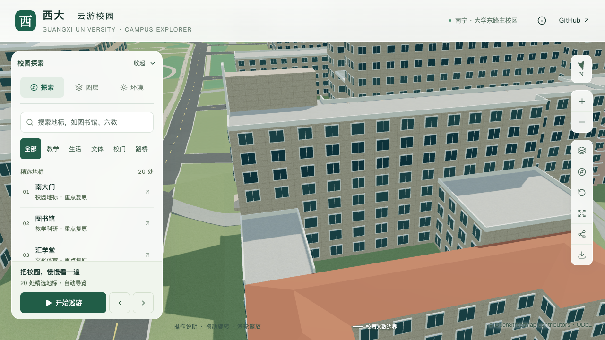
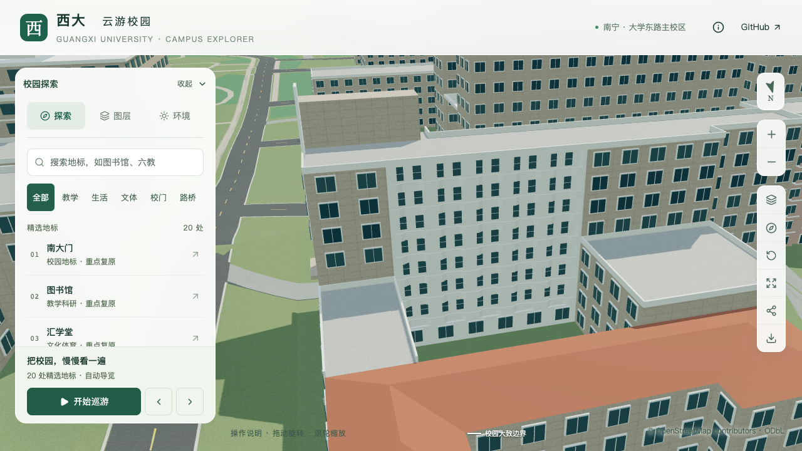

# 土木学院主楼北向内院外廊

2026-09-21，在北翼及低连接段体量校准后，补入主楼朝内院的七层退进外廊。原内院南边为该立面锚点，楼板与白色实栏沿重复折线向楼内收进；北翼屋面、两侧连接楼和南立面保留。本批仍属局部校准，不计整栋完成。

## 影像依据与采用参数

[已定位的北侧航拍](CIVIL_REAR_MASSING_EVIDENCE.md)可见主楼上部七层连续凹入的外廊、重复折线白栏板及后墙深色开口。来源为[GX720广西大学全景](https://www.gx720.net/pano/viewer/?slug=pano-658)，拍摄日期未知；照片仅留本机参考，不作为模型纹理或公开素材。

该外廊定位至原内环第3边，西端 `[-512.12092773,-824.246676]`、东端 `[-486.166600955,-824.280072]`，长度约25.95米。只修改 `south-main` 上这一条内院立面，廊深及折线均向楼内，未把楼板伸入内院，也未修改原地面轮廓。

| 内容 | 采用值 | 口径 |
| --- | --- | --- |
| 楼层 | 第2至第8层，层高3.3米 | 七层外廊有影像支持；层高沿用估算 |
| 廊深与端墙 | 1.6米、两端各0.4米 | 照片约束估算 |
| 实栏 | 高0.95米、局部厚0.14米 | 外形估算，不作结构设计 |
| 折线 | 五组，向内收0.38米 | 组数与幅度为影像分辨率约束下的简化估算 |
| 楼板 | 厚0.18米，沿栏板折线 | 保留直线屋顶，最下方补底层墙顶封口 |
| 后墙开口 | 每组两处，宽1.1/0.9米、高1.85米、窗台0.8米 | 以浅玻璃表达深色开口；未声称精确门窗数量或通行门 |

照片中两端楼梯间的圆窗及竖向体量尚未在本批实现，不能把中间外廊覆盖范围扩展为整个北立面已完成。北翼三层外廊与本次八层主楼内院外廊分别处理。

## 数据及模型处理

`openCorridor` 允许内院边界，但仍检查整个退进区域落在所属分部内，并拒绝与其他凹廊相交或穿出建筑。朝向由环方向和内外环身份决定；新增测试同时覆盖正反内环方向。

可选 `frontProfile` 为沿端墙之间区间的比例及内退深度对，最多64个点，严格沿立面前进，两端与原端墙对齐。禁止向外突出、过深折线、过短区间和非有限数值；折线后必须保留至少0.6米到后墙的距离。当前只支持保留底层、完整上部楼层与实栏的形式，不与显式立柱或镂空栏杆混用。

两个LOD共用折线楼板、实栏、后墙和开口。最下方折线凹口处增加墙顶封口，避免留下未封闭表面；屋顶最后一块板保持直线，并保留原屋面。未配置折线的既有外廊继续原生成路径。

## 验收记录

[固定坐标专项](model-checks/refinement/s2-civil-north-gallery-geometry.json)核对七层五组栏板的直段与斜段、楼板上下表面、旧墙净空、后退玻璃和窗框、后墙、最下方封口、上部凹口、直线屋顶与内院留空。[旧模型反例](model-checks/refinement/s2-civil-north-gallery-negative-geometry.json)使用上一提交资产，确认旧贴墙窗不能通过外廊检查。

独立生成测试进行520项检查，覆盖两个LOD、两种内环方向和旋转立面，包含凹口封口与屋顶上下表面。数据解析测试覆盖向外突出的折线、深度越界、倒序或过短线段、无效端点、非法数值及穿出主体的退进范围。

217项Python测试、56项Node测试、类型检查、lint、完整模型及Pages构建通过。源文件、基础和近景模型各通过900条专项记录；北翼屋面、南面退进、幕墙、斜墙、附楼、台阶、门厅、道路关系及树木净空回归通过。

基础模型经Draco压缩后，6厘米窗框的法线出现量化偏差，窗框法线点积门槛为0.98，实测最小约0.98089；其余面及源文件、近景窗框保持0.99门槛。坐标容差分别为源文件0.006米、基础0.05米、近景0.02米，没有用法线容差替代退进距离、材质或留空检查。

[数据检查](model-checks/refinement/s2-civil-north-gallery-data.json)确认只有一条内院立面规则变化，所有分部、屋顶、入口和其他立面保持。447栋其他建筑和3,063株树保持；[源文件比较](model-checks/refinement/s2-civil-north-gallery-source-preservation.json)确认只有土木学院网格改变。只有基础模型和所在近景区块变化，其他67个GLB及93个基础节点保持，全部69个GLB与生产包一致。首屏模型5,360,892字节，增加29,500字节；最大普通近景1,684,868字节。

16张正向、斜向、前后、日夜、植被开关及手机尺寸截图均已直接核看；宽景中折线较细，低连接楼遮住部分下层外廊，这些部位由几何探针补充验证。手机尺寸为桌面视口模拟，不是真机测试。图书馆手机回归也已核看。

| 内院近景 | 修改前 | 修改后 |
| --- | --- | --- |
| 北向主楼 |  |  |

三次LOD往返和两档各三次30秒环绕通过，浏览器无错误。精细档60/60/60 FPS，流畅档28/28/28 FPS；相对同系统S0，三角形增加4.46%/10.33%，绘制调用增加4.20%/14.83%，帧率变化0%/−6.67%，符合原预算。流畅档302次绘制调用中位数仍接近增幅上限。

24次CPU快照未在计时窗口捕获高占用Python或Blender计算；10秒采样且只纳入CPU至少2%的进程，不证明完全没有后台活动。[联合汇总](model-checks/refinement/s2-civil-north-gallery-summary.json)通过，保存当前资产指纹与验收范围。累计仍为21条部分对象记录、新增整栋验收零栋。

## 接续

继续处理两端楼梯间、北翼外廊与门窗、两侧连接楼细节及西南附楼后方屋面。当前学院楼完成后，按用户顺序推进实验大厅、新结构大楼；大厅身份与历史时点仍按既有证据队列核对。
