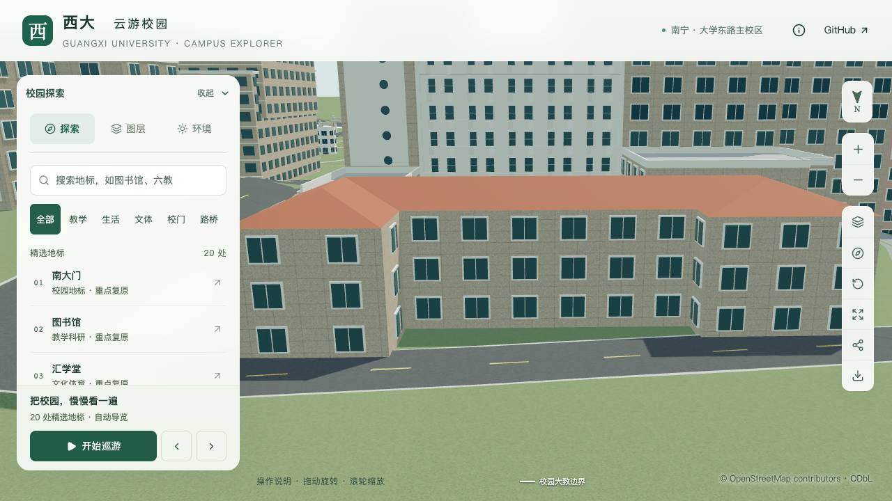
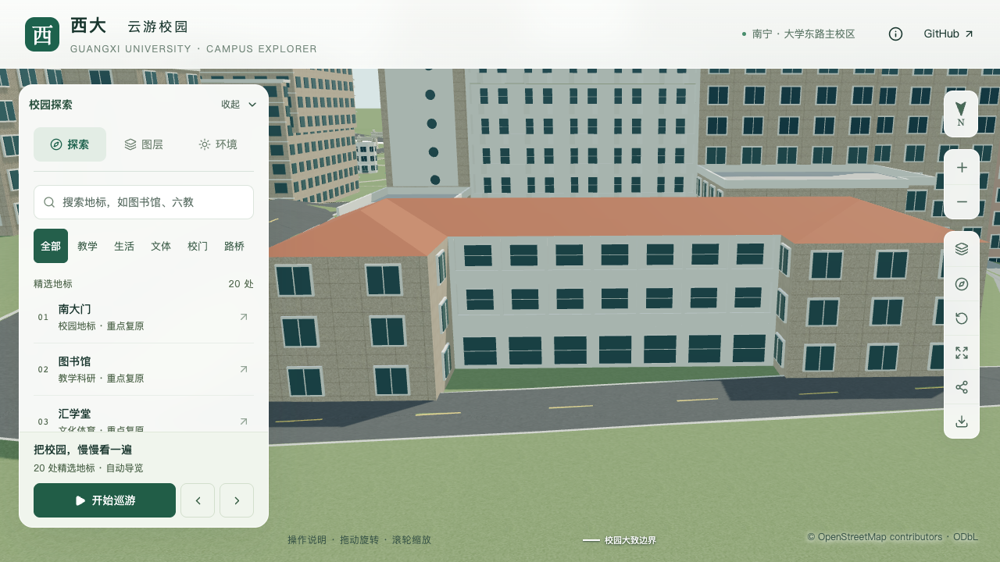
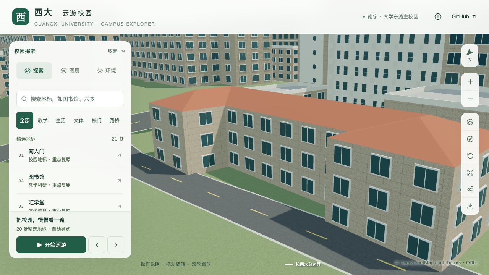
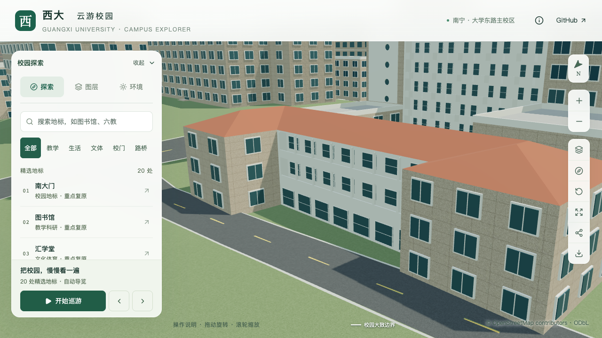

# 土木学院北翼中央立面

2026-09-21，北翼中央立面补入上部两层退进外廊、白色柱列与实栏，以及底层连续玻璃开口。保留此前三层体量和红色连续坡屋顶；本批不代表两端翼楼、连接楼或整栋学院楼完成。

## 依据和参数

[GX720北侧全景](https://www.gx720.net/pano/viewer/?slug=pano-658)的原始切片可辨两层外廊、栏板、竖向支撑及底层玻璃。通过内院和周边已定位建筑确定该段是北翼朝北的中央凹入立面，位于两端前凸翼楼之间，定位说明见[北侧取证](CIVIL_REAR_MASSING_EVIDENCE.md)。拍摄日期未知；参考照片仅本机保留，不作为公开纹理。

原外环第13边从西端 `[-514.439377478,-795.136496]` 到东端 `[-488.577378343,-795.169892]`，约25.86米，属于 `north-rear` 分部。外廊向楼内退进，未向前扩出原轮廓。

| 内容 | 采用值 | 精度边界 |
| --- | --- | --- |
| 北翼体量 | 三层、檐口10.8米、原红色坡屋顶 | 保留前批；层高仍是估算 |
| 外廊 | 第2、3层，廊深1.3米，两端各留0.3米 | 层位及退进形制有照片依据，尺寸估算 |
| 柱列 | 七跨、八根支撑，宽0.28米、深0.3米 | 分格与截面简化估算 |
| 实栏 / 楼板 | 高0.9米 / 厚0.18米 | 估算；共享白色材质 |
| 上层后墙玻璃 | 每跨宽2.2米、高1.75米、窗台1米 | 不声称准确窗表或内部用途 |
| 底层玻璃 | 每跨宽2.65米、高2.4米、窗台0.35米 | 浅窗面表达；没有据此新增通行入口 |

照片栏板局部泛绿不足以确定固定涂装，本次沿用白色。实际开间尺寸、完整窗格、底层门窗用途和连接楼层数仍待更多资料确认。

## 实现和保留范围

使用已有 `openCorridor`、`piers` 和 `openings` 规则，一次替换中央立面上部两层的贴墙通用窗。后墙玻璃位于退进区，底层显式玻璃仍在原外墙面；支撑从首层外廊板底连续到檐口。坡屋顶与廊顶板分开，原坡面控制点、三角网和屋脊保持。

仅一条 `north-rear` 立面规则改变。原占地、内院、两端翼楼、两侧连接段、南主楼及附楼体量、圆窗墙、折线外廊、入口、铺装和树位均保留。

本批同时将 Blender 专用测试改名为 `blender/test_round_window_geometry.py`，避免它与 `scripts/test_round_window_panels.py` 同名。在数据测试修改模块搜索路径后，同名文件会被错误导入并报缺少 `mathutils`；改名后完整220项Python测试通过。此修正不改变模型生成逻辑。

补拍近距离斜向时，截图工具原先硬取第二镜头，导致单镜头列表取景中断；`check-building-context-browser.mjs` 现可用首镜头作为植被开关对照，并拒绝空列表。修正后以单镜头完成前后、植被、夜景和手机尺寸五项实际检查，原三镜头流程保持。

## 验收

[固定坐标专项](model-checks/refinement/s2-civil-north-wing-geometry.json)读取源文件和实际基础/近景模型，核对栏板、后退玻璃、窗框、后墙、旧贴墙窗净空、楼板顶底、柱列、底层玻璃、端墙及原内院。坡面、屋脊、檐口和连接段平顶由[北翼体量回归](model-checks/refinement/s2-civil-north-wing-rear-geometry.json)检查。[旧模型反例](model-checks/refinement/s2-civil-north-wing-negative-geometry.json)在第一处栏板探针命中旧石色实墙而失败。

源文件、基础和近景各通过159条专项记录，位置容差分别为0.006、0.05、0.02米。前向墙面法线点积大于0.99；仅基础模型细窗框允许0.98门槛，以容纳压缩量化，仍严格检查材质和退进位置。此前南立面、主楼圆窗、折线外廊、附楼、门厅、坡屋顶、道路和树木专项均通过。

220项Python测试、56项Node测试、类型检查、lint、完整模型和Pages构建通过；改名后的圆窗生成测试也完成280项检查。[数据对照](model-checks/refinement/s2-civil-north-wing-data.json)确认只改变中央立面规则，447栋其他建筑及全部分部屋顶保持。[源文件比较](model-checks/refinement/s2-civil-north-wing-source-preservation.json)确认只有土木学院网格改变，3,063株树实例保持。

[资产检查](model-checks/refinement/s2-civil-north-wing-assets.json)确认只改变基础模型和所在近景区块，其余67个GLB和93个基础节点保持，69个模型与生产包一致。首屏模型5,374,804字节，增加6,416字节；最大普通近景1,684,868字节。

14张正向、斜向细部、前后、日夜、植被开关及手机尺寸截图已直接核看，图书馆手机回归也正常。近距离可辨柱列与端墙退进，但白色构件在日景宽视角下层次较弱，由几何探针补充确认真实廊深；没有声称照片级材质或光照匹配。手机尺寸为桌面视口模拟。

| 北翼中央 | 修改前 | 修改后 |
| --- | --- | --- |
| 正向 |  |  |
| 近距离斜向 |  |  |

三次LOD往返和两档各三次30秒环绕完成，浏览器无错误。精细档60/60/60 FPS，流畅档28/28/28 FPS；三角形中位数4,203,750 / 1,163,478，绘制调用569 / 302。相对同系统S0，三角形增加4.57% / 10.60%，绘制调用增加4.02% / 14.83%，帧率变化0% / −6.67%，符合原预算。流畅档绘制调用仍接近15%增幅上限，不能据本轮通过声称已有稳定余量。

24次CPU快照在计时窗口未捕获高占用Python或Blender；10秒采样及2%CPU纳入阈值不证明没有任何后台活动。[联合汇总](model-checks/refinement/s2-civil-north-wing-summary.json)通过，保留当前资产指纹及验收范围。累计仍为21条部分对象记录、新增整栋验收零栋。

## 接续

继续核对北翼两端窗列、西端楼梯窄窗、连接楼细节、西南附楼后方屋面及前庭。学院楼完成后，按用户顺序处理实验大厅、新结构大楼，同时保留旧大厅与新平台的身份、年代区分。
