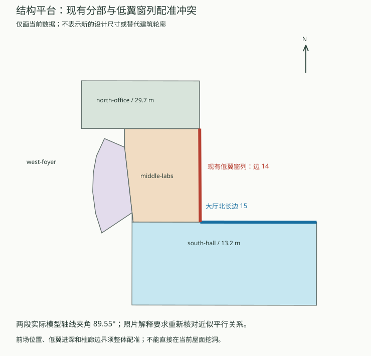

# 结构平台：低翼与门厅配准返工

2026-09-29，重新对照校方设计效果图、建成航拍与生产模型，**撤回“密集窗低翼已定位到原边14东立面”的结论**。已同步修正输入及公开数据中的证据说明。现有几何保留为待纠正占位，本批没有声称完成新体量或整栋验收。

## 发现与依据

此前依据蓝顶大厅、北楼东端及旧大厅的邻接关系，把密集窗低翼分配给 `middle-labs` 的东边。这只能帮助识别复合建筑，不能证明具体墙面对应。遗漏了更直接的相对方向检查。

- [2014年校报基建专版](https://news.gxu.edu.cn/__local/8/C4/4D/0B1CE8B9D4B8389F21FF34B7030_FF27C11E_793A3.pdf?e=.pdf)的“土木工程大型结构研究平台实验室鸟瞰效果图”显示：密集窗低翼沿高大厅长立面前侧展开，柱廊及连接屋面向北办公楼转折。重新读取原PDF中独立嵌入的411×229像素图（xref 17），避免把整页缩图上的邻接关系误当定位。它是设计效果图，只用于相对空间关系；同页“中庭、曲线外廊”的文字属于图书馆，不能引用为平台设计说明。
- [学校2022年拆除公告航拍附件](https://www.gxu.edu.cn/system/_content/download.jsp?urltype=news.DownloadAttachUrl&owner=1556120285&wbfileid=3792656)中，低窗翼的长边与蓝顶大厅北侧长边近似同向，连接门厅另向高楼延伸。它支持检查设计与建成形体的对应，但透视图上的像素不能直接换算成进深、层高或柱距。
- [GX720全景658](https://www.gx720.net/pano/viewer/?slug=pano-658)的 `b/6/7.jpg` 可见密集窗翼和柱廊的转折，不能仅因它们位于北楼东端旁边，就把窗翼认定为南北向东墙。全景拍摄日期仍未知。
- [2024年临时水电施工图公告](https://www.gxu.edu.cn/info/1364/36271.htm)所附PDF第4页只包含平台局部；第39页西侧轮廓被图框裁切。两页不足以恢复完整低翼与门厅边界，本次没有将局部3F/2F标签直接赋给新分部。

## 现有数据的可重复检查



生产数据使用平面 `x=东、y=北`，不能直接当成渲染场景的x/y/z。大厅北侧外露长边为原边15，当前低实验区窗列位于原边14的一段；两者的无向轴线夹角为 **89.554°**。照片解读要求核对的是低翼沿大厅长边展开的关系，现有定位接近垂直。

[诊断脚本](../scripts/inspect_civil_platform_alignment.py)读取实际分部立面端点，输出[方向、来源指纹和核看范围](model-checks/refinement/s2-platform-alignment-review.json)。几何角度由程序计算，照片对应关系由人工解读；没有拟合相机，没有把图像解释包装成自动测绘结果。新轮廓就绪标志和照片配准接受标志均为 `false`。

```sh
python3 scripts/inspect_civil_platform_alignment.py
```

此前413项检查证明源文件、基础和近景生成了一致的指定窗列；它们没有检查该窗列对应现实中的哪面墙。旧模型反例失败也只能证明生成差异，不能挽救错误配准。历史检查保留，真实性结论以本次更正为准。

## 下一批实际返工顺序

1. **整体重新分区。** 联合追踪高大厅北墙、密集窗低翼、柱廊转折和北楼端部，先确定四者的平面关系。当前 `middle-labs`、`west-foyer` 的名称与功能不能继续当作证据，先保留稳定建筑ID。
2. **处理外轮廓与附属体的关系。** 检查低翼是原外环内的分段，还是原轮廓遗漏的附属体。任何补绘需有可复核定位及估算说明；不能只为通过“原轮廓不变”检查而把低翼塞到错误位置，也不能直接画一个未经定位的矩形。
3. **迁移低翼窗列并重做门厅。** 完成体量对应后，才决定保留、迁移或取消现有18列网格。柱廊屋面、柱列、玻璃及入口按同一配准处理，保持南侧构件门与人员门的功能区分。
4. **重新验收。** 更新独立几何预期，检查修改前后多视角及源/基础/近景一致性，再执行道路、植被和原性能预算验收。验收必须包含“是否对应正确墙面”的资料对照。

最初检查时提出过“连续屋面封住中庭”的假设。现有资料更直接支持的是低翼与门厅的分区/方向问题；开敞空间也可能位于原外环之外。因此**本批不把这个假设变成内部孔洞，不在现有屋面直接挖空**。

## 本批交付边界

公开建筑数据、GeoJSON和校准记录已包含撤回说明；只改目标楼的校准元数据，`form`、全部建筑坐标和模型资产保持。完整数据解析（含跨建筑上下文）幂等、Pages构建通过，公开数据与生产包一致，69个模型在两处逐一校验保持。专项核对见[本批数据检查](model-checks/refinement/s2-platform-alignment-data.json)。完整S2–S5目标继续，22个对象仍为1栋首轮整栋通过、21个部分校准。开发、提交与推送仅在 `dev`。
