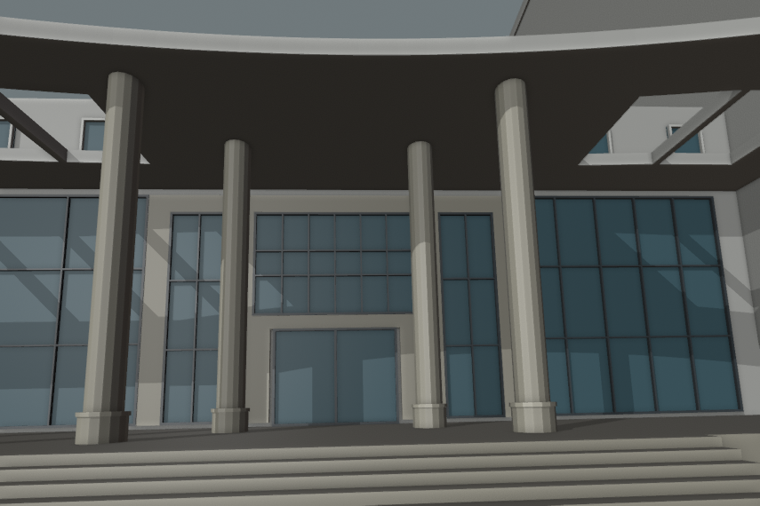

# 结构平台门廊：相机假设与柱距校准

2026-09-30，接续[曲线前缘与进深候选](CIVIL_PLATFORM_CURVED_ENTRY.md)。本批用固定对应点约束相机和柱距，并修订中央玻璃分格。**这是单张照片约束下的估算候选，尚未替换生产模型，也未完成照片配准或整栋验收。**



## 输入与假设

参考已核看的[2023年校方游学报道](https://tmjz.gxu.edu.cn/info/1452/6575.htm)中的855×570完整门廊合影。文章发表于2023年9月7日，活动为8月31日，未另行取得拍摄日期。使用针孔投影，不校正镜头畸变；固定相机高度1.65米、水平主点427.5像素，允许垂直主点偏移以表示未知裁切。玻璃宽4.85米、高3.2米、顶底标高7.45/4.25米和门廊净高8.25米仍是既有估算，不能由本次拟合反证为实测。

坐标原点为入口外缘，x向画面右、y向建筑内、z向上。手工对应点如下，均为像素坐标：

| 对应点 | x | y |
| --- | ---: | ---: |
| 中央玻璃左上 | 284 | 239 |
| 中央玻璃右上 | 459 | 240 |
| 中央玻璃右下 | 461 | 357 |
| 中央玻璃左下 | 280 | 357 |
| 前列左柱与顶接触处 | 150 | 96 |
| 前列右柱与顶接触处 | 580 | 97 |
| 后列左柱与顶接触处 | 269 | 166 |
| 后列右柱与顶接触处 | 473 | 166 |

另取前缘底线在x=80、427、760处的y=47、64、44三个竖向约束。玻璃角点考虑了边框的可见斜率，不再以正矩形代替四角；遮挡、边框厚度与人工取点仍带来误差。

求解器使用NumPy实现有界阻尼最小二乘，分别从5、9、16、30米相机距离启动，每次最多180轮。焦距范围250–1800像素、相机外距3–50米、横移±5米；偏航±0.4、俯仰−0.1至0.55、滚转±0.1弧度；垂直主点100–700像素。前柱半跨3–6米、后柱半跨2.2–3.5米、后柱退距2–5.3米、前柱距曲线0.4–1.5米。完整参数及每个起点结果见[拟合报告](model-checks/refinement/s2-platform-camera-fit.json)，不宣称全局最优解。

## 结果与模型变化

| 方案 | 八点二维RMS/像素 | 前缘竖向RMS/像素 |
| --- | ---: | ---: |
| 固定上一版柱距，仅拟合相机 | 24.924 | 17.737 |
| 相机与四项柱距联合拟合 | 5.552 | 2.533 |
| 柱距取整后的当前候选，重新拟合相机 | 5.653 | 2.321 |

固定柱距方案的俯仰、滚转达到约束边界；误差比较只对上述模型和边界成立。联合拟合与取整候选未触及边界。取整后的候选采用：前列主柱中心±4.0米，后列中心±2.35米、距原外缘3.8米；前柱中心随曲线退入1.0米。其余四根前柱沿边位置保留，总数仍为八柱假设。屋面边框宽由1.15增至1.55米，以覆盖后退后的完整柱顶；保留中央五个实档、两侧七个孔洞、约6米进深及原总占地。

当前拟合相机的焦距478.267像素、外距6.474米、横移0.677米、垂直主点385.666像素；偏航/俯仰/滚转为0.050183/0.141937/−0.021743弧度。它是用于同条件对照的相机假设，不是恢复的真实拍摄机位。

将假设机位高度改为1.4或1.9米，以及进行三次固定随机种子的±2像素取点扰动，联合拟合得到前半跨约3.908–3.998米、后半跨2.311–2.352米、后退3.726–3.809米、前柱距曲线0.944–1.040米。这些有限试验支持当前取整范围，**不是统计置信区间**。先前把玻璃四角近似为矩形时，柱距仍接近当前解，但相机俯仰和裁切偏移变化明显；旧取点结果已写入报告，说明相机解仍有歧义。

中央上部玻璃从四列改为六列，三行采用净玻璃高度的0.375、0.625分界，上下行较高、中行较矮。灰度边界辅助核看支持照片中五条内竖框约在x=313、342、371、400、429，两条横框约在y=284、313。十个交点没有参与相机求解，其投影RMS为6.426像素；由于六列与行比例本身来自同一照片，不能将其称为独立几何真值检验。

## 实际渲染与回归

`render_civil_entry_proposal.py --camera-report`将同一相机用于前后候选，并用Blender自身的投影函数复核四角。两方案共八项的最大差为0.002133像素，低于0.05像素阈值；这证明求解器与渲染相机对应，不能证明建筑已与照片完全对应。见[投影核对](screenshots/refinement/s2-platform-camera/camera-projection.json)。

| 视角 | 上一候选 | 当前候选 |
| --- | --- | --- |
| 拟合透视 | [原柱距](screenshots/refinement/s2-platform-camera/original-photo.png) | [新柱距](screenshots/refinement/s2-platform-camera/candidate-photo.png) |
| 正面 | [原柱距](screenshots/refinement/s2-platform-camera/original-entry.png) | [新柱距](screenshots/refinement/s2-platform-camera/candidate-entry.png) |
| 斜视 | [原柱距](screenshots/refinement/s2-platform-camera/original-oblique.png) | [新柱距](screenshots/refinement/s2-platform-camera/candidate-oblique.png) |
| 顶视 | [原柱距](screenshots/refinement/s2-platform-camera/original-roof.png) | [新柱距](screenshots/refinement/s2-platform-camera/candidate-roof.png) |

八张图均已核看。当前视角中前后主柱与中央窗的关系改善，原先额外侧柱不再挤入中央构图，未通过删除其余四柱获得这一效果。前缘仍为素白，圆柱帽及侧格栅细分尚未完成。

272项Python测试通过；基础与近景两档184条[几何检查](model-checks/refinement/s2-platform-camera-geometry.json)通过，包括新增主柱、五条内竖框和两条非均匀横框检查，保留曲线、屋面孔洞、八柱顶圈、通路、围合与十扇上窗探测。上一曲线候选可精确复现且166条网格回归通过；通用立面面板在0°、90°、31.14°两档旋转检查通过。

448栋完整解析结果保持；69个GLB在public/out的字节数与哈希符合原清单。正式覆盖表、数据及校园源文件未改。本轮候选的六分部轮廓、总占地、入口和台阶参数均保持上一候选；未导出校园GLB、重建Pages或测FPS。输入指纹和保留范围见[汇总](model-checks/refinement/s2-platform-camera-summary.json)。

## 复现与接续

```sh
mkdir -p work/refinement-s2-platform-camera
work/refinement-venv/bin/python scripts/fit_civil_entry_camera.py \
  --output work/refinement-s2-platform-camera/fit.json
work/refinement-venv/bin/python scripts/preview_civil_platform_entry.py \
  --output work/refinement-s2-platform-camera/proposal.json
blender --background --python-exit-code 1 \
  --python blender/validate_civil_entry_proposal.py -- \
  --surround --tall-surround --curved-roof --refined-columns \
  --proposal work/refinement-s2-platform-camera/proposal.json \
  --report work/refinement-s2-platform-camera/geometry-rerun.json
```

渲染比较JSON由 `r=proposal(); r['original']=proposal(refined_columns=False)['candidate']` 生成，交给 `render_civil_entry_proposal.py -- --proposal=<比较JSON> --output=<独立目录> --camera-report=work/refinement-s2-platform-camera/fit.json`。`--wide-columns`复现上一曲线候选；其他历史参数保留各自旧形体。

下一步先完成门廊前缘石色饰面、柱帽及侧格栅一致性，再将标注为估算的整体候选接入正式构建，核对实际地形、接路、基础/近景GLB和性能预算。随后继续C区大厅运输口、剩余屋面及北楼立面，旧实验大厅保持独立取证。累计22个对象、1栋首轮整栋通过、21个部分校准；完整S0–S5目标保持。开发、提交与推送均在dev，未经许可不更新main/master。
