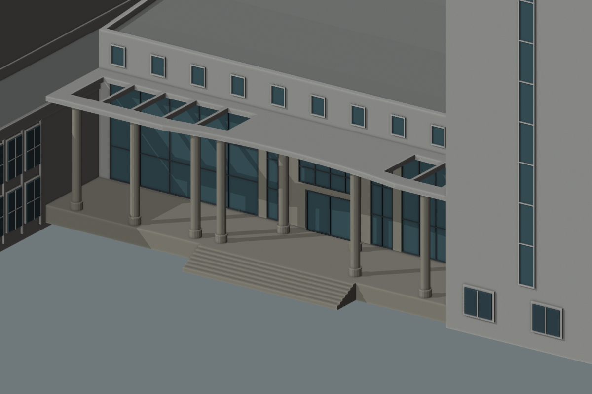
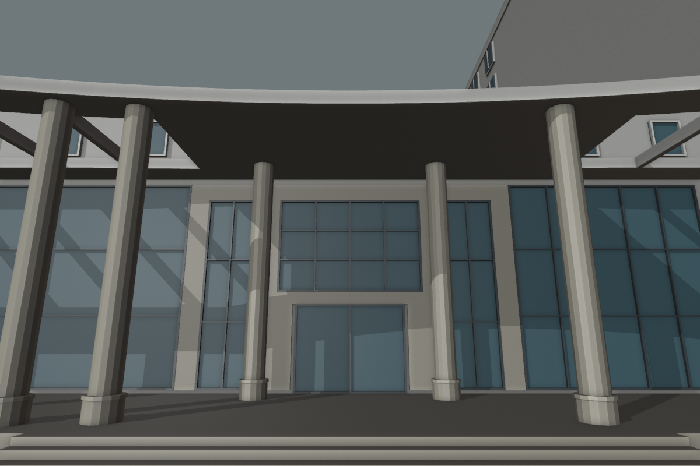

# 结构平台门廊：曲线前缘与进深联合候选

2026-09-30，接续[玻璃比例与上部窗带](CIVIL_PLATFORM_ENTRY_PROPORTIONS.md)。本批在原建筑占地内加深门廊，补入中央内收的曲线前缘，前后柱和人员门随之调整。**仍为可复现估算候选，未完成相机配准、生产替换或整栋验收。**



后续已完成[有界相机与柱距候选](CIVIL_PLATFORM_CAMERA_ALIGNMENT.md)；本文保留本批参数，复现时须加 `--wide-columns`。

## 本次联合变更

| 部位 | 上一候选 | 本候选 |
| --- | --- | --- |
| 后墙与门廊分界 | 后退3.6米 | 后墙两端沿原南北边界向西移动2.4米，门中心进深约6米 |
| 屋面前缘 | 直线 | 18米宽抛物线近似，中央向内退0.8米，两端接原前缘 |
| 前柱 | 固定距原外缘0.7米 | 随曲线退入，柱心约距曲线0.6米 |
| 后列两柱 | 距原外缘2.65米 | 改为4.7米，沿边位置仍±2.8米 |
| 门及台阶 | 原外缘点与后退门 | 外缘点、门宽、七级台阶、梯宽及地坪标高保持，后退门移至新后墙 |

门厅坡屋面东侧两个顶点随共享墙移动，其余屋面控制点保留。门廊面积由111.858增至186.423平方米，对应门厅减少约74.565平方米；这是内部重新分区。分部并集与原总占地差约8.53×10⁻¹³平方米，数值重叠约4.55×10⁻¹³平方米，其他四部分轮廓保持。实际门中心后退量按新后墙求交得到5.9999357米，避免直接写入6米产生微小悬空。

这些数字均为候选设计参数。照片没有独立给出6米进深、18米曲线宽度或0.8米内收量，也没有确认八柱总数。曲线是分段抛物线近似，不能称为恢复了真实圆弧半径。

## 近人视角纠正了首版曲线方向



参考[已核看的2023年校方完整合影](https://tmjz.gxu.edu.cn/info/1452/6575.htm)，门廊前缘中央在画面中比两端低。首版采用中央向外鼓出的曲线，平面和网格检查通过，但近人视角中央反而抬高，因此被视觉核对拒绝；改为中央内收后，在同一相机中出现相同方向的可见关系。首版图、候选JSON及通过的几何记录仍保留在本机 `work/refinement-s2-platform-curved-entry/outward-*`，不能把它们当作最终结果。

新增透视相机只是检查工具：位于外缘前8.7米、标高2.75米，朝向后退6米、标高6.3米的点，镜头22.5毫米、传感器宽36毫米。**没有优化相机或校正镜头畸变；该视图不能证明与原照片配准。** 三个原正交视角继续保留，总计八张前后对照图，`original` 表示上一候选。

近人视角仍显示一侧额外入镜的柱子，前后主柱相对尺度和保留的侧柱间距尚未协调到参考构图。前缘仍为素白，石色饰面、柱帽与楼名字样未完成。

## 生成器与验证

`slattedRoof.frontCurve` 是可选配置，字段为 `from`、`to`、`inset`、`segments`。第一条四边形边沿门廊进深，曲线作用于其末端一侧的长边（局部u=1）。在指定纵向区间内，内收量为 `inset × (1 − s²)`，区间之外为零；曲线按偶数4–64段采样。先在单位方形中合并梁、实档与孔洞，再变换整环，避免独立拼梁裂缝。后墙边u=0保持，全部屋面仍限制在原四边形中，并检查剩余开孔深度和支撑柱位置。未配置曲线时保留旧路径。

269项Python测试通过，包含旋转、真实孔洞、后缘保持、非法曲线配置和柱顶落空拒绝。Blender基础/近景两档166条记录通过：新增13个前缘位置各内外两条射线，保留七个屋面孔洞、八柱各16个柱顶环采样、三条门宽通路探测、石色围合和十扇上部窗检查。旧直屋顶在应退入位置仍有实体，反例有效；上一候选114条网格回归也通过。见[几何报告](model-checks/refinement/s2-platform-curved-entry-geometry.json)。

八张最终图均已核看。448栋完整解析结果、69个GLB在public/out的字节数和哈希、正式覆盖表及校园源文件保持；前三版候选几何可精确复现。未导出校园模型、重建Pages或重测FPS；独立场景不代替真实地形、接路和性能验收。[汇总及指纹](model-checks/refinement/s2-platform-curved-entry-summary.json)保留分区量、初稿拒绝和未解决问题。

```sh
mkdir -p work/refinement-s2-platform-curved-entry
work/refinement-venv/bin/python scripts/preview_civil_platform_entry.py \
  --wide-columns --output work/refinement-s2-platform-curved-entry/proposal.json
blender --background --python-exit-code 1 \
  --python blender/validate_civil_entry_proposal.py -- --surround --tall-surround --curved-roof \
  --proposal work/refinement-s2-platform-curved-entry/proposal.json \
  --report work/refinement-s2-platform-curved-entry/geometry-rerun.json
```

`--straight-roof` 复现上一版3.6米进深的直线前缘；`--low-roof` 与 `--without-surround` 分别复现更早两版。前后渲染用 `r=proposal(refined_columns=False); r['original']=proposal(curved_roof=False)['candidate']` 写比较JSON，再交给 `render_civil_entry_proposal.py -- --eye-level --proposal=<比较JSON> --output=<独立目录>`。

## 下一步

建立可复现的相机对照，优先校准前后主柱的投影尺度及额外侧柱间距，随后统一前缘饰面和柱帽，再决定候选生产替换及接路、两级GLB、性能验收。D区仍为OSM支持的位置假设。C运输口、大厅剩余外观、北楼及旧大厅继续保留；累计22个对象、1栋首轮整栋通过、21个部分校准，完整S0–S5目标不变。仅在dev开发、提交与推送。
