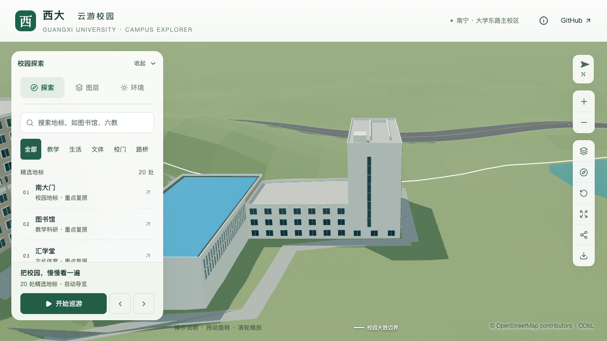

# 结构平台北楼：东端竖向窄玻璃带

2026-09-21，接续[北楼屋顶](CIVIL_PLATFORM_ROOFTOP.md)，细化 `way/957404988` 的东端白墙。本批只补入一条窄玻璃带，保留既有九层主体、北窗网、屋顶附加体及四分部，不增加整栋完成数。

## 影像与方位

[GX720广西大学全景](https://www.gx720.net/pano/viewer/?slug=pano-658)能同时看到南侧蓝顶大厅、北楼密集窗网和东侧独立旧大厅。结合[校方标号航拍](https://www.gxu.edu.cn/info/1364/30576.htm)的建筑相对位置，画面中北窗网旁的大块白墙对应北楼东端，不能把画面左侧当作地理西侧。

原始图块 `b/6/7.jpg` 可见白墙中的竖向暗玻璃带；相邻 `l/6/0.jpg` 补全北面窗网。另核看 `l/7/0.jpg` 与 `l/6/1.jpg` 的近邻上下文，未从它们新增门位结论。[逐图路径、哈希与判断边界](model-checks/refinement/s2-platform-slit-evidence.json)保留本机核看记录。照片不打包进仓库，也不作为模型纹理；资源路径中的2021/8不证明拍摄日期，影像不能证明2026年现状。

## 采用的表达

复用已有 `facadeRules.panels`，只作用于原外环第14边中的 `north-office` 分段，比例从北往南计算。该分段约15.838米，玻璃带范围0.56—0.64，宽约1.267米；底端3.8米、顶端26.4米，采用八格、0.08米白框与0.10米框深。以上位置、尺寸和分格数都是照片约束下的估算，不是逐窗测绘。

主墙继续保留大块白色实墙，底层通用窗仍是示意。图中靠南转角另有细暗带，但其所属墙面及转折尚未确认，本批不外推；也不将本条玻璃带认定为楼梯间或据此确定人员入口。它是共享浅表立面构件，不提供室内空间或可通行开口。

## 验证

平台专项增加八个玻璃格中心、两侧16个实墙点、上下两处实墙点，共26个固定采样，检查玻璃材质、外向法线与周边实墙。预期坐标独立写入验证器，不从生产参数读取。原四分部、屋顶、北窗网、大厅高窗及高空间检查继续保留。

```sh
blender --background --python-exit-code 1 --python blender/validate_civil_platform.py -- --inset-roof --north-facade --roof-volumes --east-slit --report-prefix=s2-platform-slit-local
```

236项Python、59项Node检查、类型检查、lint、完整模型与Pages构建通过。

- [平台专项](model-checks/refinement/s2-platform-slit-geometry.json)：源文件、基础、近景各341项通过；[旧模型反例](model-checks/refinement/s2-platform-slit-negative-geometry.json)在第一个窄玻璃带材质点失败。
- [数据对照](model-checks/refinement/s2-platform-slit-data.json)：447栋其他建筑、所有楼栋轮廓/高度/屋顶/入口、目标其他立面及1,085个GeoJSON几何保持；目标新增一个玻璃面板和全景来源引用。
- [源文件](model-checks/refinement/s2-platform-slit-source-preservation.json)及[导出资产](model-checks/refinement/s2-platform-slit-assets.json)：532个其他非树对象、3,063株树、67个其他GLB与93个基础节点保持。69个模型与生产包一致；首屏5,395,180字节（增加600字节），最大普通近景1,684,868字节。
- [430栋普通建筑](model-checks/refinement/s2-platform-slit-generic-geometry.json)、[实际树冠净空](model-checks/refinement/s2-platform-slit-trees-geometry.json)及[道路](model-checks/refinement/s2-platform-slit-road-building.json)回归通过。
- [浏览器前后对照](model-checks/refinement/s2-platform-slit-final-context-browser.json)与[画面核看](model-checks/refinement/s2-platform-slit-visual-review.json)：四组前后、植被开启、夜景及手机尺寸共11张图逐张核看，无页面、控制台或HTTP错误。手机尺寸使用基础层，其他镜头为近景层；东侧玻璃带在两级均保留。手机镜头裁掉部分大厅，不用它认定大厅整体完成；视口模拟不等于手机真机测试。



[最终汇总与资产指纹](model-checks/refinement/s2-platform-slit-summary.json)通过。[性能复测](model-checks/refinement/s2-platform-slit-performance-browser.json)采用同机Apple M5、Chromium 148、1280×720、DPR 1、既有S0活动协议，每档三轮各30秒：

| 指标 | 精细档 | 流畅档 |
| --- | --- | --- |
| 三轮FPS中位数 | 60 / 60 / 60 | 28 / 28 / 28 |
| 相对S0的FPS变化 | 0% | −6.67% |
| 三角形中位数及相对S0变化 | 4,198,007，+4.43% | 1,163,799，+10.63% |
| 绘制调用中位数及相对S0变化 | 563，+2.93% | 295，+12.17% |

六项均符合原预算，三次LOD往返无错误。[26次进程快照](model-checks/refinement/s2-platform-slit-performance-performance-context.json)在计时窗口未记录到超过2%阈值的Python/Blender计算。上述结果只代表固定设备和活动视角；新增玻璃带并非减面优化，轮次间三角形或绘制调用波动不解释为模型性能提升，也不外推为手机真机保证。

人员门厅、南厅运输口、其他立面和低翼细节继续按[精细校准计划](CAMPUS_REFINEMENT_PLAN.md)推进。当前仍为22个校准对象、1栋首轮整栋通过、21个部分校准；平台整体及S2—S5目标尚未完成。开发、提交及推送仅在 `dev`。
