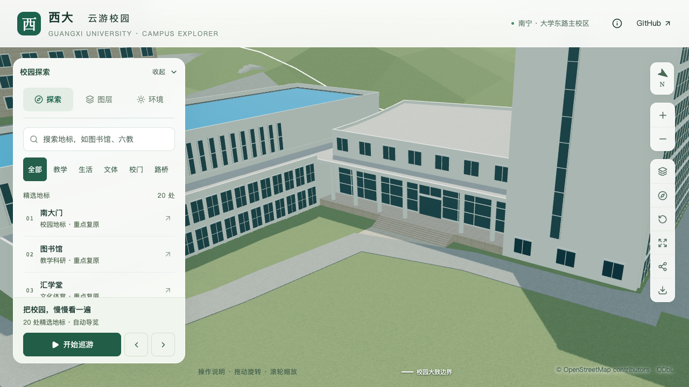

# 结构平台：人员台阶与服务路衔接

2026-09-30，接续[人员门与七级台阶](CIVIL_PLATFORM_PERSONNEL_ENTRY.md)，在 `way/957404988` 东侧D区补入有限连接面，并修正相邻 `way/759332838` 服务路的悬空高程。建筑轮廓、门位、平台、台阶、其他楼栋和树位保持。此批只处理室外局部接缝，不增加整栋验收计数。

## 范围与依据

连接面沿用上一批12米梯宽，从实际最外踏步边缘接到原映射道路边界，面积约19.171平方米；进深随斜交路边由约0.170米变化至3.026米。道路的OSM标签为 `highway=service`，不能称为专用步行道。

诊断发现原道路约高于地形0.40米，在台阶最近处直接连接会产生陡坡。本批沿用原约635.558平方米道路轮廓，将主体路面改为原地形上方0.08米；在南侧既有校道接口用3米范围过渡。北端与另一条服务路 `way/759096572` 重叠约6.159平方米，该范围保留邻路高程，并在周边有限范围过渡，不把邻路一起压低。

这些尺度是**模型衔接参数**，不是现场测绘。位置依据沿用已归档OSM轮廓及GX720全景，入口依据详见上一批专项；没有新增照片证明铺装材料、道路纵坡或车辆管理方式。12米梯宽本身仍为估算，无障碍路线未验收。

## 实现约束

- `front-connection` 支持明确配置的后退柱廊入口；起点从门位加柱廊进深、台阶节距和实际踏面外缘推导。宽度沿用 `stepWidth`，不允许再用 `pathWidth` 覆盖，避免铺面超出梯宽。
- `groundedService.preserveNeighborOverlap` 显式启用既有邻路重叠保留，范围从道路相交计算，不能手填任意地块。未配置的旧修复保持原规则。
- 服务路设0.06米地形净空，低于其0.08米抬高量，避免对原地形作无意义的整体下挖与细分；入口连接面仍采用0.12米地下净空。
- 路面接触使用埋入边缘的小范围交叠处理导出精度缝隙；连接面与道路的可见标高分别验证，不把地下交叠当成可行走高差。

## 验证

最终结果见[本批联合验收](model-checks/refinement/s2-platform-path-batched-summary.json)。检查涵盖实际Blender源文件与解码基础GLB的连接面、台阶起点、沿全梯宽取样的坡面连续性、路面接口、2.1米净空，以及服务路主体、南北接口和局部导出边界。旧资产作为缺少连接面及未贴地道路的反例。

最初验证指出相邻修复道路下方的地形也有变化，随后分开检查两处明确范围；另发现原北端邻路重叠引起高差，补入保留及过渡。首次失败报告保留，不以首次构建作为最终验收。数据准备尚未完成时启动的一次Python测试出现中间数据错误，最终完整构建后重跑。

首次同条件性能测量帧率通过，但流畅档绘制调用相对S0增加15.59%，超过15%预算，[首次失败汇总](model-checks/refinement/s2-platform-path-summary.json)保留。随后在加载阶段将局部导出节点的沥青、路缘石片段并回原道路相同材质组，减少2次绘制调用；只在材质、世界变换、图层和渲染属性一致时合并。实际解码后的40,000个有向三角形、位置、法线、颜色和UV逐项一致，纹理引用保持；主体局部道路材质仍单独保留。新增3项Node测试覆盖材质/变换差异拒绝、索引与层级保持及重复调用。GLB、源模型和地理数据保持此次几何验收时的指纹，复测不重新构建模型。

同条件复测精细60/60/60 FPS、流畅30/30/30 FPS；相对原同系统S0，三角形增加6.02%/14.22%、绘制调用增加3.47%/14.83%，原预算通过，流畅档余量仍较小。三次LOD往返无错误；26次CPU快照在计时窗口未记录到达到2%阈值的Python/Blender活动，采样不代表完全隔离。首次15.59%绘制调用超限报告保留；合批后复用指纹一致的模型几何结果，并重新构建Pages、核看11张目标及6张回归图。

本批仍为22个校准对象、1栋首轮整栋通过、21个部分校准。下一步继续门框、门扇与柱基的可见细节，随后核对C区运输开口、大厅屋面及北楼剩余立面；旧实验大厅作为独立历史对象处理。完整S0–S5计划及只在 `dev` 开发、提交和推送的规则保持。

2026-09-30接续：[门框、门扇与柱基专项](CIVIL_PLATFORM_ENTRY_TRIM.md)细化人员入口外观，原连接面和服务路几何保持，并重新检查实际接缝。上述性能数据仍为本接路批次历史结果，新批次结果单列。
