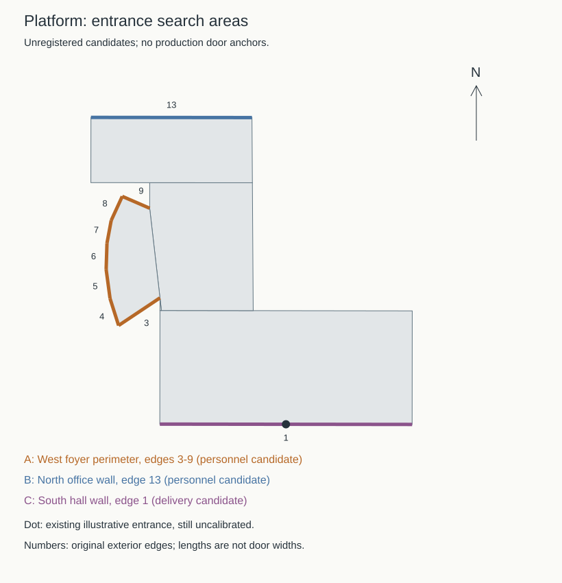

# 结构平台：人员入口与构件入口定位接续

2026-09-21，接续[内缩蓝顶](CIVIL_PLATFORM_ROOF.md)。本批补充2025年校方入口照片线索，并将三个待核对区域映射到现有轮廓边号。**尚未确认照片对应的具体墙面，本批不修改生产模型。** 大厅、低实验区、门厅和北综合楼仍共用 `way/957404988`，不重复登记建筑。

## 新照片与可用程度

| 来源 | 直接核看结果 | 对建模的作用 |
| --- | --- | --- |
| [2023年电气与土木支部联学报道](https://dqgc.gxu.edu.cn/info/1057/3503.htm)的图1 | 图注具名大型结构试验研究平台；可见四根圆柱、柱后深色玻璃分格和中央下部实墙，人物遮挡门口，顶部和周边被裁切 | 支持圆柱玻璃门廊这一外观线索；没有方位、宽度或绝对标高依据 |
| [2025年智能建造大赛报道](https://tmjz.gxu.edu.cn/info/1452/8101.htm)末幅合影 | 文章明确活动在平台综合楼举行；照片两侧有圆柱、玻璃，前方有宽台阶。中央活动背景板遮挡立面 | 与2023年门廊照片相容，但不能仅凭活动地点证明同一门口，更不能据此锁定西侧或北侧墙面。台阶级数、进深和柱数仍未确定 |
| [2024年结构设计竞赛报道](https://tmjz.gxu.edu.cn/info/1452/7115.htm)末幅合影 | 低楼实墙、带支托的挑檐、窗格及植被，与前两张的可见构造不同 | 未与目标复合楼配准，不移植为大厅或北楼入口 |
| [2024年讲座](https://carbon.gxu.edu.cn/info/1032/1975.htm)、[2022年参观](https://fls.gxu.edu.cn/info/1205/4124.htm) | 本次筛查照片均为室内活动、展品、实验设备或会议室 | 不作为外门位置依据；“第六报告厅”是名称，不从数字推断六楼 |

2025年报道发布于11月10日，活动日期为11月7—8日；这是新增的历史线索，不是2026年现场复核。该文明确报告厅在综合楼一楼，仍不能定位其外门。原实验中心站点同题链接返回404，已取得学院官网文章，失败和替代来源都记录在案。

四篇新筛查文章共24张图片，全部看过联系表；其中各篇最后一张另看完整图。不能将缩略筛查表述为每张都完成了高分辨率立面分析。[机器证据记录](model-checks/refinement/s2-platform-entry-evidence.json)保留逐图URL、字节数、哈希及核看程度；学校照片不作为模型纹理。

## 现有轮廓上的三个核对区域



| 区域 | 原外环边号 | 当前模型边界长度 | 待解决问题 |
| --- | --- | --- | --- |
| A：西侧门厅外围 | 3—9 | 51.803米，七条边合计 | 圆柱门廊是否属于此处；若属于，位于哪条边或跨哪些边 |
| B：北综合楼北墙 | 13 | 39.157米 | 2014年设计的北侧人员入口与照片门廊是否对应 |
| C：南大厅南墙 | 1 | 61.357米 | 构件运入/废料运出开口的位置、数量及门洞尺度 |

这些数值来自模型外环，**不是门廊宽度，也不是实测尺寸**。A和B是竞争性的人员入口核对区域，不代表已确认存在两个门；C独立核对运输功能，不套用圆柱合影。边号按原始轮廓计，不能直接作为分部重排后的边号使用。

[2014年校报设计说明](https://news.gxu.edu.cn/__local/8/C4/4D/0B1CE8B9D4B8389F21FF34B7030_FF27C11E_793A3.pdf?e=.pdf)区分北侧人员流线与南侧试件、废料流线，但它是设计资料，不是门洞建成定位图。[2022年学校航拍附件](https://www.gxu.edu.cn/info/1364/30576.htm)和[GX720全景658](https://www.gx720.net/pano/viewer/?slug=pano-658)能辨认蓝顶大厅、低连接体和高楼；本次另直接核看全景原瓦片 `4/b/6/7.jpg`，仍不足以把合影的玻璃门廊唯一配准。全景资源路径含2021年8月，不等于拍摄日期。

现有生产入口仍是南墙中点的2.2米宽示意门，中心 `[-687.128, -788.096]`、朝向约180.073°。这只是生成器的最长边回退，不因恰好位于设计的运输一侧而获得“真实构件门”身份。

## 下一批落模顺序

1. **人员门廊定位。** 先找同时展示圆柱门廊和蓝顶厅/九层楼转角的外景，匹配A或B及具体边界，再落门廊、柱后玻璃、门洞和台阶。仅有门前合影时不根据人物推算绝对尺寸。
2. **南厅运输开口。** 独立确认C上的大门，不沿用2.2米示意门或人员门廊尺寸；确认后检查运输前场和既有道路的连接。
3. **北楼立面和屋顶可继续推进。** 门位未解不妨碍核对已在航拍中定位的窗墙分区、白色外框与屋顶突出物，但尺寸和遮挡区域保持估算/未知记录。
4. **接路单独核对资料时点。** [后勤基建处2024年11—12月简报](https://ghjjc.gxu.edu.cn/info/1011/3517.htm)记录土木工程综合实验中心施工的临时道路与管线工作；历史照片中的门前铺面不能直接当作现状通路。最终落模仍检查台阶贴地、与路面衔接及现有植被净空。

## 本批检查与状态

[只读诊断脚本](../scripts/inspect_civil_platform_entries.py)核查原外环有效性、候选边所属分部和向外法线，并输出[边界坐标记录](model-checks/refinement/s2-platform-entry-candidates.json)与上图。输出的 `photoRegistered` 和 `productionReady` 均为 `false`，门锚点保持空值，不接入生产准备链。

```sh
work/refinement-venv/bin/python scripts/inspect_civil_platform_entries.py
```

生产数据、Blender源文件与69个GLB保持 `c21c49c`，本批没有重建或声称新增渲染/性能验收。累计22个校准对象、1栋首轮整栋通过、21个部分校准；完整S2—S5继续执行。开发、提交、推送均在 `dev`，主分支不更新。
