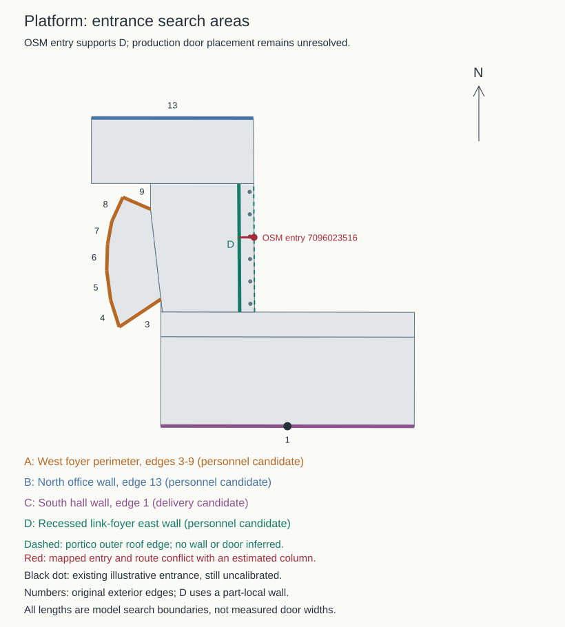

# 结构平台：人员入口与构件入口定位接续

## 2026-09-30：找到OSM入口节点，优先核对D区

原始快照 `data/snapshots/osm-2026-09-09.json.gz` 中的[节点7096023516](https://www.openstreetmap.org/node/7096023516)带有 `entrance=yes`，且属于平台原始 `way/957404988` 的节点序列。本次读取[OSM节点接口](https://api.openstreetmap.org/api/0.6/node/7096023516)，核对版本2、2021-06-23更新时间、经纬度与标签，均与仓库快照相同。这是既有地图入口记录，不是新测绘，也不独立证明2026年现场状况。

节点坐标为经度108.2814232、纬度22.8404808，按项目坐标变换为 `[-695.206647, -742.415344]`。它落在**D区连接柱廊东侧**，距离简化后的原外环边14约0.001736米；该近共线带标签节点不再作为规范化轮廓的独立顶点。当前生成入口仍回退到南墙中点，因此不能从成品轮廓未保留该点推断原始数据没有入口。

新增证据将下一步从“A/B/D同等候选”改为**优先校准D区门洞与柱列的对应关系**。A、B尚无相应入口节点支持，但也不能据此排除其他实际门口；南侧C运输口仍独立核对。OSM节点标的是外轮廓上的入口位置，不能直接当作柱廊后退玻璃墙上的测绘门中心。

### 将节点用于当前模型时发现的冲突

| 检查 | 结果 |
| --- | --- |
| 原外环边14上的投影比例 | 0.614855479，从该边起点计算 |
| 柱廊外缘投影 | `[-695.208383, -742.415355]` |
| 后退门厅墙上的垂足 | `[-698.808310, -742.438185]`，模型进深3.6米 |
| 直达路径与现有柱列 | 与从北向南第三根估算柱相交，最短距离为0 |
| 现有解析器试装 | 拒绝：`Portico column blocks the central entrance route` |

试装只在内存副本中采用2.2米探测门宽和既有3.6米后退，**2.2米不作为门宽建议或实测值**。没有把该配置写入生产覆盖表，也没有移动柱子以绕过检查。当前柱数、柱距和柱径原本就是估算；地图点的定位精度也未知，现阶段不能仅凭冲突判断哪一项应移动。此诊断检查的是现有规则的中央通路，不代替后续完整门宽、柱间净宽、台阶、贴地及道路连接验收。

[更新后的定位图](model-checks/refinement/s2-platform-entry-candidates.svg)用红点表示OSM入口、红线表示通路投影、红色小圆表示冲突柱；南侧黑点仍为旧示意门。[机器坐标与解析器结果](model-checks/refinement/s2-platform-entry-candidates.json)可由 `scripts/inspect_civil_platform_entries.py` 复现；[独立证据记录](model-checks/refinement/s2-platform-entry-osm-evidence.json)保存当前接口响应指纹及快照一致性。

本次另核看2024年临时水电施工图第4、39、40页及第39页平台局部，没有取得可直接采用的门洞锚点；2024年夏令营末幅合影仍裁掉转角，2025年后勤简报对应平台的图片为室内桥梁展厅，均未用于定位。后续应围绕D区核对邻柱和门洞，不再反复扩大A/B/C搜索范围。生产模型保持 `0ed569b`，檐口局部联合验收已通过，整栋及全部入口接路未完成。

## 前一轮照片关联记录

> 2026-09-30接续：新增2024年入口透视展厅的照片关联，并按六分部模型增加D区——连接柱廊后的门厅东墙。最新结论见下节；A/B/D均未完成门位配准，南侧C运输口仍未确认。

## 2026-09-30：入口与展厅关联、六分部定位图

[2024年“走进学院”活动报道](https://tmjz.gxu.edu.cn/info/1452/7240.htm)的四幅照片已分别直接核看。末幅合影显示灰色圆柱、黑色玻璃分格、中央玻璃开口、宽台阶及阶前线形排水沟；透过中央开口，可见与同篇第一幅室内图相符的蓝色塔架及红色桥梁模型。第二幅展示室内拱形展陈，第三幅是大型试验设备，均不能提供外部门位。[2023年工程院调研报道](https://news.gxu.edu.cn/info/1002/40253.htm)的第一幅照片另显示相同类型的拱形展陈、蓝色塔架和红色桥梁模型，正文将该段参观归于大型结构试验平台。该文其余三个参观地点的图片未纳入本次证据。

**本次新增的是“门廊—桥梁展厅”的可见关联，而非门口方位。** 2024年合影中央门洞未被整块活动背景板遮住，入口识别价值高于2025年竞赛合影；但仍裁掉楼体转角，无法区分西侧门厅、北墙或连接柱廊后墙。图像相似和文章活动地点共同支持其归属平台的推断，不视为测绘配准。屏幕显示2024年6月25日，只作画面内容记录，不据此覆盖网页7月10日发布日期或断言拍摄日。

当前六分部模型中的连接柱廊必须分开记录两条线：

| D区线位 | 索引与作用 | 当前模型长度 |
| --- | --- | --- |
| 门厅后退东墙，实线 | `link-foyer` 第0多边形/外环/边0，可能承载人员门的待核对墙面 | 31.070米 |
| 柱廊东侧屋顶外缘，虚线 | `link-portico` 第0多边形/外环/边2，是原外环边14的一段，不是实墙 | 31.073米 |

两线在后墙中点处的垂直距离为模型设定的3.6米。**这些是既有估算模型的定位尺度，不是从合影量出的门宽或柱廊实测进深。** 不得将D区门锚点直接设在原外环边14；后墙朝外法线进入开敞柱廊，仍处于整栋占地内部，不能沿用整栋外环法线检查。

只读诊断现在检查后墙与柱廊共享边、屋顶外缘与原边14重合以及朝向开敞柱廊的法线，输出更新后的四区[定位图](model-checks/refinement/s2-platform-entry-candidates.svg)和[坐标记录](model-checks/refinement/s2-platform-entry-candidates.json)。[本次证据记录](model-checks/refinement/s2-platform-entry-wide-evidence.json)保留五张实际核看图片的URL、哈希、大小和逐图判断；图片只用于核对，未作为模型纹理。

下一步优先寻找能将该展厅入口与蓝顶大厅/九层楼转角连起来的外景，确定A/B/D之一及门位，再处理台阶与接路。C南侧运输开口独立取证。原2.2米南墙示意门保持；生产数据、Blender源文件和69个GLB未改变，不重复构建或声称新增性能验收。上一轮檐口的同条件性能验收仍待补齐。

## 2026-09-21—29历史筛查

> 2026-09-29接续：[柱后玻璃专项](CIVIL_PLATFORM_PORTICO_GLAZING.md)按全景相对关系补入连接体退后东墙玻璃，新增2025年5月研修班合影线索。真实门锚点仍未确认；下文A/B/C是早期候选记录，后续应同时核对六分部模型的连接柱廊区域。

2026-09-21，接续[内缩蓝顶](CIVIL_PLATFORM_ROOF.md)。本批补充2025年校方入口照片线索，并将三个待核对区域映射到现有轮廓边号。**尚未确认照片对应的具体墙面，本批不修改生产模型。** 大厅、低实验区、门厅和北综合楼仍共用 `way/957404988`，不重复登记建筑。

## 新照片与可用程度

| 来源 | 直接核看结果 | 对建模的作用 |
| --- | --- | --- |
| [2023年电气与土木支部联学报道](https://dqgc.gxu.edu.cn/info/1057/3503.htm)的图1 | 图注具名大型结构试验研究平台；可见四根圆柱、柱后深色玻璃分格和中央下部实墙，人物遮挡门口，顶部和周边被裁切 | 支持圆柱玻璃门廊这一外观线索；没有方位、宽度或绝对标高依据 |
| [2025年智能建造大赛报道](https://tmjz.gxu.edu.cn/info/1452/8101.htm)末幅合影 | 文章明确活动在平台综合楼举行；照片两侧有圆柱、玻璃，前方有宽台阶。中央活动背景板遮挡立面 | 与2023年门廊照片相容，但不能仅凭活动地点证明同一门口，更不能据此锁定西侧或北侧墙面。台阶级数、进深和柱数仍未确定 |
| [2024年结构设计竞赛报道](https://tmjz.gxu.edu.cn/info/1452/7115.htm)末幅合影 | 低楼实墙、带支托的挑檐、窗格及植被，与前两张的可见构造不同 | 未与目标复合楼配准，不移植为大厅或北楼入口 |
| [2024年讲座](https://carbon.gxu.edu.cn/info/1032/1975.htm)、[2022年参观](https://fls.gxu.edu.cn/info/1205/4124.htm) | 本次筛查照片均为室内活动、展品、实验设备或会议室 | 不作为外门位置依据；“第六报告厅”是名称，不从数字推断六楼 |

2025年报道发布于11月10日，活动日期为11月7—8日；这是新增的历史线索，不是2026年现场复核。该文明确报告厅在综合楼一楼，仍不能定位其外门。原实验中心站点同题链接返回404，已取得学院官网文章，失败和替代来源都记录在案。

四篇新筛查文章共24张图片，全部看过联系表；其中各篇最后一张另看完整图。不能将缩略筛查表述为每张都完成了高分辨率立面分析。[机器证据记录](model-checks/refinement/s2-platform-entry-evidence.json)保留逐图URL、字节数、哈希及核看程度；学校照片不作为模型纹理。

## 现有轮廓上的三个核对区域



| 区域 | 原外环边号 | 当前模型边界长度 | 待解决问题 |
| --- | --- | --- | --- |
| A：西侧门厅外围 | 3—9 | 51.803米，七条边合计 | 圆柱门廊是否属于此处；若属于，位于哪条边或跨哪些边 |
| B：北综合楼北墙 | 13 | 39.157米 | 2014年设计的北侧人员入口与照片门廊是否对应 |
| C：南大厅南墙 | 1 | 61.357米 | 构件运入/废料运出开口的位置、数量及门洞尺度 |

这些数值来自模型外环，**不是门廊宽度，也不是实测尺寸**。A和B是竞争性的人员入口核对区域，不代表已确认存在两个门；C独立核对运输功能，不套用圆柱合影。边号按原始轮廓计，不能直接作为分部重排后的边号使用。

[2014年校报设计说明](https://news.gxu.edu.cn/__local/8/C4/4D/0B1CE8B9D4B8389F21FF34B7030_FF27C11E_793A3.pdf?e=.pdf)区分北侧人员流线与南侧试件、废料流线，但它是设计资料，不是门洞建成定位图。[2022年学校航拍附件](https://www.gxu.edu.cn/info/1364/30576.htm)和[GX720全景658](https://www.gx720.net/pano/viewer/?slug=pano-658)能辨认蓝顶大厅、低连接体和高楼；本次另直接核看全景原瓦片 `4/b/6/7.jpg`，仍不足以把合影的玻璃门廊唯一配准。全景资源路径含2021年8月，不等于拍摄日期。

现有生产入口仍是南墙中点的2.2米宽示意门，中心 `[-687.128, -788.096]`、朝向约180.073°。这只是生成器的最长边回退，不因恰好位于设计的运输一侧而获得“真实构件门”身份。

## 下一批落模顺序

1. **人员门廊定位。** 先找同时展示圆柱门廊和蓝顶厅/九层楼转角的外景，匹配A或B及具体边界，再落门廊、柱后玻璃、门洞和台阶。仅有门前合影时不根据人物推算绝对尺寸。
2. **南厅运输开口。** 独立确认C上的大门，不沿用2.2米示意门或人员门廊尺寸；确认后检查运输前场和既有道路的连接。
3. **北楼立面和屋顶可继续推进。** 门位未解不妨碍核对已在航拍中定位的窗墙分区、白色外框与屋顶突出物，但尺寸和遮挡区域保持估算/未知记录。
4. **接路单独核对资料时点。** [后勤基建处2024年11—12月简报](https://ghjjc.gxu.edu.cn/info/1011/3517.htm)记录土木工程综合实验中心施工的临时道路与管线工作；历史照片中的门前铺面不能直接当作现状通路。最终落模仍检查台阶贴地、与路面衔接及现有植被净空。

## 本批检查与状态

[只读诊断脚本](../scripts/inspect_civil_platform_entries.py)核查原外环有效性、候选边所属分部和向外法线，并输出[边界坐标记录](model-checks/refinement/s2-platform-entry-candidates.json)与上图。输出的 `photoRegistered` 和 `productionReady` 均为 `false`，门锚点保持空值，不接入生产准备链。

```sh
work/refinement-venv/bin/python scripts/inspect_civil_platform_entries.py
```

生产数据、Blender源文件与69个GLB保持 `c21c49c`，本批没有重建或声称新增渲染/性能验收。累计22个校准对象、1栋首轮整栋通过、21个部分校准；完整S2—S5继续执行。开发、提交、推送均在 `dev`，主分支不更新。
