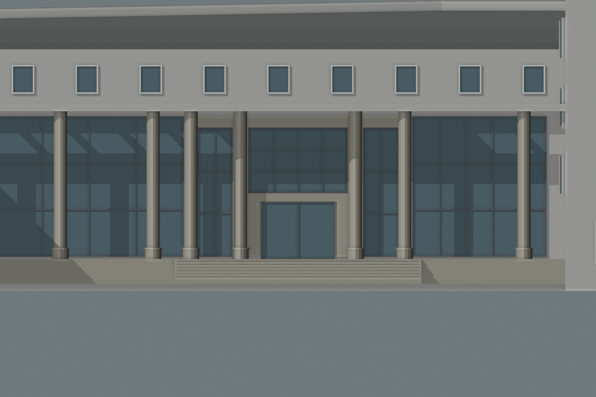

# 结构平台门廊：玻璃、顶高与上部窗带联合候选

> 后续已补入[曲线前缘与加深门廊候选](CIVIL_PLATFORM_CURVED_ENTRY.md)。本文保留历史尺寸和图片；复现本批需加 `--straight-roof`。

2026-09-30，接续[中央石色围合](CIVIL_PLATFORM_ENTRY_SURROUND.md)。复核完整合影发现上一候选中央玻璃明显偏扁，本批调整其比例，并解决抬高门廊顶后上部窗带消失的问题。**此方案仍为估算候选，未替换正式校园模型；照片位置与相机尚未配准。**



对照[上一候选](screenshots/refinement/s2-platform-entry-proportions/original-entry.png)，中央玻璃增高，上部改为受边界约束的小窗列。[斜视图](screenshots/refinement/s2-platform-entry-proportions/candidate-oblique.png)可同时查看窗列、门廊屋面和柱后玻璃。

## 比例筛查，不作为摄影测量

使用已核看的[校方2023年广角合影](https://tmjz.gxu.edu.cn/info/1452/6575.htm)，在855×570原图中人工选取中央玻璃外缘四点：(284,241)、(460,241)、(460,357)、(284,357)。可见宽高约176×116像素，表观宽高比1.517。按每个端点±3像素做敏感性检查，范围约1.393–1.655；**这不是置信区间，不包含未知镜头畸变或透视误差。**

上一候选的4.85×1.85米玻璃宽高比为2.622。在近正面墙面的近似下，与照片差异明显。本批保留原估算宽度，把玻璃高度试调至3.2米，比例为1.516。这个接近只证明所选矩形比例相近，不能证明8.6米屋顶高度、门宽或建筑位置正确；收窄窗宽等其他方案也可能产生同样比例。脚本及结果见[比例筛查](../scripts/inspect_civil_entry_proportions.py)、[原始取点与数值](model-checks/refinement/s2-platform-entry-proportions-image.json)。

## 联合调整与初稿问题

| 项目 | 上一候选 | 本候选 |
| --- | --- | --- |
| 门廊顶/净高 | 7.2 / 6.85米 | 8.6 / 8.25米 |
| 中央玻璃底/顶 | 4.25 / 6.1米 | 4.25 / 7.45米 |
| 石色上横梁 | 6.1–6.65米 | 7.45–8.0米 |
| 内外壁柱 | 顶部6.1米 | 顶部7.45米 |
| 上部窗带 | 自动生成 | 10扇显式1.1×1.4米窗，标高9.1–10.5米 |

上述米制值、十窗数量、间距和白框仍为估算；候选主体门厅10.8米最低檐高及后侧屋面高差保持。门廊平面、前后柱位置、门宽、地坪和台阶保持，圆柱随净高增高。

第一版只抬高屋顶，自动窗因下界检查整排消失。重新核看GX720瓦片及学校航拍，上部窗带仍应保留；不能把74条几何检查通过当作完整外观通过。失败图保留在本机 `work/refinement-s2-platform-entry-proportions/initial-no-clerestory/`，初稿74条几何记录在同目录上级的 `geometry.json`。

最终增加 `above-portico` 区域：同一共享墙可分别配置顶下玻璃与顶上窗列，禁止重复区域、跨越顶板和越过墙顶；上下显式区域各自接管自动窗，避免叠加。仅针对无突出边框的平顶柱廊使用该上部规则。支持后墙为现有折面坡屋顶，但窗仍限制在其最低檐高以内。

## 验证与生产边界

267项Python测试通过，新增上下两区共用墙边、重复解析、自动窗抑制和上下越界拒绝检查。基础/近景两档实际网格114条记录通过，其中新增十扇上窗的玻璃与白框射线；删除上窗后，十处玻璃检查均失败。屋面七孔、柱顶环、完整门宽通路、石色围合及无隐藏玻璃检查保留。见[几何记录](model-checks/refinement/s2-platform-entry-proportions-geometry.json)。

最终六张对照图均核看。448栋完整解析结果、69个GLB在public/out的字节数和哈希、生产覆盖表及校园源文件保持；前两版候选几何也可精确复现。未重建校园模型、Pages或重测FPS。见[汇总与指纹](model-checks/refinement/s2-platform-entry-proportions-summary.json)。

```sh
mkdir -p work/refinement-s2-platform-entry-proportions
work/refinement-venv/bin/python scripts/preview_civil_platform_entry.py \
  --straight-roof --output work/refinement-s2-platform-entry-proportions/proposal.json
work/refinement-venv/bin/python scripts/inspect_civil_entry_proportions.py \
  --output work/refinement-s2-platform-entry-proportions/image-rerun.json
blender --background --python-exit-code 1 \
  --python blender/validate_civil_entry_proposal.py -- --surround --tall-surround \
  --proposal work/refinement-s2-platform-entry-proportions/proposal.json \
  --report work/refinement-s2-platform-entry-proportions/geometry-rerun.json
```

`--low-roof` 复现上轮石色围合候选；`--without-surround` 复现更早的整片玻璃候选。生成本批前后对照JSON时用 `r=proposal(curved_roof=False); r['original']=proposal(tall_surround=False)['candidate']`，然后交给已有 `render_civil_entry_proposal.py`，输出至独立目录。

## 下一步

本次比例修订没有解决弧形前缘、门廊进深、完整柱网与相机对应关系。下一步以已保留窗带的联合候选为基线，处理前缘与进深，同时核对其与后墙、北楼和蓝顶大厅的空间关系，再决定生产替换。C运输口、大厅剩余外观、北楼与旧大厅继续保留；累计22个对象、1栋首轮整栋通过、21个部分校准，完整S0–S5目标不变。仅在dev开发、提交与推送。
