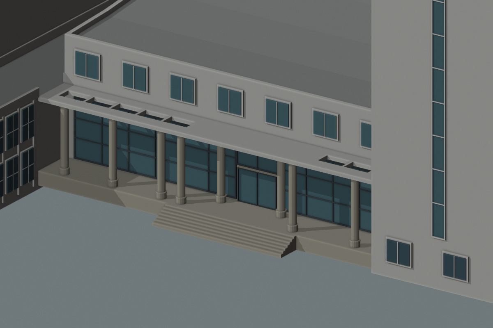

# 结构平台门廊：实际楼体中的独立对照候选

2026-09-30，接续[混合屋面支持](CIVIL_PLATFORM_MIXED_ROOF.md)，已把前后柱列和中部实顶/侧格栅组合到实际D区轮廓中，生成原模型与候选的六张对照图。**这是可复现的估算方案，尚未写入生产覆盖表，也未通过照片配准或整栋验收。**

## 当前候选及未解决的差异



对照[原模型](screenshots/refinement/s2-platform-entry-proposal/original-oblique.png)，候选包含入口前后两对圆柱、中部连续实顶和两侧真实孔洞。D区位置沿用原OSM入口线索，原31米左右条带及3.6米进深均继续作为估算。不能从这组正交检查相机推断真实照片的拍摄方向或绝对尺寸。

| 参数 | 候选采用值 | 依据与限制 |
| --- | --- | --- |
| 前列入口两柱 | 相对门中心沿边±5.2米，距外缘0.7米 | 依据照片的前宽后窄关系尝试估算，未拟合相机 |
| 后列入口两柱 | 沿边±2.8米，距外缘2.65米 | 直径及柱基沿用旧估算；不代表完整柱网测绘 |
| 其余四根前柱 | 沿边位置保留、外缘后退改0.7米 | 使整个条带仍有连续支撑；总计八柱不是照片确认数量 |
| 屋面 | 11根横梁、12个空档，填实第5至9档 | 其余七孔保留，梁方向跨越门廊进深；数量与间距估算 |
| 边梁与横梁 | 边梁宽1.15米、横梁宽0.2米 | 用于当前浅进深方案，视觉上边梁偏宽，需继续核对 |
| 门、台阶与玻璃 | 沿用已有估算 | 未认为原整面分格玻璃已符合新照片 |

**当前不能直接采用这版替换正式模型。** 参考照片的中央玻璃由石色横梁及壁柱围合，而候选仍是整面玻璃；带楼名的前缘呈弧形，候选仍为直线；3.6米进深和八柱数量也缺少独立依据。下一步以当前对照为起点，集中处理中央围合、前缘及进深关系，避免把“增加两根柱”当作整个门廊已经还原。C区运输口继续独立定位，其他大厅与北楼待办保留。

## 生成器修正

混合屋面原先被“柱后玻璃必须邻接完整平板”的条件挡住。本批允许带填实区的混合平顶与已校验的柱后玻璃组合，保留地坪、顶面高度、完整共享墙边、框深及柱基避让检查；纯格栅仍不使用该入口墙配置。

首版候选渲染发现自动窗叠在整片玻璃上：格栅让内部墙的自动窗下界降到地坪，而已有显式玻璃另生成一次。现在显式柱后玻璃负责下部墙面，同一内部边上的自动窗只从门廊屋顶以上生成；屋顶以上窗列保留。回归测试验证自动窗下界、玻璃上界、柱冲突拒绝和重复解析一致。初稿图保留在本机 `work/refinement-s2-platform-entry-proposal/initial/`，正文六张图均为修复后的结果。

## 本次补充核看的照片

[2025年学生代表大会报道](https://tmjz.gxu.edu.cn/info/1226/7880.htm)末幅合影更清楚地显示中央门、圆柱及台阶，但顶部与两侧仍裁切，没有新增方位锚点。[2022年第二幼儿园参观报道](https://dkgqgczx.gxu.edu.cn/info/1003/1091.htm)前两张展厅图可见桥梁模型、玻璃墙和第六报告厅入口；本次仅核看这两张原图，未将室内方位视为外门位置证明。网页发布日期分别为2025-06-17、2022-04-25，正文活动日期分别为6月15日、4月21日，不当作独立照片拍摄时间戳。

## 验证与复现

264项Python测试通过。Blender以生产 `ordinary_building` 函数分别生成基础/近景几何，50条记录检查12个屋面空档、后列两柱、门洞全宽通路，以及八柱各16个柱顶环采样。原模型在七个应开孔位置仍被整板遮住、两个后柱位置没有支撑，反例有效。结果见[几何报告](model-checks/refinement/s2-platform-entry-proposal-geometry.json)。这些检查证明候选的生成和净空，不证明照片对应或工程结构性能。

全部448栋完整解析结果与生产记录一致；69个GLB在 `public` 与 `out` 中逐一符合原清单，生产数据与校园Blender源文件保持。六张原模型/候选的正面、斜视和顶视图已逐张核看，见[汇总及指纹](model-checks/refinement/s2-platform-entry-proposal-summary.json)。图像为隔离的材质色检查，未包含实际地形、道路和植被，不作为接路或性能验收。未重建校园模型、Pages或重测FPS。

```sh
mkdir -p work/refinement-s2-platform-entry-proposal
work/refinement-venv/bin/python scripts/preview_civil_platform_entry.py \
  --output work/refinement-s2-platform-entry-proposal/proposal.json
blender --background --python-exit-code 1 \
  --python blender/render_civil_entry_proposal.py -- \
  --proposal work/refinement-s2-platform-entry-proposal/proposal.json \
  --output work/refinement-s2-platform-entry-proposal/rerender
blender --background --python-exit-code 1 \
  --python blender/validate_civil_entry_proposal.py -- \
  --proposal work/refinement-s2-platform-entry-proposal/proposal.json \
  --report work/refinement-s2-platform-entry-proposal/geometry-rerun.json
```

脚本只写明确指定的候选输出，不自动改生产配置。累计22个校准对象、1栋首轮整栋通过、21个部分校准，完整S0–S5目标继续；开发、提交和推送只在`dev`。
