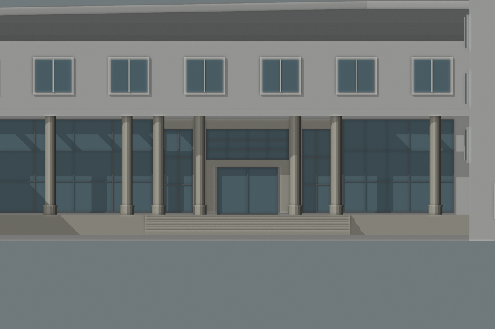

# 结构平台门廊：中央石色围合候选

> 后续已补入[比例与上部窗带联合候选](CIVIL_PLATFORM_ENTRY_PROPORTIONS.md)。本文保留历史尺寸与图片；复现本批需加 `--low-roof`。

2026-09-30，接续[前后柱列与混合屋面候选](CIVIL_PLATFORM_ENTRY_PROPOSAL.md)，在同一D区估算方案中补入中央玻璃周围的石色横梁、壁柱与门头。**仍是独立候选，未替换生产模型，未通过照片配准或整栋验收。**



对照[上轮整片玻璃候选](screenshots/refinement/s2-platform-entry-surround/original-entry.png)，中央上部玻璃被石色框架围合，门头与两侧窄墙衔接；侧窗分别分格。正面图中后列圆柱遮住部分壁柱，需结合[斜视图](screenshots/refinement/s2-platform-entry-surround/candidate-oblique.png)核看。图中 `original` 指上轮候选，并非正式校园模型。

## 参数与依据

沿用已核看的[2023年校方广角合影](https://tmjz.gxu.edu.cn/info/1452/6575.htm)：照片支持中央玻璃、石色横梁和壁柱、两侧窄窗的构成关系，不能直接提供下表的米制尺寸。全部尺寸、窗格数及左右重复关系均为估算。门前人物遮挡区域不作为完整门型证明。

| 部位 | 本候选采用值 |
| --- | --- |
| 内侧壁柱 | 相对门中心沿边±2.8米，宽0.75米，标高1.16–6.1米 |
| 外侧壁柱 | 沿边±5.225米，宽0.65米，同上标高 |
| 上横梁 | 跨门中心±5.55米，标高6.1–6.65米 |
| 中央玻璃 | 宽4.85米，标高4.25–6.1米，4列3行深色分格 |
| 两侧窄窗 | 各宽1.725米，标高1.16–6.1米，2列3行 |
| 门头 | 原3.8米宽横梁增高至0.4米，左右各接0.525米石色延伸；下接窄墙 |
| 石色面板 | 深0.21米，外表面与原门头对齐；未与玻璃重叠 |

共14块显式面板：9块石色实体、5块玻璃。远端两翼玻璃延续仍是占位估算。前后柱列、八柱总数、3.6米进深、屋面五个实档与七个开孔，以及原门宽和台阶沿用上一候选。

## 生成与验证

实体面板新增可选 `finish: stone`，默认保持白色。柱后墙允许实体与玻璃矩形共同配置，继续执行高度、重叠、屋顶净空、柱脚和深度检查。石材区域直接替换玻璃矩形，没有在整片玻璃前叠加装饰块。

266项Python测试通过，覆盖新材质限制、相接矩形、重叠拒绝、顶板和支撑柱冲突。Blender两档实际 `ordinary_building` 网格共74条检查通过：保留屋面、柱顶和通路检查，增加固定点材质及石材后方无玻璃检查；旧生产模型缺少石色围合的反例有效。既有面板在0°、90°、31.14°的两档旋转回归通过。见[几何记录](model-checks/refinement/s2-platform-entry-surround-geometry.json)。

六张前后正面、斜视、顶视图均直接核看。448栋完整解析结果保持，69个GLB在 `public`、`out` 中符合原清单，生产数据与校园源文件不变。未重建校园GLB、Pages或重测FPS；独立图不包含实际地形与周边场地，不能代替运行时和接路验收。详见[汇总与指纹](model-checks/refinement/s2-platform-entry-surround-summary.json)。

```sh
mkdir -p work/refinement-s2-platform-entry-surround
work/refinement-venv/bin/python scripts/preview_civil_platform_entry.py \
  --low-roof --output work/refinement-s2-platform-entry-surround/proposal.json
blender --background --python-exit-code 1 \
  --python blender/validate_civil_entry_proposal.py -- --surround \
  --proposal work/refinement-s2-platform-entry-surround/proposal.json \
  --report work/refinement-s2-platform-entry-surround/geometry-rerun.json
```

调用 `proposal(False)` 或 CLI `--without-surround` 可复现上轮候选。六张图用以下比较文件生成，使镜头和其余几何保持一致：

```sh
work/refinement-venv/bin/python - <<'PY'
import json,sys
from pathlib import Path
sys.path.insert(0,'scripts')
from preview_civil_platform_entry import proposal
r=proposal(tall_surround=False); r['original']=proposal(False)['candidate']
Path('work/refinement-s2-platform-entry-surround/comparison.json').write_text(json.dumps(r))
PY
blender --background --python-exit-code 1 \
  --python blender/render_civil_entry_proposal.py -- \
  --proposal work/refinement-s2-platform-entry-surround/comparison.json \
  --output work/refinement-s2-platform-entry-surround/rerender
```

## 接续范围

下一步优先处理照片中带楼名的弧形前缘，并联合航拍和OSM入口约束核对门廊进深与完整柱网。D区仍为有OSM支持的位置假设，不因局部围合变得更像照片就视为已配准。C区运输口、大厅剩余外观、北楼与旧大厅核对继续保留。累计22个校准对象、1栋首轮整栋通过、21个部分校准；完整S0–S5目标和仅在 `dev` 开发、提交、推送的规则保持。
