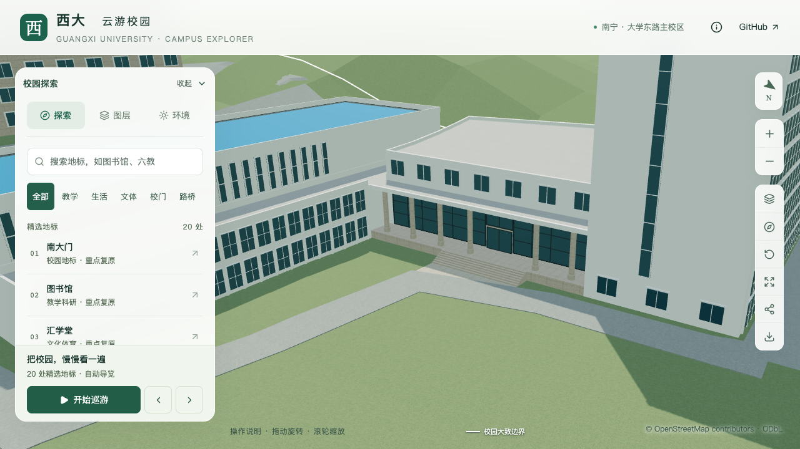

# 结构平台人员入口：门窗框与圆柱基座

> 后续完整照片复核：[前后柱列与两侧格栅](CIVIL_PLATFORM_WIDE_ENTRY_REVIEW.md)尚未对应当前单排柱、整板顶。下文记录框与柱基这一局部批次；几何和性能通过不代表整座门廊已匹配照片。下一步顺序改为先核对整体形制，再继续C运输口。

2026-09-30，接续[人员台阶与服务路连接](CIVIL_PLATFORM_ENTRY_CONNECTION.md)，细化 `way/957404988` 东侧D区人员入口。门窗深色框、浅石色圆柱和加宽柱基采用照片约束；尺寸、双扇简化和重复柱基仍为估算。此批不增加整栋验收计数。

## 照片与采用边界

校方[2024年“走进学院”报道](https://tmjz.gxu.edu.cn/info/1452/7240.htm)中的入口合影可见深色玻璃框、浅石色圆柱及门上横梁；[2025年冈比亚研修班参观报道](https://tmjz.gxu.edu.cn/info/1016/7805.htm)的较大合影补充外侧圆柱加宽基座与顶圈。人物遮挡中间柱脚和部分门区，照片也缺少足以唯一配准的建筑转角，不能从中量出门宽、柱径或实际门扇数。来源目录新增两个独立条目，图片仅作参考，未加入生产纹理；本机参考图哈希见[证据记录](model-checks/refinement/s2-platform-trim-evidence.json)。

入口位置沿用上一批原始OSM入口投影和柱廊后墙，不因局部合影移动门位。六根柱基按可见外侧形制重复估算，不声称六根均无遮挡可见。

## 实现

| 构件 | 本批采用 | 保留或未知 |
| --- | --- | --- |
| 柱后玻璃 | 三个面板的框改为共享深色材质 | 原边界、标高和分格保持 |
| 人员门 | 3.6×2.8米原范围内补0.07米深色框及闭合双扇分隔 | 两扇仅为外观简化，实际开启方式、五金未知 |
| 门上横梁 | 浅石色，高0.18米 | 宽3.8米，原前沿保持；非实测 |
| 六圆柱 | 柱身改浅石色，柱基高0.55米、径向外挑0.08米 | 原柱心、0.65米柱径、柱廊净高保持 |
| 柱基顶圈 | 高0.08米，在基座外再挑0.03米 | 非精确石材节点 |

柱基顶圈的最外投影纳入柱廊范围、柱间重叠、中央通路与低位玻璃避让检查。按保守包围盒检查，完整3.6米门宽的直达区域距最近柱基仍约0.293米；这是模型碰撞余量，不是无障碍净宽指标。原七级台阶、12米梯宽、连接面和服务路标高保持，实际接缝另作回归。

生成器用独立柱基高度变量，避免影响分部屋顶和檐口。初稿曾因变量复用导致檐口下移，被既有固定屋顶检查拦截；失败报告保留，初稿截图不作为最终验收。另一次初稿检查误将窗框外白墙要求为深色，已恢复白墙预期并补充独立深色窗框命中检查。

## 验证与后续

平台专项在源文件及实际基础/近景各执行513项检查，覆盖原体量、屋面、窗格及新增深色边框；入口专项各76条记录覆盖玻璃、五条门框、横梁及六柱三个高度的轮廓。两者均通过，旧模型分别在柱身材质与门上横梁处失败。台阶接路、普通建筑、道路和树冠回归通过；259项Python、65项Node测试、类型检查、lint及完整模型/Pages构建通过。

最终11张目标对照与6张图书馆/普通楼栋回归图已直接核看。只有本栋源对象及基础/对应近景模型变化，其他533个非树源对象、3,063株树、67个GLB与95个基础节点保持。69个模型和生产包逐一一致；首屏5,816,220字节，比前批增加4,496字节，最大普通近景1,684,868字节。几何、截图、资产和性能的联合结果见[本批汇总](model-checks/refinement/s2-platform-trim-summary.json)。

最终同条件性能为精细60/60/60 FPS、流畅30/30/30 FPS；相对原同系统S0，三角形增加6.00%/14.30%、绘制调用增加3.47%/14.83%，原预算通过，流畅档余量较小。三次LOD往返无错误，26次CPU快照在计时窗口未记录到达到2%阈值的Python/Blender活动；采样不代表完全隔离或手机真机性能。

下一步先核对C区南侧构件运输口，再完成大厅剩余屋面与北楼立面。旧实验大厅继续作为独立历史对象核对；当前仍为22个校准对象、1栋首轮整栋通过、21个部分校准，完整S0–S5目标保持。开发、提交、推送仅在 `dev`，不更新主分支。
