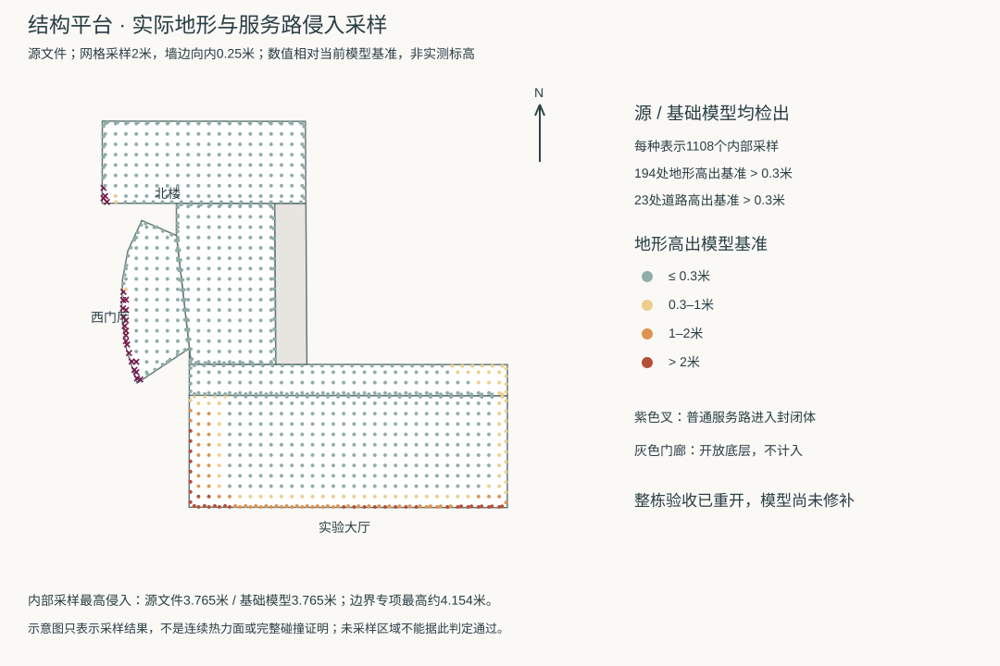

# 结构平台：地形与服务路侵入楼体，整栋验收重开

> 2026-09-30修复接续：已实现闭合楼体下方的有界地形修补和西侧普通服务路裁剪。下列诊断保留作为失败基线；本批最终结果见文末“修复实现与复验”。建筑标高仍是原模型采用值，不代表实测。

> 后续批次已完成[西侧整条服务路贴地和三处接缝修复](CIVIL_PLATFORM_WEST_ROAD.md)。本文末尾的“原西侧路面仍有示意高差”属于上一批范围说明；外围地形和待证外观的限制继续保留。


2026-09-30，核对北楼西侧模型画面后发现，低层遮挡不能全部归因于相机。对当前源文件和实际基础GLB的射线检查确认：**地形进入大厅等封闭体，普通服务路进入西门厅和北楼边缘**。平台首轮整栋状态转回待修复，当前为22个校准对象、1栋首轮通过、21个部分校准；保留已经完成的形体和D区入口。

本批完成原因定位、可复现的实际网格审计和修复边界核对，**尚未修改生产地形或道路**。不能把新增检查器通过合成测试写成现有校园模型已修复。



## 复现结果

[审计器](../blender/inspect_foundation_clearance.py)对五个封闭分部使用2米内部网格，并在外墙向内0.25米的带上补采样；开放柱廊和内院不作为封闭底层。每种表示共1108点。地形取实际向上网格面；道路检查包括普通`roads`层，并从当前分部屋顶以下向下查询，避免高架路遮住下方的冲突路面。

| 分部 | 每种表示采样数 | 地形高于基准0.3米的点数 | 道路高于基准0.3米的点数 | 地形最大高差，源/基础 |
| --- | ---: | ---: | ---: | ---: |
| 实验大厅 | 414 | 155 | 0 | 3.765 / 3.765米 |
| 北侧低翼 | 161 | 20 | 0 | 0.729 / 0.731米 |
| 北综合楼 | 217 | 5 | 4 | 0.501 / 0.502米 |
| 西门厅 | 119 | 14 | 19 | 0.885 / 0.887米 |
| 连接门厅 | 197 | 0 | 0 | 约0 / 0.001米 |

两种表示均有194处地形侵入点、23处道路侵入点。西门厅最深道路采样约高出基准1.253米，命中普通道路网格。原边界专项的最大地形高差约4.154米，位置与内部采样不同，不能把这两个最大值混称为同一组测量。

0.3米是本次识别明显模型侵入的容差，不是现场允许高差、建筑规范或无障碍标准。`-4.76`米为模型采用基准，未据此认定现场标高。离散采样能证明所列冲突存在，但没有冲突的采样不足以证明整片空间完全正确。源文件与基础GLB的逐分部统计、最严重命中点、对象/材质及指纹见[失败报告](model-checks/refinement/s2-platform-foundation-before.json)。近景楼栋仍使用同一基础地形，不另造一份近景地面结论。

```sh
blender --background --python-exit-code 1 \
  --python blender/inspect_foundation_clearance.py -- \
  --building-id=way/957404988 \
  --report=work/platform-foundation-check.json \
  --samples-output=work/platform-foundation-samples.json \
  --fail-on-intrusion
```

当前模型运行该命令应以非零退出，并写出`passed: false`的报告。报告写入成功且断言明确指向侵入才算复现；进程错误或未生成报告不算发现冲突。

## 原因与排除的快捷修法

当前地形网格间距约19.69×19.62米。数据准备只对建筑占地外扩4米内的网格顶点完全压平，向外18米逐步过渡。大厅西南角落在一组未完全压平的插值顶点之间；其中一个顶点还受随后处理的物理学院平整区影响。渲染使用三角面，因此实际射线数值与初步双线性采样略有不同，两者都确认侵入。

对西南角相邻四个顶点的最终高程与建筑影响权重已记录在[原因及反事实实验](model-checks/refinement/s2-platform-foundation-diagnosis.json)。这说明了当前生成算法的失配，不证明原始DEM误差的具体来源，也不提供新的实测高程。

在内存中尝试将目标占地外扩一格对角线（约27.79米）内的37个顶点统一压平。虽然其他建筑中心基准未变，**物理学院边缘地面却最大下降约8.73米**；故未采用。仅检查楼心高度和建筑文件未变，不能保证邻楼接地保持。

原[道路碰撞检查](../blender/validate_road_buildings.py)覆盖`infra-road`、桥梁和引道，未覆盖普通聚合服务路。其历史通过结论仍限于这些对象；不能继续用它证明平台附近所有道路都不穿楼。新增审计补上这个检查范围，不改写历史报告为通过。

## 修复顺序与验收边界

1. 先在当前平台范围建立局部地形修补方案，保留建筑基准和原始DEM，不用扩大全局平整缓冲改变邻楼地面。修补范围同时受物理学院、道路和D区台阶连接约束。
2. 独立定位普通西侧服务路与北楼、西门厅的相交段；解决路面进入封闭轮廓后，再联合地形修补。不能单纯把楼整体抬高，或降低地面却留下悬空路。
3. 检查源/基础地形、实际道路接缝、所有目标分部、物理学院边缘、D区人员入口与净高；其他建筑、树位和道路应保持或逐项解释变动。用失败模型验证新增检查能拦截旧问题。
4. 修复后检查多方向及近地画面，再运行原体积和活动性能预算；平台整栋验收通过前不恢复完成计数。大厅运输门、北楼背面窗型与西门厅屋面仍各自待影像核对，不从地形问题推断真实外观。

本次已经有界复查既有校方航拍和`b-6-7`全景图块：主要支持北/东面及连接门厅，未获得南/西立面与西门厅屋面的新尺寸依据。上述外观项保留待证；优先修复已被实际资产确认的接地问题。

## 本批验证范围

新增[五项真实网格夹具检查](../blender/test_foundation_clearance.py)：平地正例、外部高顶点造成内部地形侵入、无基础设施ID的普通服务路侵入、内院排除，以及高架路不遮挡下方冲突。夹具通过；当前校园模型审计按预期失败，二者分别记录。

本批未改生产数据、Blender校园源文件或69个GLB，因此没有重建或重新测FPS。既有生产测试不是本次新执行结果。开发、提交和推送仅在`dev`，主分支保持。


## 修复实现与复验

新增 `foundation-overrides.json` 与派生 `foundations.json`，只配置现有平台。数据准备从闭合分部求并集，排除开放柱廊；核心外扩0.1米，地形过渡最多6米，道路冲突裁剪外扩0.4米。这些是模型修补参数，不是现场道路改建或土方尺寸。原始DEM、高程网格、448条建筑记录与楼底标高均保持。

过渡区域避开保留道路、既有入口整地和邻楼。修补作用于实际三角面，边界外保留原地形平面；补齐网格接缝后，从原地形统一重算共享顶点，避免两侧插值不同而开缝。仅合并局部共面边以控制成本。道路裁除有效地图路面约40.78平方米的冲突范围；原始道路数据不改写，D区入口和东侧接路保持。

源模型和基础GLB使用同一修补。新增检查覆盖全部普通道路，不再只依赖基础设施道路检查。另将普通服务路材质的Draco位置精度提高到17位，抑制校园级包围盒造成的厘米级高程漂移；该材质的颗粒纹理UV采用11位，保留原6 MB预算。其他道路材质沿用原导出设置。

复验文件：

- [封闭分部内部复验](model-checks/refinement/s2-platform-foundation-after.json)：与失败基线相同的每表示1108个采样。
- [邻楼、道路及边界检查](model-checks/refinement/s2-platform-foundation-neighbors.json)：每表示49196个采样；地形比较同表示基线，保留道路的高度及接地比较未修改的源平面，另记录相对旧压缩路面的变化。
- [D区接路](model-checks/refinement/s2-platform-foundation-connection-geometry.json)、[人员入口台阶](model-checks/refinement/s2-platform-foundation-entry-geometry.json)、[六分部](model-checks/refinement/s2-platform-foundation-parts-geometry.json)。
- [源对象保留](model-checks/refinement/s2-platform-foundation-source-preservation.json)与[69项模型检查](model-checks/refinement/s2-platform-foundation-assets.json)。
- [本批汇总与性能](model-checks/refinement/s2-platform-foundation-summary.json)。

大厅运输口仍未配准；北楼南/西立面、西门厅屋面及旧大厅现状仍待依据。修复接地不代替这些外观核对，本批不增加整栋完成计数。


### 本批仍保留的范围限制

外围高地保持原状，因此南向和西南近地镜头仍可能被前景坡面遮挡；这与封闭楼体内部侵入已消除是两项不同结论。道路检查证明保留路面没有因本次整地新增贴地偏差，不代表原有普通服务路已全部贴地：检查样本中仍能见到原先路面与地形的示意高差，后续须按独立路段校准。暂不据此恢复平台整栋完成计数。
