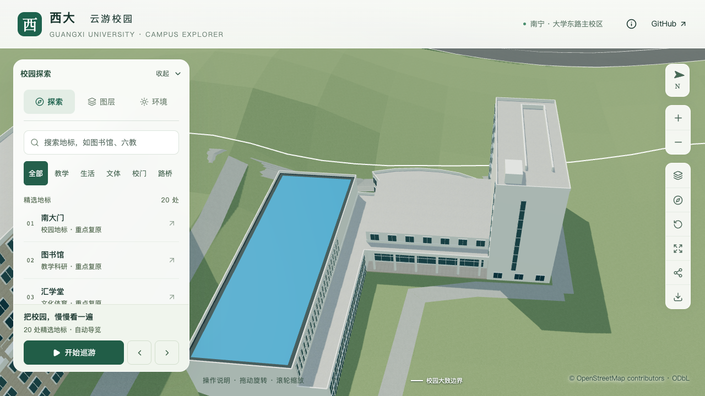

# 结构平台：连接门厅上升屋面

2026-09-29，接续[柱廊后玻璃](CIVIL_PLATFORM_PORTICO_GLAZING.md)，将 `way/957404988` 的 `link-foyer` 平顶占位替换为沿进深上升的浅色屋面。原六个主体分区、高度、柱列、玻璃和入口保持；屋顶增量单独记录，不增加楼层或建筑计数。

## 依据与采用形体

直接核看[GX720全景658](https://www.gx720.net/pano/viewer/?slug=pano-658)的既有图块 `b/6/7.jpg`：在低窗翼与北楼之间，柱廊后方的门厅屋面向后升高，前沿下方可见窄窗。按蓝顶大厅、北楼东端及柱廊转折对应当前坐标，采用由东侧柱廊向西侧内进深升高的关系。[2022年校方航拍](https://www.gxu.edu.cn/info/1364/30576.htm)局部用于核对邻接位置，没有从透视像素换算实际坡高。

保留10.8米最低檐口，最高上升2.4米至13.2米；沿进深采用四段连续平面，表达向后逐渐变陡的简化轮廓。11个顶点、9个三角面完整覆盖原连接体约631.618平方米占地。原图不能给出曲率或精确剖面，以下数值均是模型估算，不是测绘点：

| 沿屋面进深的位置 | 相对最低檐口的上升 |
| --- | ---: |
| 0米，柱廊侧 | 0米 |
| 5.354米 | 0.261米 |
| 10.708米 | 0.792米 |
| 16.062米 | 1.515米 |
| 21.416米，最深端 | 2.400米 |

进深基准是连接体退后东墙的内法向，沿用前批估算墙线；不等于原图量出的屋面宽度。西侧折线边界使部分截面在最大进深前结束，其边缘高度按同一曲面插值。真实檐口压顶、排水、曲率、柱廊独立顶板及其与新坡面的构造仍待细化，当前没有宣称屋面全部完成。

## 生成与检查约束

分部屋顶新增 `type: "profiled"`，必须显式给出 `mesh` 和正 `rise`，只用于封闭主体；普通顶层屋面与原有坡顶规则保持。网格仍须完整覆盖原分部、没有重叠、孔洞被填、未连接内边或重复投影顶点。最低点须接主体顶；升高的边缘派生封闭侧墙，面朝外。既有 `hipped/gabled` 网格仍要求边缘零抬升，不借本次扩展放宽其约束。

生成器以浅色屋面材质绘制新坡面，侧墙沿用分部墙色；不保留该分部的旧水平顶面及通用水平女儿墙。柱后玻璃仍限制在主体高度以内，允许其后主体承托这种显式坡顶，地坪/板底/柱子净距约束保持。两档共用同一屋面形体。

专项在前批参数上追加 `--foyer-profile`：固定位置射线覆盖四段坡面、两段外露侧墙，累计投影面积另排查重复水平盖板或缺口。旧平顶模型应在新的坡高预期失败；此项是采用几何的检查，不把程序通过当作真实曲率已确认。

## 本批验证

244项Python、62项Node测试及类型检查、lint、Pages构建通过。源模型、基础模型与近景模型各456项专项检查通过；旧平顶在新坡高预期失败。普通楼栋、道路与树冠检查通过。其他447个建筑记录、532个非树源对象、3,063株树及1,085个GeoJSON几何保持。

直接核看11张浏览器对照图，包含四组固定视角、树木开启、夜景与手机基础模型。新屋面连续接到北楼，所查视角未见缺面；高位日景中的坡度较轻微，移除旧水平女儿墙及后缘升高更容易辨认。夜景可见分段坡面色调差异。当前缺少照片中的檐口压顶，不能将这些画面视为真实曲率或整栋验收。

仅基础GLB与目标近景块变化，其他67个GLB和基础模型93个非目标节点保持。首屏模型合计5,399,328字节，比前批减少48字节；最大普通近景块1,684,868字节。[数据](model-checks/refinement/s2-platform-profile-data.json)、[几何](model-checks/refinement/s2-platform-profile-geometry.json)、[资产](model-checks/refinement/s2-platform-profile-assets.json)、[浏览器记录](model-checks/refinement/s2-platform-profile-final-context-browser.json)保留本批检查结果。

同一浏览器、系统与基准场景下，精细/流畅各三轮30秒活动测试分别为60/60/60、30/30/30 FPS，三轮LOD切换通过。相对S0，三角形中位数增加4.45%/10.72%，绘制调用增加1.10%/13.69%，均在原预算内。27次CPU快照未在计时窗内记录到达到2%阈值的Blender或Python重任务；这是10秒采样结果，不代表完全隔离后台进程。另核看6张图书馆与普通坡顶回归画面。[本批汇总及文件指纹](model-checks/refinement/s2-platform-profile-summary.json)、[视觉核看](model-checks/refinement/s2-platform-profile-visual-review.json)。

## 后续

继续核对门厅檐口、柱廊屋面、真实人员门和南侧构件运输口及接路。结构平台仍为部分校准；累计22个对象、1栋首轮整栋通过、21个部分校准，完整S2–S5和20–30栋整栋目标保留。开发、提交和推送仅在 `dev`。
