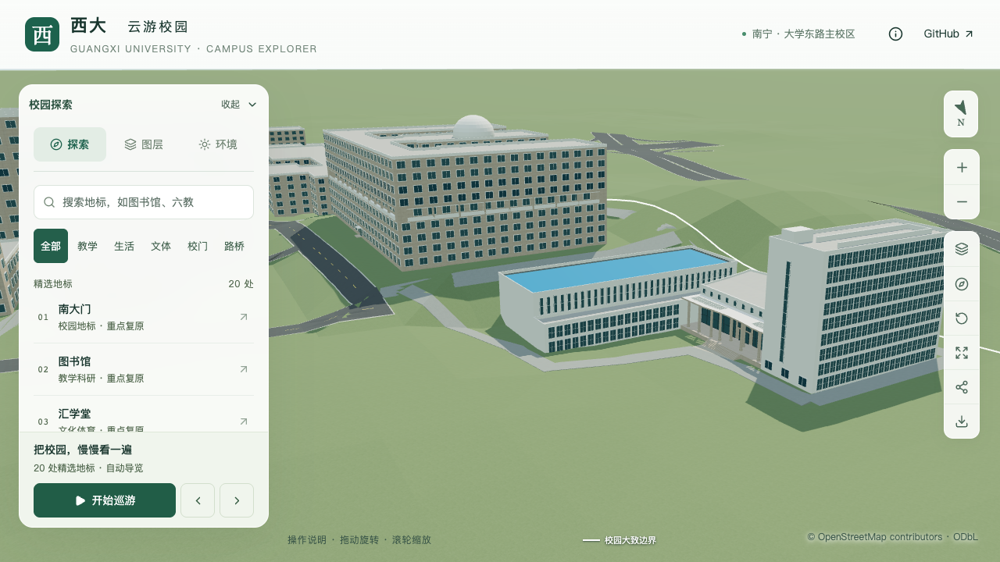

# 实验大厅北墙：补齐高窗覆盖范围

2026-09-30，核对大厅四面时发现：六分部调整后，大厅北墙已长约61.35米，但高窗仍沿用原来约38米低翼外边的投影范围。22列高窗的实际首尾跨度只有36.04米，西端留下23.64米空白。原几何检查只抽查旧窗带的三列，因此未覆盖这一遗漏。

本批将高窗重排为整面墙上的**32列估算双排窗**，修复范围截短。大厅13.2米高度、蓝色屋面、低翼、门廊、北楼、人员入口和台阶接路均保持；南侧运输门继续待定位。



## 依据与参数

直接重新核看本机保存的[校方2022年公告航拍](https://www.gxu.edu.cn/info/1364/30576.htm)平台局部及[GX720全景658](https://www.gx720.net/pano/viewer/?slug=pano-658)北向瓦片。航拍中，高窗沿蓝顶大厅北长墙延续到低翼与门厅后方，未显示模型原来那段大片空白。照片支持窗带延续范围；低分辨率、透视及遮挡不足以确认每列的数量和尺寸。原图与历史时点说明见[对象识别](CIVIL_LAB_IDENTIFICATION.md)和[六分部调整](CIVIL_PLATFORM_REPARTITION.md)。

| 参数 | 本次采用值 | 性质 |
| --- | --- | --- |
| 所属墙 | `south-hall` 与 `north-low-wing` 的共享北墙，上部高差区 | 已定位；分部墙线仍为估算 |
| 墙段长度 | 61.3521米 | 当前模型派生值 |
| 列数 | 32，每列两行 | 照片约束估算，不是逐窗实测 |
| 分配范围 | 两端各内退1.2米，余下等分32跨 | 估算排布参数 |
| 玻璃宽度 | 每跨的0.55，约1.0132米 | 估算；保留0.12米框宽和0.10米凸出 |
| 高窗标高 | 相对本楼地面8.1—12.5米 | 沿用值，未改变高度 |
| 首尾窗边跨度 | 58.1231米；距两端各1.6145米 | 分跨与窗宽共同产生的外框范围 |

这里的1.2米是分跨范围的端部留白，不是墙角到第一扇窗边的实际距离；没有把两个数值混用。没有加楼板、改变高空间大厅口径或复制室内设备。

前后跨度和参考图指纹保存于[证据记录](model-checks/refinement/s2-platform-hall-span-evidence.json)。

## 检查与保留范围

`validate_civil_platform.py`新增 `--full-hall-north`，使用独立固定墙端点检查全部32列的两行玻璃、下部实墙、31处窗间墙和两端留白；从原来漏掉的西端开始检查。旧模型在第32列预期玻璃处命中白墙，按预期失败，见[反例](model-checks/refinement/s2-platform-hall-span-negative-geometry.json)。历史参数路径保留，不用新预期覆盖旧批次结论。

```sh
blender --background --python-exit-code 1 --python blender/validate_civil_platform.py -- \
  --inset-roof --north-facade --roof-volumes --east-slit --repartition \
  --portico-glass --foyer-profile --roof-rim --entry-bay --personnel-entry \
  --entry-trim --integrated-portico --full-hall-north \
  --report-prefix=s2-platform-hall-span-local
```

源文件、实际基础和近景模型各595条[平台几何检查](model-checks/refinement/s2-platform-hall-span-geometry.json)通过，人员门/台阶各88条[回归](model-checks/refinement/s2-platform-hall-span-entry-geometry.json)通过，整体门廊420条[回归](model-checks/refinement/s2-platform-hall-span-portico.json)通过。278项Python、65项Node、类型检查、lint及模型/Pages构建通过。第一次Python测试与数据准备并行，读到未完成最终筛选的植被数据而出现两项失败；构建后复测全部通过，初次日志保留在本机工作目录，未改测试标准。

[数据对照](model-checks/refinement/s2-platform-hall-span-data.json)确认其他447栋、全部原占地和1,085个GeoJSON几何保持；平台六个分部、其他立面规则、屋顶附加体、入口及连接面保持。[源文件对照](model-checks/refinement/s2-platform-hall-span-source-preservation.json)确认只有平台楼网格变化，其余533个非树对象及3,063株树保持，包括地形和连接铺装。

[资产检查](model-checks/refinement/s2-platform-hall-span-assets.json)确认仅基础与本栋近景两份GLB改变，其他67份、95个其他基础节点保持；69个模型及数据与Pages静态包一致。首屏模型5,830,400字节，增加2,360字节，最大普通近景1,684,868字节，满足原体积预算。

11张[前后网页画面](model-checks/refinement/s2-platform-hall-span-final-context-browser.json)已直接核看：从东北、北侧高视角和西端均可见窗带延续；蓝顶边带、低翼、坡屋面、门廊及九层楼形体保持。植被开启、夜景和390×844视口保留同一范围；手机尺寸画面使用基础模型，不代表真机性能。最终性能、树冠/道路回归与指纹以[本批汇总](model-checks/refinement/s2-platform-hall-span-summary.json)为准。

两档各三轮30秒活动测量，精细60/60/60 FPS、流畅30/30/30 FPS；相对原同系统S0，三角形增幅6.32%/14.61%、绘制调用增幅3.47%/14.83%，原预算通过。三次LOD往返无错误，六张图书馆/普通楼回归画面已核看。27次CPU快照在计时窗口未记录到≥2%的Python/Blender活动；十秒采样不证明完全隔离。流畅档已接近15%预算，后续增加细节前须继续控制几何和绘制调用。

## 四面资料覆盖与下一步

| 部位 | 当前表达 | 核对边界 |
| --- | --- | --- |
| 大厅北墙 | 本次整面高窗与北侧低翼窗网 | 方位和窗带延续有影像支持，数量/尺度估算 |
| 大厅东、西墙 | 白色实墙占位，关闭通用窗 | 不能由北侧影像确认全墙无开口；保持未知 |
| 大厅南墙 | 白色实墙占位，旧自动门已移除 | 室内宽开口尚未定位；运输门、前场未验收 |
| 大厅屋面 | 内缩蓝顶、深色边带、浅色外缘 | 形制有影像支持；微坡、排水及实际边带尺寸未知 |
| 北楼北/东面 | 北窗网、东侧大实墙与竖向窄玻璃带 | 已有照片约束估算；底部门窗局部仍为示意 |
| 北楼南/西面 | 沿用普通窗规则，南面部分被门厅遮挡 | 本批未取得可配准的反面影像；不能将北窗网镜像复制过去 |
| 北楼屋顶 | 两条长条、西连接及东南小体量 | 外形估算保留；用途和设备未确认 |

下一步针对北楼南/西面及西侧门厅核对已有参考的可见范围，补齐整栋多方向画面和未知登记，再按主计划5.3节进行首轮整栋联合复核。仍为22个校准对象、1栋首轮通过、21个部分校准；大厅与北楼共用一个稳定ID，旧大厅另列，不增加完成计数。开发、提交和推送仅在`dev`。
