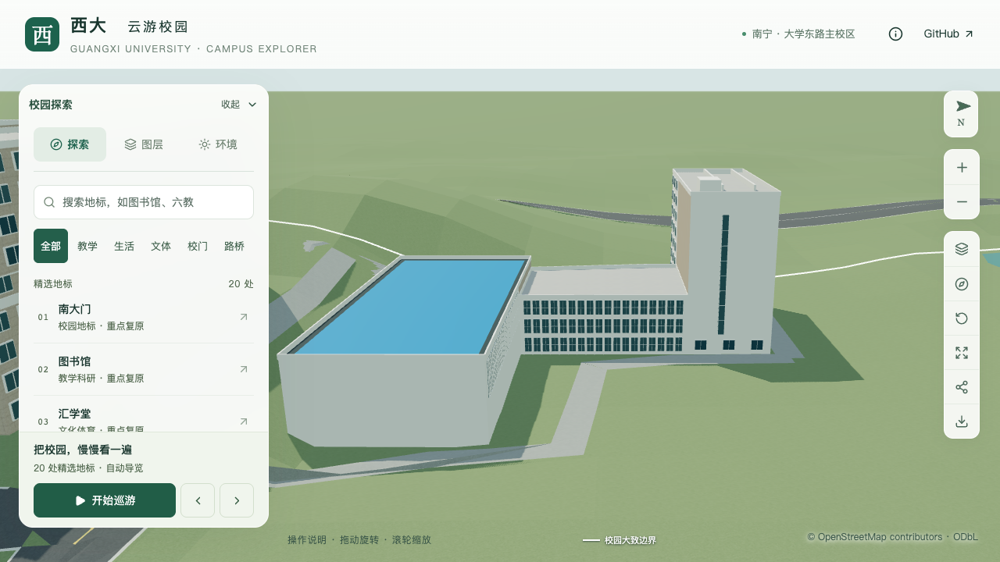

# 结构平台低实验区：东立面密集窗列

2026-09-21，接续[北楼东端玻璃带](CIVIL_PLATFORM_EAST_SLIT.md)，校准蓝顶大厅与北楼之间 `middle-labs` 分部的东立面。所属对象仍为 `way/957404988`。

## 依据及表达

[学校2022年拆除采购公告](https://www.gxu.edu.cn/info/1364/30576.htm)的[标号航拍](https://www.gxu.edu.cn/system/_content/download.jsp?urltype=news.DownloadAttachUrl&owner=1556120285&wbfileid=3792656)以及[GX720广西大学全景](https://www.gx720.net/pano/viewer/?slug=pano-658)均显示低实验区外侧的密集窄窗和连续白色竖框。用南侧蓝顶大厅、北楼东端白墙及东侧旧大厅交叉定位，作用范围确定为原外环第14边的低实验区分段，方向自北向南。

本轮直接核看全景原始图块 `b/6/7.jpg` 与既有校方航拍局部裁图；完整航拍上下文沿用[新旧实验大厅识别](CIVIL_LAB_IDENTIFICATION.md)。[证据记录](model-checks/refinement/s2-platform-labs-evidence.json)包含文件哈希及本次核看范围。全景拍摄日期未知，历史航拍不代表2026年现状；图像只作参考，不打包分发或转成模型纹理。

| 参数 | 采用值 | 确认程度 |
| --- | --- | --- |
| 窗列 | 18列、三行 | 密集窗列形制有影像支持，数量估算 |
| 窗宽 / 窗高 | 跨宽的0.73 / 层高的0.74 | 比例估算 |
| 两端留白 | 各0.65米 | 尺寸估算 |
| 连续白色竖框 | 19根，宽0.20米、凸出0.14米 | 连续白框形制有影像支持，构件尺度估算 |
| 近景分格 | 每窗中竖梃、两行 | 尺度表达，非逐扇窗开启方式复原 |

复用现有 `windowGrid`，仅替换低实验区东侧的稀疏通用窗列。三层、10.8米暂沿用[首批分部估算](CIVIL_PLATFORM_MASSING.md)，不因窗行数将实际楼层认定为已确认。底层窗列按可见形制延续，门位、内部用途和低翼其他立面仍待核准；北楼东端玻璃带使用同一原边的另一个分部规则，互不混用。

## 验证

专项增加54个玻璃格点、六个端部实墙点及12个连续竖框点，检查外向法线与竖框凸出量。预期锚点、分段端点和采样坐标独立于生产配置，保留此前大厅、北窗网、东端窄玻璃带、四分部屋顶及屋顶附加体的检查。

```sh
blender --background --python-exit-code 1 --python blender/validate_civil_platform.py -- --inset-roof --north-facade --roof-volumes --east-slit --lab-facade --report-prefix=s2-platform-labs-local
```

236项Python、59项Node检查、类型检查、lint、完整模型与Pages构建通过。

- [平台专项](model-checks/refinement/s2-platform-labs-geometry.json)：源文件、基础、近景各413项检查通过；[旧模型反例](model-checks/refinement/s2-platform-labs-negative-geometry.json)在新增低实验区第一个玻璃点失败。
- [数据对照](model-checks/refinement/s2-platform-labs-data.json)：原分部、轮廓、高度、屋顶、入口及其他立面保持，447栋其他建筑和1,085个GeoJSON几何不变。另同步公开来源目录中的 `gx720CivilNorthPanorama` 名称和用途，补齐上一批尚未反映在生产目录中的说明；104条来源按ID与输入目录核对，只有该条内容变化。
- [源文件](model-checks/refinement/s2-platform-labs-source-preservation.json)与[资产](model-checks/refinement/s2-platform-labs-assets.json)：仅平台源对象、基础GLB和本栋近景区块变化；532个其他非树对象、3,063株树、67个其他GLB及93个基础节点保持。69个模型和公开数据与生产包一致；首屏5,396,508字节（增加1,328字节），最大普通近景1,684,868字节。
- [430栋普通建筑](model-checks/refinement/s2-platform-labs-generic-geometry.json)、[实际树冠净空](model-checks/refinement/s2-platform-labs-trees-geometry.json)与[道路](model-checks/refinement/s2-platform-labs-road-building.json)回归通过。
- [浏览器](model-checks/refinement/s2-platform-labs-final-context-browser.json)与[画面核看](model-checks/refinement/s2-platform-labs-visual-review.json)：四组前后、植被开启、夜景、手机尺寸共11张图逐张核看，无页面、控制台或HTTP错误。手机尺寸使用基础层，其余视图采用近景层，均保留窗列节奏；手机视口模拟不等于真机测试。



[最终汇总及资产指纹](model-checks/refinement/s2-platform-labs-summary.json)通过。[性能复测](model-checks/refinement/s2-platform-labs-performance-browser.json)沿用同机Apple M5、Chromium 148、1280×720、DPR 1和S0活动协议，每档三轮各30秒：

| 指标 | 精细档 | 流畅档 |
| --- | --- | --- |
| 三轮FPS中位数 | 60 / 60 / 60 | 27 / 27 / 28 |
| 相对S0的FPS变化 | 0% | −10.00% |
| 三角形中位数及相对S0变化 | 4,198,301，+4.44% | 1,166,765，+10.92% |
| 绘制调用中位数及相对S0变化 | 563，+2.93% | 299，+13.69% |

六项均符合原预算，但流畅档帧率已处于允许下沿，后续不放宽门槛。三次LOD往返无错误；[26次进程快照](model-checks/refinement/s2-platform-labs-performance-performance-context.json)在计时窗口未记录到超过2%阈值的Python/Blender计算。结果仅适用于该固定设备和活动视角，不把轮次间波动解释为本次窗列的独立性能因果，也不外推为手机真机表现。

该立面工作包不代表入口已配准或平台整栋完成。累计22个校准对象、1栋首轮整栋通过、21个部分校准，完整S2—S5及20—30栋目标继续；提交与推送仅在 `dev`。
