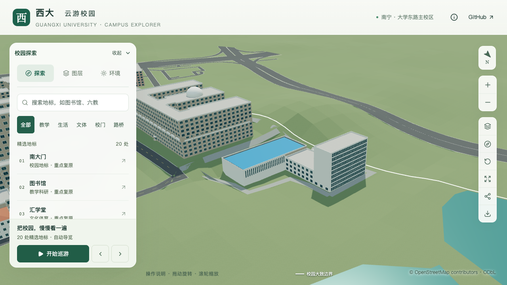

# 结构平台北楼：密集窗网与东端实墙

2026-09-21，接续[入口定位取证](CIVIL_PLATFORM_ENTRY_EVIDENCE.md)，细化 `way/957404988` 的九层北综合楼。原四分部、内缩蓝顶、南大厅高窗、楼高与入口位置保持；本批不增加整栋完成数。

## 依据和方位

[学校2022年拆除采购公告](https://www.gxu.edu.cn/info/1364/30576.htm)的[标号航拍附件](https://www.gxu.edu.cn/system/_content/download.jsp?urltype=news.DownloadAttachUrl&owner=1556120285&wbfileid=3792656)展示蓝顶大厅以北的板式高楼：北长立面有密集白色窗框，露出的东端墙上部为大块浅色实墙。拍摄者从北侧看向校园内部，不能把画面左侧直接当作地理西侧。本批将北长立面对应到原外环第13边，东端实墙对应到第14边中属于 `north-office` 的分段；同一原边上的低实验区保留原窗列。

原图、哈希及历史时点限制沿用[对象识别记录](CIVIL_LAB_IDENTIFICATION.md)。本机核看 `north-office-detail.png` 及其完整航拍上下文；不把低分辨率裁图放大当作新增细节证据，不转载为模型贴图。九层来自[2014年校报设计说明](https://news.gxu.edu.cn/__local/8/C4/4D/0B1CE8B9D4B8389F21FF34B7030_FF27C11E_793A3.pdf?e=.pdf)，29.7米仍为九层乘3.3米的估算高度，历史照片不证明2026年外观未变化。

## 本批参数

| 部位 | 本批表达 | 依据范围 |
| --- | --- | --- |
| 北面窗网 | 22列、九行，外边各留1米；窗宽占跨0.78，窗高占层0.75 | 密集竖向白框形制有航拍支持；22列、比例、标高与底层延续均为估算，非逐窗测绘 |
| 连续竖框 | 23根，宽0.22米、凸出0.18米 | 延续北面竖向网格识别特征；构件尺寸估算 |
| 近景窗内分格 | 每窗中竖梃、两行分格 | 表达窗格尺度，未逐扇确认开启方式；基础层保留主要窗洞比例与连续竖框 |
| 东端墙 | 北楼上八层去除通用窗，底层仍留示意窗 | 航拍所见大块白墙；未核准底部门窗，不外推为全墙无开口 |

复用已有 `windowGrid` 和 `skipWindowLevels`，没有新增逐栋专用生成器或材质。第14边改为北楼、低实验区各自的规则，防止按北楼九层给三层低翼删窗。低实验区的显式分部标记仅拆分规则作用范围，不改变几何。

北面底层窗网不意味着入口定位完成。圆柱门廊仍按[西侧/北侧候选](CIVIL_PLATFORM_ENTRY_EVIDENCE.md)核对；南侧2.2米示意门也没有被认定为实际运输口。照片中不规则开窗、空调、屋顶设备及东端局部细节没有在本批逐一复制。

## 验证

专项固定检查覆盖北面全部198个窗位、每层边缘实墙、连续竖框位置与0.18米凸出量，以及东端原通用窗中心的24个实墙点；同时保留四分部、蓝顶边带、大厅高窗、外墙法向和内部无中间楼板检查。预期采样坐标独立写入验证器，不从本次覆盖参数读取。

```sh
blender --background --python-exit-code 1 --python blender/validate_civil_platform.py -- --inset-roof --north-facade --report-prefix=s2-platform-north-local
```

231项Python、59项Node检查、类型检查、lint、完整模型及Pages构建通过。早于导出完成运行的一次Node检查因中间数据尚无高程而失败；该结果保留在本机工作记录，最终资产导出后59项全部通过。

- [专项几何](model-checks/refinement/s2-platform-north-geometry.json)：源文件、基础与近景各292项检查通过；[旧模型反例](model-checks/refinement/s2-platform-north-negative-geometry.json)在北窗网检查中失败。
- [数据对照](model-checks/refinement/s2-platform-north-data.json)：448栋中仅平台校准字段变化；原轮廓、分部、屋面、高度和入口保持，第14边低实验区仅增加规则归属标记。[普通建筑](model-checks/refinement/s2-platform-north-generic-geometry.json)、[实际树冠净空](model-checks/refinement/s2-platform-north-trees-geometry.json)与[道路](model-checks/refinement/s2-platform-north-road-building.json)回归通过。
- [源文件对照](model-checks/refinement/s2-platform-north-source-preservation.json)：仅平台对象变化，其他532个非树对象的几何、UV、材质与变换及3,063株树实例保持。
- [资产核对](model-checks/refinement/s2-platform-north-assets.json)：69个模型与生产包一致；仅基础GLB与 `chunk-n2-n3.glb` 变化，67个其他GLB和93个基础节点保留。首屏5,394,280字节，增加2,036字节；最大普通近景区块1,684,868字节，均在预算内。
- [浏览器前后对照](model-checks/refinement/s2-platform-north-final-context-browser.json)及[画面检查](model-checks/refinement/s2-platform-north-visual-review.json)：四组前后镜头，加植被开启、夜景、手机尺寸共11张。手机尺寸为基础层，其余为近景层，无页面、控制台或HTTP错误；手机尺寸模拟不等于真机测试。正常植被视图中局部低层受树冠遮挡；大厅屋面镜头裁掉部分北楼，不用于完整北立面验收。



最终[汇总与资产指纹](model-checks/refinement/s2-platform-north-summary.json)确认本工作包通过，未升级为整栋验收。[性能报告](model-checks/refinement/s2-platform-north-performance-browser.json)使用同机Apple M5、Chromium 148、1280×720、DPR 1的本地生产预览及既有S0活动协议，每档三轮各30秒：

| 指标 | 精细档 | 流畅档 |
| --- | --- | --- |
| 三轮FPS中位数 | 60 / 60 / 60 | 28 / 27 / 28 |
| 相对S0的FPS变化 | 0% | −6.67% |
| 三角形中位数及相对S0变化 | 4,201,728，+4.52% | 1,166,279，+10.87% |
| 绘制调用中位数及相对S0变化 | 562，+2.74% | 299，+13.69% |

六项均在既定预算内。三次近景/全景往返无错误；[进程记录](model-checks/refinement/s2-platform-north-performance-performance-context.json)共27次快照，计时窗口未记录到超过2%阈值的Python/Blender计算。结果限于该设备、浏览器和固定活动视角，不把静态截图帧率当持续活动性能，也不外推为手机真机或全校任意视角保证。

## 接续

北楼东/西/南其他立面、屋顶突出物和白色框架转折继续核对；人员门廊与南厅运输开口继续独立定位，入口、台阶和接路在位置确认后实施。当前仍为22个校准对象，1栋首轮整栋通过、21个部分校准；完整S2—S5目标保持。所有提交和推送仅在 `dev`，不合并主分支。
