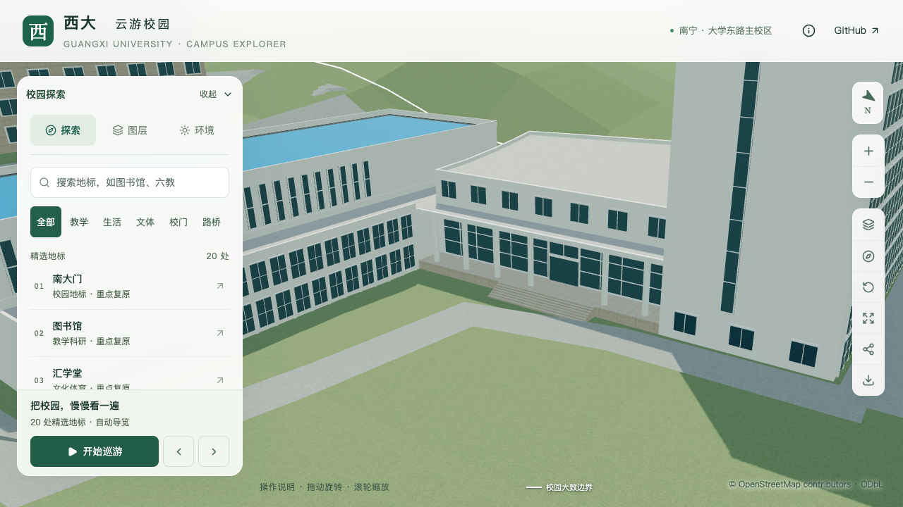

# 结构平台：东侧人员入口与台阶

2026-09-30，接续[入口侧宽跨](CIVIL_PLATFORM_ENTRY_BAY.md)，在 `way/957404988` 的D区柱廊后墙补入人员入口的估算表达，配合抬高地坪、连续台阶和门洞两侧/上方玻璃。完整道路连接、无障碍路线和南侧运输口尚未完成，整栋不增加验收计数。

## 依据与不确定性

原始[OSM节点7096023516](https://www.openstreetmap.org/node/7096023516)支持东侧柱廊入口位置；沿既有3.6米估算进深投影至后墙，门中心采用 `[-698.808310, -742.438185]`。OSM精度未知，后墙也是模型估算，不能称为实测门中心。

重新直接核看[2024年“走进学院”报道](https://tmjz.gxu.edu.cn/info/1452/7240.htm)末幅合影：入口有玻璃开口、上方实心横梁、两侧高玻璃及宽台阶，门内可见与同文展厅相符的桥梁模型。[2025年研修班报道](https://tmjz.gxu.edu.cn/info/1016/7805.htm)合影显示相容的柱廊、横梁与阶梯，但缺少建筑转角，不独立证明门位。两张照片有人员遮挡，未按人物身高量尺寸，也未把可见边线数量认定为实测级数。[GX720全景](https://www.gx720.net/pano/viewer/?slug=pano-658)与OSM共同约束所在区域，照片关联仍为推断。

本批采用的米制值均为**有界估算**：

| 构件 | 本批模型 |
| --- | --- |
| 门面 | 宽3.6米、高2.8米，位于柱廊后墙；浅玻璃面表达，未建室内或可开启门扇 |
| 门前地坪 | 相对建筑基准高1.05米，替换原0.24米地坪 |
| 台阶 | 宽12米、七级，每级模型顶面相差0.15米，水平节距0.3米 |
| 台阶基础 | 从建筑基准向下0.15米，消除局部地形比基准低2–6厘米造成的浮空 |
| 柱后玻璃 | 两侧六列/四列、各三行；门上两列一行。侧窗底1.16米、顶6.3米，门上窗底4.03米 |

原六柱位置、直径、板底与屋顶保持，柱高随地坪抬升缩短。浅色框、简化横梁及玻璃材质仍未精确匹配照片中的黑框与石材，不以本批几何通过代替完整立面真实性。旧南墙最长边中点的默认示意门移除；它本无运输口证据，不作为南侧真实开口保留。

## 生成与约束

已有后退入口增加可选 `stepWidth` 和 `stepFoundationDepth`：前者必须覆盖门宽且不超出入口处柱廊可用范围，后者为0–0.3米之间的正数；二者只允许用于后退入口。未配置时保持原台阶生成行为。玻璃分成三个不重叠矩形，避免原整片横格穿过新的门面；门面仍属于外观表达，不切出可进入室内。

台阶宽度单独设为12米，不使用该入口位置自动计算出的约26.011米完整柱廊宽度。0.15米埋置量只改变台阶实体底面，踏面高程保持。参数拒绝非数值、非有限值、越界宽度和错误入口类型。

## 检查记录

249项Python、62项Node、类型检查、lint及完整模型构建通过。平台源/基础/近景各507项上下文检查通过；新的入口专项各53条记录覆盖整门宽通路、门玻璃与横梁、门前平台、七级踏面、基础底面、台阶边界和旧门移除。源/基础使用各自实际地形，近景使用已解码基础地形核对，检查踏面高于地面、基础底低于地面。旧模型分别在新地坪与门面检查失败。

3.6米通路到最近圆柱外缘净距约0.406米；12米台阶足迹与已建机动车道路无平面重叠。这些检查不证明完整步行接路、无障碍或现场尺寸。道路与树冠全局回归通过；其他447栋建筑记录、532个非树源对象、3,063株树、1,085个GeoJSON几何及67个非目标GLB保持。69个模型与生产包匹配，首屏5,400,892字节（增加996字节），最大普通近景1,684,868字节。

11张目标对照和6张回归图已逐张核看。近景能看到独立门面、抬高地坪和连续台阶，台阶前仍有草地接缝；夜景与手机视口未出现新的显示错误。

同条件精细60/60/60 FPS、流畅30/30/30 FPS；相对同系统S0，三角形增加4.56%/10.71%，绘制调用增加2.93%/11.79%，原预算通过。三次LOD往返无错误，26次CPU快照在六个计时窗口未记录到达到2%阈值的Python/Blender活动；十秒采样并非设备隔离证明。[汇总及资产指纹](model-checks/refinement/s2-platform-door-summary.json)通过本局部联合验收，[照片与估算记录](model-checks/refinement/s2-platform-door-evidence.json)保留来源与限制。

## 下一步

先把台阶前的落脚面与现有步行铺装接顺，并检查地形、植被和通路宽度。随后继续门框、门扇和柱基的可见细节、C区运输开口、大厅屋面及北楼剩余立面；旧实验大厅继续按独立历史对象核对。仍为22个校准对象、1栋首轮整栋通过、21个部分校准，S0–S5与20–30栋目标保持。
